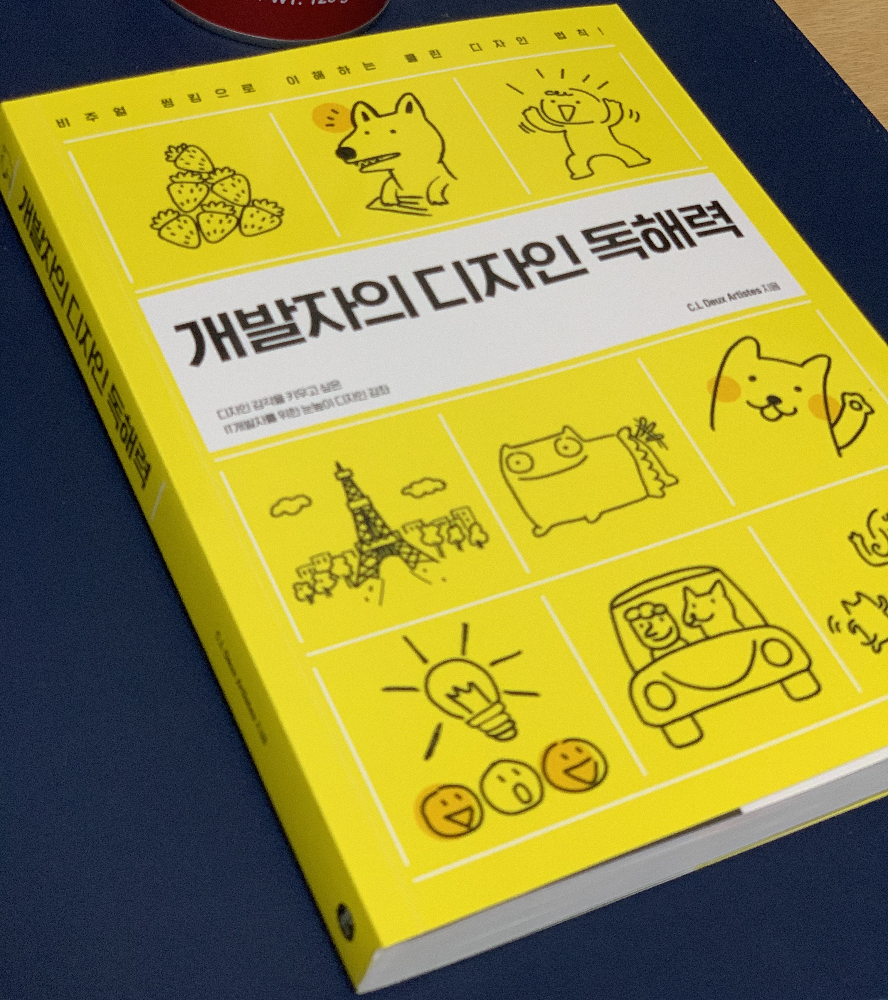

> 나는 디자인 감각이 없어!
> 모델이 입으면 세련되어 보이는 옷을 내가 입으면 촌스러워 보이는 것

많은 개발자들이 디자인에 대한 아쉬움을 드러낸다. 특히 회사일이 아닌 자신이 필요한 무언가를 만들려고 할 때, 디자인 감각이 여실히 드러난다.

## 개발자에게 디자인

이 책은 디자이너 출신의 개발자, 일명 개자이너(또는 디발자)가 쓴 책이다. 그래서 인지 더욱 호기심이 생겼다. 개발자의 관점에서 디자인을 설명하려 하는 관점들이 보였고 많은 도움이 됐다.

글의 초반에는 개발자(엔지니어)들이 갖고 있는 디자인에 대한 오해를 풀고 시작하는데, 오해를 푸는 방식이 재밌다. 디자인, 프로그래밍 두 영역 모두 하시는 분이다 보니 개발자의 입장에서 역지사지 관점으로 설명을 한다. 예를 들면 이런 식이다.

- Q: 디자인을 잘 하려면 모든 디자인 법칙을 알아야 하나요?
- A: 당신은 프로그래밍의 모든 법칙을 알고 앱을 개발하나요?(코딩을 하나요?)

- Q: 포토샵이나 일러스트 레이터를 배우면 디자인을 잘할 수 있나요?
- A: VSCode, IntelliJ만 잘 다루면 프로그래밍을 잘할 수 있을까요?

## 개발자가 디자인을 조금이라도 이해하기 위한 TODO

1. 사물을 다양한 각도에서 관찰하는 습관들이기
2. 다양한 색상을 자주 보고 다른 사람이 작업한 배색을 따랗며 자신의 디자인에 응용해보기
3. 단순한 도형으로 그리는 연습하기
4. 디자인의 이름을 정하고 목적과 주제 그리고 표현 방식을 정하고 디자인 시작해보기

개발자들은 시간을 들여 코딩 공부를 하고 코딩 연습을 한다. 디자인도 마찬가지로 연습을 해야 한다. 연습을 할 때, 4번처럼 디자인의 이름을 정하고 디자인의 목적, 주제, 방식을 정한 다음 시작해보는 습관을 들이라고 조언한다.

## 색상 설계 해보기

가장 먼저 접근할 수 있는 것은 색상을 조합하고 배치하는 것이다. 어떻게 색상을 조합할 것인지 그 원칙에 따라 연습해볼 수 있을 것 같다.

### 단색 설계법

1. 디자인에 단순 명료한 느낌, 순수한 느낌, 깨끗한 느낌을 준다.
2. 색상을 줄여 콘텐츠에만 집중하게 한다.
3. 색상이 하나로 뭉쳐 화면이 넓어 보이는 효과가 있다.

### 먼셀 색상표 기준 비슷한 색 설계

비슷한 색 배색은 색상간의 차이가 작아 거슬림이 없고 부드럽고 유연한 이미지를 떠올리게 하여 조화롭고 안정된 느낌이 든다.

### 약한 반대색 설계

1.  정반대 색끼리 붙으면 색상 충돌이 심해 강렬한 느낌이 든다.
2.  색상 충돌이 약하지만 강렬한 느낌이 줄어 청량한 느낌이 든다.

## 좋은 디자인?

UX와도 연관이 있는 부분이고 이 부분은 개발자가 먼저 제안할 수 있는 상황도 꽤 많다.

### 일의 부담을 줄이기

사용자가 입력, 선택, 허락을 해야 하는 정보들은 사용자의 기억, 생각, 이해를 요구한다. 이런 정보들을 쉽게 처리할 수 있도록 한 번에 하나씩 보여 주는 방식으로 디자인한다. - p376

이 맥락은 모바일 환경의 애플리케이션을 디자인 할 때 매우 중요한 요소라고 생각한다. 어떤 쇼핑몰에 들어가서 제품을 주문하려고 했을 때, 회원가입으로 유도된 경험은 누구나 한번쯤 있었을 것이다. 제품을 구매하려고 하는 순간 수많은 입력창으로 도배된 회원가입 화면은 눈살을 찌푸리게 만들며 구매하려고 했던 제품이 엄청난 매력을 갖고 있지 않는 이상 사용자는 바로 뒤로 가기를 눌러 '이탈'하게 된다.

### 무게 균형 맞추기

이미지에서도 무게감을 느낄 수 있다. 크기가 크면 무거워 보이고, 작으면 가벼워 보인다. 마찬가지로 색상이 진하면 무거워 보이고, 연하면 가벼워 보인다. 이 때 큰 것과 작은 것을 나란히 놓으면 무게 균형이 맞지 않다. 큰 것에 밝은 색을, 작은 것에 어두운 색을 칠하면 무게 균형이 맞아 보인다. - p388

## 마무리

당연히 이 책 한 권으로 디자인을 이해할 수는 없을 것이다. 하지만 혼자 디자인을 시작하려고 했을 때의 막막함은 어느 정도 해소해줬다. 그리고 디자인 된 무언가를 바라볼 때 새로운 시각을 얻게 되었다.
