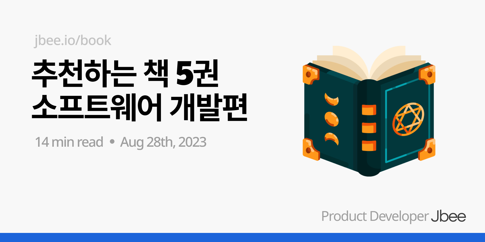

독서의 계절을 맞아 책 추천 시리즈를 준비해봤다. 많은 도움을 받았거나 팀원에게 추천하는 책 5권을 선정했다. 단순 소개를 넘어 책을 언제 읽으면 좋을지, 어떻게 활용할지에 대한 내용 함께 담아보았다.

이런 글은 추천하는 사람이 누구인지 잘 살펴보고 받아들여야 한다. 개발을 어떻게 공부해왔는지, 최근에 주로 개발하는 영역은 무엇인지, 속해있는 팀의 규모 등 여러모로 주관이 많이 들어갈 수 밖에 없기 때문이다.

## [구글 엔지니어는 이렇게 일한다](https://www.aladin.co.kr/shop/wproduct.aspx?ItemId=294146082)

감히 원픽으로 골랐다. 한때 트위터 타임라인을 뒤덮은 책이라 많은 분들이 아실 책이라 생각한다.

실제로 구글 팀이 어떻게 하고 있는지는 모르겠으나 엔지니어링을 하다 보면 마주할 수 밖에 없는 상황이 있는데, 그런 부분들을 다루고 있다. 지식의 공유, 문서화 등 ‘코딩’과 직접적으로 관련없는 엔지니어링 영역에 대해 이렇게 체계적으로 다룬 책이 있던가 싶다.

이 책을 추천하면 '그거 구글 얘긴데, 우리 팀에 실질적으로 도움이 되는가?'라는 질문을 많이 받았다. 일단 난 많은 개선을 만들었다. ‘이게 가능한 것은 구글이라 그래’라는 태도로 읽으면 의미없다. 물론 팀의 상황에 맞게 변화를 시도해야 하는 것은 맞지만 시도를 해본다는 것 자체가 유의미하다고 생각한다. 유의미한 변화가 만들어지지 않더라도 현재 팀의 문제를 진단하는데 있어 하나의 지침이 되어줄 수 있을 것이다.

꽤 분량이 많은 책이다. 만약 두껍다고 느껴진다면 테스트 챕터만이라도 읽어보길 권한다. 아니면 아래 링크하는 요약본을 먼저 읽어봐도 좋다. 이런 정보 습득을 위해 읽는 책은 요약본을 먼저 읽고 더 알고 싶은 부분만 읽는 것도 효율적인 독서 방법 중 하나라고 생각한다.

### 좋았던 문장들
- 소프트웨어 엔지니어는 시간의 흐름과 언젠가 변경될 가능성에 더 신경써야 한다.
- 혼자 일하려 한다면 실패할 위험성을 불필요하게 키우고 자신의 성장 잠재력을 속이는 것이다.
- 코드는 작성되는 횟수보다 읽히는 횟수가 더 많으며 시간이 지날수록 더 벌어진다.
- 가능한 ‘규칙’들은 ‘자동으로' 적용되게끔 해야 한다.
- 코드는 부채다
- 테스트는 엔지니어에게 신뢰를 줄 때만 가치가 있다.
- 테스트를 작성하는 것과 ‘잘' 작성하는 것은 별개이다.

요약: https://tosspayments-dev.oopy.io/share/books/software-engineering-at-google

## [좋은 코드, 나쁜 코드](https://www.aladin.co.kr/shop/wproduct.aspx?ItemId=294649282)

어떤 면에선 구글 엔지니어 책보다 이 책을 추천한다. 구글 엔지니어 책이 소프트웨어 엔지니어링 전반을 다루고 있다면 이 책은 '코드'에 집중한다. 그런 면에서 구글 엔지니어 책보다 먼저 읽어도 좋다고 생각하고 더 추천한다. (이 책도 구글 엔지니어가 쓴 책이긴 하다.)

목차를 보면 이론과 실전 그리고 단위 테스트 세 부분으로 나뉘어져 있는데, 이론 챕터에는 기능과 구현의 차이, 추상화 계층, 조건 검사, 오류 핸들링 등 좋은 소프트웨어 개발을 위한 핵심 내용이 정리되어 있다. 실전 챕터에는 실제로 코드에 적용할만한 내용들이 나와있는데, [리팩토링](https://www.aladin.co.kr/shop/wproduct.aspx?ItemId=236186172) 책이나 [클린 코드](https://www.aladin.co.kr/shop/wproduct.aspx?ItemId=34083680)책에서 본 내용이 많을 것이다. 단위 테스트 부분은 상대적으로 짧은데 이번 책에선 테스트가 무엇인지 어떻게 접근해야 하는지 정도만 파악하고 아래 소개할 테스트 관련된 책으로 좀 더 파보는 것을 추천한다.

설명을 보면 알겠지만 여러 고전 명작들에서 좋은 내용을 **쉽게** 설명한 책이다. 이제 개발을 막 시작하신 분들에겐 가장 먼저 이 책을 추천할 것 같다. 경력이 있더라도 책을 아직 읽지 않았다면 한번 읽어보는 것을 추천한다. 경험으로 체득한 내용들이 머리 속에 정리되는 느낌을 받을 수 있을 것이다.

### 좋았던 문장들
- 좋은 소프트웨어인지 그렇지 않은지는 그 모든 작은 결정들이 모여서 이루어진다.
- 코드베이스에서 코드 라인이 적을수록 좋다.
- 코드를 다 작성하고 나서 테스트에 대해 생각해서는 안 된다.
- 어떤 출력이 다른 요소에 의한 입력을 필요로 할 때, 두 요소는 순차적 응집도를 가졌다고 볼 수 있다.
- 인터페이스를 참조하게 되면 코드의 일반성을 높일 수 있다.
- 너무 비대한 계층 때문에 발생하는 문제는 너무 얇은 계층 때문에 발생하는 문제보다 더 심각하다. 확실하지 않은 경우에는 남용의 위험에도 불구하고 계층을 얇게 만드는 것이 좋다.
- 부서지기 쉬운 물건은 바쁜 장소에 둘 수 없다.
- 세부 사항을 사용하기 보다 조건을 명백하게 하는 것이 훨씬 낫다.
- 일반적으로 코드의 잠재적 호출자에 대한 가정은 가능한 한 하지 않는 것이 좋다.
- 오류를 숨기면 호출하는 쪽에서 오류를 복구할 기회를 없애는 것이다.

### [오브젝트](https://www.aladin.co.kr/shop/wproduct.aspx?ItemId=193681076)
너무 많은 개발 도서 추천 글에서 언급된 책이라 추천하는게 의미가 있을까 잠깐 고민을 했지만 이 논리면 포스팅 자체가 의미없기 때문에 목록에 올렸다.

조금 읽다가 내용이 너무 어렵다면 같은 저자의 책, ‘객체지향의 사실과 오해’라는 책부터 읽어보길 추천한다. 백엔드 개발은 그렇다 치고 프론트엔드 개발에 객체 지향 프로그래밍이 필요할까?에 대한 의문이 있는 분들은 아마 객체 지향이라는 개념에 대해 잘못 알고 있을 가능성이 높다고 생각한다. 당연하게도 많은 것을 적용해볼 수 있고 컴포넌트가 달라지는 것을 느낄 수 있을 것이다.

감히 이 책을 읽기 전과 후에 컴포넌트를 바라보는 관점이 달라졌다고 말할 수 있을 것 같다. 물론 모든 책이 그렇겠지만 책을 읽기만 해서는 소용이 없다.

이 책은 오래 전에 읽기도 했고 읽고 정리한 요약이 없다. 그런데 이 책은 정보 습득을 위해 읽는 책이라기 보단 사고의 확장, 사고의 변화를 위해 읽는 책이라고 생각한다. 끝까지 다 읽을 필요도 없고 모듈? 컴포넌트? 객체? 등 코드 덩어리를 바라보는 시각이 달라졌다면 끝까지 읽지 말고 **덮어도 되는** 그런 책이라고 생각한다. 팀원들과 함께 스터디를 하며 의견 교환을 하기에도 좋은 책이니 스터디를 만들어봐도 좋을 것 같다.

### [단위 테스트](https://www.aladin.co.kr/shop/wproduct.aspx?ItemId=280870631)

테스트의 기본이 되는 단위 테스트에 대한 책이다. 앞에서 소개한 '구글 엔지니어는 이렇게 일한다' 책에서도 테스트에 대한 부분을 상당 부분 할애하고 있는데, 겹치는 내용이 좀 있다.

단순히 단위 테스트가 무엇이고 어떻게 해야 한다라는 내용을 넘어 ‘좋은’ 테스트 코드는 무엇인가에 대한 내용을 다루고 있다. 좋은 단위 테스트의 4가지 요소를 중심으로 설명하는 부분이 테스트 코드를 작성하는데 있어서 큰 가이드가 되었다.

책의 주제가 주제인만큼 꼭 단위 테스트를 실제로 작성해보면서 책을 읽어나가길 바란다. 테스트를 작성하지 않으며 책만 다 읽었다면 이 책을 추천한 의미가 없어지기 때문이다. 

요약: https://tosspayments-dev.oopy.io/share/books/unit-testing

### [레거시 코드 활용 전략](https://www.aladin.co.kr/shop/wproduct.aspx?ItemId=168779479)

저자는 레거시 코드를 이렇게 정의한다.

'테스트 코드가 없는 코드'

(벌써 재밌지 않은가) 방금 전에 작성한 코드라도 테스트 코드가 없다면 레거시 코드라는 것이다. 저마다 레거시 코드를 정의하지만 난 이 정의가 가장 마음에 들고 나에게 많은 변화를 문장이다. 테스트에 대한 이야기를 레거시 코드에서부터 시작하는 책이고 정말 실질적인 도움이 많이 됐던 책이다.

책을 읽고 그 내용을 자신의 것으로 만드는 데에는 그 책을 '언제 읽는가'도 많은 영향을 미친다고 생각한다. 그런 의미에서 이 책은 내가 팀의 레거시 코드를 맡게 되었을 때 읽으면 가장 흡수력이 좋을 것이라고 생각한다.

### 좋았던 문장들

- 기존의 동작을 그대로 유지한다는 것은 단순히 코드를 그대로 두는 것 이상의 의미를 가진다.
- 캡슐화는 그 자체가 목적이 아니다. 코드에 대한 이해를 돕기 위한 도구일 뿐이다.
- 너무 많은 것을 캡슐화하게 되면 그 안의 내용물은 썩거나 고이게 된다.
- 레거시 시스템에선 '어떻게 동작해야 하는지'보다 '실제로 어떻게 동작하고 있는지'가 중요.
- 인터페이스에는 세부 구현이 아니라 책임을 전달하도록 한다.

요약: https://tosspayments-dev.oopy.io/66bd4494-792a-4137-82bc-57eb41f32345

## 마무리

이런 책들을 소개하면 전 프론트엔드 개발자인데요? 라는 분이 가끔 있는데, 이 책들은 직군과는 상관없이 좋은 소프트웨어를 개발하는데 도움이 되는 책들이다. 책의 재료로 사용되는 언어가 JavaScript가 아닐뿐.

요즘 테스트 코드 중심으로 사고를 옮기는 것은 매우 중요하다는 것을 느끼고 있다. 그러다보니 오늘 소개하는 책에 테스트 관련된 책이 많다. 이대로 마무리 지으면 아쉬우니 테스팅/설계와 관련한 책 몇권을 더 추천하며 글을 마무리 한다.

### [클린 아키텍처](https://www.aladin.co.kr/shop/wproduct.aspx?ItemId=202322454)
- 이 명저를 이렇게 후순위로 소개하다니?라고 생각할 수도 있겠다. 이유가 있는 배치인데, 설계에 대한 중요성은 겪어봐야 납득이 되고 더 잘 이해할 수 있기 때문이다.
- 이유를 모른 채 계층을 나누면 계층을 나누는 데에만 집중하게 되고 코드가 엉뚱한 곳에 배치된다. 테스트 가능성에 대해 이야기하는데, 테스트를 작성하기 어려운 코드에 데여야 테스트가 용이하려면 어떻게 해야 할까 고민을 할 것이고 그 때 이 책을 보면 도움이 될 것이다.

### [테스트 주도 개발](https://www.aladin.co.kr/shop/wproduct.aspx?ItemId=37469717) 
- 이 책도 정말 유명한 책이다. 다만 덧붙이는 책에 불과한 이유는 타이밍 때문이다. 유명한 것도 당장 도움되는 책인지는 다르기 때문이다.
- 테스트에 대한 숙련이 없이 TDD를 먼저 접하게 되면 난이도가 급격하게 올라가서 TDD는 커녕 테스트 코드 작성도 하기 힘들다고 생각한다. 테스트에 익숙해지면 자연스럽게 테스트를 먼저 작성하고 싶은 마음이 들텐데, 그 때 읽으면 흡수가 더 빨리 될 것이라고 생각하는 책이라고 생각한다.

### [쏙쏙 들어오는 함수형 코딩](http://aladin.kr/p/ZfCes)
- 이름이 좀 귀여운 책이다. 함수형 프로그래밍에 대한 내용보단 계층형 설계, 추상화 레벨에 대한 내용이 좋은 책이다.
- 이 역시 분량이 많아 두꺼운 책이지만 다 읽을 필요는 없는 책이다.

### [이펙티브 소프트웨어 테스팅](https://www.aladin.co.kr/shop/wproduct.aspx?ItemId=311329128)
- Effective 시리즈 명성에 비해 부실하지만 몇 안 되는 테스트 책 중 하나이다. 좋은 테스트 코드에 대한 고민이 담겨있고 '테스트 코드의 유지 보수성을 위한 원칙' 챕터가 좋았다.
- 요약: https://tosspayments-dev.oopy.io/287802ad-84b9-42ad-9651-7c0901455274

Next: 추천하는 책 5권 - 소프트스킬편 (작성중)

여러분들이 추천하는 책이 있나요? 댓글로 남겨주세요.
