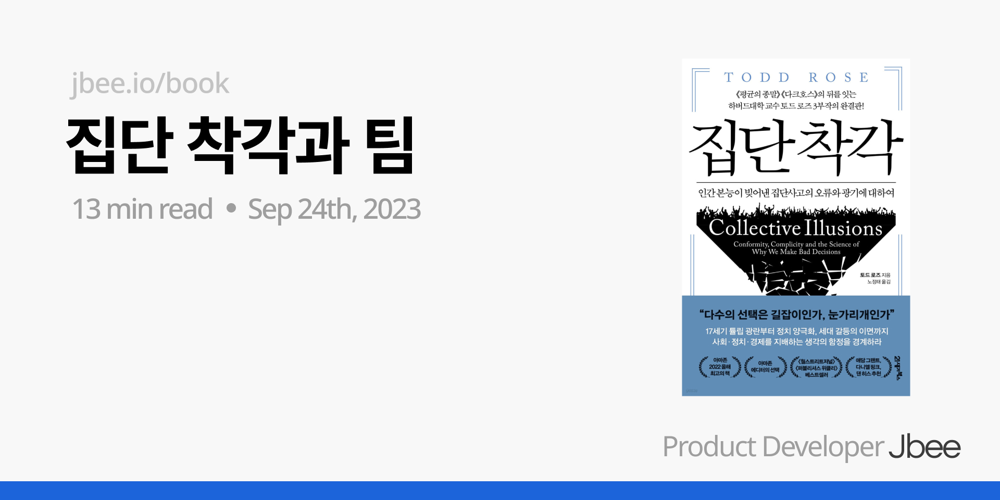

토스의 코어 밸류(핵심 가치) 중, Question every assumption 이라는 가치가 있다. '모든 기본 가정에 근원적인 물음을 제기하라'라는 뜻이다. 하는 일이 엔지니어링인 만큼 너무 중요한 가치라고 생각했고, 토스에 합류하기 전에도 비판적인 사고라던가 5 Why의 중요성에 대해선 잘 인지하고 있었다. 그러나 이러한 역량은 어떻게 개발할 수 있을지 감이 안 잡히던 중, 두 가지 책을 접하게 됐고 어느 정도 방향성을 잡게 됐다.

- 집단 착각
- 평균의 종말

## 집단과 착각

'성공'이 무엇이라고 생각하는지 조사한 자료를 공유하는데, 결과가 참 아이러니 하다. 개인은 ‘본인의 관심과 재능에 따라 최선의 역할을 하며 본인이 아끼는 이들에게 헌신하는 것’이 중요하고 이것이 성공이라고 생각하지만, 이 사회는 그렇지 않다고 생각한다. 이 사회와 다른 사람들은 명예와 돈을 기준으로 성공을 결정한다고 생각한다.

> '난 그런데, 이 세상이 그렇게 만만하진 않더라구'.

### 사회적 규범

무엇을 위한 식사 예절인가? 누구를 위한 결혼식인가? 우리가 당연하게 여겨지고 있는 것들이 하나 둘씩 사라지고 있는 추세이다. 하지만 이는 상당한 노력을 필요로 한다. '결혼은 하는데, 식은 안 올리려고' 이 한 마디면 30분 동안 질문 세례를 받을 수 있을 것이다.

우리가 암묵적으로 합의한 사회적 규범은 세상을 살아가는데 있어서 인지적 부하의 상당 부분을 해결해준다. 이것을 '캉디드의 오류'라고 하며, 아무 생각없이 규범에 협응하는 것을 말한다. 규범이 존재하고 대부분의 사람이 따르고 있다면, 모든 사람들이 그 규범에 동의할 것이라고 생각하게 되는데, 바로 이것이 문제다. 우리가 암묵적으로 합의한 이 규범에 모두가 동의하고 있을까?

### 따라쟁이의 함정

다른 이들과 행동을 조율하고 싶은 인간의 충동을 **순응 편향**이라고 한다. 사람들은 스스로 판단할만큼 충분한 정보가 없다고 생각하거나 결정에 대한 확신이 없을 때, 다른 사람의 결정이나 행동을 따른다고 한다. 다수를 따르면 결정에 대한 책임을 희석시킬 수 있고 실패를 감당하기 그나마 쉬워지기 때문이다. 따라한다는 것은 대세를 선택하고 결정을 포기한다는 것이다.

다수결로 의사결정을 내렸을 때, 모든 이가 원치 않은 방향으로 결정되기도 한다. 본인 만의 판단을 아직 못 내렸지만 의사결정은 해야 하고 그러다보니 떠밀려서 대세를 따르는 결정을 내리게 된 것이다.

#### 따라쟁이 벗어나기

내가 본능적으로 다른 사람의 행동을 따라 한다고 느낄 때 왜인지를 묻고 답할 수 있어야 한다. 하지만 과연 내가 다른 사람을 따라한다는 것을 알아차릴 수 있을까? 누군가 나에게 피드백을 주지 않는 이상 알아차리기 쉽지 않을 것 같다.

모든 것을 알고 결정을 하려다 보니 비용이 커지게 되고 그러다 보니 대세를 선택하는 것이 아닐까? 최대한 알려고 하되 모든 것을 아는 상황은 쉽게 오지 않다는 것을 인정하고 결정할 수 있는 결단력이 필요하진 않을까? 생각을 하게 됐다.

우리의 감정과 행동은 연결되어있다. 나만 잘못된 선택을 하는 것은 아닐까? 나만 다른 선택을 해서 망신을 당하진 않을까? 하는 걱정부터 들기 마련이다. 자퇴를 결정했을 때도 대세를 따르지 않은 결정이었고 이 결정으로 받는 스트레스가 적지 않았다. 대세를 선택하지 않음에서 오는 막연한 두려움도 무시할 수 없는 것 같다. 이 두려운 감정을 떨쳐내고 남에게 인정받고자 싶은 욕구를 떨쳐낼 수 있을까? 이 또한 쉽지 않다.

현실로 되돌아와서, 다들 집 사서 오르는 집값을 타고 가는데, 나만 낙오되는 것은 아닌가? 생각이 들면 난 어중간한 지식으로 결단을 내릴 수 있을까? 아이러니 하게도 중요한 결정일수록 어렵고 그렇기 때문에 피해를 최소화 하기 위해 대세를 따르는 것 같기도 하다.

### 집단지성

과연 집단으로 모여 머리를 맞대면 지성이 되는가? 맞지만 이 집단지성에는 전제 조건이 있던 것이다. 바로 개개인이 개인으로서 판단을 내리고 이 개인의 판단들이 모여야 집단지성이 되는 것이다.

개개인이 개인으로서 판단을 내리는 것이 아닌, 다른 사람의 판단에 영향을 받고 대세를 따르는 판단을 내리게 되는 순간, 집단 지성이 아니라 **집단 무지성**으로 변질된다고 한다. 앞에서 살펴봤듯이 '순응 편향'으로 충분히 그럴 수 있다고 생각했다.

다른 사람의 발언에 영향을 안 받을 수 있는 사람이 얼마나 될까? 그 다른 사람이 가진 배경, 권한, 지위 등이 다르다면? 발언이 주는 영향도는 사람마다 다를 것이다. 이런 점을 생각해봤을 때, 개인의 판단을 존중하고 다양한 판단이 내려질 수 있도록 하는 게 참 중요하다는 생각이 들었다. 또한 판단을 내리기 위한 지식이 없다면 공부해서 채워야 하고 그 판단이 옳은지 검증하는 상호 검증의 분위기가 중요하다.

부분의 합이 전체 그 이상이 되려면, 부분이 부분으로서 가치가 있어야 한다.

### 조직과 개인

> 개인은 부족에게 짓눌리지 않기 위해 언제나 안간힘을 써야한다. - 니체

#### 합의의 함정

의견을 내지 않는 조직보다 위험한 조직이 있을까? 침묵은 궁극적으로 본인에게도 좋지 않고 조직에게도 좋지 않다. 본인의 의견을 솔직하게 말하지 않았기 때문에 본인에게 상처를 남기며 집단의 입장에서는 새로운 정보을 얻지 못했기 때문에 좋을 것이 없다. 그리고 이것은 장기적으로 '집단 착각'을 만들어 조직을 위험에 빠뜨린다. 다양한 의견이 나오지 않는 조직은 미래가 없다.

인간은 사회적 동물이기 때문에 본인만 의견이 다른 고립의 상황을 두려워한다. 의견이 달라도 고립되지 않는 환경을 조성해야 하고, 본인만의 의견을 내더라도 다수에 속할 때 누릴 수 있는 혜택을 그대로 누릴 수 있게 끔 하는 것이 중요하다. 굳이 소수의 의견을 일부러 만들 필요는 없으나 다수에 속하려고 바뀌지 않는 것과 **침묵은 중립이 아니라 해를 끼친다 **는 점을 구성원들에게 인지시키는 것이 중요하다.

#### 소속감

소속하기 위해 거짓을 말하는 경우는 어떨까? 다양한 의견이 나오진 않겠지만 그래도 의견을 이야기하니까 조금이나마 나을까? 인간은 나를 설명할 때와 속해있는 조직을 설명할 때 활성화되는 뇌의 영역이 일치한다. 조직과 나를 동일하게 인지하며 이것이 인간에게 소속감이 중요한 이유이다. 그런데 이 소속감을 위해 거짓을 말하면 어떨까? 집단에 소속되기 위해 스스로를 속이게 되고 결과적으로 자존감도 낮아지게 된다. 속해있는 조직은 좋지 않은 방향으로 나아가게 되고 이것은 본인에게 좋지 않은 결과를 가져오기 때문에 악순환이 반복된다.

소속감에 얽매여 실수를 하지 않으려면 어떻게 해야할까? 믿는 구석을 여러 개 만들어두면 된다. 자기 정체성의 복잡도를 높이는 것이다. 태어나면서 소속되는 가족이 중요한 이유이기도 하다. 조직에서는 개인이 하나의 집단에만 올인하지 않고 여러 조직에 속할 수 있도록 시스템을 마련해보는 것도 시도해볼만 하겠다.

#### 반복 편견

큰 회사라면 사내 익명 게시판 서비스가 있다. 요즘엔 익명 게시글을 올릴 수 있는 공동 게시판 서비스도 있다. 어느 회사에선 루머의 근원지로 활용되기도 하고 어느 팀에선 공식적인 정보보다 빠르게 정보가 공유되는 사원들의 아지트가 되기도 한다.

신뢰란 다른 사람들이 맡은 바 역할을 제대로 해낼 것이며, 그들이 우리에게 지니고 있는 책임을 다할 것이라고 기본적으로 가정하는 것을 말한다. 당연하게도 조직 내에선 이것이 깨지지 않도록 신경쓰는 것이 중요하지만 해내기 어려운 영역이다.

익명 게시판과 조직 내 신뢰는 미묘한 관계에 있다. 인간은 어떤 이야기를 자주 들으면 들을수록 그 이야기가 참이며 다른 사람도 그렇게 생각한다고 믿게 된다. 반복 편견이다. 그렇기 때문에 사실과 무관한 잘못된 이야기라도 반복해서 노출되면 그것이 진실이라고 믿게 된다. 발 없는 말이 괜히 천리를 가겠는가. 익명 게시판이 그 역할을 톡톡히 해낸다.

그렇기 때문에 '예측'해야 하는 영역을 남겨두지 않는 것이 중요하다. 말이 나올 영역을 근본적으로 차단하는 것이다. 공개할 수 있는 정보를 모두 공개하여 모든 것을 관찰할 수 있게 하고 스스로 합리적인 판단을 내릴 수 있게 끔 하는 것이 중요하다. 합리적인 판단을 내릴 수 있다고 가정하는 것 또한 신뢰의 영역이다. 조직엔 올바른 정보가 더 많이 노출되어야 하고, 그래야 입력으로 들어온 잘못된 정보가 사실과 무관하다는 것을 스스로 판단할 수 있다.

하지만 사정에 따라 정보 공유에는 한계가 있기 마련이고 이로 인해 '상상'이 필요한 영역이 생긴다. 사람들은 예측을 하게 되고 이것을 기정 사실화하여 말을 만든다. 만들어진 말은 반복되어 노출되고 이 정보를 기반으로 또 다른 '예측'을 하게 된다. 루머가 만들어지고 신뢰가 깨지는 것인 작은 상상에서 시작된다.

방법은 하나이다. 방금 이야기 한 내용을 모두가 인지한다면 된다. 집단에서 발생한 루머인지, 공개된 사실인지 파악하고 사실에 노출되도록 신경쓰면 된다. '예측하는 뇌는 관찰하는 뇌를 쉽게 이긴다.'는 사실을 모두가 알고 신경쓴다면 유리 같은 신뢰는 무너지지 않을 수 있다.

### 마무리

토드 로즈의 책을 읽으면 많은 생각을 하게 된다. '평균의 종말' 책에 이어 이번 책도 조직 관점에서 여러 생각을 하게 해주었다. 하나의 착각이라도 더 깨닫길.
