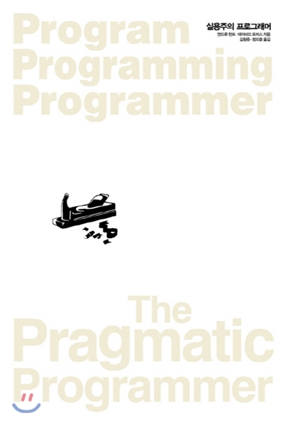

원서는 Practical Programmer라는 책으로 국내에서는 '실용주의 프로그래머'라는 제목으로 출간됐다. 워낙 유명한 책이라서 개인적으로 의미있게 다가온 몇몇 문장에 대해서만 생각을 정리하는 식으로 리뷰를 한다. 코딩과 관련된 내용은 다른 책을 통해서도 많이 다룰 수 있어서 의도적으로 제외했다.

## 자신의 일에 대해 생각하면서 일하라.🤔

이 글에서 **'생각'**이란 모든 개발 과정에서 매일 자신이 내리는 모든 결정을 지속적이고 비판적으로 평가해 보는 것을 말한다.

물리학에서 가장 먼저 배우는 운동의 법칙에 **관성**이 있다. 하던대로 하던 관성에 젖어 자신이 내놓은 문제 해결 방안이 최선이라고 생각하는 순간, 다른 사람의 이야기를 귀기울여 듣지 않게 된다. 기존에 사용하지 않았던 것을 살펴보거나 하던 일을 멈추고 한 발자국 물러나서 자신이 어떻게 문제를 해결해나가고 있는가 비판적으로 평가해보는 것이 중요하다.

무의식적으로 좋지 않은 습관을 갖고 있을 수 있고 반복되는 작업을 계속 그대로 하고 있을 수 있다. 이렇게 **'생각'**하면서 일하면 자신이 문제를 해결하는 생산성을 높일 수 있는 일이기도 하다.

터미널을 통해 Git을 사용하고 있는데 `git status`, `git checkout -b ...` 이렇게 전체 명령어를 다 입력하고 있는 것은 관성에 따라 작업하는 것이라고 생각할 수 있다. 자주 사용하는 명령어들은 alias로 등록해 타이핑하는 양을 줄일 수 있고 그만큼 시간을 절약할 수 있기 때문이다. 하나의 명령어를 입력하는데 몇 초 안 걸리겠지만 이런 부분들을 조금씩 개선해나가는 것이 중요하다고 생각한다.

## 깨진 창문을 내버려 두지 말라.🛠

- 이 깨진 창문을 고치지 않은 채로 내버려 두지 마라.
- 발견하자마자 바로 고쳐라.
- 깨끗하고 제대로 기능하는 다른 시스템들에서 창문 하나가 깨지기 시작하면 그 시스템은 급속도로 악화된다.

여기서 ‘깨진 창문’이란 나쁜 설계, 잘못된 결정, 혹은 형편없는 코드를 말한다.

이 내용은 미국의 범죄학자가 소개한 [깨진 창문 이론](https://ko.wikipedia.org/wiki/깨진_유리창_이론)이다. 지금은 시간이 없고 나중에 고칠 예정이기 때문에 내버려 둔 잘못된 소스 코드들이 프로젝트에 '발생'하는 순간 이 잘못된 것들이 프로젝트 전체에 퍼지게 된다는 뜻이다.

동료의 코드를 리뷰할 때나 코드를 작성할 때 항상 염두에 두고 있는 내용이다. Git을 활용한 형상 관리 기법이 워낙 보편화되어 있고 GitHub에서의 Pull Request 또는 GitLab에서의 Merge Request 기반으로 Code Review가 진행되면서 많은 부분 지켜질 수 있는 부분이다.

좀 더 구체적인 예시는 어떤 것이 있을까. 지금은 당장 사용하지는 않고 아마 가까운 미래에 사용될 예정인 코드들이 주석으로 남아있다고 해보자. 그 주석이 어떤 주석이느냐에 따라 달라지겠지만 이러한 주석들이 하나 둘 생겨나면서 그 정체성은 모호해진다. 어떠한 이유로 남겨둔 주석인지 파악하기 어려우며 정체모를 주석들은 하나 둘 프로젝트 전체로 퍼져나가기 쉽다.

## 자기계발과 관련된 문장들.😱

- 매년 새로운 언어를 최소 하나는 배워라.
- 기술 서적을 분기마다 한 권씩 읽어라.
- 비 기술 서적도 읽어라.
- 수업을 들어라.
- 지역 사용자 모임에 참여하라.
- 다른 환경에서도 실험해보라.
- 트렌드를 놓치지 마라.
- 인터넷을 이용하라.
- 자신이 배훈 교훈들을 현재 프로젝트에 적용하도록 노력하라.

도대체 이 많은 것을 전부 어떻게 한다는 말인가. 하루가 48시간이라면 도전해볼만 하다. 하지만 일반인들은 하루에 기본 8시간은 일을 해야 먹고 살 수 있으며 충분한 수면을 위해 하루 8시간을 숙면에 투자해야 한다. 먹는 시간, 쉬는 시간을 빼고 나머지 시간만 온전히 자신의 시간이 되는데, 하라는 것은 너무 많다.

그래도 의식적으로 분기마다 한 권 씩 읽으려 노력하고 있고 연초에는 어떠한 언어를 시도해볼까 고민(만)한다. 트렌드를 놓치지 않기 위해 newsletter들도 구독하지만 훑어보는 정도이다. 수업을 들었던 경우는 까마득하다.

당장 필요해진 것들을 학습하고 수련하는 시간에만 투자를 해도 시간이 없는 현실.

## 읽고 듣는 것을 비판적으로 분석하라. ✋

종종 새로운 라이브러리 소개글을 보면 '이 라이브러리는 어떤 어떤 점이 좋다.' 이렇게 장점만 소개된다. 자신이 만든 라이브러리의 단점을 소개글에 포함시키는 경우는 당연하게도 매우 드물다. 그렇기 때문에 내용을 비판적으로 받아들이는 것은 굉장히 중요하다고 생각한다. (최근엔 vlang이...)

비슷한 맥락에서, 어떤 라이브러리에 대해 제대로 이해했는지를 물어보려면 그 라이브러리의 장점 말고 단점을 물어보는게 좋다. 단점은 직접 사용해보면서 여러 삽질을 거쳐야만 느껴지기 때문이다. 이런 맥락에서 웹 프론트엔드의 라이브러리 또는 프레임워크, 도구들을 사용해보면서 모두까기 시리즈를 연재해볼까 생각이 들었다.

## 지식을 일반 텍스트로 저장하라. ✍️

나는 지금 지식을 일반 텍스트로 저장하고 있다. 나중에 '내가 블로그를 하는 이유'라는 주제로 글을 쓸 예정이다. 닳고 닳은 주제지만 그냥 내 입장에서 쓰고 싶다.

이 책의 후반부에는 다음과 같은 문장이 나온다.

> 아무리 흐린 먹물이라도 가장 훌륭한 기억력보다 낫다.

프로젝트 문서화도 마찬가지라고 생각한다. 도메인과 관련된 지식, 트러블 슈팅 내용, 개발 환경, 배포 시나리오 및 정책 등 문서화가 필요한 내용들은 정말 많다. 이러한 내용들을 프로젝트 담당자 한 명의 머리속에만 존재한다면 그 프로젝트는 매우 건강하지 못한 것이라 생각된다.

## 요구사항을 수집하지 말고 채굴하라.⛏

완벽한 기획서는 없다. UX를 설계하는 단계에서 변경이 되기도 하고 디자인이 되면서 변경이 되기도 하고 개발이 진행되면서도 변한다. 그렇기 때문에 개발자는 자신이 개발을 계속해서 뒤엎고 싶지 않다면 요구사항을 눈에 보이지 않는 것까지 알아내야 한다.

기획서를 바탕으로 수집하는 것이 아니라 보다 더 좋은 방법은 없는지, 이것이 실제로 구현하는데 문제는 없는지 채굴하는 것이다. 여기서 '문제'란 일정 상 가능한지 또는 기술적으로 가능한지 등을 포함하게 된다.

**그럼에도 불구하고** 요구사항은 반드시 변경되기 때문에 함께 요구사항을 분석하고 그 책임을 조금 나누는 것은 어떨까. 개발자가 기획 단계에서 아무런 관심이 없다면 변경되는 요구사항에 대한 모든 책임이 기획을 정리한 사람에게 돌아간다. 일정은 일정대로 맞춰야하는 개발자 입장에서는 이런 기획자를 원망할 수 밖에 없다.

미래를 예측하는 것은 불가능하다. 요구사항이 변경될 것을 미리 예측하여 확장가능한 설계를 하는 것은 쉽지 않은 일이다. 그렇기 때문에 '소프트'한 구조, 변경이 쉬운 구조를 유지하는 것이 중요하다.

## 사용자처럼 생각하기 위해 사용자와 함께 일하라.🤝

사실 이 문장은 저자가 의도한 것과는 조금 다른 생각이 들었다. 해외 서비스를 개발하고 있는 요즘 많이 느끼고 있는 부분인데, 내가 사용하지 않는 서비스를 개발한다는 것은 참 재미없는 일이다. 투자 서비스를 만들었는데 내가 만든 투자 서비스를 통해서 투자를 해본적이 없다.

문득 업무 환경을 떠나서도 사용하는 서비스를 개발하고 싶다는 생각이 들었다. 꼭 내가 만든 부분이 아니더라도 피드백을 직접 줄 수 있는 프로덕트면 재밌을 것 같다. 아직 해보지 않아서 그렇지 막상 이렇게 되면 서비스를 사용하지 않으려나.

내가 필요한 것을 만들고 만든 것을 사용하는 사이드 프로젝트가 이래서 재미있나보다. 개밥먹기.

## 저자의 개발자에 대한 정의👨🏼‍💻

저자가 말한 내용의 일부분을 각색해보았다.

개발자는 넓은 범위에 걸친 여러 전문 분야의 기술들을 사용해서 어떠한 문제를 해결하기 위해 소프트웨어를 개발하는 사람이며 그 개발 과정은 문제 정의와 해결의 연속. 이러한 개발은 대부분 팀 기반 환경에서 이루어지기 때문에 사회적 기술을 갖춘 사람.

> 실용주의 프로그래머 리뷰 끝.
