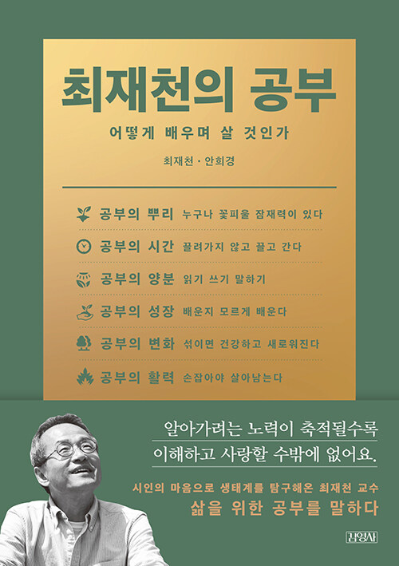

개인적으로 최재천 교수님을 좋아하다보니, 자연스럽게 읽기 시작했다. 서점에서 읽기 시작하여 구매 후 집에 와서 하루만에 다 읽었다. 여운이 가시기 전에 틈 내서 생각을 정리해봤다.

평소에 관심많던 교육에 대한 이야기였고 인터뷰 형식이라 빠르게 읽히기도 했다. 내가 바라던 이상적인 교육을 이야기하고 있어서 실현을 상상하며 설레기도 했다.

공부의 이론을 설명하는 책이라기 보단 최재천 교수님이 그동안 겼어왔던 일들을 공부, 교육이라는 키워드에 맞게 편집한, 자서전에 가까운 책이라고 생각한다.

## 아이들을 자연으로,

유현준 교수님 말을 빌리자면, 학교의 구조가 교도소와 다를 바 없다고 한다. 생각해보면 참 비슷하게 생겼다. 축구하는 친구들의 전유물이 된 운동장을 없애고 숲을 만들자는 이야기도 있다. 너무 많이 가르친다는 얘기도 하며 미적분을 필요로 하는 애들만 공부하는게 맞지 않나?라는 이야기를 했는데, 참 맞는 말이다 싶었다.

나중에 마을을 만들게 된다면 학교를 없애고 마을 자체가 학교가 되는 마을을 만들고 싶다.

최재천 교수님의 어록 중에 ‘알면 사랑한다’라는 말을 좋아한다. 최근 다이빙을 하고 바다를 사랑하게 된 것도 몰랐던 새로운 세상을 알게 됐기 때문이다. 이것을 다른 사람도 알았으면 하는 마음이 생기면서 언젠간 바다의 문제를 해결하는 일을 하고 싶어졌다. 하고 싶은 것을 찾으려면 많은 것을 경험해봐야 하는 것 같다.

그 중 하나로 자연이지 않을까. 자연을 경험하게 하는 것이 중요하지만 이것을 뒷받침할 근거와 명분이 있을까? 잘 모르겠다. ‘자연을 가까이 하는 교육을 시도했더니 하버드에 진학했어요’라면 학부모들이 지지해주려나?

## 하버드 이야기

책의 중간 중간에 하버드 이야기가 자주 나온다. 내용 중 두 가지가 흥미롭게 다가왔다.

난 대학을 졸업해본 적이 없다. 어렴풋이 국내 대학교가 졸업하기가 상대적으로 평이하다는 이야기만 들었는데, 하버드는 그것에 비하면 엄청 어렵구나 싶었다. 예전부터 생각했던 것이지만 이게 맞지 않나? 라는 생각을 갖고 있다.

졸업이 힘든 학교인 것 말고도 유의미하게 다가온 이야기는 전공 말고도 다른 대외활동들을 엄청 열심히 하고 다른 것도 열심히 하는 친구를 응원하고 인정하는 문화이다. 중학교 시절을 되돌아보면 특목고 진학 시 내신을 제출하는데 도덕, 기술가정 이런 과목들은 포함되지 않았다. 자연스럽게 이런 과목들은 신경쓰지 않는 친구들이 있었다. 이와는 아예 다른 양상의 모습이고 부러웠다.

최근 나에게 다양한 색을 입혀보고 있다. 처음 해보는 것들을 도전해보고 세계를 넓히면서 다양한 관점을 갖는게 왜 중요한지 점점 알아가고 있는 중에 의미있게 다가왔다.

## 독서는 빡세게

독서는 취미가 아니라 일이어야 한다고 한다. 대부분 취미로 책을 대하기 때문에 ‘가성비’ 얘기가 나오는 것은 아닐까 생각한다.

최근 책을 읽을 때 이 책을 어떤 목적으로 읽을까를 먼저 고민하게 되었다. 크게 세 가지로 나누고 있는데,

1. 대리 경험/정보 습득을 위한 독서
2. 사고의 관점을 늘리기 위한 독서
3. 재미를 위한 독서
   이렇게 세 가지로 나누고 있다.

개발과 관련된 책은 대부분 1번 목적으로 대한다. 모든 부분을 읽지 않고 내가 원하는 부분만 읽는 방식으로 책을 대하면서 읽는 속도가 빨라졌다. 글만 읽었을 때, 이해가 안 되는 부분에 대해서만 예제 코드를 본다던가 읽지 않고 넘어가는 영역이 많아졌다.

다른 분야의 책, 예를 들면 뇌과학, 인류학 등은 이해를 하면서 읽어나가다 보니 2번의 접근을 하며 숙독하고 있다. 그리고 단순 재미를 위해서 읽는 소설 책들은 3번 접근으로 뇌를 비우기 위한 목적으로 읽는다.

## 교육!

돌고 돌아 사회 문제는 교육으로 귀결된다는 이야기가 있다. 개선애 대한 피드백이 몇십년 후에야 오는 분야이다보니 애자일하게 개선하기 힘든 것 같다. 그래서인지 즉각적인 임팩트를 만들 수 없고 그러다 보니 투자 대비 효율이 떨어져 관심을 갖지 않는건다 싶다.

교육이라는 문제는 개선이 아니라 혁명이 필요한 분야가 아닐까
