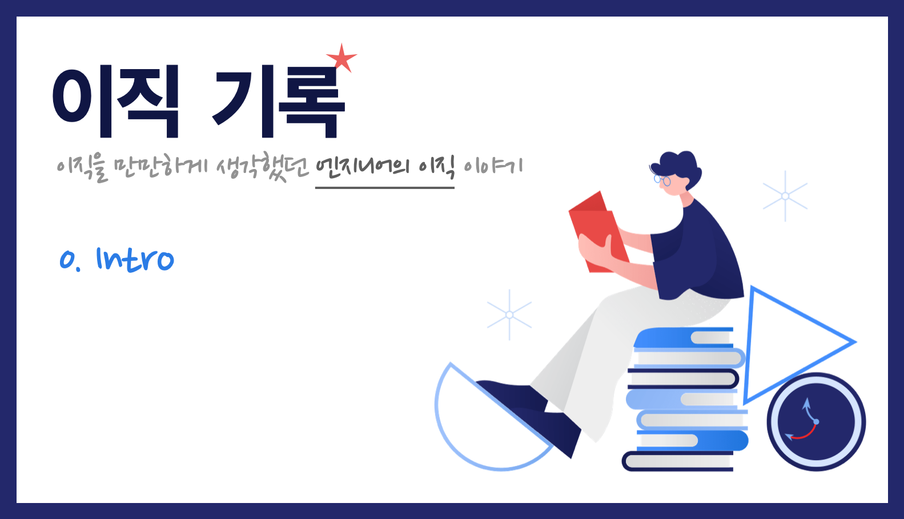

    Image by: <a>https://icons8.com</a>

이번에 이직을 하게 되면서 경험했던 것들을 정리해보려고 합니다. 부족한 필력이지만 수많은 경력직 엔지니어 분들이 자신과 잘 맞는 회사를 찾는데 도움이 되길 바라는 마음으로 정리해봤습니다.

### Table of Contents

1. 준비하기 전에 (coming soon)
   1. 왜 이직하는가
   2. 원하는 회사는 어떤 회사인가
   3. 나만의 기준 확립하기
   4. 생각보다 중요한 의지와 다짐
2. 이력서와 지원 (coming soon)
   1. 좋은 이력서는 무엇일까
   2. 사실 이미 작성되었어야 한다
   3. 회사들의 채용공고 살펴보기
   4. 어떻게 지원할까
3. 기술 인터뷰 (coming soon)
   1. 과제 전형?
   2. 자주 나온 질문과 좋았던 질문들
   3. 어떻게 준비할 수 있을까
   4. 혹시 궁금한 점 있으신가요
4. 컬쳐 인터뷰 (coming soon)
   1. 불리는 이름들과 그 유형들
   2. 자주 나온 질문과 좋았던 질문들
   3. 나에 대해 돌아볼 수 있는 계기
   4. 아쉬웠던 인터뷰
5. 협상과 오퍼, 그리고 오프보딩 (coming soon)
   1. 이상과 현실 (프로 vs 개발자)
   2. 오퍼 조율과 수락
   3. 입/퇴사일 협의 면담
   4. 인수인계
6. 번외 1) 채용 프로세스에 대한 단상 (coming soon)
   1. 과제에 대한 생각
   2. 좋은 기술 인터뷰란 무엇일까
   3. 채용은 속도전
   4. 인재 채용 활동
7. 번외 2) 레퍼런스 체크 (coming soon)
   1. 현재 회사 인원을 무조건 포함?
   2. 합의되지 않은 레퍼런스 체크?
   3. 한 번 더 읽어봐야 하는 동의서
   4. 진행 절차와 준비할 것들

겪었던 이직 과정을 순서대로 정리할 예정입니다. 혹시 경력직 이직에 대해 궁금한 점이 있으신 분들은 아래 **댓글👇을 통해 질문**해주시면 대답해드릴 수 있는 부분에 대해 FAQ 포스팅을 번외로 작성해보려고 합니다.

|       |                                                      |
| :---: | :--------------------------------------------------: |
| Next  |                  [1. 준비하기 전에]                  |
| Intro | [0. Intro](https://jbee.io//career/2020-turnover-0/) |
