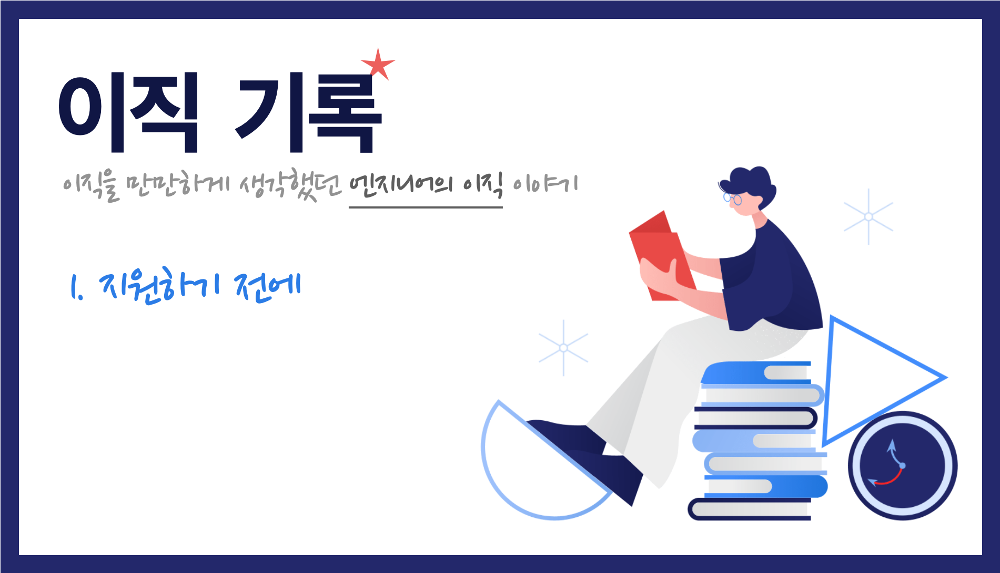

    Image by: <a>https://icons8.com</a>

이직을 본격적으로 준비하고 원하는 팀, 회사에 지원하기 전에 생각해봐야 하는 것들에 대해서 정리해봤습니다.

### Table of Contents

1. 왜 이직하는가
2. 원하는 회사는 어떤 회사인가
3. 실제로 만나고 다니기
4. 생각보다 중요한 의지와 다짐

## 왜 이직하는가

이 질문에 대한 답이 중요한 이유는 앞으로 **지원하게 될 회사를 선택하는 과정**에 있어서 큰 영향을 미치기 때문이고 더 나아가서는 옮기게 된 팀에서 얼마나 **만족도 높게** 일할 수 있는지 결정하기 때문이다.

인터뷰에 대한 내용을 다룰 때 좀 더 자세하게 다루겠지만 경력직 인터뷰에서 10 중 8 정도로 들어오는 질문은 이직을 결심하게 된 이유이다. 양쪽에게 중요한 질문일 수 있는 이 질문에 대한 답을 지원하기 전에 자신만의 기준을 확립하는 것이 중요하다.

이직을 한다는 것은 **새로운 팀으로 합류하는 것**을 의미하지만 그 이전에 **속했던 팀에서 떠난다는 것**을 의미한다. 떠나는 이유가 문제를 **'회피'하기 위해서는 아닌지** 고민해봐야 한다.

이직을 생각하고 있는 어떤 사람에게 그 이유가 무엇인지 물어봤을 때, 10명에게 물어봤다면 그 10명 모두 이유가 다를 것이다. 물론 속한 조직이 특별한 문제가 없을 경우에 그렇다. 조직에 특정한 문제가 있다면 그 문제가 해결될 가능성을 나름대로 판단한 다음 이직을 결심하게 된다.

즉 이직을 생각하게 되는 계기는 **외적 요소**로 인한 것, **내적 요소**로 인한 것 크게 두 가지로 나눌 수 있다.

### 외적 요소

외적 요소는 나 자신이 아닌 속한 조직 또는 외부 환경에 의한 것이다.

- 연봉(또는 복지, 처우 등)이 불만족스러워서
- 상사와의 불협화음 때문에
- 집과 거리가 너무 멀어서
- 추가 채용이 원활히 되지 않아서
- 진행하던 사업이 좋지 않은 결과로 마무리 되어서
- ...

### 내적 요소

내적 요소는 나 자신에 이유가 있는 것들이다.

- 새로운 사업 영역의 도메인을 경험해보고 싶어서
- 자신의 기술 스택을 바꾸기 위해
- 새로운 기술 스택을 경험해보고 싶어서
- 좀 더 넓은 영역에 대해서 일을 해보고 싶어서
- 다른 방식의 업무 프로세스, 일하는 방식을 경험해보고 싶어서
- ...

무엇이 되었든 **'문제'로 정의**한 다음, 현재 속한 조직에서 어떻게 해결할 수 있을지에 대한 고민이 선행되어야 한다. 문제를 회피하려고만 한다면 앞으로 합류하게 될 팀, 조직에서도 만족하지 못하고 다시 이직을 준비할 가능성이 높다.

> 현재 속한 조직을 떠나야 하는 이유를 '문제'로 인식하고 정리해보자.

## 원하는 회사는 어떤 회사인가

이직을 결심하게 되는 계기에 따라 원하는 회사가 달라진다. 정리한 내용을 바탕으로 원하는 회사 리스트를 정리해보자.

연봉이 불만족스러워서 이직을 결심했다면 기본적으로 처우를 좋게 준다는 회사를 알아봐야 할 것이며, 새로운 사업 영역의 도메인을 경험해보고 싶어서 이직을 결심했다면 현재 소속된 사업 영역과 다른 사업 영역의 회사를 알아봐야 할 것이다.

하지만 지원자 입장에서 회사에 대한 깊은 정보를 얻을 수 있는 곳은 거의 없다.

어느 회사든지 자신들의 회사는 '수평적인 조직 문화'를 가지고 있고 '최고의 동료들과 함께' 하며 '합리적인 의사결정'을 한다고 한다. (실제로 그런지는 들어가서 일해봐야 알 수 있는 것들이다.)

> 최대한 정보를 수집하여 원하는 회사 리스트를 정리하자.

## 실제로 만나고 다니기

정리한 회사 리스트 중 재직 중인 사람이 있는 회사라면 직접 이야기를 듣는 것이 가장 **정확하고 생생한 이야기**를 들을 수 있다. 추천인 보너스 제도를 통해 인재가 채용되면 서로에게 득이 되므로 재직자들도 적극 채용 활동에 나선다.

요즘에는 오피스 투어를 장려하는 스타트업도 많고, CTO 직책을 맡고 있는 분들이나 Tech HR을 담당하시는 분들이 먼저 인터뷰를 요청하기도 한다. 집 밖으로 나서면 회사에 대한 정보를 생각보다 많이 접할 수 있다. 이러한 부분들을 어려워 하지 말고 요청하면 회사들의 실제 일하는 방식, 조직문화를 간접적으로 경험해볼 수 있다.

개발자 행사에 참여한다면 채용 부스를 운영하고 있는 스폰서 회사들이 있다. 부스에 방문하게 되면 채용 프로세스, 개발 문화, 사용하고 있는 기술 스택 등에 대한 생생한 이야기를 들을 수 있다.

실제로 경험했던 회사 중, 외부에서 봤을 때 성장도 폭발적으로 하는 벤처 회사였지만 채용 프로세스 상에서 느껴진 것은 굉장히 대기업스럽고 인상이 좋지 않았던 회사도 있었다. (몇 시간이 채 되지 않는 인터뷰 시간이었지만 가고 싶지 않은 회사가 되었다.) 반대로 외부에서 봤을 때는 그냥 그랬던 회사였지만 실무자들과의 대화에서 매력을 느끼게 된 회사도 있었다.

그리고 받은 오퍼들 중 최종 결정을 내릴 때, 이야기를 나눠본 사람이 있는 회사에 더 마음이 갈 수밖에 없다. 만나서 나눈 이야기를 기반으로 가게 될 회사에서 어떤 일을 맡게 될 지 어떻게 퍼포먼스를 낼 지 그려지기 때문이다.

> 최소 1~2년 다닐 회사, 팀에 대한 정보를 발품팔아 얻어보자.

## 생각보다 중요한 의지와 다짐

목표로 하는 회사를 결정했다면 준비하고 계획하기 전에 한 가지 다짐을 해야 한다. 이직에는 **상당히 많은 비용**이 들어간다. 준비를 위해 퇴근 후의 개인 시간 전부를 투자해야 할 것이고 채용 프로세스가 진행되는 동안에는 본업에 충실하면서 여러 가지 일들을 동시에 진행해야 한다.

이렇게 **많은 시간과 비용을 투자할 준비가 되어있는지** 자기 자신에게 물어봐야 한다.

또 새로운 환경에 적응하고 **퍼포먼스(성과)를 내기 까지의 시간과 비용을 감수할 수 있는가**이다. 현재 팀에서는 익숙한 업무 환경과 친해진 동료들이 있기 때문에 새로운 환경에 적응하는 비용이 없다. 그러나 새로운 팀에 합류하고 나서는 적응하는 시간동안 퍼포먼스를 100% 발휘하기 힘들다.

마지막으로 생각해봐야 할 것은 **이직에 실패할 수 있다는 가능성**을 열어둬야 한다. 불합격을 한 번 받으면 그 순간 자신감이 많이 하락한다. 채용 프로세스 상 최종 합격보다 불합격 소식을 빨리 듣게 된다. A라는 회사, B라는 회사 두 회사를 동시에 진행하고 있을 때, 한 곳에서 불합격을 받으면 다른 한 곳에서 면접을 진행하는 동안 자신감이 떨어질 수 밖에 없다.

목표로 했던 회사 리스트에 있는 회사들에게 전부 불합격을 받을 수도 있다. 이럴 땐 기존의 조직으로 돌아가서 다시 준비를 해야 하는데, 이 때의 스트레스도 감당하기 힘들 수 있다.

여러 예상치 못한 일들로 이직을 준비하는 기간이 길어질 수도 있다. 이러한 것들을 감내할 다짐이 생각보다 중요하다.

> 이직에 대한 의지를 점검하고 멘탈이 흔들리지 않겠다는 다짐이 필요하다.

## 마무리

이 글에서 이야기한 여러 가지를 고려해봤을 때 이직의 타이밍이라면 멘탈을 다잡고 준비를 해나가면 된다. 이제 이력서를 정리하고 지원을 해보자.

|       |                                                              |
| :---: | :----------------------------------------------------------: |
| Next  |                 [이직기록 2. 이력서와 지원]                  |
| Intro | [이직기록 0. Intro](https://jbee.io/career/2020-turnover-0/) |
