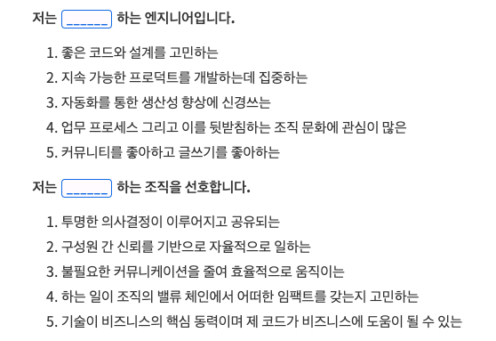

    Image by: <a>https://icons8.com</a>

이직을 본격적으로 준비하고 원하는 팀, 회사에 지원하기 전에 정리해야하는 이력서에 대해서 정리해봤습니다.

### Table of Contents

1. 좋은 이력서는 무엇일까
2. 이력서의 내용
3. 이력서의 형식
4. 이력서 작성하기

## 좋은 이력서는 무엇일까

이력서에 대한 좋은 자료들은 정말 많다. [junior-recruit-scheduler](https://github.com/jojoldu/junior-recruit-scheduler#%EC%9D%B4%EB%A0%A5%EC%84%9C--%ED%8F%AC%ED%8A%B8%ED%8F%B4%EB%A6%AC%EC%98%A4-%EC%9E%91%EC%84%B1%EB%B2%95)라는 저장소에도 많은 자료들이 정리되어 있다.

### 이력서의 기본

기본적으로 이력서는 채용하는 입장에서 지원자를 **궁금해하도록** 해야한다.

일단 진행한 프로젝트가 있다면 어느 정도 **기간**동안 진행했는지 어떤 **역할**을 맡았는지 명시되어 있어야 한다. 진행한 프로젝트만 명시되어 있다면 그 프로젝트를 진행하는 동안 지원자는 무엇을 했는지, 어떤 문제를 해결했는지 알 수가 없다.

진행한 프로젝트 상세 내용에 **'성능 향상 및 사용성 개선'**이라는 내용이 있다고 하자. 채용 담당자 (또는 서류 검토자, 면접관)은 어떤 부분에서 성능을 향상시킨 것일까? 초기 로딩 성능을 개선한 것일까, 렌더링 성능을 개선한 것일까 궁금할 수 있다. 사용성을 개선했다고 했는데 어떤 사용성을 개선한 것일까? UX를 개선한 것일까, 무엇을 개선한 것일까 궁금하기 마련이다.

> 문제를 해결했던 경험을 기반으로 궁금증을 유도해보자.

## 이력서의 내용

그렇다면 이력서에는 어떤 내용이 들어가면 좋을까? 필자는 커리어 코치도 아니고 이력서를 많이 검토해본 경험도 없기 때문에 주관적인 관점에서 정리를 해봤다.

### 1. 추상적인 부분은 구체적으로

앞의 예시에서 이력서의 내용에 '향상', '개선'이라는 단어를 사용했다. 향상시켰다던가 무엇인가를 개선했다는 것은 이전보다 나아짐을 의미하며 이 때, 이전과 이후를 어떻게 **'측정'했는지**가 중요하다.

그리고 어느 정도를 개선했는지 **숫자**로 드러내는 것이 좋다. 개선했다고 했을 때, 나온 결과를 기반으로 이야기할 수 있어야 하는 것이다.

> 개선에 대한 내용은 측정을 기반으로 작성하자.   추상적인 표현 대신 구체적인 표현을 사용하자.

### 2. %와 기술 스택은 글쎄

이력서에서 흔히 볼 수 있는 두 가지인데, 기술 스택에 대한 이해도를 %로 표현한 것과 자신이 다룰 수 있는 기술 스택을 하나 하나 나열한 부분이다. 일단 필자는 이 부분에 대해 꽤 부정적이다.

'React라는 기술 스택을 100%로 이해하고 있다.' 라고 이력서에 적혀있을 때, 이 100%는 받아들이는 사람마다 다르다.

지원자의 입장에서는 React라는 라이브러리를 사용하여 프로젝트를 진행해봤고 추후 진행하는 프로젝트를 React로 문제없이 진행할 수 있다는 가정하에 100%라는 수치를 적었겠지만 채용 담당자가 이 100%라는 수치를 받아들일 때, React 커미터 (Committer) 수준을 요구할 수 있다. (실제 React 오픈소스 프로젝트의 커미터라면 100%라고 적어도 될 것 같다.)

그리고 이 기술 숙련에 따른 % 수치는 누가 측정하는가? 어떤 기술 스택에 대한 이해도를 60%정도 라고 했을 때, 그 의미가 무엇인지 도대체 모르겠다. 측정하는 기준이 없는 수치는 의미가 없다고 생각한다.

기술 스택을 나열한 것도 같은 맥락이다. 사이드 프로젝트에서 살짝 사용해본 라이브러리, 프레임워크 또는 언어가 명시되어있는 경우들이 많은데, 보통 잘 모르는 기술 스택에 대해서도 조금이라도 더 많아보이기 위해 적는 경우가 많다. 필자가 채용 담당자라면 나열된 기술 스택을 믿지 않을 것 같다. 물론 사이드 프로젝트에서 사용했던 기술도 사용해본 것이지만 그렇다면 각 기술들을 어느 정도 레벨에서 사용해봤는지 함께 명시가 되어야 한다.

> 사용해봤던 기술 스택에 대해서는 진행한 프로젝트를 부연 설명할 때 적는 것만으로도 충분하다.

### 3. 단점을 아는가

사용했던 기술 스택에 대한 내용을 조금 더 보충하자면 사용한 기술 스택의 단점까지 알아야 진정으로 그 기술 스택을 이해한 것이 된다. 기술 스택을 소개하는 여러 아티클들은 그 기술 스택의 장점에 초점을 둔다. 그러나 모든 기술 스택 도입에는 트레이드 오프가 있기 마련이다.

이 트레이드 오프를 정확히 분석하고 어떤 장점때문에 도입을 했고 단점은 어떤 방법으로 상쇄했는지 말할 수 있을 때, 자신의 기술 스택이 된다.

> 사용해봤던 기술 스택의 단점은 무엇인지 한번 생각해보자.

## 이력서 형식

일단 필자의 이력서는 웹 상에 공개되어있다. (<https://jbee.io/about>) 별 내용은 없지만 외부에 공개로 올려놓고 평소에도 꾸준히 관리하는 중이다. 꾸준히 관리한 덕분에 이력서의 내용보다는 포맷을 정리해야 했다.

실제로 지원할 때에는 간소화된 내용으로 정리된 **PDF 형식의 이력서**로 지원을 했다. 그 이유는 두 가지이다. 필자가 웹 상에 공개하여 관리하는 이력서는 **스타일링이 주관적으로** 되어있다. 많은 사람들이 차용한 포맷이 채용 담당자가 이력서를 읽는데 편할 것이라고 생각했다. 그리고 대부분 PDF형식으로 제출을 해야하기 때문에 PDF 형식으로 이력서를 관리해야 한다.

내용은 경력과 관련이 없는 외부 발표 내용은 제외하고 재직한 **회사에서의 경력을 중심**으로 간소화했다. 제출용 이력서를 한 벌 더 만드는 것이 부담스러웠기 때문에 원티드에서 제공하는 PDF Export 기능을 사용했다. 실제로 웹 상에서 관리되고 있던 이력서 기반으로 텍스트만 넣어주면 PDF로 가져올 수 있어서 편리했다.

> 자신만의 스타일은 지양하고 PDF 형식으로 이력서를 준비하자.

## 이력서 작성하기

어떤 내용을 넣을지, 어떤 형식으로 작성할지 결정했다면 이력서를 작성하면 된다. 필자는 다음과 같은 순서로 이력서 순서를 정했다.

1. 본인에 대한 간단한 소개 (이메일, 연락처, 자기소개)
2. 경력 기술 (시간 역순)
3. 학력
4. 기타 활동
5. 자신을 드러낼 수 있는 링크들

가장 **중요한 것부터 순서대로** 작성하면 된다. 경력 기술 또한 현재 재직 중인 회사를 처음으로 시작하여 **역순**으로 경력을 기술하면 된다. 기타 활동에는 활동하고 있는 개발 커뮤니티 내용을 넣었고 링크에는 GitHub 계정 링크와 블로그 링크를 추가했다.

참고로 웹 상에서 공개하고 있는 이력서에는 가장 중요하지 않다고 생각하는 학력을 마지막에 두었지만 원티드 이력서는 그렇지 않아서 저런 순서로 작성이 됐다.

### 나라는 개발자에 대한 소개

이력서를 작성할 때, 필자는 나라는 개발자를 좀 더 잘 드러내고 싶었다. 그래야 합류하게 될 팀에서도 자신의 팀에 맞는지 제대로 확인할 수 있기 때문이다. 서로 윈윈(win-win)이 되길 바라며 자기소개 구성을 독특하게 해봤다. (이 부분에서 면접 질문이 정말 많이 들어왔다.)

내가 어떤 개발자인지, 어떤 엔지니어인지 소개를 추가했다. 엔지니어로서 일을 할 때 가장 크게 가치를 두는 부분을 드러내기 위해 집중을 했다. 그리고 함께 일할 팀에게 바라는 이상향을 중심으로 **어떤 조직을 선호하는지** 추가했다.

> 큰 틀을 잡고 자신을 잘 드러낼 수 있게 이력서를 보충하자.

### 사실 이미 작성되었어야 한다

바로 제출할 수 있을 정도로 이력서 포맷에 맞춰 작성되어 있어야 한다는 이야기가 아니다. 현재 속해 있는 팀에서 진행했던 프로젝트들이 정리되어 있어야 하고 그 프로젝트를 진행하면서 겪었던 이슈들, 문제를 해결해나갔던 경험들이 정리가 되어있어야 한다.

아무런 재료없이 이력서를 작성하려고 하면 정말 막막하다. 평소에 문제를 해결했던 경험들, 겪었던 이슈들 등을 잘 정리해두었다면 무리없이 이력서 포맷으로 정리할 수 있다.

현재 소속되어 있는 팀에 이슈를 정리하여 공유하는 문화가 잘 되어있다면 자신이 공유한 내용을 정리하면 되겠지만, 그렇지 않다면 스스로 정리를 해두고 이력서 작성할 때 참고하면 좋다.

> 이력서의 재료들은 평소에 정리해두는 습관을 들여보는 것은 어떨까

## 마무리

이제 자신을 대신 어필해줄 선봉장, 이력서도 준비되었고 지원할 회사를 고르고 지원하면 된다.

|       |                                                              |
| :---: | :----------------------------------------------------------: |
| Next  |             [이직기록 3. 지원하기 (coming soon)]             |
| Intro | [이직기록 0. Intro](https://jbee.io/career/2020-turnover-0/) |
