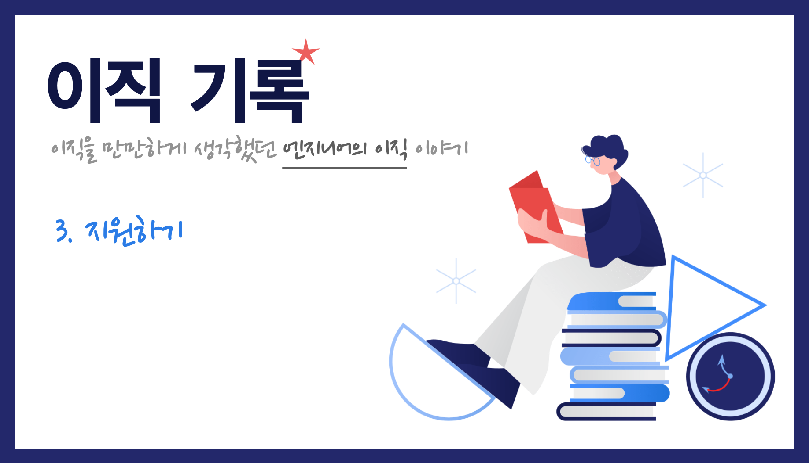

    Image by: <a>https://icons8.com</a>

이직을 회사에 지원을 할 때 살펴봤던 내용들에 대해 정리해봤습니다. 주로 프런트엔드 엔지니어 채용공고를 살펴봅니다.

### Table of Contents

1. 채용 공고의 구성 요소
2. 자격요건
3. 우대조건
4. 어떻게 지원할까

## 채용 공고의 구성 요소

Job Description이라고 불리는 채용 공고이다. 우선 성의없는 채용 공고를 내걸고 함께 할 사람을 찾는 조직에는 지원할 이유가 없다. 대부분 지원자 입장에서 회사에 대한 첫인상은 JD가 결정하기 때문이다. 본인이 성의없다고 느꼈으면 다른 사람들도 성의없다고 생각할 수 있다. 이는 합류하게 되었을 때도 원활한 채용 활동을 하지 못하고 있는 조직이라는 것을 의미한다.

채용 공고의 기본은 다음 세 가지이다.

- 주요 업무(또는 담당 업무)
- 자격 요건
- 우대 사항

추가로 조직 내에서 사용하고 있는 기술 또는 프로덕트를 구성하고 있는 기술을 명시하기도 한다. 조직별로 채용을 진행하고 있다면 '조직 소개'가 들어가면 좀 더 좋고 공고마다 채용 프로세스가 다를 수 있다면 '채용 프로세스'도 명시가 되어야 한다.

팀에 대해 좀 더 알아볼 수 있는 **기사나 링크**가 들어가있으면 팀을 이해하는데 큰 도움이 되며 팀 내에서 엔지니어링 핸드북을 만들어서 관리하고 있다면 함께 공유를 해도 좋을 것 같다.

- [토스팀 프런트엔드 개발자 인터뷰 - 토스의 첫인상을 책임지는 사람들, 프론트엔드 개발자를 만나다](https://blog.toss.im/2019/09/05/tossteam/people/toss-frontendchapter-interview/)
- [메쉬코리아 Front-End Engineering Handbook](https://github.com/meshkorea/front-end-engineering)

> 우선 기본적인 채용 공고, JD를 갖춘 회사를 살펴보자.

## 자격요건

자격 요건은 말 그대로 해당 포지션을 지원하는데 **기본이 되는 자격**을 말한다. 필자의 주관적인 해석이지만 이 부분을 잘 살펴보면 재밌는 것을 알 수 있다. 프런트엔드 엔지니어 채용 공고를 기준으로 살펴보면 다음과 같은 내용들은 빠지지 않는다.

- HTML, CSS, JavaScript에 대한 이해가 깊은 분
- React, Vue, Angular 등 SPA 프레임워크 사용에 능숙하신 분
- Git 등의 분산 버전 관리 시스템 이용에 능숙한 분
- 새로운 기술에 관심이 많고, 자기 개발을 위해 노력하시는 분
- 서버 개발자, 디자인 직군과 원활히 소통하는 능력
- (경력직 공고의 대부분은 여기에서 '3년차 이상' 또는 '5년차 이상'을 포함시킨다.)

자격요건은 말 그대로 **기본**에 해당되는 사항이다. 경력직의 경우 이 부분은 딱히 눈 여겨볼 필요없다.

그러나 이 **기본적인 것들 이외의 자격요건**을 살펴보면 **이 팀의 프런트엔드 엔지니어가 어디에 집중하는지** 알 수 있다. 예를 들면 다음과 같은 내용이 추가되었다면 그 팀이 주로 사용하고 있는 언어나 **중점적으로 두고 있는 가치**에 대해 알 수 있다.

1. TypeScript, Flow 등 JS 정적 타이핑 툴 경험
2. UI/UX에 대해 높은 가치를 두고 있는 분
3. Redux, Redux-Saga, RxJS 등 개발 및 운영 경험이 있으신 분

내용으로 봤을 때, **충분히 우대조건에 포함될 수 있는 내용을 자격요건에 넣어뒀다면** 다음과 같은 의미가 있지 않을까 생각된다.

1. 정적 타이핑을 적극적으로 사용하며 이로 인해 얻을 수 있는 이점을 명확하게 활용한다.
2. 프로덕트의 가치 중 UX를 중요하게 생각하며 이를 바탕으로 개발자는 디자이너와 긴밀한 협업을 진행한다.
3. SPA로 작성된 웹 애플리케이션에서 상태 관리의 중요성을 인지하고 있으며 비동기 처리를 위한 여러 가지 도구를 사용한다.

> 자격요건에서 다른 회사와의 차이점이 있다면 그 부분을 살펴보자.

## 우대조건

이 경우도 일반적인 것들 제외하고 살펴봐야 한다. 우대조건에는 일반적으로 다음과 같은 것들이 기술된다.

- 단위 테스트, UI 테스트 자동화 및 배포 자동화 경험
- 성능 측정 및 최적화 경험
- 서버 사이드 개발 경험 혹은 백엔드에 대한 기본적인 이해
- Webpack, Rollup 등 모듈 번들러에 대한 이해가 깊으신 분
- 오픈 소스 기여 경험

일반적인 것들을 제외하고 명시되어있는 우대조건은 **실제로 팀에서 벌어지는 일들**에 대해 명시가 되있을 확률이 높다. 예를 들면 다음과 같은 것들이다.

- 웹 표준을 고려한 UI 개발 경험이 있는 분
- 서버 사이드 렌더링(SSR) 개발 경험이 있는 분
- 모바일 앱 내 웹앱 개발 경험
- GraphQL에 대한 이해
- Electron 개발 경험
- E2E Test 경험
- D3.js 등 데이터 시각화 라이브러리 사용에 능숙하신 분
- UI의 애니메이션이나 모션에 대한 관심이 있거나, 구현하는 것을 즐기는 분

실제로 팀에서 운영중인 프로덕트 중 서버사이드 렌더링을 하고 있다던가, 웹앱을 통해 서비스된다던가 Electron을 사용하여 데스크탑 애플리케이션을 서비스하고 있다는 뜻이다. 평소에 자신이 해보고 싶었던 부분이 있는지 또는 이미 경험해봐서 잘할 수 있는 부분이 있는지 살펴보면 좋다,

> 뻔한 이야기를 걷어내면 그 팀이 중점적으로 두고 있는 가치와 하는 일이 보인다.

## 어떻게 지원할까

지원할 수 있는 경로는 여러 가지가 있다. 헤드헌터를 통해서 진행할 수도 있고 채용 플랫폼을 통해 회사에 지원할 수 있고 회사로 바로 지원하는 방법도 있다.

여기에서 중요한 것은 일정 계산이다. 회사마다 채용 프로세스가 진행되는 속도가 다르다. 대기업 성향이 있는 회사일수록 채용 프로세스가 느리다.

앞에서 말했던 것처럼 큰 회사라고 전부 '대기업'처럼 채용 프로세스가 느리게 진행되는 것은 아니다. 오히려 벤처 회사지만 최종 합격까지 여러 절차를 추가하여 느리게 진행되는 벤처회사도 있다. (인성 검사, 적성 검사, 레퍼런스 체크 등) 실제로 프로세스가 가장 빨랐던 팀은 면접이 끝나자마자 다음 일정을 문의하여 난감했던 적도 있다.

채용 프로세스가 보통 어느 정도 걸리는지 확인한 후에 일정을 정리해야 한다. 하지만 예상했던 것보다 느리게 혹은 빠르게 진행될 수 있는데, 채용 프로세스 담당자와 일정을 잘 조율하는 것이 필요하다.

## 마무리

채용 공고를 잘 살펴본 후, 자신에게 맞는 회사를 리스트업하여 지원하자. 이제 인터뷰를 준비해보자.

|       |                                                              |
| :---: | :----------------------------------------------------------: |
| Next  |           [이직기록 4. 기술 인터뷰 (coming soon)]            |
| Intro | [이직기록 0. Intro](https://jbee.io/career/2020-turnover-0/) |
