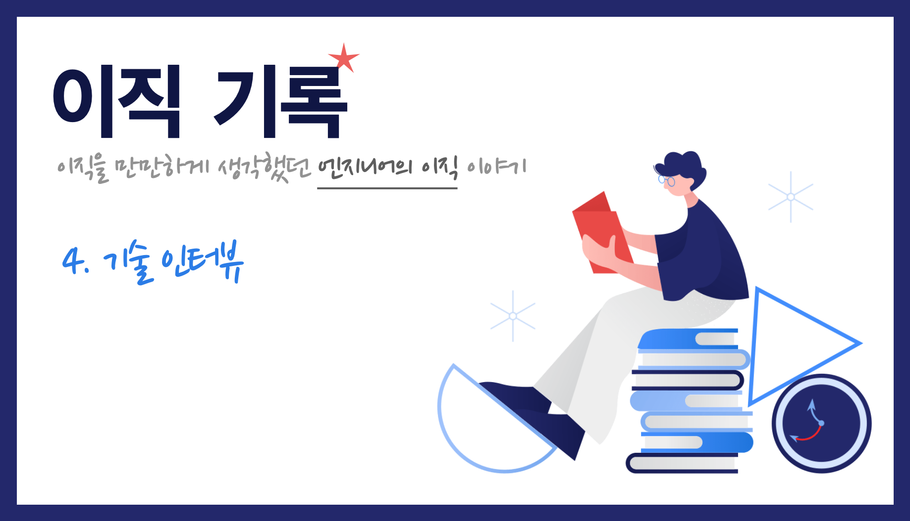

    Image by: <a>https://icons8.com</a>

개발 직군 채용 프로세스 상 반드시 존재하는 기술 인터뷰에 대해 정리해봤습니다.

### Table of Contents

1. 과제 전형
2. 자주 받았던 질문과 좋았던 질문들
3. 어떻게 준비할 수 있을까
4. 혹시 궁금한 점 있으신가요

## 과제 전형

서류 전형에 합격했다면 대면 인터뷰를 진행하기 전에 과제를 진행하거나 코딩 테스트를 진행한다. 회사에 따라서는 바로 기술 면접을 진행하기도 하고 화상으로 사전 인터뷰를 진행하는 경우도 있다.

지원한 회사 중 코딩 테스트를 실시하는 회사는 2곳이었고, 과제 전형을 진행한 곳은 4곳이었다. 나머지는 이 단계를 건너뛰고 바로 면접 프로세스를 진행했다.

과제의 종류는 간단한 '할일 관리 애플리케이션 만들기'부터 시작해서 'Socket을 이용한 채팅 애플리케이션 만들기'까지 다양했다. 겹치는 과제가 없었고 전부 처음부터 만들었다. 어떤 회사는 제플린 시안을 기반으로 구현하는 부분까지 평가 요소에 포함됐다.

코딩 테스트는 일반적인 알고리즘 코딩 테스트도 있었고 주관식 문제도 함께 나오는 유형도 있었다. 두 곳은 다음과 같은 플랫폼을 사용했다.

- [프로그래머스 코딩테스트 플랫폼](https://programmers.co.kr/)
- [testdom.com](https://www.testdome.com/)

### 일정 조율

여러 회사를 동시에 지원한다면 과제 일정이 겹치지 않도록 잘 조율해야 한다. 퇴직을 하지 않았다면 재직 중인 회사에서 퇴근 후에야 시간이 되기 때문에 생각보다 시간이 많이 부족할 수 있다. 주말을 포함하여 일정을 조율하되 여러 회사의 과제 전형을 동시에 진행하지 않도록 하는 것이 좋다.

> 과제를 진행하기 위한 시간을 충분히 확보하자.

### 과제 vs 코딩테스트

둘 중에서 자신이 자신있는 것은 무엇인지 생각한 다음에 회사를 선택하는 방법도 있다. 자신이 알고리즘 문제를 잘 푼다면 코딩 테스트 전형이 채용 프로세스에 있는 회사에 지원하면 된다. 필자는 두 유형 중 과제 전형이 더 좋다고 생각하여 주로 과제 전형으로 진행하는 회사에 지원을 했다.

코딩 테스트는 몇 시간이면 끝나지만 과제의 경우 꽤 많은 시간이 필요하기 때문에 이 점을 유의해서 고민해보면 좋을 것 같다.

> 자신에게 유리한 전형으로 진행되는 회사, 팀으로 지원하자.

### 익숙한 개발 환경 템플릿 만들어두기

과제를 진행하기 위해선 우선 개발 환경을 구축해야 한다. 과제를 할 때마다 개발 환경 구축부터 시작하면 시간이 정말 오래 걸린다. 과제의 요구 사항을 구현하는데 집중하기 위해 자신에게 익숙한 개발 환경을 미리 구축해두는 것을 추천한다. 좀 더 나아가 템플릿으로 만들어두는 방법도 있다.

주어진 과제들은 SPA 라이브러리의 제약이 없었다. 대부분의 과제는 오픈소스 라이브러리 사용에 제약이 없거나 있다 하더라도 React일 가능성이 높기 때문에 필자는 create-react-app 기반의 템플릿을 만들어두었다.

가장 익숙한 라이브러리들로 필요한 개발 환경을 미리 구축해둔 것이다. 현재 [cra-template-unicorn](https://github.com/JaeYeopHan/cra-template-unicorn)이라는 이름으로 오픈소스로 공개하여 관리하고 있다. 개발 환경을 구축할 때마다 매번 반복될 수 밖에 없는 것들을 미리 템플릿화하여 과제를 좀 더 수월하게 진행할 수 있었다.

> 자신에게 익숙한 라이브러리나 프레임워크를 기반으로 개발 환경을 미리 만들어두자.

## 자주 받았던 질문과 좋았던 질문들

면접이 끝나고나서 바로 면접 과정을 복기하면서 놓쳤던 질문은 무엇이 있었는지부터 어떤 대화가 오갔는지 메모를 해뒀다. 그 중 자주 받았던 질문과 좋았던 질문들을 간단하게 정리해보려고 한다.

### 자주 받았던 질문

경력직 기술 인터뷰는 보통 이력서 기반으로 진행되기 때문에 중복으로 받게 되는 질문이 많았다. 대부분은 이력서를 정리하면서 질문이 나올 것이라 예상했던 부분에 대한 질문을 받았고 이 부분은 미리 준비를 해뒀다.

"이력서에 적힌 내용 중..."

- **성능**을 개선한 부분을 좀 더 설명해주실 수 있나요?
- **사용성**을 개선한 부분을 좀 더 설명해주실 수 있나요?
- **설계**를 진행한 부분을 좀 더 설명해주실 수 있나요?
- **테스트**를 보강한 부분을 좀 더 설명해주실 수 있나요?
- **배포 자동화** 부분을 좀 더 설명해주실 수 있나요?
- **App-Like 한 UI**는 어떻게 진행했나요?

이러한 질문들은 '퀴즈쇼' 면접이 아닌 **경험을 기반**으로 진행되기 때문에 좀 더 많은 대화가 오갈 수 있어서 좋았다. 그 외에 프런트엔드 개발의 기본적인 부분에 대해서도 많은 질문을 받았다.

- Redux를 사용하는 이유는 무엇인가요?
- redux-saga라는 redux middleware를 사용한 이유는 무엇인가요?
- 웹뷰 환경에서 디버깅은 어떤 방식으로 진행할 수 있나요?
- 프런트엔드 개발에서 테스트 코드는 어떻게 작성할 수 있나요?
- CSS-in-JS의 장점과 단점은 무엇이 있나요?

> 이력서를 기반으로 받을 수 있는 질문들에 대해서는 미리 정리를 해두자.

### 좋았던 질문들

개인적으로 단순한 퀴즈쇼 질답 인터뷰보다 실제 현업에서 발생할 수 있는 상황을 가정하고 함께 이야기하면서 진행하는 인터뷰가 기억에 남았고 면접을 마치고 나서도 배울 점이 많았다. 개인적으로 좋다고 생각하는 상황 기반의 질문들은 다음과 같다.

- 애플리케이션이 '느리다'라는 피드백을 받았을 때, 어떻게 접근할 수 있을까요?
- A라는 기능을 구현하기 위해서는 브라우저의 어떤 storage를 사용하여 해결하는 것이 좋을까요?
- 이 엘리먼트는 문제가 있는 것 같은데, 어떤 문제가 있을까요?
- 접근성 관련하여, 접근성은 왜 중요하며 개발자는 무엇을 할 수 있을까요?
- 다국어 처리 시, 리소스는 어떻게 효율적으로 관리할 수 있을까요?

중요한 개념들을 단순하게 물어봤던 질문들은 다음과 같다.

- 이벤트 루프에 대해 설명해주세요
- 클로저에 대해 설명해주세요
- 웹 브라우저가 화면을 렌더링하는 순서에 대해 설명해주세요
- DOM에서 이벤트 전파 방식의 종류에 대해 설명해주세요

## 어떻게 준비할 수 있을까

작성한 이력서 기반의 예상 질문 정도는 먼저 준비를 하는 것이 좋다. 그리고 평소에 개발을 하면서 무의식적으로 사용하고 있던, 위에서 언급한 기본 개념들에 대해서는 다시 한번 정리할 필요가 있다. 좀 더 정리된 상태로 대답할 수 있도록 자신의 언어로 배출하여 정리하는 것이 필요하다.

간단한 질문들은 [Interview_Question_for_Beginner](https://github.com/JaeYeopHan/Interview_Question_for_Beginner) 저장소를 참고했다.

여담으로 [Cracking the Coding Interview](http://www.crackingthecodinginterview.com/) 책을 샀는데, 한번도 펼쳐보지 않았다.

### 모의 면접

인터뷰는 보통 2:1 또는 3:1로 진행된다. 4:1로 진행된 적도 있는데, 면접을 마치고 누가 누군지도 기억이 나질 않았다. 그리고 1시간, 길게는 1시간 30분 정도로 면접이 진행되기 때문에 지인들과 함께 모의 면접을 진행해봐도 좋을 것 같다.

> 평소에 잘 알고 있던 내용도 다시 한번 정리하여 잘 대답할 수 있도록 준비해보자.

## 혹시 궁금한 점 있으신가요

보통 면접이 마무리되고 나서, 지원한 조직 또는 회사에 대해 질문할 수 있는 시간을 준다. 돌이켜봤을 때, 신입 면접 때는 이 시간을 앞서 진행한 인터뷰에서 내가 부족했던 부분을 조금이라도 복구하기 위해 사용하려 했던 것 같다.

하지만 경력직 면접이라서 그런지는 몰라도 그럴 필요는 없다고 생각이 들었다. 오히려 지원한 팀에 대한 생생한 정보를 들을 수 있는 기회로 많은 것을 물어볼 수 있는 시간이라고 인식이 바뀐 것이다. 이와 관련된 많은 자료들이 있는데 [Reverse Interview](https://github.com/JaeYeopHan/Interview_Question_for_Beginner/tree/master/Reverse_Interview)로 따로 정리해뒀다.

필자는 실제로 만나서 대부분 물어봤고 그 내용은 다음과 같다.

- 지금 프런트엔드 팀의 최대 문제는 무엇인가? (리소스 문제 제외)
- 프런트엔드 개발자 수는 어느 정도 인가?
- 프로젝트 또는 스프린트를 진행하면서 요구 사항 변경은 어떻게 관리하나?
- 일반적으로 기획(planning)부터 배포까지 진행되는 워크 플로우(Work Flow)는 어떻게 되는가?
- 운영중인 프로덕트, 서비스에서 웹뷰가 차지하는 비율은 어느 정도인가?
- 백엔드와 인프라 부분도 할 수 있는가?
- 자신이 원하는 팀을 이동할 수 있나? 있다면 어떤 과정이 필요한가?
- 채용 시 필요한 인재에 대한 기준이 명확하게 자리 잡았는가?

> 팀에 대해 물어볼 수 있는 기회를 잘 활용하여 나와 맞는 팀인지, 내가 원하는 팀인지 다시 한번 살펴볼 수 있도록 하자.

## 마무리

면접은 면접관과 피면접자가 서로 대화를 하는 시간이다. 두 사람에게 모두 이 시간은 함께 할 사람을 알아가는 과정이라고 생각하고 임하면 좋을 것 같다. 기술 인터뷰가 마무리되고 합격 소식을 전달받는다면 다음 채용 프로세스가 진행된다. 다음 포스팅에선 2차 기술 인터뷰, 임원 면접이 아닌 '컬쳐 인터뷰'라는 단계에 대해 이야기 할 예정이다.

|       |                                                              |
| :---: | :----------------------------------------------------------: |
| Next  |           [이직기록 5. 컬쳐 인터뷰 (coming soon)]            |
| Intro | [이직기록 0. Intro](https://jbee.io/career/2020-turnover-0/) |
