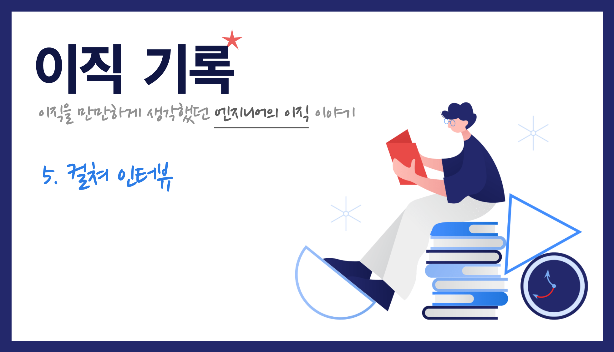

    Image by: <a>https://icons8.com</a>

채용 프로세스에서 보통 두 가지 인터뷰를 진행하는데, 그 중 하나는 대부분 기술 인터뷰이고 나머지 하나는 회사 재량으로 인터뷰를 진행합니다. 대기업의 경우, 임원 면접이라고도 하고 어떤 회사에서는 컬처 인터뷰라고 하기도 합니다. 두번째 인터뷰의 모든 경우를 겪어보진 않았지만 경험을 중심으로 정리해봤습니다.

### Table of Contents

1. 불리는 이름들과 그 유형들
2. 조직 문화와 나를 돌아볼 수 있는 계기
3. 여러 질문들 정리
4. 컬쳐 인터뷰에 대한 준비

## 불리는 이름들과 그 유형들

회사마다 이 두번째 인터뷰를 부르는 이름이 다르기 때문에 이 포스팅에서는 '컬쳐 인터뷰'라고 하겠다. 2차 인터뷰에서도 기술 인터뷰를 진행하는 경우도 있기 때문에 그 경우는 제외하고 이야기하려 한다.

보통 회사 또는 팀의 조직 문화와 맞는 사람인지를 판단하기 위해 인터뷰를 진행하며 인성 면접인 것 같으면서도 그 성격을 달리 한다. 그에 따라 받는 질문도 천차 만별이었다. 지원자의 경력에 기반하여 압박하는 질문을 하기도 한다.

일단 컬쳐 인터뷰의 목적은 **'조직 문화'**라고 불리우는 **조직의 특성**에 얼마나 잘 맞는지를 확인하기 위해서다. 아무리 기술력이 뛰어난 사람이더라도 무엇보다 조직에 얼울려 퍼포먼스를 내는 것이 중요하기 때문에 대부분 컬쳐 인터뷰 과정을 채용 프로세스에 포함시키는 것 같다.

## 조직 문화와 나를 돌아볼 수 있는 계기

회사 입장에서 이 인터뷰에 시간을 많이 들이고 공을 많이 들였다면 **현재 조직 내에서 공유된 조직 문화에 맞는지** 확인할 수 있을 것이다. 그렇기 때문에 이 인터뷰에 임할 때는 최대한 솔직하게 임하는 것이 좋다고 생각한다.

이 컬쳐 인터뷰라는 것을 준비하면서 나에 대해 많이 돌아보게 되었다. 가장 간단한 **나의 장단점**부터 시작해서 내가 가장 몰입하는 순간은 언제인지, 인생에서 이루고자 하는 궁극적인 **목표**는 무엇인지 다시 한번 생각해보게 되었다.

## 여러 질문들 정리

이 부분에서도 이력서 상단에 적은 '저는 \_\_\_\_ 하는 조직을 선호합니다' 부분에서 질문을 많이 받았다. 부연 설명에 대한 질문과 내가 선호하는 조직이 되기 위해 속해있던 조직에서 어떤 노력을 했는지에 대한 질문을 받았다.

### 왜 이직하시나요

이 질문에 대한 이야기는 [이직기록 1. 지원하기 전에 - 왜 이직하는가](https://jbee.io/career/2020-turnover-1/#%EC%99%9C-%EC%9D%B4%EC%A7%81%ED%95%98%EB%8A%94%EA%B0%80)에서도 다뤘다.

아마 완벽한 회사는 없을 것이다. A라는 이유로 이전 회사를 떠나려고 하지만 지금 인터뷰를 진행하고 있는 회사도 똑같이 A라는 이슈가 있을 수 있고 A가 아닌 B라는 다른 문제를 갖고 있을 수 있다.

여기에서 중요한 것은 **솔직하게 말하되 잘 정리해서** 말해야 한다는 것이다. 그럴싸한 말로 이직하게 된 계기를 거짓으로 둘러댔다가 이직하게 된 회사에서도 같은 이유로 고통받다가 또 이직을 하게 되면 내 입장에서나 회사 입장에서나 손해를 보기 때문이다.

솔직하게 말하되 자신이 **그 문제를 해결하기 위해 어떤 노력을 했는지**도 함께 말해야 한다. 노력을 하지 않았더라면 좋지 않게 보일 수 있다. 옮기려는 회사에서 어떤 문제가 있을 때, 해결하려하기 보다는 회피하려는 모습을 보일 수 있기 때문이다.

1차 기술 인터뷰, 2차 인터뷰 때 (당연하게도) 가장 많이 들은 질문이고 이직하고 나서도 공백기 동안 사람들 만날 때마다 제일 많이 듣는 질문이다. 지원하기 전에 잘 정리해두었다면 자신이 했던 노력과 함께 잘 이야기하면 된다.

> 너무 포장하지도 말고 너무 날 것 그대로 말하지 말고 적당히 말하는 것이 중요하니 잘 정리해두자.

### 왜 우리 회사이어야 할까요

이 질문도 지원한 곳 전부에서 빠지지 않고 받았던 질문이다. 이 부분은 지원한 회사마다 다른 부분도 있고 공통적인 부분이 있을 것이다. [이직기록 1. 지원하기 전에 - 원하는 회사는 어떤 회사인가](https://jbee.io/career/2020-turnover-1/#%EC%9B%90%ED%95%98%EB%8A%94-%ED%9A%8C%EC%82%AC%EB%8A%94-%EC%96%B4%EB%96%A4-%ED%9A%8C%EC%82%AC%EC%9D%B8%EA%B0%80) 단계에서 잘 정리해두었다면 이를 기반으로 공통적인 부분을 미리 정리해두자.

그리고 지원한 회사별로 프로덕트나 서비스의 특징, 조직 문화 등을 기반으로 자신이 이 회사를 선택한 이유와 이 회사에서 어떤 퍼포먼스를 낼 수 있는지에 대해 2~3가지의 대답을 정리해두면 좋다.

> 지원하고자 하는 회사에 대한 특징을 파악하고 자신이 선택한 이유와 결합하여 답변을 정리해두자.

### 좋았던 질문들

나 자신에 대해 다시 한번 생각해볼 수 있었던 좋은 질문들도 있었다.

- 10년 뒤 날 축하하는 파티가 열렸다면, 그 파티는 어떤 축하 파티일까?
- 입사 후 1주일 동안 무엇을 할 것인가?
- 나에게 있어서 개발이 어느 정도 중요한가?
- 함께 일하기 힘들었던 동료는 어떤 유형이었는가? 그 사람은 왜 그랬을까?
- 개발 직군 말고 다른 직군으로 일할 수 있다면 어떤 일을 잘 할 수 있을 것 같은가?
- 내 커리어에서 가장 함께 일하고 싶은 사람은 누구였는가? 그는 어떤 사람이었나?

사실 이 질문들로 지원자가 조직 문화에 맞는 사람인지 판단하는 것은 어려울 것 같다. 질문에 대한 답변 뿐만 아니라 인터뷰를 진행하면서 드러날 수 있는 대화의 방식, 표현의 방식도 많은 영향을 끼치지 않을까 생각했다.

평소에 잠깐 잠깐 생각했던 질문도 있었지만 처음 듣는 질문도 많았는데 어쩔 수 없이 그 상황에서 생각해서 답변해야 하는 질문들이었다. 이러한 질문들에 대비해 답변을 따로 준비한다는 것은 조금 힘들지 않을까 싶다.

### 압박을 줬던 질문

면접관 나름의 판단 기준이 있고 이를 판단하기 위한 질문들이었지만 일부러 압박을 하려는 느낌을 받았고 이에 대해 나 또한 자연스럽게 방어적으로 대답을 했던 질문들이 있다. 지금와서 생각해보면 무의미한 질문들이었던 것 같다.

- 업무 강도가 높은데, 야근을 해도 괜찮겠냐
- 업무가 바빠서 개인 오픈소스 활동을 못하고 커뮤니티 활동을 못하게 되면 어떨 것 같냐
- 본인이 말한 이직 사유가 그대로 이 조직에서도 적용된다면 떠나겠냐

사실 질문만 보면 그렇지 않지만 다음 질문이 이어지면서 압박을 하는게 느껴졌다. 간혹 이 과정에서 빈정거리는 말투로 질문을 이어가시는 분도 계셨는데, 많이 아쉬웠다.

### 아쉬웠던 질문

사전에 진행되는 인터뷰가 컬쳐 인터뷰라고 안내를 받게 되면 피면접자 입장에서는 기술과 관련된 질문이 들어오지 않을거라 예상한다. 그리고 면접관이 기술과 관련된 사람만 들어올 것이라고 생각하지 않게 된다.

그런데 이 컬쳐 인터뷰에서 기술과 관련된 질문을 하게 되면 피면접자는 당황하게 된다. 상대방이 기술에 대해 어느 정도 이해가 있는지 알 수 없는 상황에서 어디까지 쉽게 설명해야하는지 혼돈이 오기 때문이다. 물론 인터뷰가 진행되기 전에 면접관들도 자기 소개를 하긴 하지만 그 포지션이 대체 뭘 하는 포지션인지 알 수 없는 경우가 대부분이기 때문이다.

컬쳐 인터뷰라고 했으면 기술과 관련된 질문은 최대한 지양하는 것이 좋은 것 같다.

## 컬쳐 인터뷰에 대한 준비

회사마다 팀마다 질문들이 많이 달랐기 때문에 따로 준비하기 보다 자신에 대해 좀 더 고민하는 시간을 갖는 것이 중요할 것 같다. 평소에 이상으로 생각했던 조직 문화는 무엇인지 나는 어떤 성격의 사람인지 고민하고 솔직하고 일관된 대답을 하면 이 컬쳐 인터뷰가 서로가 잘 맞는지 확인할 수 있는 시간이 될 것이라 생각된다.

### 조직 문화 미리 살펴보기

지원한 회사가 정말 입사하고 싶은 회사, 팀이라면 그 회사의 조직 문화를 미리 살펴보고 이해하는 것이 도움이 될 수 있을 것 같다. 채용 홈페이지에는 인재상, 핵심 가치 등을 공유하고 있다.

그러나 이것은 말처럼 쉽지 않다. 재직했던 NAVER나 LINE은 팀 별로 운영하는 블로그도 없고 외부에서 볼 때 지원하고자 하는 팀이 어떤 일을 하는지 알기 힘들기 때문이다.

하지만 스타트업의 경우, 자신들의 조직 문화를 소개하는 글들을 심심치 않게 볼 수 있다. 심지어 우아한형제들 같은 경우에는 ['배민다움'](http://www.yes24.com/Product/Goods/32992422)이라는 책도 있다. 토스를 만드는 비바리퍼블리카의 경우, 자신들의 문화를 정리하여 블로그 글로 올려두기도 한다. ([토스팀 문화 소개 글](https://blog.toss.im/category/tossteam/culture/))

준비하기 쉽지 않고 준비하는 것보다 질문에 맞춰서 자신의 생각을 조리있게 전달하면 되겠지만 조금이라도 회사에 대해 알아보기 위해 이러한 노력들을 하는 것도 좋을 것 같다.

> 컬쳐 인터뷰를 준비하면서 자신에 대해 돌아보게 되는 계기로 삼아보자.

## 마무리

채용 프로세스를 어느 정도 마무리 단계까지 진행했다면 최종적으로 레퍼런스 체크를 진행하는 회사도 있다. 다음 포스팅에서는 이 레퍼첵에 대해 정리하려고 한다.

|       |                                                                      |
| :---: | :------------------------------------------------------------------: |
| Next  | [이직기록 6. 레퍼런스 체크](https://jbee.io/career/2020-turnover-6/) |
| Intro |     [이직기록 0. Intro](https://jbee.io/career/2020-turnover-0/)     |
