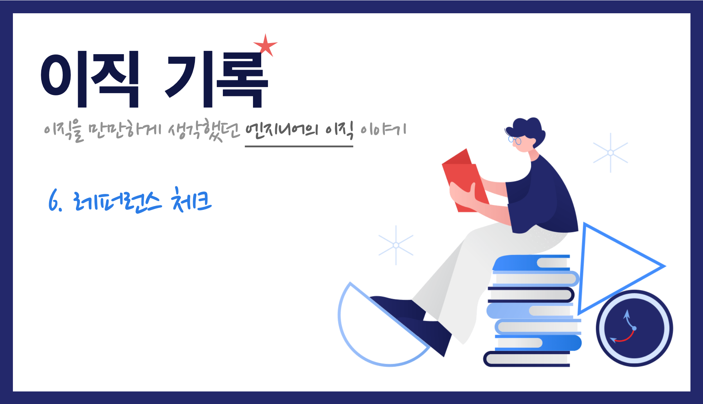

    Image by: <a>https://icons8.com</a>

인터뷰 과정이 마무리되고 나서 대부분 채용 프로세스가 끝나지만 레퍼런스 체크라는 단계를 두는 회사도 있습니다. 이 과정은 지원자가 면접 과정 중 거짓을 말하지는 않았는지, 실제로 업무에 임하는 모습은 어떤지 확인하는 단계입니다. 보통 대행 업체를 통해 이루어지며 함께 일했던 사람들에게 유선으로 연락하여 이루어지는데, 이 레퍼런스 체크를 진행했던 경험을 정리해봤습니다.

### Table of Contents

1. 합의되지 않은 레퍼런스 체크
2. 현재 재직 중인 동료를 포함
3. 한 번 더 읽어봐야 하는 동의서
4. 미리 준비해야 하는 것

## 합의되지 않은 레퍼런스 체크

사전에 협의가 안 된 레퍼런스 체크를 진행했고 입사를 했다는 이야기를 들은 적이 있다. 어떤 사람에게 내 레퍼런스가 체크될지 전혀 모르는 상황에서 진행되는 것은 당연히 좋지 않은 경험일 것이며 이렇게 진행할 이유가 전혀 없다.

이번 이직 과정에서는 딱 한 회사에서 레퍼런스 체크 진행을 요구했다. 대행 업체를 통해 이루어졌으며 함께 일했던 동료 중 4~5명 명단을 요구했다. 이렇게 사전에 **언제, 어떤 사람에게 레퍼런스가 체크되는지** 알고 진행할 수 있어야 한다,

> 레퍼런스 체크가 진행된다면 대상 명단, 일정 등 충분히 사전에 협의가 가능하다.

### 현재 재직 중인 동료를 포함

사전 협의가 이루어지는 과정 중, 지원한 회사에서 '현재 재직 중인 직장의 동료 한 명'을 무조건 포함해달라는 요구했다. 개인적으로는 받아들일 수 없는 요구였고 이렇게 진행해야 한다면 레퍼런스 체크를 거부하고 이것으로 다음 채용 프로세스가 진행될 수 없다면 중도 포기를 한다고까지 말했다.

일단 첫번째로, 이 회사에 합격한다는 보장, 이 회사로 이직한다는 보장이 없다. 만약 추후 프로세스에서 회사와 지원자 간에 미스 매칭이 발생한다면 현재 재직 중인 회사에 그대로 다녀야 할 수도 있다. 하지만 지원자는 이미 조직 내에서 이직하려는 사람이 된다. 현재 재직 중인 직장의 동료에게 레퍼런스 체크를 받는 것은 지원자 입장에서 절대 득이 될 수 없는 요구이다.

두번째, 예의. 온보딩만큼 중요한 것이 오프보딩이라고 생각한다. 중요한 오프보딩 과정을 전부 건너뛰고 단지 레퍼런스 체크 때문에 함께 했던 동료들에게 이 조직을 떠난다는 소식을 전하는 것이 과연 예의일지 의문이다.

그럼에도 불구하고 현재 직장 동료를 명단에 포함하길 원한다면 함께 일하다가 먼저 퇴사하신 분을 명단에 추가하여 우회할 수 있는지 알아볼 수 있다.

> 레퍼런스 체크 명단에서 현재 재직 중인 동료를 (절대) 포함시키지 말자.

## 한 번 더 읽어봐야 하는 동의서

사전 협의 과정에서 요구 사항 한 가지를 거절했고 받아들여지지 않는 조건에서 레퍼런스 체크 사전 협의가 이루어졌다. 현재 재직 중인 동료를 레퍼런스 체크 명단에 포함시켜달라는 요구 사항은 회사 입장에서도 크게 중요하지 않은 사항이었지만 일단 요구해본 것이라고 생각이 들었다. (이렇게 되니 최종 합격을 받아도 유쾌하지 않을 것 같았다.)

마지막으로 레퍼런스 체크 동의서를 작성하는데 동의서에 거절했던 요구 사항이 그대로 들어가 있었다. 여러 가지 조항들이 애매한 말들로 꾸며져 있어서 유심히 읽어보지 않았으면 놓쳤을 부분이다.

회사 측에서 요구한 것인지 레퍼런스 체크 대행 업체가 의도한 것인지는 모르겠으나 이 부분도 다시 수정을 요청드렸고 반영된 내용으로 동의서를 다시 작성한 후 명단을 전달했다.

> 서명을 하기 전에는 꼼꼼히 다시 한 번 읽어보자.

## 미리 준비해야 하는 것

앞서 이야기한 것처럼 대행 업체를 통해 연락을 받으면 사전 협의가 먼저 이루어지는 것이 맞다. 이런 과정없이 회사 임의적으로 레퍼런스 체크를 수행한다면 거부할 권리가 있다. 최대한 협의를 진행한 후에 레퍼런스 체크를 받는 것이 좋다.

### 동료에게 미리 연락하기

명단을 제출할 때는 어떤 관계였는지와 연락처를 전달하게 된다. 이 또한 함께 일했던 동료의 개인 정보이므로 당사자에게 먼저 연락을 해야 하는 것이 예의이다. 업무 도중 갑자기 모르는 사람에게 전화를 받는 일 또한 굉장히 귀찮은 일이기 때문에 사전에 양해를 구하고 허락을 구한 다음 명단에 포함시켜야 한다. 보통 4~5명의 명단을 요구하기 때문에 혹시 있을지 모르는 레퍼런스 체크를 대비해 미리 연락하고 준비해두는 것이 좋다.

좋은게 좋은거라고 연락이 오면 좋게 말해달라고 할 수도 있는 상황이지만 이 또한 당사자의 평판(reputation)과 관련이 있는 부분이기 때문에 이런 난감한 이야기는 애초에 꺼내지 말자. 간단히 모르는 전화가 오면 받아달라는 귀띔만 하자.

> 사전에 양해를 구하고 레퍼런스 체크를 위한 명단 리스트를 만들어두자.

## 마무리

개인적으로는 레퍼런스 체크 과정이 정말 필요한가 싶다. 이번에 이직을 하면서 여러 회사 중 한 곳만이 레퍼런스 체크를 진행했는데, 그 과정 중 내 진심성(?)을 의심받는 기분이 들었다. 레퍼런스 체크를 통해서 얼마나 신빙성 있는 정보를 얻을 수 있는지 의문이고 이전 회사와 조직 문화가 다르고 함께 일하게 될 사람도 다른데, 레퍼런스 체크가 필요한 이유를 모르겠다.

그리고 짦은 경험에 기반한 생각이지만, 레퍼런스 체크를 진행한다는 것은 지원자의 역량을 인터뷰를 통해 충분히 파악할 능력이 없다는 것을 입증하는 것이 아닐가 생각했다. 특히 개발 직군의 경우, 기술력은 과제 또는 코딩 테스트와 기술 인터뷰로 충분히 판단이 가능하다고 생각하고 커뮤나케이션 등 자기들의 조직 문화에 어울릴 수 있는지는 컬쳐 인터뷰를 통해 확인이 가능하다고 생각한다.

아직 많은 회사에서 채용 프로세스에 레퍼런스 체크를 포함시킨다. 레퍼런스 체크를 진행하게 되는 분들은 아무 피해없이 무탈하게 진행되어 원하는 회사로 이직할 수 있기를 바란다.

|       |                                                              |
| :---: | :----------------------------------------------------------: |
| Next  |   [이직기록 7. 오퍼와 협상, 그리고 오프보딩 (coming soon)]   |
| Intro | [이직기록 0. Intro](https://jbee.io/career/2020-turnover-0/) |
