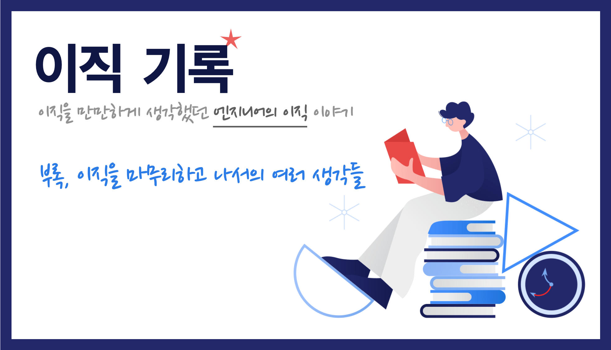

    Image by: <a>https://icons8.com</a>

이직을 하는 과정에서 여러 생각이 들었습니다. 이직 시리즈 포스팅의 마지막인 이번 포스트에선 이직 프로세스의 반대 순서로 생각들을 정리하려고 합니다.

### Table of Contents

1. 이상한 감정과 고민
2. 좋은 인터뷰란 무엇일까
3. 사전 전형에 대한 생각
4. 인재 채용 활동

## 이상한 감정과 고민

여러 회사 오퍼들을 비교하고 조율하면서 어느 회사로 갈지 고민할 수 있다는 것은 정말 큰 행운이었다. 그러나 최종 수락까지는 정말 많은 고민이 있었다. 분명 원하던 이직이었고 지금보다 좋은 조건에서, 원하던 환경에서 일할 수 있다는 것을 알지만 이미 익숙해진 이 조직을 포기하고 갈 만큼의 가치가 있는지 고민하게 됐다.

이직하는 동안의 고생은 기억나지 않고 Comfort Zone에 머물러 익숙함을 추구하려는 마음이 한 구석에서 피어오른다. 그러면서 지금 재직 중인 회사의 조건도 따져보면 나쁘지 않다는 생각을 한다. 오히려 이런 익숙함을 포기하고 새로운 환경에 적응하며 새로운 사람을 사귀는 등 적응 비용에 비해 그 보상이 크게 느껴지지 않는다.

이직 결정을 앞둔 보통의 사람들이 이런 감정을 느끼는 지는 모르겠지만 나는 이런 감정이 들었고 혼란스러웠다. 물론 훌륭한 동료들과 만족스러운 좋은 조건에서 일하고 있었기 때문일 것이다.

**이직을 하는 이유**를 명확히 하고 정리해두는 것이 중요하다고 계속해서 말했다. 고민을 뒤로 한채, 내가 그 때 왜 이직하려고 했는지 다시 다잡으면서 나아갈 수 있었다.

## 좋은 인터뷰란 무엇일까

면접은 정말 어렵다. '좋은 기술 인터뷰'라는 주제에 대해서 회사 입장 그리고 지원자 입장에서 생각을 정리해봤다.

### 운

'운도 실력이다'라는 말이 있지만 이번에도 다시 한번 느낀 것은 운이라는 것이 정말 중요하다고 생각한다.

지원한 조직과는 상관없이 어떤 면접관을 만나느냐도 운에 좌우된다. 면접관이 평소에 관심을 갖고 깊게 알아본 영역이 나와 일치하여 많은 대화를 나누고 인터뷰기 좋은 분위기에서 마무리 될 수 있다. 반면 완전 반대의 경우도 발생할 수 있다.

그렇기 때문에 면접을 진행하는 채용 담당자(면접관)의 경우 면접자에게 **최대한 많은 기회**를 주는 것이 중요하며, 면접자의 경우 오게 되는 기회들을 **최대한 많이 잡아낼 준비**를 해야 한다. 다만 행운은 곱셈으로 다가오기 때문에 미리 노력하고 준비하지 않았다면 결국 0으로 귀결된다.

> '운'이라는 요소에 의존성을 최대한 덜어낼 수 있도록 면접자에게 기회를 충분히 주는 기술 인터뷰가 좋은 인터뷰가 아닐까.

### 면접관은 회사의 얼굴이자 첫인상

어떤 경로로 지원했든지 지원자 입장에서 회사에 대해서 많은 정보를 알고 있을 가능성은 거의 없다. 그렇기 때문에 회사에 대한 첫인상은 면접관에 의해 결정된다. 지원한 회사들 중 2곳의 회사에서는 면접 시작하기 전에 다음과 같은 말을 했다.

"만약 면접의 결과가 기대했던 것과 다르더라도 이 결과는 지원자의 역량이 부족함을 의미하지 않습니다."

물론 지원자 입장에서 불합격을 받게 되는 순간엔 이 말이 기억나질 않는다. 그러나 지원자 입장에서는 배려받는 느낌을 받고 조금이라도 편안한 마음으로 인터뷰에 임할 수 있을 것이다.

사실 저 말은 정말 진실이다.

- 단지 지원한 회사와 맞지 않았을 뿐.
- 맞았다하더라도 면접관과 맞지 않았을 뿐.
- 맞았다하더라도 타이밍이 맞지 않았을 뿐.
- 맞았다하더라도 준비가 약간 부족했을 뿐.

불합격했다면 하루 이틀 정도만 나에게 기분 나빠할 시간을 주고 이 마인드로 다음 면접을 준비하면 된다. 첫인상이 좋았다면 불합격을 받았어도 인상이 좋게 남을 것이고 좋지 않았다면 합격을 받았더라도 좋은 인상으로 남기 힘들다.

> 면접관은 회사 또는 그 팀의 얼굴이다. 절대 무례하게 굴지 말 것.

### 대화

면접은 면접관과 면접자가 서로 대화를 하는 시간이다. 면접관은 지원자가 지원한 회사에 적합한지 대표로 참석한 것이며 지원자 또한 자신이 어떤 역량을 갖고 있고 어떤 조직을 선호하는지 이야기하려 참석한 것이다. 두 참석자의 목적은 다른 것 같지만 결국 '함께 일할 수 있는가'를 판단한다는 목적을 가지며 이 대화는 자연스럽게 서로가 잘 맞는지에 대한 이야기를 주로 나눈다.

면접자가 면접관이 일방적으로 자신을 점수로 평가한다는 느낌이 들 때 긴장을 하게 되고 자신이 하고 싶은 이야기를 많이 못할 수 있다. 이전 질문에 대답하지 못한 것을 계속 신경쓰느라 이후 인터뷰에 집중하지 못하는 경우도 있다.

인터뷰가 제대로 진행되지 않으면 회사는 인재를 놓칠 수 있고 지원자는 자신을 제대로 드러낼 기회를 놓치게 된다.

대화를 하듯이 인터뷰를 진행하는 것은 퀴즈쇼가 아닌 반구조화 인터뷰로 할 수 있다.

**반구조화 인터뷰**란 사전에 **기본적인 질문**을 만들어놓고 그에 따라 인터뷰 대상자들에게 같은 질문을 하되, **지원자가 말하는 내용에 따라 다른 질문**을 유연하게 던지는 방식을 말한다. 물론 일방적인 '퀴즈쇼' 면접보다 훨씬 더 어려우며 면접관의 역량에 더 많이 의존한다.

면접자 또한 수동적으로 평가받는 자세를 취하지 않고 질문에 부연 설명이 필요하면 적극적으로 질문을 하며 인터뷰를 진행해야 한다는 것을 느꼈다.

> 인터뷰는 기본적으로 서로를 알아가는 대화이다.

## 사전 전형에 대한 생각

1차 인터뷰를 진행하기 전에 다양한 사전 전형들이 존재한다. 필자가 겪은 총 세 가지의 사전 전형에 대해 이야기해보려고 한다.

### 과제 테스트와 구현 비용

이전 포스트에서도 언급했다시피 과제 전형에는 **개인 시간과 노력이라는 비용**이 들어가게 된다. 최소한으로 잡아도 퇴근 후의 시간 중 대부분을 투자할 것이라고 생각된다. 필자의 경우에는 대부분 일주일의 시간이 주어졌고 짧은 경우에는 48시간이 주어졌다.

과제에 들어간 비용은 이 사전 전형에서 떨어지게 된다면 어떤 피드백도 받지 못하고 개인 프로젝트도 아니게 되는 그저 낭비하게 되는 비용인 것이다. 물론 이 회사에 지원해봤다는 것에서 의의가 있을 수는 있지만 객관적으로 봤을 때 **자신의 시간을 투자한 만큼 돌아오는 것이 없을 수 있는 가능성**이 있다.

운이 좋게도 과제 전형에서 불합격 받은 경우는 없었지만 투입되는 비용에 대해 회사 측에서 적당한 보상을 해줄 수 있을지 고민을 해보면 좋지 않을까 하는 생각이 들었다.

하지만 들어가는 비용만큼 확실하게 지원자와의 핏(fit)을 살펴볼 수 있는 전형이라고 생각된다. 지원자에게도 과제 전형에 통과하여 1차 인터뷰에서 코드 리뷰까지 진행하며 리뷰를 받게 된다면 더 없이 좋은 전형이라고 생각된다.

이 과제 전형에서 진행되는 과제는 팀에서 직접 만든 것이다. 한 문제로 돌려막기를 할 수 없으니 지속적으로 리소스를 투자하여 새로운 과제를 만들어야 한다. 어느 정도 지속적인 리소스 투입이 필요한 전형인만큼 회사 입장에서는 얻는 것이 많은 전형이라고 생각한다.

### 알고리즘 테스트와 실효성

과제에 들어가는 비용에 비해 적은 비용이 들어가게 되는 알고리즘 테스트에 대해서는 부정적이다. 정말 기본적인 코딩 능력을 살펴보기 위해 쉬운 문제들로 구성하여 실시한다면 그 의미가 있겠지만 엄청 어려운 알고리즘 코딩 테스트를 보는 것이 과연 유의미할지 의문이다.

물론 알고리즘을 설계하는 것이 주 업무인 팀에서는 이것이야말로 적합한 전형이라고 생각한다. 실제로 **팀에 합류하여 퍼포먼스를 낼 수 있는지를 판단**하기 위해 적합한 사전 전형 설계가 필요하다.

지원자 입장에서는 과제 전형에 비해 투자해야 하는 시간이 적다는 장점이 있지만 알고리즘 문제 풀기 감을 익혀야 하는 시간 또한 필요하지 않을까 생각된다.

### 스크리닝 면접

전화 면접 또는 화상 면접으로 1차 인터뷰를 진행할 정도의 지원자인지 판단하는 방법도 있다. 서로의 리소스를 최소한으로 사용하면서 사전 검열을 진행하는 방법이다. 회사 입장에서 투입되는 리소스 측면에서는 오히려 과제 전형으로 진행하는 것보다 덜 들어갈 수 있다. 과제 설계하고 만들 비용으로 직접 대화를 나누면서 지원자의 역량을 빠르게 확인할 수 있기 때문이다.

### 정리

사전 전형을 위해 이해 당사자가 투입되는 리소스와 비용 대비 효과는 다음과 같이 정리할 수 있을 것 같다. 물론 회사의 상황에 따라 천차만별로 달라질 수 있겠지만 필자가 속한 포지션의 입장에서 정리해봤다.

- 회사에서 투입되는 리소스: 과제 전형 >> 스크리닝 면접 > 알고리즘 코딩 테스트
- 지원자가 투입되는 리소스: 과제 전형 >> 알고리즘 코딩 테스트 > 스크리닝 면접
- 지원자의 역량을 파악할 수 있는 척도: 과제 전형 > 스크리닝 면접 >> 알고리즘 코딩 테스트

> 여러 사전 전형 중, 지원자를 배려하고 회사와 맞는 사람을 채용하기 위해 적절한 사전 전형을 고민해봐야 하지 않을까

## 인재 채용 활동

이전 직장에서는 채용 설명회에 직접 참여하여 예비 지원자들을 만나보기도 했고, 다른 직군의 일을 하게 된다면 어떤 일을 해보고 싶냐는 질문에 Developer Relation 일을 해보고 싶다고도 할만큼 인재 채용 활동에 관심이 많다.

### 개발자 행사 참여

지원할 생각이 없던 회사였는데, FEConf에서 만난 인연으로 지원을 하게 된 회사가 있다. 일하는 방식부터 서비스의 성장 가능성까지 정말 매력적인 회사였다. 네트워킹이 없었다면 이런 회사를 알기 힘들었을 것이다.

현실적으로 개발자(잠재적 지원자)들과 가장 가까이에서 이야기 할 수 있는 공간이라고 생각한다. Tech HR 담당자 분들이 개발자 행사에 참여하고 현업 개발자가 개발 관련 발표를 진행하면서 채용 활동을 하는 것은 이미 너무 익숙한 채용 활동 중 하나이다.

### 기술 블로그

주로 다른 회사에 대한 정보는 사업적인 부분 정도만 기사나 SNS를 통해 듣게 된다. 심지어 이 마저도 관심있게 들여다보지 않으면 대부분 파악하기 힘들다.

개발자에게 매력이 있기 위해서는 사업적인 부분도 물론 중요하지만 개발의 영역으로 홍보하면 좋지 않을까. 우리 팀의 시스템이 어떻게 되어있는지, 개발 문화는 어떤지, 자랑하고 싶은 기술은 무엇이 있는지 홍보하는 채널을 통해 개발자에게도 충분히 매력있는 회사임을 어필하는 것이다.

여러 가지 채널이 있겠지만 가장 쉽게 시도해볼 수 있는 것이 기술 블로그라고 생각한다. 물론 그에 따른 비용도 많이 들겠지만 요즘 대부분의 회사에서는 기술 블로그를 운영하며 자신들의 기술을 공유하고 기술적으로 매력있는 회사임을 어필한다. [한국 IT 기업들의 기술 블로그](https://www.44bits.io/ko/keyword/engineering-blog#%ED%95%9C%EA%B5%AD-it-%EA%B8%B0%EC%97%85%EB%93%A4%EC%9D%98-%EA%B8%B0%EC%88%A0-%EB%B8%94%EB%A1%9C%EA%B7%B8)

### 오픈 소스

더 나아가서는 사내에서 사용하고 있는 기술을 오픈 소스로 공개하는 것이다. 이미 Google, Facebook, Netflix, Microsoft 등 수많은 오픈 소스를 운영하고 있다. 국내에서도 디자인 시스템을 오픈 소스로 공개하기도 하는 등 여러 오픈 소스에 대한 투자가 이루어지는 것 같다.

> 일부 자사의 기술을 공개하는 것이 회사의 비기를 유출하는 것이라고 해서 꺼리는 분들이 계시긴 하는데, 공유를 통해 얻는 것이 더 많다고 생각한다.

## 마무리

약 100일 간의 이직 과정을 총 8편의 글로 정리를 해봤다. 개인적으로는 제 자신을 돌아보는 계기가 되었고, 겸손해질 수 있는 계기가 되었고, 많이 배울 수 있었던 기간이었다.

이직을 생각하시거나 이미 준비하고 계시는 분들께 조금이나마 도움이 되는 글이었으면 좋겠다.

감사합니다 :)

> 모든 경력직 엔지니어의 커리어 개발을 응원합니다!

|       |                                                              |
| :---: | :----------------------------------------------------------: |
| Intro | [이직기록 0. Intro](https://jbee.io/career/2020-turnover-0/) |
