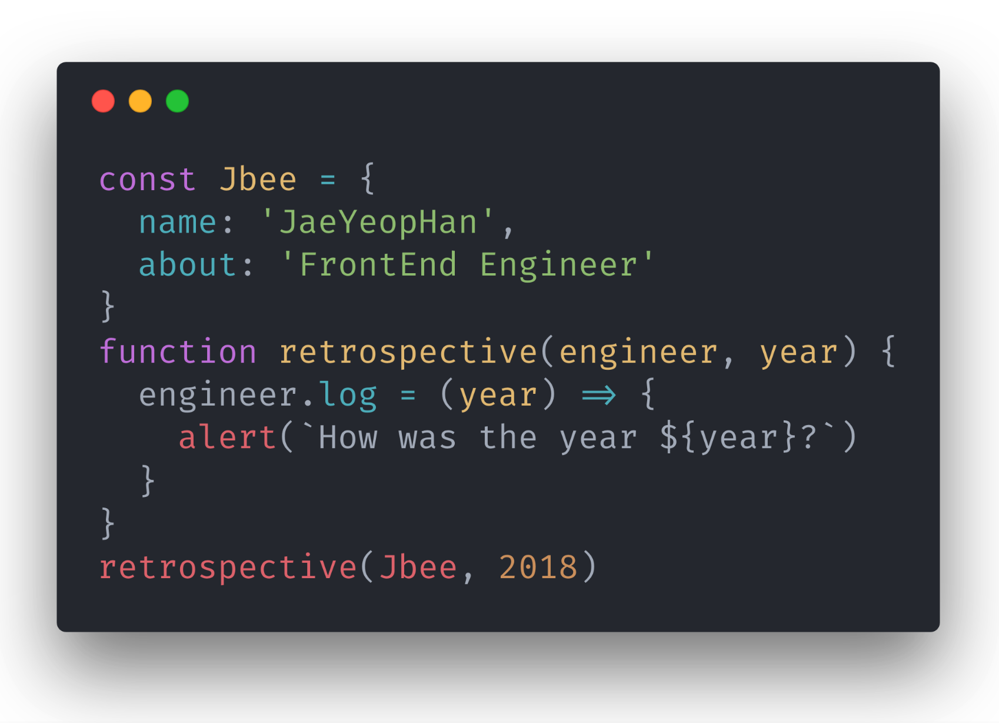
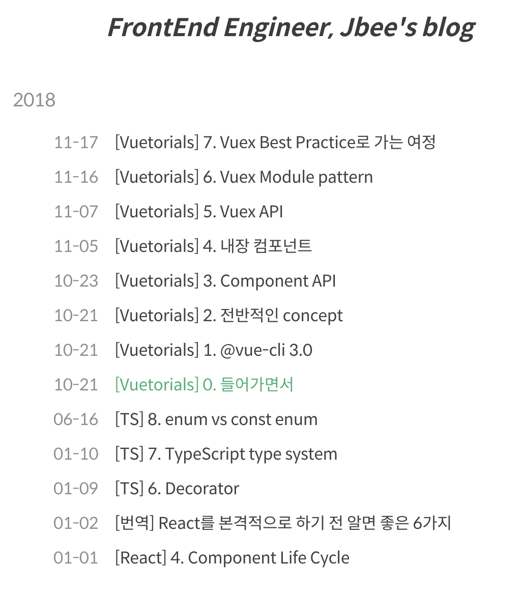
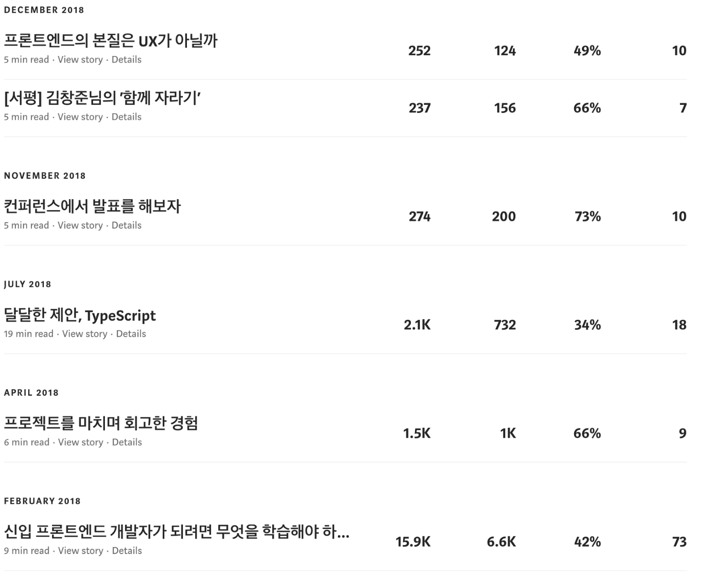
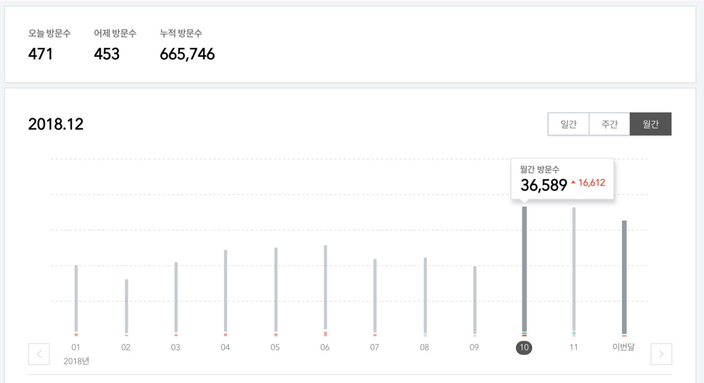
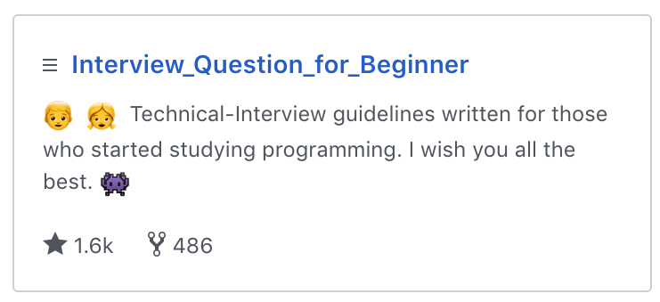
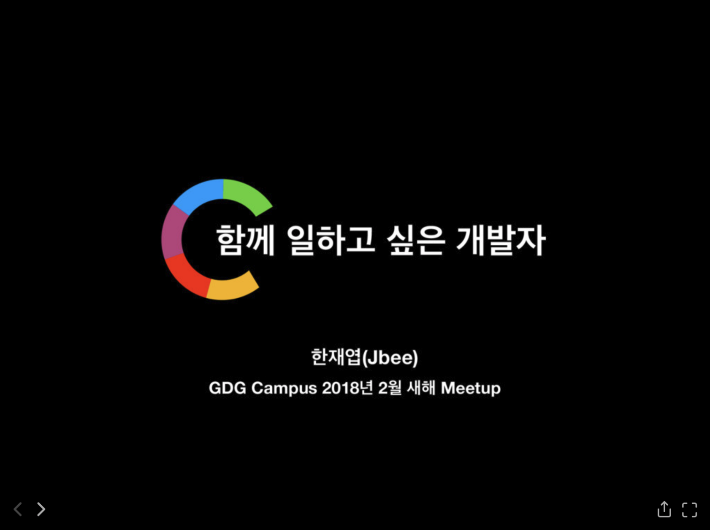
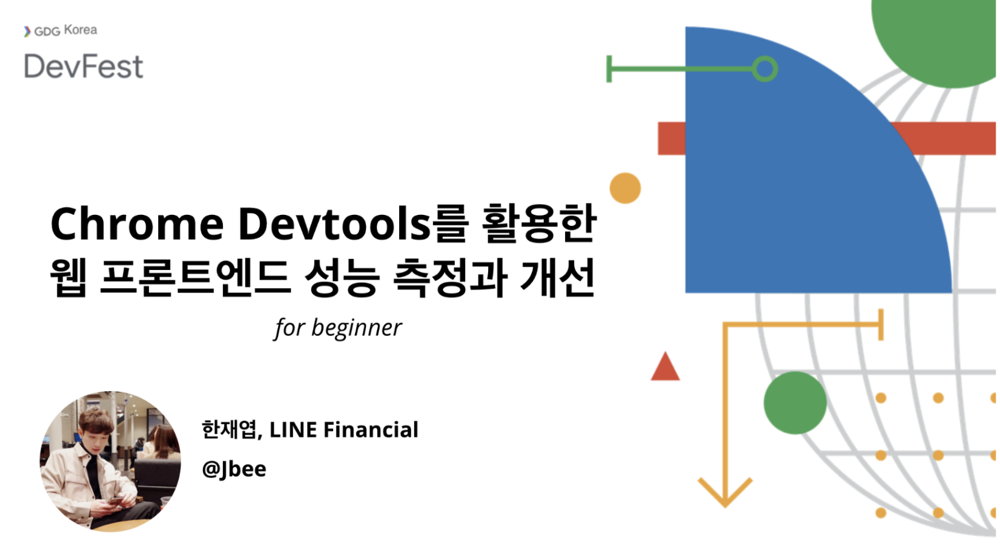
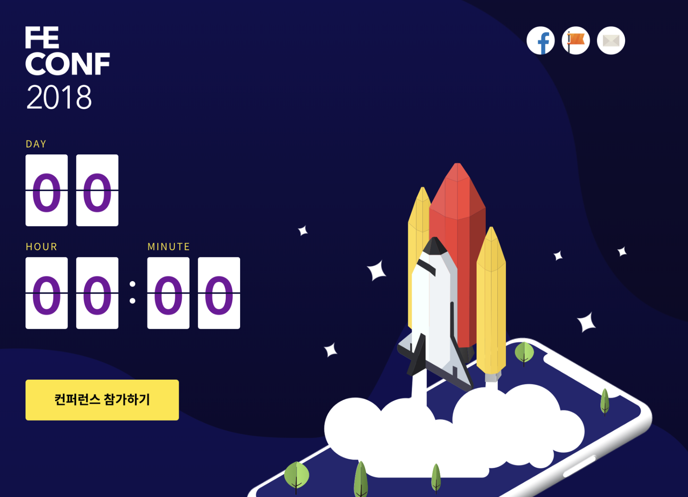
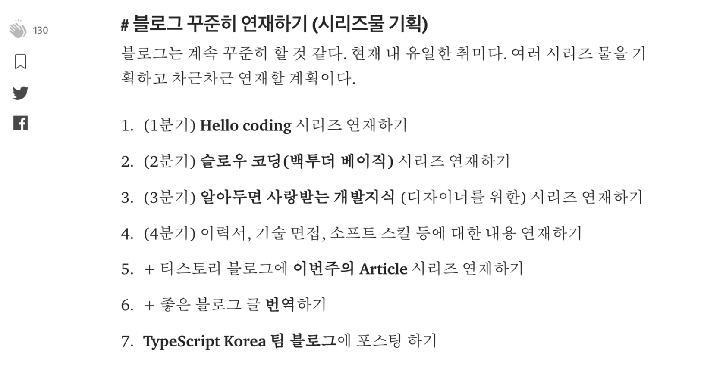

이전 팀에서 프로젝트 회고를 진행할 때, 회고에 대해서 공부를 꽤 했었다.

> 사전적 정의를 먼저 살펴보자면, “돌아다봄”, “지나간 일을 돌이켜 생각함” 등을 의미한다… 회고 (Retrospective)에 대한 정리 및 설계

그래서. 한다. 나는. 회고. 2018년을

## 블로그 현황

취미이자 학습 수단이자 나를 브랜딩하는 요소 중 하나인 블로그를 가장 먼저 회고해보려 한다.

> 글은 얼마나 썼을까

### GitHub Blog

주로 기술적인 내용을 올리는 GitHub 블로그에는 13개의 글을 썼다.

> https://jaeyeophan.github.io/archives/

TypeScript Tutorial을 마무리했고 React Tutorial을 갑자기 마무리했고 Vuetorial을 새로 썼다. 이직한 회사에서 Vue를 사용하고 있어서 공부하는 김에 정리해봤다. React를 어느 정도 알고 있으면 Vue는 빠르게 습득할 수 있다. 그 반대는 안 해봐서 잘 모르겠지만 아닐 수도 있을 것 같다. 그리고 난 아직 React를 더 좋아하는 것 같다.

### Medium

주로 뻘글을 발사하는 미디엄에 6개의 글을 썼다.

코드가 거의 포함되지 않는 에세이(?) 형식의 글들을 주로 Medium에 올린다. 신입 프론트 어쩌구 글이 가장 많이 조회됐다. 이 글을 쓰면서 정말 나는 이 모든 것을 다 알고 있는가, 정말 이 모든 것을 다 알아야 하는가를 생각해보게 되었다. 아직 결론은 못 내렸다.

### 티스토리

너무 옛날에 쓴 글이 많아서 블로그를 내릴까도 생각을 해봤지만 아직까지 많은 분들이 방문해주고 있어서 내리진 않았다. 한달에 3만 명이 넘게 방문해주고 있다. 올해와 마찬가지로 새로운 글은 추가되지 않고 현상 유지만 할 것 같다. 언젠가는 글들을 하나 하나 다듬어서 새로운 블로그에 배포를 해볼까 생각 중이다.

### Interview_Question_for_Beginner

> https://github.com/JaeYeopHan/Interview_Question_for_Beginner

블로그는 아니지만 나에게 있어선 소중한 GitHub Repository이다. 소스 코드는 snippets 뿐인 Document repository지만 열심히 운영하고 있다. 많은 분들의 응원 속에 스타가 꾸준히 찍히고 있다. 아직 많이 부족한데 좀 더 신경써야겠다.

### 총평

블로그 작업량이 많이 줄어들기는 했지만 그래도 의미있는 글들을 많이 작성한 것 같아 기분이 좋다. Hexo 기반으로 만들어진 GitHub 블로그를 Gatsby로 마이그레이션하려 했지만 아직 hexo인걸보니 미루다 실패한듯 하다. 내년 상반기에는 진행되길…!

## 커뮤니티

많은 것을 배웠고 많은 사람을 만났던 커뮤니티 활동을 되돌아보자.

### 두 번의 발표

> https://speakerdeck.com/jaeyeophan/gdg-campus-2018-meetup-balpyojaryo-hamgge-ilhago-sipeun-gaebalja

> https://slides.com/jbee/devfest_seoul_2018_performance_optimization_with_chrome_devtools?fbclid=IwAR2uOqKbvSATuPrmSFNYp6DZzYXns_mlWJf3yBi-_SQlzbJ3_MQc6iaq714#/

첫 발표를 2월에 했었다. 기술 발표는 아니었지만 온 힘을 다했다. 참석자들에게 정말 도움이 되는 발표를 하고 싶었다. 너무 힘을 줬는지 다시는 발표를 하지 않겠다고 다짐을 했었다. 그러나 나는 한 번의 발표를 또 했다. 인간은 똑같은 실수를 반복한다. 두 번의 발표 모두 최선을 다해 준비했기 때문에 후회없는 발표를 했다. 아마 내년에도 기회가 된다면 개발자 행사에서 발표를 하지 않을까 싶다. 발표를 해서 경험한 좋은 것들에 대해 글도 썼다. ‘컨퍼런스에서 발표를 해보자'.

### FEConf

> https://2018.feconf.kr/

훌륭한 오거나이저, 디자이너 분들과 함께 프론트엔드 개발자 행사를 주최했다. 준비하는 과정에서 욕심을 많이 부렸다. 그래서 주변에 피해를 끼치기도 했고 참석자들에게도 불편함을 제공했다. 다음 FEConf2019는 보다 성숙한 컨퍼런스로 만들고 싶다. (나만 잘하면 될 것 같다.)

빠르게 매진되는 표를 보고 프론트엔드 컨퍼런스의 중요성을 다시 한 번 깨닫게 되었고 막중한 책임감 또한 느끼게 되었다. FEConf2018을 마치고 참가자 피드백을 많이 받았다. 이를 토대로 컨퍼런스 오거나이징 후기를 쓰려했지만 이 또한 아직 draft. 나중에 마무리하고 공유할 예정이다.

### TypeScript Korea

국내에서도 TypeScript에 대한 관심이 높아지고 있다. 나보다 훨씬 TypeScript에 대해 잘 알고 좋아하시는 세 분의 오거나이저 분들과 함께 운영하고 있다. 내년에도 꾸준히 지속되길…!

## 이직

### 개발자로서 성장에 대한 고민

일을 하다가 문득, 이런 생각이 들었다.

> 아직 특정 한 분야를 꼬집어 한 우물을 파기에는 너무 이른 시기가 아닌가?

**자연스럽게 ‘개발자’로서 어떻게 ‘성장’할 것인가에 대한 고민을 하게 되었다.**

재직 중인 회사는 나름 큰 규모였고 내가 속해있는 팀은 플랫폼 성격의 업무를 하는 팀이었다. 자바스크립트(or 타입스크립트)만 한다. 다른 팀에 퍼블리셔가 계셔서 HTML/CSS를 하드하게 다뤄볼 기회도 없고 다른 팀에 서버 개발자 분들이 계셔서 백(Back)단 코드를 자유롭게 볼 수 없었다. 기획, 디자인 부분 또한 마찬가지로 다른 팀에서 driven하고 있기 때문에 서비스의 방향에 의견을 제시하는 것도 쉽지 않았다. ‘제품’을 생산하는 프로세스가 분업화, 체계화되어 있어 그 속에 들어가 내가 맡은 바의 임무를 충실히 이행하면 되었다.

사실 하나도 제대로 하기 힘들다. 하지만 접점이 존재하는 분야에 대해서 어느 정도 수준까지는 알아야 수월하게 협업이 가능하며 효율성을 높일 수 있다고 생각한다. 또한 이 경험은 아직 특정 분야의 전문가라고 할 수 없는 주니어 시기가 적당하다고 생각했다. 기본적인 풀스택 경험을 바탕으로 프론트엔드 개발자, 또는 백엔드 개발자처럼 특정 분야로 나아가야 하지 않을까하는 생각이 들었다.

내가 진정 하고 싶은 것이 무엇인가, 현재 팀에 남아있는 것이 도움이 될까를 고민했다. 난 백엔드부터 프론트를 거쳐 운영까지 보다 다양한 경험을 할 필요가 있고 이것을 하고 싶기 때문에 현재 속해있는 팀에 만족하지 못하고 있다는 결론을 지었다.

### LINE Financial

다시 LINE으로 돌아왔다. 2년 전 인턴을 했던 그 LINE이다. 원하던 환경으로 완벽하게 이직하지는 못했다. 그럼에도 이직을 결심하게 된 이유가 있었고 그 부분에 대해 집중적으로 성장하려 한다. 한 걸음씩 천천히 오래.

내년에는 좀 더 성숙한 고민으로 ‘성장’에 대한 글을 써보려한다.

## 면접

면접관으로 면접을 들어가게 되었다. 면접은 너무 어렵다. 체력 소모 또한 극심하다. 면접 내내 면접자가 하는 말을 주의깊게 들으면서 맞는 대답인지 파악해야하고 다음 질문을 생각해야 하고 그와 동시에 내가 함께 일하고 싶은 개발자인지를 파악해야 한다. 또한 면접자가 자신의 능력을 최대한 끌어내어 후회없이 면접을 마칠 수 있도록 최선을 다해야 한다.

몇 번의 면접을 하다보니 하고 싶은 얘기가 정말 많아졌다. 그래서 ‘면접이란 과정에 대해서'란 글을 작성했는데 아직 draft 단계이다. 몇 번의 면접을 더 진행한 후 다듬은 다음 배포할 예정이다.

면접이란 과정은 면접관, 피면접자 두 입장 모두 많은 것을 배울 수 있는 시간이라고 생각한다. 인터뷰 스터디 만들고 싶다.

## 계획은 세우지 않기로.

회고를 작성하기 전에 일 년 전의 내가 쓴 글을 봤다. 야심차게 준비한 분기별 포스팅 계획은 단 하나도 실행에 옮겨지지 않았다! (그래도 다른 발표 계획이나 사이드 프로젝트 계획들은 모두 수행했다!)

내년에 기회가 된다면 저 계획의 일부라도 수행해보고 싶다.

## Jbee.log(2018)

당찬 내년 계획없이 어떻게 회고를 마무리해야하나. 올해 좋은 회고글이 많이 올라와서 그런지 많은 자극이 되었다. 아무 계획없어도 당차게 내년을 맞이할 수 있을 것 같다. 아, 어디선가 읽었던 것 같은데 출처가 기억나지 않는다.

_성장은 스칼라가 아니라 벡터다._

> 끝.
