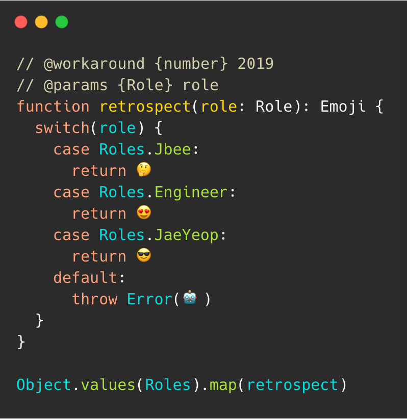
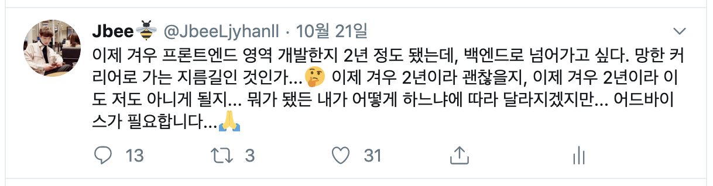
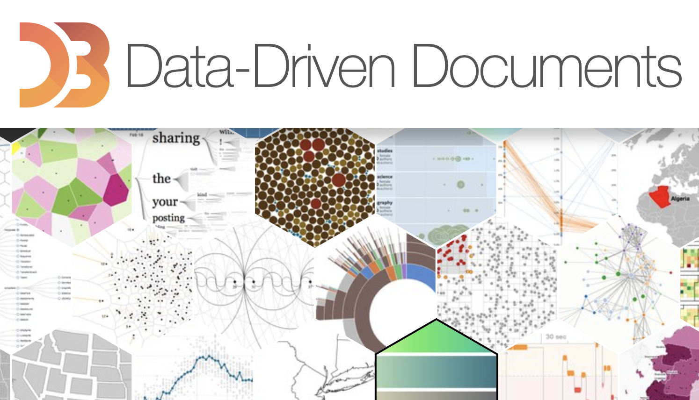

- [Jbee.log(2018)](https://jbee.io/essay/2018_retro/)
- [Jbee.log(2017)](https://jbee.io/essay/2017_retro/)

> 연말 회고  
> 자동 반사

## Jbee로서의 회고

- 블로그 운영
  - Gatsby로 블로그 마이그레이션 ([Link](https://jbee.io/etc/intro-new-blog/))
  - [resume](https://jbee.io/about)와 블로그 통합 및 개편
  - 도메인 구입 (jbee.io)
  - 블로그 starter-pack 만들어서 배포 ([gatsby-starter-bee](https://github.com/JaeYeopHan/gatsby-starter-bee))
  - gatsby plugin 도 하나 만들어서 배포 ([gatsby-remark-images-medium-zoom](https://github.com/JaeYeopHan/gatsby-remark-images-medium-zoom))
- 발표
  - [NAVER Tech Concert: Front End - For growth of junior developer](https://speakerdeck.com/jaeyeophan/junieo-gaebaljayi-seongjange-daehaeseo)
  - [GDG frontendgame - UX빼면 시체, 프런트엔드](https://speakerdeck.com/jaeyeophan/uxbbaemyeon-sice-peureonteuendeu)
  - [For.D 슬기로운 인턴 생활 - 멘토스와 인턴콜라](https://speakerdeck.com/jaeyeophan/mentoseuwa-inteonkolra)
  - [Boostcamp 특강 - 미리 알았다면 좋았을 것들](https://speakerdeck.com/jaeyeophan/miri-alassdamyeon-johasseul-geosdeul)
- 행사
  - FEConf2019 **개최**
  - LINE 채용설명회 참석
  - 페이스북 F8 콘퍼런스 참석
  - 뱅크샐러드 사내 행사 참석
  - DEVIEW2019 콘퍼런스 참석
  - 야놀자 사내행사 참석
  - 웹뷰 밋업 참석
  - NHN 콘퍼런스 참석
  - Facebook Dev C 행사 참석
  - 한빛데브그라운드 행사 참석
  - 이상한모임 행사 참석
  - Boostcamp 데모데이 참석
- 사이드 프로젝트
  - 현재 진행중

뭔가 여기저기 많이 다니고 뭘 한 것 같지만 1년이라는 긴 시간을 두고 봤을 때, 회사일 말고 시간날 때 틈틈히 뭘 해보려고 한 것 밖에 없다.

1. 블로그라는 취미 생활을 좀 더 재밌게 하기 위해 내 블로그 테마를 만들었고 많은 분들이 템플릿을 사용해주고 계신다. (무한감사)
2. 블로그 현황은 이제 따로 정리하지 않는다.
3. 콘퍼런스를 여기저기 다녔지만 내 개발 역량 성장에는 딱히 도움되지 않았다. 이와 관련된 글을 작성해볼 예정이다.
4. 올해도 FEConf 행사를 무사히 마무리했다. 항상 오거나이징 후기를 작성하려 하지만 쓰다보면 감히 퍼블리시 할 수 없게 작성된다.
5. F8 Hackathon은 인생 경험이 될 것임에 분명하다. ([Link](https://jbee.io/etc/f8-hackathon-review/))
6. 기술 발표를 못한 것이 아쉽다.

## N년차 프론트엔드 엔지니어로서의 회고

개발자의 경력을 어떻게 계산할까. 보통 연차로 계산하는데, 이것은 '만'으로 계산하는가? 아니면 햇수로 계산하는가? 숫자는 딱히 중요한 것 같지 않다.

상반기 회고를 작성하고 따로 배포하지 않았는데, 그 글을 여기에 옮겨보려 한다.

### 프론트엔드 엔지니어?

네이버에 프론트엔드 엔지니어로 입사했고 지금은 라인 파이낸셜에서 뱅크 프로젝트의 웹 프론트엔드 영역을 담당하여 만들고 있다. 순수 VanillaJS 만으로 개발해봤고 jQuery로도 개발해봤고 요즘 많이 사용한다는 React, Vue로도 프로젝트를 진행해봤다.

하지만 프론트엔드 개발에 있어서 큰 부분을 차지하고 있는 HTML/CSS 부분을 직접 다룰 일이 많지 않았다. 흔히 퍼블리싱 부분이라고 이야기되는 영역인데, 초록색 계열 회사의 특성 상 퍼블리셔 분들이 따로 계시기 때문에 협업하는 구조로 프로젝트가 진행된다. 팀바팀이겠지만 내가 속했던 팀은 마크업 작업을 직접하지 않았다.

HTML/CSS 부분을 작업한다고 하면 애니메이션을 위한 keyframe, transition 작업들이 대부분이다. 조금 더 한다고 치면 이를 제어하기 위한 약간의 수정 정도겠다. 같은 화면을 다른 사람이 각각 작업을 하다보니 한 명이 작성했을 때보다 더 효율적으로 작성할 수 있는 경우도 종종 생기고 커뮤니케이션 비용도 많이 든다.

물론 장점도 존재한다. 두 명이 작업을 진행하니 공수 상으로는 프로젝트 일정을 단축할 수 있다. 그리고 개인적으로는 잘 짜여진 HTML/CSS 코드를 보고 CSS 방법론, 접근성 등의 Best Practice를 공짜로 배울 수 있다.

### 잘게 쪼개진 Rich 웹

사실 스크립트 영역, 즉 React와 같은 라이브러리를 사용하거나 JavaScript를 작성하여 static한 web page를 dynamic한 Application으로 작업하는 영역만 하더라도 정말 할 일이 많다. (그러니 내가 밥벌이를 하고 있는 것이 아니겠는가.) 여기에 마크업 작업까지 더해지면 고려해야할 부분이 더 많아지게 된다.

웹은 한 명의 개발자가 전부 개발하기에 너무 방대해져버렸다. 그렇기 때문에 대부분의 회사들은 백엔드 엔지니어와 프론트엔드 엔지니어를 각각 채용하고 있다. 그러면서 자연스럽게 백엔드는 API를 제공하는 역할로 바뀌었고 클라이언트는 모바일 앱 개발자들이 따로 있는 것처럼 프론트엔드 엔지니어들이 담당하게 되었다.

### 하지만 결국 웹,

실제 개발하면서 마주했던 문제 중 크리티컬하고 서비스에 장애를 주었던 문제들은 코드 안에서만 발생하지 않았다. 백엔드와 통신하는 과정에서 발생했으며 인프라 이슈와 함께 발생했다. 코드 안에서 발생할 수 있는 버그들은 QA 과정에서 대부분 잡히기 때문이다.

프로젝트를 진행하면서 마주하게 되는 수많은 문제들을 해결할 때, 폭넓은 시야가 필요하다. 어떤 문제인지에 따라 프론트엔드에서 해결하면 빠르고 쉽게 해결할 수 있는 문제가 있고 백엔드에서 진행하면 좋은 문제가 있다. 한 쪽 분야의 지식만 있으면 해결 방법을 먼저 제안해주기 전까지 기다릴 수밖에 없으며 서로 커뮤니케이션 비용만 높아지게 된다.

결국 웹에 대한 전반적인 이해가 필요하고 이를 경험해보는 것이 중요하다는 결론을 내렸다.

### 그래서 풀스택이라는 말인가?

경험의 깊이에 따라 다르겠지만 백엔드 엔지니어도 프론트엔드에 대한 이해가 필요하고 프론트엔드 엔지니어도 백엔드에 대한 이해가 필요하다. 그리고 그 이해가 깊으면 깊을 수록 좋다.

하지만 여기서 놓치면 안 되는 부분이 있다. 백엔드 엔지니어는 말 그대로 백엔드 엔지니어이기 때문에 백엔드에 대해 전문가가 되어야 한다. 이러한 전문성을 바탕으로 프론트엔드에 대한 이해가 있을 때, 좋은 API가 탄생하게 된다.

마찬가지로 프론트엔드 엔지니어 또한 프론트엔드 영역에 대해 전문가가 되어야 한다. 이러한 전문성을 바탕으로 백엔드에 대한 이해가 있을 때 웹을 더 잘 이해하게 되고 원활한 커뮤니케이션이 이루어진다.

### 선택과 집중

내가 속한 환경에서 집중할 수 있는 영역이 있었고 그 부분에 대해서 확실히 집중하고자 한다.

#### App Like Web

주어진 환경에서 배울 수 있는 것에 집중하고자 했다. 뱅크 어플리케이션을 만들면서 모바일 앱 내에서 노출되는 웹뷰작업을 주로 하게 되었다. 모바일 앱으로부터 사용자가 유입되다 보니 UX에 많은 부분을 신경쓰게 되었다. 일정 상 애니메이션 부분이 많이 제외가 되면서 진행되곤 하는데 이 부분도 시간을 투자하여 최대한 모바일 앱 같은 모바일 웹을 만들어 보려고 노력하고 있다. 그리고 이러한 과정들을 UX-LAB이라는 repository에 정리하고 있다.

#### Testing

테스트에 대해서 각 잡고 공부하고 있다. 프론트엔드 쪽은 백엔드 쪽보다 테스트에 대한 인식이 더 안 좋다. 어떻게 하면 ROI가 나오는 테스트 코드를 작성할 수 있는지 고민했고 그 고민은 아직도 진행 중이다. 이와 관련된 내용은 현재 블로그 글로 연재 중이다. ([React Testing SERIES](https://jbee.io/react/testing-0-react-testing-intro/))

### 이제 하반기도 끝

상반기 때 목표로 했던 부분들을 착실히 수행했다. 그래서 일까? 마음 한 구석에서 스멀스멀 백엔드가 마려웠다.

이 트윗 때문에 팀원들이 나를 팔로우하는 일이 발생했다. (관심 병사 시작?) 이 트윗에서 서지연님께서 해준 말이 인상 깊었고 감사했다.

> 많은 커리어들이 외부 환경에 따라 결정되는데 원하는 방향이 있고 하고 싶은게 있다는건 진짜 행복한거 같아요! :)

하고 싶은게 있다는 것은 정말 좋은 것 같다. 그리고 요즘 막 관심을 가게 된 분야는 Data Visualization 영역이다.

그저 막연한 관심인데, 어떻게 시작해볼 수 있을지 고민이다.

## 한재엽으로서 회고

'취미'란 무엇인가. 취미가 일이 될 때 덕업일치라고 하더라. 보통 취미가 뭐냐는 질문에 개발이라고 대답하면 재미없어 한다. 그리고 뭔가 너드(nerd) 같아 보인다. 사실 이 부분에 대해 적잖게 스트레스 받았다. 왜 난 취미가 없을까? 고민하기도 했다.

그런데 올해 하반기 때부터는 그냥 코딩한다고 한다. 떳떳해졌다고 할까. 아쉽다. 이제는 이전의 내가 내 취미를 인정하지 않았던 것이 아쉽다.

올해에는 시간이 날 때, 마음 맞는 사람들과 사이드 프로젝트를 했다. 디자인 부터 내가 담당해서 진행하고 있는데 재밌었다. 그리고 도커, 쿠버네티스를 공부하면서 인프라를 구축해보려고 했다. 도입의 이유없이 학습 목적이었기 때문일까 이 부분도 재밌었다. 아마 앞으로도 관심가는 부분이 생기면 내 시간을 사용해서 공부하고 시도해볼 것 같다.

## Jbee.log(2019)

작년에도 그랬듯이 새해 다짐, 계획 등은 하지 않기로 했다. 상황에 따라 하고 싶은 일, 하고 싶은 것을 하게 될테니. 내년 `Jbee.log(2020)`에는 어떤 내용이 담길까.
