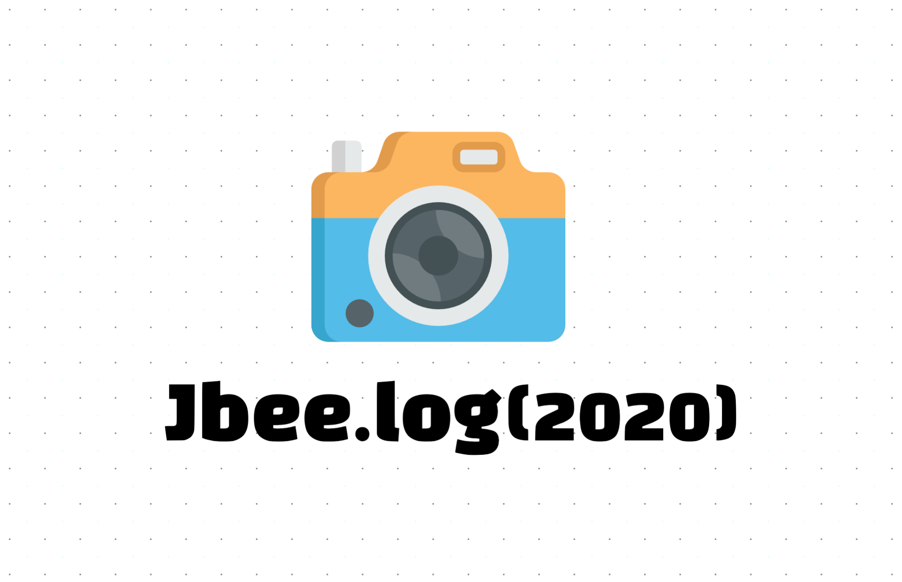
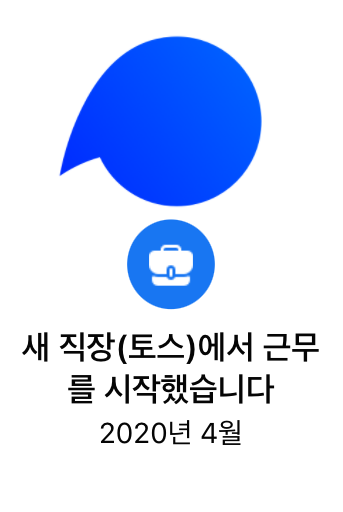
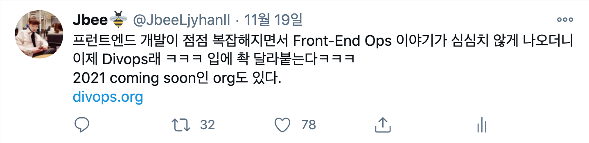

### 이전 회고

- [Jbee.log(2019)](https://jbee.io/essay/2019_retro/)
- [Jbee.log(2018)](https://jbee.io/essay/2018_retro/)
- [Jbee.log(2017)](https://jbee.io/essay/2017_retro/)

### Table of Contents

- 토스팀으로 합류
- FEConf2020 at Home
- 하고 싶은게 많은 엔지니어

## Intro

올해 회고를 쓰기 전, 지난 년도의 회고들을 쭉 읽어봤는데 조금 부끄러웠다. '내가 이만큼이나 올해를 알차게 보냈어'라고 자랑하는 느낌을 받았기 때문이다. 꼭 누군가에게 보여주기 위한 글이라고 느껴졌고, 그때 당시 내가 어떤 고민을 했는지 알기 힘들었다.

그래도 다행히 꾸준히 회고를 작성해둔 덕에 당시 어떤 감정이었는지 정도는 어렴풋이 감을 잡을 수 있었다. 그래서 올해 회고는 조금 솔직하게 작성해보려고 한다.

## 토스팀으로 합류

2020년 나에게 가장 큰 이벤트는 이직이었다. 이 과정에 대한 내용은 [이직 기록](https://jbee.io/career/2020-turnover-0/)을 통해 최대한 자세하게 정리해뒀다.

### Why, Toss

'이직 기록'에서 따로 정리하지 않았던 팀 결정에 대한 이야기를 잠깐 해보려고 한다. 최종적으로 여러 회사에서 오퍼를 받았고, 그 중 토스팀으로 합류하기로 결정했다. 끝까지 고민했던 회사가 있었는데, 둘 중 어느 회사를 선택했더라도 후회가 없을 것 같다.

이직 당시, 조직 문화에 관심이 많았다. 관련 책도 읽고 생각을 꽤 많이 정리하기도 했다. 훌륭한 동료들과 함께 했지만 내가 생각한만큼의 아웃풋이 나오지 않았기 때문이다. 프로젝트를 리드하면서 원인이 무엇일지 고민했고 그 원인이 조직 구조, 조직 문화에 있지 않을까 라는 결론을 내렸다.

이 고민이 토스로 이끌었다.

### 사일로 (a.k.a Squad)

토스팀과 이전 직장과 가장 다른 점은 사일로 조직 구조를 취하고 있다는 점이었다. 사일로는 [Spotify의 Squad](https://congruentagile.com/2013/02/27/spotify/)로 팀의 기본 단위다. 각 사일로가 각각 토스 제품의 일부분을 담당하고 하나의 작은 스타트업처럼 목표를 갖고 전체의 목표에 향하게 된다.

처음 속하게 된 사일로는 토스라는 앱에 새로운 유저를 유입시키는 인플로우 사일로(Inflow Silo)였다. '반짝특가'라는 제품으로 에어팟 프로를 1,000원에 판매하면서 엄청난 사용자를 유입시켰고 이터레이션을 돌면서 여러 실험으로 좀 더 효율이 높은 방법을 찾아보는 경험을 했다. 인플로우에서 개발했던 여러 제품 중 '숨은 정부지원금 찾기'라는 제품은 지금까지도 신규 사용자를 모셔오고 있는 효자 제품이 되었다.

내가 만든 작은 제품이 속해있는 조직에 어떤 영향을 주는지 바로 눈앞에서 실시간으로 봤다. 새로운 제품을 출시하고 치솟는 그래프를 보는 건 마약과도 같은 경험이었다.

### 우물 안 개구리

짧은 경력이지만 충분히 잘해가고 있다고 생각했던 차에 이직을 했기 때문에 자신있었다. 운이 좋게도 여러 회사에서 오퍼를 받았기에 그 자신은 확신이 되었다. 그리고 이것이 자만이었다는 것을 토스팀에 합류하고 깨달았다.

내 경험은 턱없이 부족했고 깊이도 얕았다. 토스팀에 합류한지 8개월 정도 되었는데 정말 **밀도 높은 성장**을 했고 앞으로도 기대하고 있다. 토스팀이라고 하면 조직 문화가 먼저 떠올랐지만 기술적인 부분과 개발 문화에서도 배울 점이 많았다.

- 디자인 시스템(TDS)을 통한 디자인 일관성 유지 및 생산성 향상
- 모노레포(monorepo) 구조를 통한 생산성 향상
- 효율적인 CI/CD를 통한 배포 용이성 및 안정성 향상
- 코드리뷰에 대한 고민과 시스템 구축을 통한 리뷰 활성화
- 재사용 가능한 함수 단위와 컴포넌트 그리고 좋은 코드에 대한 고민
- 챕터, 조직에 대한 비판적인 시각

이러한 것들이 기반이 되어 프런트엔드 챕터 구성원들이 함께 성장할 수 있는 환경이 되었고 토스 제품의 질과 생산 속도를 만든게 아닌가 싶다.

작년 이맘때 쯤 백엔드 개발에 대한 욕심을 보인 적이 있었는데, 프런트엔드 개발에 대한 자만심 때문이었던 것 같기도 하다. 그래도 백엔드에 대한 관심은 놓치지 않고 틈만 보이면 시도해보고 있다. 지난 직장의 내 팀 동료에게 좁은 식견으로 프로젝트 구조를 잡고 리드했던 것에 대해 심심한 사과의 말을 전한다.

자연스럽게 [성장에 대한 고민](https://jbee.io/essay/growth-mistaken-2020/)도 하게 되었고 [좋은 코드란 무엇일까](https://jbee.io/etc/what-is-good-code/)에 대해서도 깊게 고민해봤다. 최고의 복지는 동료라는 말을 믿지 않았는데, 맞는 말인 것 같기도 해서 나는 참 운이 좋다고 생각한다.

> 세상은 넓고 고수는 많다. 👉 [**토스팀은 채용중**](https://toss.im/career)

  (블로그에서 채용 홍보 처음 해보는데, 이력서 주세요)

## FEConf2020 at Home

여느 커뮤니티 행사, 컨퍼런스와 마찬가지로 FEConf 또한 온라인으로 진행을 해야만 했다. 몇번의 행사 진행으로 오프라인 행사가 익숙해져서 자신감이 붙나 싶었는데, 그 자신감을 비웃기라도 한 듯 COVID19가 덮쳤다.

  쇼미9 재밌게 봄 (VVS)

> 왔노라, 보았노라, 이겼노라

다행히 행사는 잘 마무리되었고 참가자 분들에게도 좋은 피드백을 많이 받았다.

### 온라인 행사

플랫폼 선정부터, 행사 운영 방식까지 전부 달라져야 했다. 온라인 환경 특성상 유입이 쉬울 수도 있고 어려울 수도 있지만 이탈은 굉장히 쉽다. 결국 우리에게 익숙하고 쉽게 접근할 수 있는 Youtube를 선택했고, 사전 촬영 방식 후 라이브 스트리밍 하는 방식으로 결정하게 되었다.

### 신의 한수, 사진 등록 이벤트

매번 매진을 기록했던 FEConf이기 때문에 행사 장소가 수용할 수 있는 최대 인원을 행사 참석 인원이라는 인식이 있었다. 그러나 온라인으로 진행하는 이번엔 예측이 도저히 불가능했다.

다행히 이 부분은 오거나이저 분의 아이디어로 사전 등록 이벤트를 진행했다. 사전 등록 기간동안 총 1606 분이 응원 메세지를 남겨주셨고 이게 정말 큰 힘이 되었다. 이 덕분에 [후원사](https://2020.feconf.kr/#sponsors) 모집도 원활히 진행되어 행사를 잘 진행할 수 있었다.

### 행사의 감초 역할을 해준 Pop Quiz

참석 인원의 이탈을 어떻게 최소화 할 수 있을지 고민을 많이 했다. 이 부분은 [토스 얼라이먼트 데이](https://blog.toss.im/2019/08/06/tossteam/culture/2019-2h-alignmentday/)에서 진행했던 Pop Quiz를 FEConf에 [적용](https://www.facebook.com/feconf.kr/posts/1009847012776478)했다. 세션을 들었다면 맞출 수 있는 문제들을 준비했고 참가자들이 행사 시간동안 참여할 수 있도록 유도했다. 당연히 상품에도 신경을 많이 썼고 경품 선정 방식에도 고민을 많이 했다. 작은 이벤트였지만 이탈을 최소화 할 수 있었다고 생각한다.

### 상 받아야 하는 [FEConf2020 홈페이지](https://2020.feconf.kr/)

홈페이지 퀄리티에 대한 긍정적인 피드백이 참 많았다. 오거나이저로 굉장히 기분 좋은 일이었다. 바쁘신 시간 쪼개어 디자인 해주신 오거나이저 [주성님](https://jusungkim.kr/)에게 정말 감사하다. 그리고 이 디자인에 생기를 넣어준 천상계 프런트엔드 개발자이자 오거나이저인 [@codemilli님](https://github.com/codemilli)과 [@daybrush님](https://github.com/daybrush)께 샤라웃.

FEConf2020 모든 세션은 [Youtube 공식 채널](https://www.youtube.com/channel/UCWEzfYIpFBIG5jh6laXC6hA?view_as=subscriber)에 업로드되었다. 걱정했던 것보다 행사가 잘 마무리되어 뿌듯했다.

> FEConf 오거나이저 분들과 스피커로 참여해주신 분들, 전부 샤라웃 🤟

## 하고 싶은게 많은 엔지니어

작년엔 [N년차 프론트엔드 엔지니어로서의 회고](https://jbee.io/essay/2019_retro/#n%EB%85%84%EC%B0%A8-%ED%94%84%EB%A1%A0%ED%8A%B8%EC%97%94%EB%93%9C-%EC%97%94%EC%A7%80%EB%8B%88%EC%96%B4%EB%A1%9C%EC%84%9C%EC%9D%98-%ED%9A%8C%EA%B3%A0)라는 섹션에서 프런트엔드 개발자로서의 고민을 담았던 것 같다. 언제나 그랬듯 하고 싶은게 많았고 이직 후 적응이 마무리 된 하반기 동안 실행에 옮기느라 정신없었던 것 같다. 딱히 계획은 없었고 작년 회고에서처럼 상황에 따라 하고 싶은 일을 자연스럽게 하게 됐다.

### 블로그

올해는 27개의 글을 발행했다. 한달에 2~3개 정도 작성한 셈이긴 하지만 시리즈 글이 대부분이었기 때문에 한달에 1개 미만으로 작성한 것으로 반성해야 할 부분이기도 하다. 바로 작년에 블로그 템플릿고 글 좀 많이 쓴 것 같은데 글을 더 쓰려면 블로그를 새로 만들어야 하나 싶다. (아님 🤔)

### 오픈소스 운영

숨쉬듯이 사용하는 오픈소스 라이브러리들을 아무 거리낌없이 사용하다가 문득 내가 운영하는 오픈소스가 하나 있었으면 하는 작은 소망이 생겼다. 이미 [gatsby-stater-bee](https://github.com/JaeYeopHan/gatsby-starter-bee)라는 Gatsby기반의 블로그 템플릿이 있었지만 (이런거 말고) 프로덕트에서 사용할 수 있는 그런게 갖고 싶었다.

사실 이런 소망을 가진지는 꽤 되었지만 쉽게 실행으로 옮겨지지 않았다. 나만의 디자인 시스템을 만들어볼까? 하는 생각에 GitHub Org를 새로 만들고 repository를 만들기까지 했지만 실제 Commit으로 이어지기에는 장벽이 꽤 많았다. 처음부터 너무 큰 프로젝트를 하려고 했던 것이 아닐까 하는 후회가 든다. (디자인 시스템을 디자이너 없이 만들려고 했던 것부터 실수였지 않나 싶다.)

올해에도 이렇게 시도에만 그치고 지나가나 싶었는데, 토스팀이 연말에 전사 휴식기를 갖게 되었다. 그래서 이번 기회에 작은 라이브러리부터 만들어보는 것을 목표로 하여 조금씩 만들고 있다.

실제 NPM에 publish되는 소스 코드 뿐만 아니라 Document, Examples, Testing, CI/CD 등 정말 신경 쓸 것이 많았다. 단기적으로 어떤 결과물을 도출하기 위해 오버페이스로 달렸는데 생각보다 잘 따라주지 않아서 장기전으로 생각하고 천천히 다듬어보려고 한다.

  내년 상반기엔 홍보할 수 있겠지.

### 플랫폼

프런트엔드 개발 환경이 복잡해지면서 지속적으로 관리가 필요해졌고 그에 맞는 인프라 환경이 필요해지는 것 같다. 개발자를 위한 무언가를 만들 때 희열이 생기는 편이라 팀에서도 간간히 플랫폼 업무를 했다. 자연스럽게 AWS에도 손이 가면서 인프라도 조금씩 만져보고 있다.

우연히 알게 된 Divops라는 단어인데, Devops처럼 하나의 직군으로 자리잡을지는 잘 모르겠지만 프런트엔드 개발에서도 인프라의 중요성은 점점 커지고 있는 것 같다.

### 2021 프런트엔드 관전 포인트

내년에 이 회고를 봤을 때, '작년엔 이런 것에 관심을 뒀구나' 되돌아볼 수 있도록 기록해본다. 생태계 발전 속도가 워낙 빠르다보니 1Q~2Q정도에 마무리 될 것 같다.

- Rome은 babel을 비롯한 FE 개발 환경을 단순화할 수 있을까?
- 리브랜딩된 ReScript는 FE 개발 파이를 어디까지 잡아먹을까?
- React의 Server Component는 FE 개발을 얼마나 바꿀까?
- Vercel은 얼마나 내 개발을 편하게 해주려나?
- 누가 monorepo 도구 제대로 좀 만들어줬으면 좋겠는데 언제 나올까?
- Redux는 어느 정도 사라질까? 이 자리를 recoil이 가져가려나?
- CSS-in-JS emotion 말고 다른거 없을까? ~~facebook이 만들어주면 안되나?~~
- ~~이 나라에서 IE는 언제 사라질까?~~

## Jbee.log(2020)

한 해가 너무 빠르게 지나갔다. OKR로 내년 목표를 세워보려 했지만 나랑 안 맞는 것 같아서 스킵. `|> 2021 continue;`
