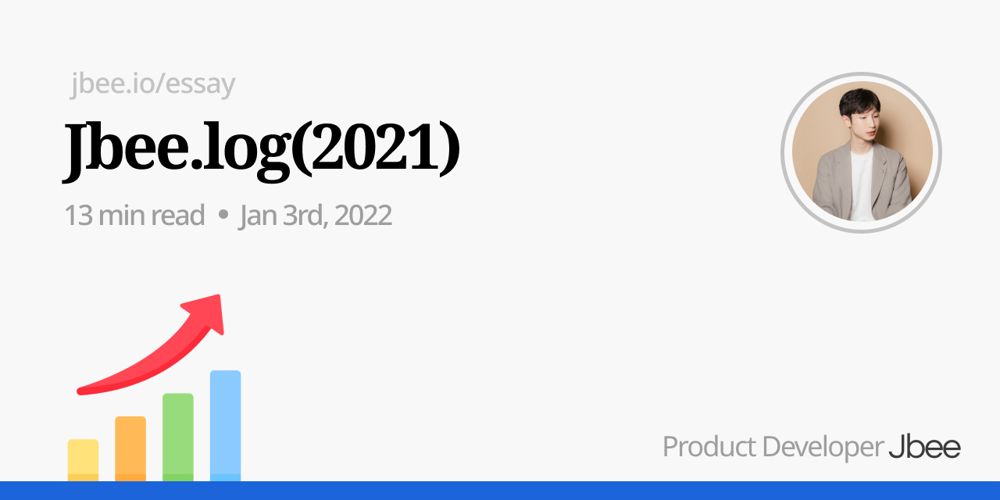
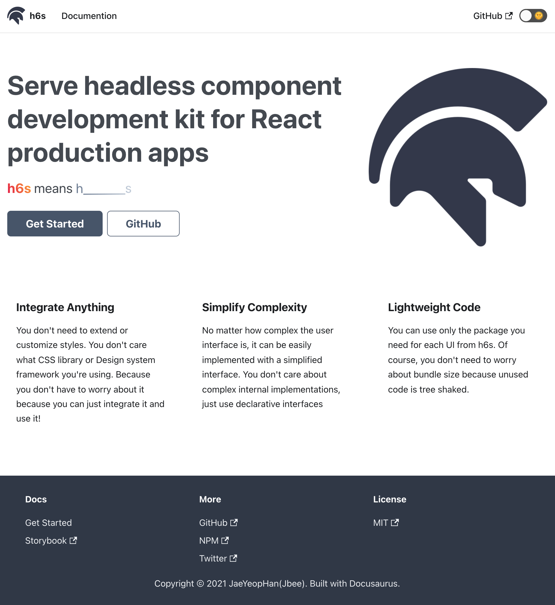

### 이전 회고

- [Jbee.log(2020)](https://jbee.io/essay/2020_retro/)
- [Jbee.log(2019)](https://jbee.io/essay/2019_retro/)
- [Jbee.log(2018)](https://jbee.io/essay/2018_retro/)
- [Jbee.log(2017)](https://jbee.io/essay/2017_retro/)

되돌아보면 정말 빨리 흘러간 한해였다. 물론 자세히 들여다보면 많은 우여곡절이 있었겠지만 말이다. ‘행동으로 옮겨서 좋았던 것’, ‘앞으로 해볼 것’, ‘하지 못해 아쉬웠던 것’ 세 가지로 회고해보려고 한다.

## 가장 오래 머무른

어쩌다보니(?) 지금 있는 토스팀이 내가 가장 오래 머무른 조직이 되었다. 전 직장, 전전 직장 둘다 1년 반을 넘지 못했기 때문이다. 올해 초에는 이직 쿨타임(2년)이 되는 시기긴 한데, 아마 별일이 없다면 이 팀에 계속 있지 않을까

가장 오래 머무른 팀, 조직이라는 것은 나에게 꽤나 의미있게 다가왔다. 다니던 대학교도 1년 반을 못 채우고 자퇴를 했고 Next 교육 기관도 1년 반을 못 채우고 수료했다. (군대라는 조직에선 타의로 1년 반을 조금 넘겼다) 어떤 이유에서든지 한 조직에 오래 머물지 못하는 역마살이 끼었나 싶을 정도로 붙어있지 못했다.

그런 내가 마음 붙이고 잘 안착할 수 있는 팀을 만난 것은 아닐까. 오히려 이런 팀을 또 만날 수 있을까 싶기도 하다.

> 나와 맞는 팀을 찾은 것
> 그러나, 조금 더 빨리 합류하지 못한 것
> 지금이라도 이 팀에 합류하고 싶다면? [너 내 동료가 돼라](https://toss.im/career/job-detail?job_id=4076143003)

### 해결하고자 하는 문제

이 이야기를 너무 길게 쓰면 회고글이 리쿠르팅 글로 바뀔 수 있을 것 같아 적당히 둘러대보자면, 조직이 [공개된 이력서](https://jbee.io/about)에 적었던 선호하는 조직과 일치하기 때문이다. 그리고 도전할 수 있는 문제들이 많이 있다고 생각한다.

앞으로 해결하고 싶은 문제들이 많은데 외부에서 봤을 땐, 이미 다 갖춰진 회사라고 생각할 수 있을 것 같다. 나도 N사에 입사하기 전까진 N사엔 모든 것이 다 갖춰져있을 것이라 생각했기 때문에 이해한다. N사처럼 큰 회사도 해결해야 할 문제가 많았는데, 과연 토스는 다를까?

외부에서 토스는 '갖춰져 있다'고 느끼는 이유는 실제로 ‘대부분’ 갖추고 있기 때문일 것이다. 하지만 팀이 성장할수록 기본적인 문제를 넘어선 **새로운 문제**를 마주하게 된다. 그리고 이 새로운 문제는 대부분 **난이도가 높다**.

아무것도 갖춰지지 않은 조직에선 1의 역량으로 10만큼 변화를 만들어 낼 수 있고 그 변화로 10만큼의 임팩트를 낼 수 있다. 어느정도 성장한 조직에서는 **1만큼의 변화를 주는 것만으로도 엄청난 임팩트**를 낼 수 있는데 그 난이도가 훨씬 높기 때문에 요구되는 역량이 높다.

예를 들면 이런 것이다. 10% 생산성을 내고 있는 조직을 20% 생산성을 낼 수 있도록 무언가 개선한다면 그것은 200%의 임팩트이다. 그러나 이미 100% 생산성의 조직을 101%로 끌어올리는 것은 1%의 임팩트이지만 조직을 구성하는 인원이 10,000명이라면 이야기가 달라진다. 그리고 **100%에서 개선할 수 있는 1%를 찾고 정의하는 것**은 매우 어렵다.

문제를 정의하기 위해서는 평소에 **비판적인 사고**가 충분히 연습되어 있어야 한다. 문제로 보이는 부분은 좀 더 면밀하게 들여다보고 더 **날카롭게 정의**하여 해결 방법을 찾아야 한다.

> 문제를 찾고자 비판적으로 바라보는 연습을 하고 있는 것.
> 그리고 찾은 문제는 보다 더 날카롭게 정의하는 연습을 할 것.

## 만드는 것이 가장 쉽다

새로 만드는 것이 내가 하는 일 중 가장 쉬운 것임을 깨달았다. 지나온 경력 대비 참 늦게도 깨달았는데, 이전에 했던 일들이 전부 새로 만드는 것 뿐이었어서 이게 가장 쉬운지를 몰랐던 것이다.

### Impact

우선 내 리소스를 들여 만든 무언가가 ‘**어떤 임팩트**를 냈는가’, 그리고 ‘실제로 임팩트가 있었는가’가 중요한데 이것이 참으로 어려웠다.

단순히 코드로 무언가를 만드는 것은 하면 되는 것인데, 이 때 한정적인 내 리소스가 필요하다. 이 제한적인 자원을 임팩트가 있다고 판단되는 부분에 투자해야 하는데 이것이 참 어려웠다. 위에서도 언급된 이야기지만 문제를 정확하게 파악하고 날카롭게 정의할수록 임팩트가 있다.

#### Focus on Impact 하지 못했던 경험

이메일 템플릿 관리가 엉망으로 되고 있었다. 디자인과 HTML 파일 간의 싱크가 되어 있지 않았고, 실제 정기적으로 발송되고 있는 템플릿과 관리되고 있는 듯해 보이는 HTML 파일 간의 싱크가 맞지 않고 있었다. 그냥 파국이었다.

하지만 잘 발송되고 있고 문제가 없었기 때문에 문제로 삼지 않으면 문제가 되지 않았던 이슈였다. 문제로 삼기엔 우선순위가 높은 다른 일들이 더 많았기 때문이다. 하지만 이런 잠재적인 부채들은 나중에 크게 발목을 잡기 마련인데, 전체 템플릿을 교체해줘야 하는 이슈를 겪고 그제서야 해당 문제에 대한 우선순위를 높이게 됐다.

이 때, 문제를 좀 더 면밀하게 들여다 봤어야 했는데 그러지 못했다. 전체 템플릿을 교체하는 작업이 너무 고된 나머지, 일단 템플릿을 관리하는 제품을 만들었다. 뒤도 안돌아보고 후다닥 만들어진 이 제품은 지금 사용되지 않으며 따로 관리할 사람이 없는 계륵이 됐다.

투입된 리소스 대비 임팩트가 없었다. 단순히 템플릿 관리만 하면 문제가 해결될 줄 알았고, 그에 맞는 제품을 만들었지만 문제는 그것이 아니었을 뿐만 아니라 내가 만든 제품은 기능이 아닌 부채가 되어 골칫거리가 되었다.

### 운영이라는 꽃

부끄러운 커리어를 공개하자면 여태 한 프로젝트를 1년 이상 해본 적이 없다. 단발성 프로젝트를 담당했거나 장기 프로젝트면 초기에 투입됐다가 운영을 할 때 즈음 또 다른 신규 프로젝트에 투입(?)됐다. 운이 없었던 것인지 좋았던 것인지 모르겠지만 둘다 장단점이 있고 배울 수 있는 부분이 따로 존재하기 때문에 크게 아쉽진 않다.

아무튼 토스팀에 합류했고 페이먼츠에서는 하나의 제품을 내가 처음부터 내가 만들고 지금까지 계속 운영하고 있다. 운영이 소프트웨어 개발의 꽃인 것을 깨달았고 이제서야 그 꽃을 마주하게 되었다.

가장 큰 문제는 과거의 나란 녀석이 저지른 수많은 코드들이었다. 엉뚱하게 작성된 코드 옆에, GitLens를 통해 보이는 `Jbee, 1 year ago` 를 보고 있자면, 빡침이 우러나온다.

프런트엔드 개발에서 느낀 운영성 이슈들은 다음의 것들이 있다.

- 사용하지 않는 backend api 와의 sync
- 선형적으로 증가하는 코드 라인 수, 그에 따른 빌드 속도 저하, 생산성 감소
- 변경에 따른 사이드 이펙트를 감지할 수 있는 시스템
- 신뢰할 수 있는 에러 모니터링 시스템
- 중복으로 정의되는 모듈과 모듈간의 의존성 관리
- 제 3자에게 해당 프로젝트의 맥락을 '잘' 전달하는 방법

확실히 프런트엔드에서 마주하는 운영성 이슈는 백엔드에서 마주하는 운영성 이슈와는 다른 성격을 가지고 있고 그 양도 상대적으로 적다고 생각한다. 그렇기에 백엔드의 운영성 이슈를 함께 바라본다면 좀 더 효율적으로 처리할 수 있지 않을까 생각했다. 고작 1년임에도 많은 문제를 정의할 수 있었다. 앞으로 어떤 문제를 마주할지 기대된다.

## 제너럴리스트를 바랬을지도

나중에 내가 개발팀을 이끈다는 생각을 했을 때, 많은 경험을 하면 할수록 좋다고 생각했다. 그래서 은연중에 서버 개발에 대한 욕심도 있었던 것 같다.

지난 회고를 읽어보면 진짜 매년 꾸준히 등장하는 소재 중 하나인 것 같은데, 나는 왜 아직도 이 내용을 회고에 쓰고 있는지 참 이해할 수 없다. 사이드 프로젝트도 백엔드를 하지 않는 것을 보면 사실 그렇게 궁금하지 않는게 아닐까 싶다.

그래도 작년 하반기에는 백엔드 개발을 해볼 수 있을지에 대해 CTO님과 이야기도 해보았다. 내 의지는 환영받았지만 아쉽게도 팀 사정 상 다음 기회를 노려보기로 했다. 이 팀 사정이라는게 내가 아직 준비가 되어있지 않았기 때문이어서 크게 아쉽진 않았다. 한편으로는 아직 준비가 안 됐는데, 잘 해낼 수 있을까? 하는 걱정도 있었는데, 기회가 왔을 때 잡아채려면 단단히 준비가 되어있어야겠다.

> 나만 준비되면 할 수 있겠다는 확신을 얻었다.
> 스스로를 속이고 있진 않은지 되돌아 볼 필요가 있고 진정 원하는 것이 있으면 착실히 준비해보자.

### 제품을 만드는 개발자

제품에 초점을 맞춰 성장하지 않았나 싶다. 내가 만든 이 제품이 오랜 기간 건강하게 자라려면 어떻게 해야할지 고민을 했던 시기였고 유연하게 만드는데 고민을 많이 했다. 올해는 작년의 내가 저지른 코드들을 수습하기 바쁘겠지만 이 과정 속에서 또 많은 것을 얻을 수 있을 것 같아 기대가 크다.

## 오픈소스

경제적 자유에 관심이 조금 생겼는데, 그 이유가 오픈소스 때문이다. 경제적인 걱정없이 (그럴 수 있을진 모르겠지만) 시간을 투자할 수 있다면 오픈소스만 하고 싶은 마음도 있다. 작년 한해 동안 정말 멋진 오픈소스 메인테이너들을 많이 알게 된 한해였고 많은 자극을 받았다.

### 꾸준함

[FEConf2021](https://2021.feconf.kr/) 계기로 [강동윤님](https://github.com/kdy1)과 이야기를 나눴었는데, swc 프로젝트는 프런트엔드 생태계 뿐만 아니라 나에게도 큰 영향을 주었다. 아니 어떻게 사이드 프로젝트를 4년동안이나 할 수 있지? 프로젝트 자체로도 충분히 대단하지만, 나에게 영향을 주었던 것은 그 프로젝트를 4년 동안 운영한 **꾸준함**이었다.

> 장기적으로 꾸준히 운영할 수 있는 사이드 프로젝트를 고민하고 시작할 것

### 나도 한다, 오픈소스

경제적 자유라는 핑계는 뒤로하고 오픈소스는 지금 당장 시작할 수 있고 그냥 하면 되기 때문에, 작년 초에 작고 귀여운 달력 라이브러리를 만들었다. 실제 팀에서 운영하고 있는 제품에서 사용하기 위해 만들었고 나만 사용하고 있는 줄 알았는데, [어떤 개발자로부터 샤라웃](https://twitter.com/maccaw/status/1416823666285887496) 받았다. 참 기분이 죠크등요였다.

### [h6s](https://github.com/h6s-dev/h6s) 홍보

방금 말한 달력 라이브러리 원래 이름이 `@veccu/react-calendar` 였는데, 최근에 리브랜딩(?)했다. headless라는 단어를 줄여서 h6s라고 만들어봤다. headless ui 라이브러리들을 하나 하나 추가해나갈 예정이다. 간단한 컴포넌트보단 복잡한 컴포넌트를 쉬운 인터페이스로 만들 수 있는 라이브러리들을 위주로 만들 예정이다.

우선 기존의 캘린더 라이브러리를 [@h6s/calendar](https://www.npmjs.com/package/@h6s/calendar) 로 마이그레이션 했고, 앞으로의 로드맵을 이 [Roadmap 이슈](https://github.com/h6s-dev/h6s/issues/112)에 정리해두고 진행할 예정이다. GitHub Organization, NPM Organization을 만들고, 디자인을 하고, 문서를 만드는 과정 하나 하나가 정말 재밌었다!

> 오픈소스를 모노레포로 전환한 것 참 잘했다.
> 꾸준히 잘 이어나가보자.

## 커뮤니티와 멘토링, 그리고 블로그

페이스북도 잘 안 하게 되는 요즘, 온라인 개발 커뮤니티는 어디로 갔을까? 멘토링을 하다 보면 내 블로그 글이 커뮤니티에 잘 전파가 되지 않는 느낌을 받았다. 어떻게 하면 더 잘 전달할 수 있을지 고민하다가 요즘 개발 커뮤니티는 어디에 있는지 궁금해졌다. (트위터... 좋은데 말이야...)

### FEConf2021

5년 꾸준히 했으니 프런트엔드 개발자들의 연례 행사로 자리 잡았지 않았을까? 하는 생각을 해보지만 또 그런 것 같지도 않고, 잘 모르겠다. 작년도 온라인이었는데 올해도 온라인일까? 오프라인으로 진행한다 하더라도 온라인과 병행하는 방향으로 진행해야 하지 않을까 싶다.

참여해주신 참가자 분들 그리고 알찬 세션으로 행사를 가득 채워주시는 스피커 분들께 감사하다. 그리고 아무런 보상없이도 묵묵히 컨퍼런스를 만들어 나가는 오거나이저 분들께도 존경한다.

> 올해도 진행한 것 자체에 박수를!
> [FEConf Youtube Channel](https://www.youtube.com/channel/UCWEzfYIpFBIG5jh6laXC6hA?view_as=subscriber) 구독 하셨나요?

### 멘토링

코딩 교육을 위한 부트캠프가 쏟아지는 시대다. 우형에 합격했다는 트윗이 많이 올라오길래 우아한형제들 공채가 있었나? 했는데, 자세히 보니 우아한테크코스 과정에 합격했다는 트윗이었다.

이런 흐름에서 현업 개발자들이 코드 리뷰를 해주는 고런 시스템도 생겨난 것 같은데, 여러 군데 제의를 받았고 몇 군데 참여를 해보았다. 리뷰를 진행하면서 많은 것을 느낄 수 있었는데, 우선 들어가는 정신력, 노동력 대비 얻는게 매우 적다는 것이었다.

맨날 하는 코드 리뷰를 생각했는데 너무 얕잡아봤다. 나도 경험이 없고 준비가 안 된 상태에서 맥락을 잘 모르는 코드를 리뷰하려다 보니 힘이 많이 들어가지 않았나 싶다. 참여하는 중엔 주말이 휘발되는 고통을 감수해야 했는데 이 정도 시간을 들일 거였으면 다른 무언가를 하는게 낫겠다 싶었다.

그래도 우아한테크코스 리뷰어는 재미있게 참여했다. 커리큘럼 과정에서 동의할 수 없는 부분이 있었지만 이 마저도 굉장히 많은 고민을 해주신 것 같아 교육 과정 자체를 리스펙하게 됐다. ‘크루’(테크코스 과정에 참여하신 분들을 크루라고 부름)분들이 어설픈 내 리뷰를 찰떡같이 반영해주셔서 감사할 따름이었다. 다음엔 좀 더 잘해볼 수 있지 않을까 하는 아쉬움이 남았던 경험이었다. 해당 코스를 잘 수료(?)하신 크루분들 중 토스팀에 합류해주신 분들도 꽤 계신다. 한거라곤 리뷰 몇 줄 뿐이지만 괜히 속으로 뿌듯했다는...

> 올해는 좀 더 성숙한 모습으로 누군가의 성장을 돕는 역할을 할 수 있으면 좋겠다.

### 블로그

템플릿을 꾸준히 잘 유지보수 했어야 했는데 그러지 못했다. (~~gatsby 잘못~~) 그래서 가장 쉬운 방법, 새로 만드는 것을 택했다. 블로그를 하는 이유는 블로그를 만들기 위해서라고 하지 않았던가! 아직 시작하진 않았는데 빨리 해야 할 것 같다. 왜냐하면 내 템플릿([gatsby-starter-bee](https://github.com/JaeYeopHan/gatsby-starter-bee))과 이 블로그는 node 12 version에서만 빌드되기 때문이다. 의도와는 다르게 완전 고전이 되어버렸는데, 나름 앤틱한 매력이 있다. (아님)

> 블로그 유지보수 못했다!
> 에라 모르겠다. 그냥 새로 또 만들자!

작년엔 6개 정도 썼나? 포스팅 하나 작성하는데 공을 들이면 보통 한달씩 (대부분 그 이상) 걸리곤 하는데, 이 정도면 매우 만족스럽다. 최근에 개발 블로거들을 비난하고 비꼬는 어떤 글을 봐서 인류애가 떨어졌지만 별로 신경쓰지 않고 간간히 글을 올릴 예정이다.

### 강의

인프런의 꾸준한 러브콜로 강의라는 것을 기획해보고 있다. (개발자 3대 허언 중 하나가 등장) 이러다 말 수도 있고 진짜 할 수도 있는데, 확실한 것은 기획을 마음에 들 때까지 꽤 오랜 기간 동안 할 것 같다. 마음 먹게 된 계기까진 아니지만 동영상이라는 매체로 내 의견을 말한 것이 [캡틴판교님 Youtube](https://youtu.be/kk7-eb6FTqM)를 통해서가 처음이었는데 참 재밌었다. (초대해주셔서 감사합니다!) 모쪼록 좋은 강의가 기획되길 바란다.

## 마무리

점점 시간이 빠르게 흐르는 것 같다. 하염없이 경력만 늘어나는 것을 경계하면서 경험을 쌓고 관점을 늘려가는 한해가 되었으면 좋겠다.
