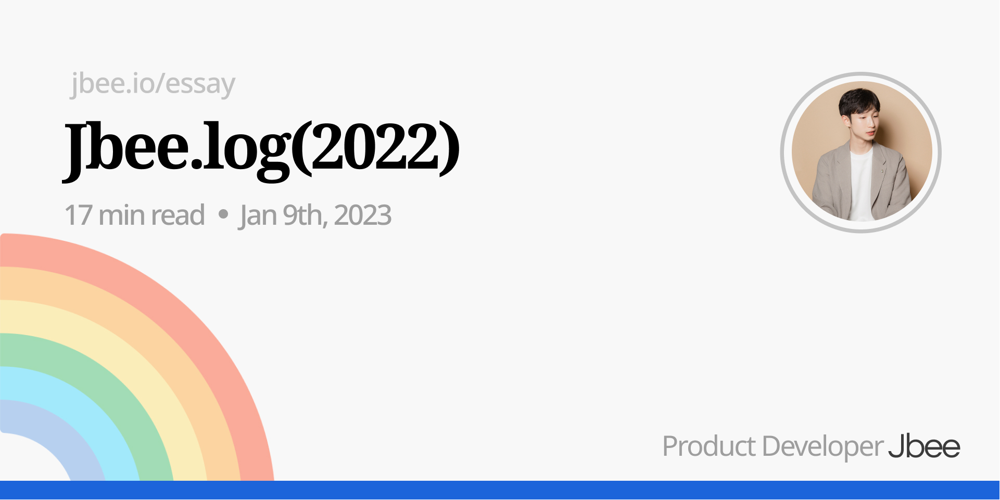

이번에는 회고를 그냥 넘겨볼까 하다가, 2023년은 어떻게 하지? 고민하던 중에 회고가 빠져선 진행할 수 없을 것 같아서 정리해봤다. 내 2022년을 구성한 여러 순간들을 키워드로 돌아보려고 한다.

## 새로운 라이프 사이클

작년엔 여러 새로운 습관, 라이프 사이클이 생겼다. 어쩌다보니 일반적인 새해 목표 3대장을 어느정도 이루게 되었다.

### 금연

재작년인 2021년 12월 28일 금연을 시작했다. 지금까지 잘 이어지고 있으니 1년이 조금 넘은 시점이 되었다. 작년에 진행한 대형 프로젝트 중 하나를 잘 마무리하여 뿌듯하다. 계속 지속될 확률도 99.9%로 자신감 레벨이 높은 항목 중 하나이다. (온 거리가 흡연 장소였던 스페인 마드리드에서 살짝 위험했다)

금연은 나에게 무엇을 가져다 주었을까.

금연 결심을 하던 때의 나는 아주 어리석게도 건강을 중요하게 생각하지 않았다. (이따 이야기 하겠지만 건강이 내 인생에서 우선순위가 많이 높아졌다.) 금연의 이유도 건강의 이유라기 보단 낭비되는 시간을 아끼기 위해서였다. 무엇보다 '좋은 곳'에 가서 흡연 장소를 찾으로 돌아다니지 않아도 된다. 흡연자들은 흡연이 가능한 장소를 찾기 위해 이리 저리 헤매야 한다. 니코틴을 끼니처럼 챙겨야 하는데, 그 빈도는 더 잦으니 참 번거로운 일이 아닐 수 없다. 알고리즘이 엉망인 회사 엘레베이터 앞에서 허송세월 낭비하는 시간도 사라졌고 내 일정 사이 사이에 들어가 있던 '담타'가 사라지니 여유가 생겼다. 금연으로 가장 소중한 자원 중 하나인 '시간'을 아낄 수 있게 되었다.

### 독서

읽은 책들을 대충 세어보니 24권 정도 읽었다. 거의 상반기에 집중해서 읽었는데 그 이유는 집필 때문이다. 들어오는 것이 있어야 아웃풋을 뱉는데 무리가 없다는 확고한 신념 같은 것이 있어서 토막글 위주로 블로그만 소비하고 있었던 인풋을 긴 호흡으로 바꾸려고 독서의 템포를 조금 올렸다.

주로 종이책을 구입해서 읽었다. 개발 서적이 아닌 책들은 크레마를 통해 출퇴근 때나 침실에서 간간히 잘 사용하고 있지만 충전을 해줘야 하는 귀찮음 때문인지, 종이책이 주는 감성 때문인지 종이책을 더 선호하는 것 같다.

가장 기억에 남는 책은, '실리콘밸리의 팀장들'이라는 책이다. 다른 책들도 재밌게 읽었지만 리드가 된 직후 읽은 책이어서 스펀지처럼 쭉쭉 흡수하게 된 책이다.

자기 전에 책을 읽으면 잠이 그렇게 잘 온다. 스마트폰 대신 책을 가까이 하려고 노력하지만 대부분 스마트폰이 자기 전 자리를 차지하곤 한다. 지난 해는 대학교 이후 손에서 멀어졌던 책을 가까이 하는 해 였다면 올해엔 조금 더 다양한 책을 접해보려고 한다.

### 운동

어쩌다 시작했는지 기억이 나질 않는데, 불현듯 운동을 해야겠다고 생각을 했다. 2분기 회고 때도 운동을 하겠다는 다짐을 하지 않았었는데, 7월 어느 날, 헬스장으로 가서 2개월을 등록했다.

#### 웨이트

작년 하반기부터 웨이트를 시작했다. 처음엔 Youtube 보면서 자세를 잡다가 연말에 PT를 받고 자세를 교정했다. 일주일에 4-5번 정도 하고 있고 출근 전 오전 시간을 활용하여 1시간씩 하고 있다. 몸이 금방 커질 줄 알고 걱정했다. 그런데 전혀 하나도 커지지 않더라. 근육통이 주는 뿌듯함이 있긴 하지만 딱히 눈에 보이는 성과가 없어서 지겨워지는 참일 때, 수영을 만났다.

#### 수영

내년엔 스쿠버다이빙을 도전해보고 싶은 마음에 물에 익숙해지기 위해 수영도 최근에 배우기 시작했다. 물에 전혀 뜨지 못하는 몸이었는데(이런 인간은 없다는 것을, 오히려 가라앉기 힘들다는 것을 수영하고 나서 알았다.), 한달이 지난 지금 자유형을 어느 정도 할줄 알게 되었다. (나름 초급반 에이스)

수영에 재미들려서 웨이트도 수영에 도움되는 운동 위주로 구성해서 하고 있다. 월, 수, 금 저녁 시간을 활용해서 1시간 씩 하고 있는데, 틈만 나면 주변 사람들에게 권하고 있다. 웨이트보다 좋은 점은 물 속에 있으니 핸드폰을 볼 시간이 없다는 것이다. 웨이트를 하다면 중간 중간 쉴 때마다 핸드폰을 보게 되는데, 수영은 그렇지 않아서 참 좋았다.

### Lesson learn

새로운 습관을 만들어가는 과정에서 배운 것이 있다면 **시스템의 중요성**이다. 인간은 나약하다. 인간의 의지를 믿지 말고 환경을 바꾸고 시스템을 만들어야 한다는 것을 배웠다. 어느 정도의 강제성이라고도 볼 수 있다.

**무언가를 하지 않아야 새로운 것을 할 수 있다.** 새해 계획들을 보면 대부분 무언가를 하려고만 한다. 무언가를 하지 않는 것은 금연말고는 거의 없다. 하던 것들은 계속하는 상태(포화 상태)에서 새로운 무언가를 하려고 하면 하기 힘들다. 과포화 상태가 되기 때문이다. 무언가를 새로 하기로 마음먹었으면 기존에 하던 무언가를 덜해야 한다. 책을 조금 더 읽어보기 위해 SNS 앱을 삭제하고 실제로 하는 시간을 많이 줄였지만 아쉽게도 Youtube 비중이 높아졌다. (포기못해)

책을 끝까지 읽어야 한다는 강박이 조금 있었는데, **모든 책이 나에게 도움이 되지 않는다.** 라는 사실을 받아들이고 난 후, 강박을 지울 수 있었다. 그러면서 책을 순서대로 읽지 않고 손에 잡히는대로 읽었는데, 더 빠르게 읽을 수 있었고 읽는 것이 더 재밌어졌다.

모든 행을 흡수하려고 하는 강박도 내려놓았다. 나에게 생각할 거리를 주는 문장을 만난 것만으로도 의미있는 책 한권으로 받아들이게 되었다.

다만 더 읽고 싶지만 더 급하다고 생각하는 것들, 더 쉽게 접근할 수 있는 것들, 날 유혹하는 재밌는 것들에게 밀리곤 하였다. 이를 해결해보고자 여러 가지를 시도해봤는데, 아직 뾰족한 방법은 찾지 못했다. (찾았지만 하고 있지 않을 수도 있다.)

운동은 더 빨리 시작할걸이라는 후회가 남았다. 건강한 신체에 건강한 정신이 깃든다는 말을 체감하고 있다. 이전의 나는 건강을 등한시 했다면 꽤나 우선순위가 높아졌다. 분기별 회고 중 2분기엔 주말마다 등산했다는 내용도 있었다. 이런 후회 때문인지, 꼰대가 되어건지, 만나는 사람에게 하는 운동이 있는지, 없다면 한번 시작해보는 것은 어떤지, 수영을 해보는 것은 어떤지 등 이야기하고 있다.

## 외부활동

### 집필

[https://fastcampus.co.kr/books/212106](https://fastcampus.co.kr/books/212106)

전자책이지만 처음 집필이라는 것을 해봤다. 패스트캠퍼스의 숏북이라는 플랫폼을 이용해 출간했다. 개발과 직접적으로 관련된 내용은 아니고 내가 어떻게 성장해왔는지, 지금은 어떻게 성장하고 있는지 긴 호흡으로 풀어쓴 책이다. 에세이라고 볼 수도 있고 지난 과정들을 교훈 중심으로 정리한 수필이라고도 볼 수 있을 것 같다. 성장에 대해 고민하고 있는 분에게 도움이 될 수 있도록 직접 겪은 이야기를 중심으로 꼭꼭 눌러담았다.

블로그를 하던 습관이 있어서 글은 빠르게 쓰여졌다. 물론 변명이지만 집필을 상반기엔 마무리하는 것 때문에 블로그 글을 거의 쓰지 못했다. (1년을 다 포함해도 3개 뿐이긴 하다.) Draft로 남아있는 글들이 몇개 있는데, 빠르게 정리해서 배포해야겠다.

### FEConf

익숙한 롯데월드 타워에서 오랜만에 오프라인 컨퍼런스를 열었다. (https://2022.feconf.kr/) 물론 Youtube 동시 송출도 진행했다. 온라인으로의 진행을 더 좋아하는 분도 있었기 때문이다. 이번에도 준비한 티켓은 빠르게 매진됐다.

커뮤니티란 무엇일까, 우리는 어떤 가치를 전달해야 하는가, 더 많이 고민을 해야 하는 시점이 아닐까 생각이 들었다. 이렇게 잘되면 내년에 더 잘해야 하는데, 점점 부담으로 다가오기도 한다.

### 이야기

발표([SLASH22](https://www.youtube.com/watch?v=fR8tsJ2r7Eg))도 하고 여러 멘토링 활동도 했다. [되는시간](https://whattime.co.kr/home)이라는 플랫폼을 활용하여 커피챗을 요청주시는 분들과도 이야기 나누고 채용팀으로 연락오는 잠재적 지원자 분들과도 이야기를 나눴다. 회사에 방문해서 같은 직군의 엔지니어 분들과 이런 저런 고충에 대해 이야기 나누기도 하고 참 많은 사람들을 만났다. 여러 대화에서 우리 팀의 채용 홍보 목적이 없진 않았지만 이야기를 나눈다는 것 자체가 흥미로웠다.

초대를 받아서 간 팀은 인프런, 힐링페이퍼 팀 두 팀이었다. 오피스로 가서 이야기를 나눴는데 내년에도 다른 팀을 방문해서 이런 저런 이야기를 하면 참 좋겠다 싶었다. (프론트엔드 개발팀이 있는 다른 회사에서도 초대해주세요.)

## 일

### 리더십

컴퓨터가 아닌 사람을 상대로 하는 것은 뭐가 됐든 참 어려운 것 같다. 누군가를 신뢰하고 성장을 이끌고 나를 신뢰하게끔 만드는 것은 정답도 없고 불확실한 요소가 정말 많았다. 처음 해보는 일이다보니 서툴었고 뚝딱거렸다.

7월에 프론트엔드 챕터 리드를 맡게 되면서 많은 것이 달라졌다. 코드를 작성하는 일 이외에 많은 역할이 주어지는 듯 하였고 이로 인해 시간을 많이 ‘뺐겼다’. **처음엔** 무엇이 나의 역할인지 몰라 허둥거렸고 이렇게 생각하다보니 시간을 투자하는 것이 아닐 뺐긴다는 생각을 하게 되었다. 그리고 이것은 극심한 스트레스로 이어져 불면증을 낳고 일과 삶의 만족도를 매우 낮췄다.

무엇이든 과하지 않도록 하며 부족하지도 않도록 할 것.

리드 역할을 수행하게 된 이후, IC일 때 하던 것들을 그대로 하려고 하다 보니 살짝씩 업무에 과부하가 생기고 의욕이 사라지기 시작했다. 시간이 생겨도 미루는 일들이 생겼고 새로운 것을 하는 것에 대해 방어적인 태도가 만들어지곤 했다.

6개월이 지난 이 시점엔 꽤나 나랑 잘 맞는 역할일지도 모른다는 생각을 하고 있다. (50%정도?) 아직도 마음 한 구석에서 나머지 50%를 차지하는 생각은 다음 두 가지 생각이다.

1. 내가 벌써? 아직 더 많은 경험이 고프다.
2. 매니징이라는 것이 실체가 있는 것인가? Engineer Managing이라는게 뭐지?

1번은 오히려 장점으로 활용할 수 있을 것 같은데, 2번은 참 어려운 문제더라.

이것과 관련해서 많은 사람들과 이야기해봤지만 아직도 해결되지 않았다. 이것 저것 알아보면서 VP of Engineering이라는 직군에 대해서도 알게 됐다. 궁극적으로 내가 추구하는 것이 무엇인지 계속해서 물어보면서 여러 경험을 축적해나갈 생각이다.

그 외에도 여러 가지 일을 했다. 상반기는 여러 회사 일을 동시 다발적으로 처리하는 반기였다면 하반기는 리드 역할과 함께 새로운 앱의 출시를 위해 신경쓰는 반기였다.

- 토스페이먼츠 챕터 소개글 작성 (https://tosspayments-dev.oopy.io/chapters/frontend/about)
- 실용주의 프로그래머 책 스터디
- Shift Left라는 이름으로 테스팅 세션 진행
- 워킹 그룹을 만들어서 챕터 개발 문화 개선하기
- 챕터원들과 꾸준히 페어프로그래밍 하기
- React Native로 앱 만드는 프로젝트에 참여하기

## 마무리

어떤 사람을 이해할 때엔 시간의 축과 함께 이해해야 할 것 같다. 어떨 땐 이러기도 하고 어떨 땐 저러기도 하는게 인간이지 않나 싶다. 나 또한 지난 해를 보내며 가치관이 달라졌다.

다채로운 색을 가진 사람이 되고 싶어졌다. 개발을 시작하고 나서의 나는 '개발'이 빠지고선 설명이 안 되는 그런 단색의 사람이었다. 심지어 '개발'만 좋아하다보니 그나마 새곧 무채색이었던 것 같다. 물론 지난 날의 나를 원망하거나 단색으로 지낸 것에 대해 후회하지 않는다. 그랬던 내가 있었기에 지금의 내가 있는 것이기 때문이다.

새해엔 거창한 목표 대신 색을 고르는 재미를 충분히 느끼고 싶다. 원하는 색을 하나씩 추가하고 나만의 무지개를 만드는 것이 목표이다. 다양한 책을 접하기도 하고, 새로운 취미를 만들기도 하고, 새로운 무언가를 배우면서 내 사고를 의도적으로 확장시킬 생각이다. 결국 이것이 내 '일'에 도움이 될 것이라고 생각한다.

여기에 한 가지를 더 추가해보자면 내가 내린 결정들에 대해 꾸준히 회고하여 결정들이 최선이 되도록 하는 사람이고 싶다. 작년에 분기별 회고를 진행했는데 아주 좋은 효과를 보았다. 시간이 지나면서 그 때는 맞고 지금은 틀린 관점이 참 많은데, 과거로부터 성장할 수 있는 지점이 참 많은 것 같다.
