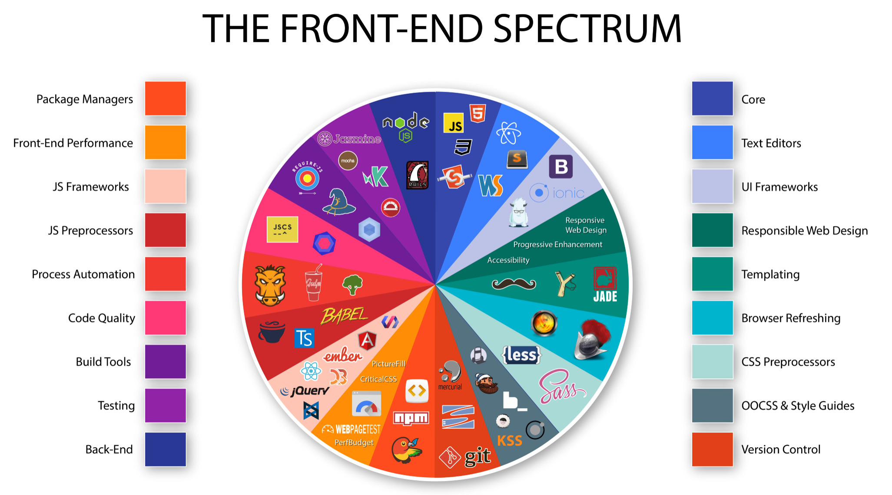

## 하나의 프로덕션, 웹

본래 웹은 어떠한 정보를 제공하기 위한 **문서(document)** 에 지나지 않았다. 사람들은 웹을 통해 보다 많은 정보를 **공유**하고 싶어졌으며 이는 기술을 발전시켰다. 자연스럽게 여러 방법들로 정보를 보여줄 수 있게 되었고 **웹**이라는 독자적인 영역으로 발전하게 되었다. 그러면서 자연스럽게 ‘문서’를 구성하고 있는 요소들이 많아지게 되었다.

사용자의 **액션**에 의해 반응해야 하는 요소들이 하나 하나 추가되면서 클라이언트 코드가 길어졌다. 정보를 보다 **‘빠르게’, ‘사용성 좋게’ 보여주고자 하는 니즈(Needs)**가 생기게 되었다. 클라이언트 단에서의 고민이 필요해졌다. 거듭되는 고민에 Thin-Client는 Thick-Client(a.k.a. Rich Client)가 되면서 프론트엔드라는 분야가 주목받게 되었다.

프론트엔드는 사용자에게 **어떠한 ‘정보’를 제공**하는데 있어서 보다 **‘우아하게’ 전달될 수 있도록 발전**한 것이다.

## 우아한 사용자 경험

### UX === Design?

보통 UX라고 하면 디자인을 떠올린다. 화면 디자인 영역을 부르는 UI design과 함께 UI/UX로 불려서 그런게 아닌가 싶다. 작은 모바일 화면에 너무 많은 정보가 노출되고 있는 것은 아닌지, 사용자가 버튼을 인식할 때 개발자가 또는 디자이너가 의도한대로 인식할 것인지, 애플리케이션을 사용하는데 있어서 불편한 점은 없는지 등을 고려한다.

### UX === 애니메이션?

UX라고 하면 애니메이션 만드는 것이라고 하는 사람도 있다. 물론 맞지만 일부일 뿐 전부는 아니다. 애니메이션도 중요하다. 사용자의 제스쳐에 맞게 동작하도록 하며 예측가능한 인터랙션을 주어 애플리케이션 사용자 피로도를 낮게 한다. 또 애니메이션은 모바일이라는 환경에서도 정보를 풍부하게 전달할 수 있도록 도와준다.

https://medium.com/@withinsight1/the-front-end-spectrum-c0f30998c9f0

## 프론트엔드 기술과 UX

### SPA + SSR/SEO ?

사용자에게 좋은 반응성을 보이기 위해 SPA가 등장하게 되었다. 기존에는 새로운 화면을 보여주기 위해 또는 어느 특정 부분을 갱신하기 위해 매번 네트워크를 타고 서버와 통신해야 했다. 그러면서 화면이 깜빡이고 어떨 때는 오래 기다리기도 했어야 했다. 클라이언트는 가지고 있는 데이터를 사용자의 입맛에 따라 그리고 상황에 따라 필요한 데이터만 서버로부터 가져오는 방식인 것이다.

SPA 환경에서 특정 행위에 대한 결과를 공유하는 니즈, 바로 이전의 상태로 돌아가고자 하는 니즈 등이 생겼다. url에 따라 변경된 화면을 서버로부터 가져와 그려주는 역할을 했던 것이 사용자 친화적이도록 히스토리를 관리하는 것이다. 프론트엔드에서 라우팅(routing)을 다루면서 고려할 수 있는 요소가 많아졌다.

성능을 고려한 클라이언트 개발 또한 UX라고 할 수 있다. 초기 로딩을 빠르게 하여 첫 페이지를 사용자에게 빠르게 보여줄 수 있는 것이다.

### 설계 ?

좀 더 나아가자면 사용자의 반응에 따라 변화하는 디자인, 그에 따라 확장 가능하고 유지보수가 용이한 설계를 하는 것 또한 중요하다. 변경 사항을 빠르게 반영할 수 있는 설계, 이 또한 UX이다.

### Service Worker, PWA?

‘오프라인’이라는 환경을 고려하고 있다. 웹을 사용하는데 있어서 Connection은 필수였다. 이러한 웹의 한계점을 어느 정도 극복했다고 볼 수 있다. Caching은 또 어떠한가. 이 또한 UX이다.

### AMP?

로딩 속도를 극대화 한 사례라고 볼 수 있다. 이 또한 UX이다.

### GraphQL?

필요한 데이터만 fetch하여 렌더링 한다면? 불필요한 데이터를 가져오지 않으니 데이터 사용량을 줄일 수 있다. 이 또한 UX이다.

---

UX라는 것은 많은 부분이 영향을 미친다. 개발자 혼자 고민한다고 해서 해결되지 않는다. 위의 기술을 전부 사용하더라도 제대로 된 UX을 고려한다는 것은 거의 불가능하다. 프로덕션에 좋은 사용자 경험을 설계하기 위해선 기획자, 디자이너의 도움이 반드시 필요하다.

하나의 프로덕션은 결국 코드로 구현되는 것이 맞지만 그 코드는 기획서와 디자인을 기반으로 작성된다. 우리에게 소중한 것이 있듯이 그들에게도 소중한 것이 있다.

> 서로의 영역을 존중하자.
