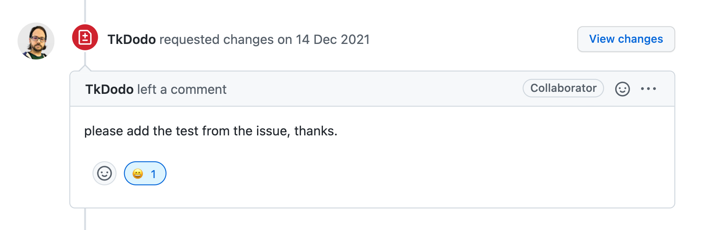

### TL;DR

1. 조직 내 코드 리뷰는 리뷰하고자 하는 관점을 코드가 아닌, **코드를 작성한 엔지니어에게, 제품을 만드는 메이커**에게 옮겨보면 어떨까.
2. 사실 코드 리뷰 문화보다 중요한 것은 테스트 문화이다.

## 코드 리뷰?

코드 리뷰(Code Review)란 말 그대로 코드를 리뷰하는 행위를 말한다. 코드 리뷰는 좋은 개발 문화 중 하나로 인식 되고 있는데, 그저 코드를 리뷰한다고 해서 좋은 개발 문화일지, 리뷰를 어떻게 잘 할 수 있을지 이야기해보려고 한다.

## 목적

코드 리뷰는 왜 할까?

### 버스 팩터 (Bus Factor)

[‘버스 팩터’](https://en.wikipedia.org/wiki/Bus_factor)란 팀원이 버스에 치여서 죽거나 크게 다쳤을 때 프로젝트가 ‘망할’ 가능성에 대한 지수를 의미한다. 그리고 이 지수는 프로젝트가 내포하고 있는 리스크를 의미하며, 지수가 낮다는 것은 프로젝트에 대한 맥락이 특정인에게 많이 쏠려 있고 정보가 제대로 공유되지 않는다는 것을 말한다.

그렇다면 코드 리뷰를 통해 서로의 코드를 살펴봄으로써 어느 한 명의 특정인에게 맥락이 몰리는 것을 방지할 수 있을까?

물론 도움은 되겠지만 ‘단편적인’ 코드 리뷰만으로는 제품에 대한 맥락을 전부 파악하는 데에 분명 한계가 존재한다. 오히려 버스 팩터를 높이기 위한 방법이라면 함께 작업하는 사람을 만들거나, 지속적인 공유와 문서를 잘 관리하는 것이 더 도움이 될 것이다.

### 버그없는 제품

리뷰를 통해 버그가 발생할 수 있는 가능성을 차단할 수 있을까? 코드 리뷰 단계에서도 캐치가 가능한 버그는 뻔한 버그일 가능성이 높다. 우리를 당황하게 하는 버그의 대부분은 미처 파악하지 못한 런타임 환경에서 발생하곤 하며 이런 엣지 케이스는 코드 리뷰 단계에서 발견하기 어렵다.

리뷰가 올라온 변경 사항에 대해 실제로 사용해보면서 리뷰하지 않는 이상, 모든 버그를 차단하기는 어렵다. 가능해도 들어가는 리소스 대비 효율이 나오지 않는다.

그렇다면 코드 리뷰는 왜 좋은 개발 문화라고 여겨질까. 그 전에 정말 좋은 개발 문화일까?

## 부작용

(목적은 모르겠고)코드 리뷰가 좋은 개발 문화라고 해서 무작정 시작하다가 부작용이 발생하는 경우도 있다.

### 병목이 되는 코드 리뷰

가장 흔히 볼 수 있는 부작용은 바로 코드 리뷰라는 단계가 제품이 만들어지는 프로세스를 Blocking 하는 것이다. 보통 코드 리뷰를 도입하기 위해 ‘제약’이라는 것을 만드는데, 많은 제약도 필요 없이 아래 두 조건만 추가해줘도 쉽게 병목이 된다.

- main branch에 들어가는 코드는 무조건 Pull Request를 통한 리뷰를 거쳐야 한다!
- 리뷰에서는 2명의 Project Owner에게 Approve를 받아야만 Merge가 가능하다!

만약 Project Owner가 조금이라도 바쁘다면? 제품이 만들어지는 속도는 안 봐도 뻔하다. 너무 기본적인 규칙이지만 이런 부작용은 주변에서 쉽게 찾아볼 수 있다.

이 병목을 ‘우린 좋은 개발 문화를 유지하고 있어’라고 속이곤 한다. 이 상태를 오랫동안 방치하면 둘 중 하나로 귀결되는데, 하나는 병목이 된 채로 느린 제품 완성 속도를 만들어내는 것이고, 다른 하나는 리뷰의 의미가 없어지는 것이다.

### 의미없는 코드 리뷰

바로 ‘무지성 Approve’ 단계를 말한다. 새로운 코드가 Pull Request를 통해 main branch에 들어가는 의미가 사라지는 것이다. 각자의 개발을 진행하느라 바쁘다 보니 서로의 코드를 잘 안 보게 되고, 보더라도 깊이 있게 못 보니 유의미한 리뷰가 없는 것이다. 그 와중에 내 코드는 빨리 리뷰돼서 main branch에 들어가길 바라는 동상이몽이 펼쳐진다.

### 싸움이 되는 코드 리뷰

성인들이 코드를 가지고 싸우기도 한다. 구성원들이 준비가 안 된 상태에서 서로의 코드를 리뷰하면 무엇을 리뷰해야 하는지 전부 다르고 무엇이 옳은지 다르다.

‘내 코드는 옳고 네 코드는 옳지 않아.’라는 가정이 있으면 이 총성 없는 전쟁은 끝나지 않는다. 겉으로 드러나게 싸우면 오히려 다행이다. 서로 기분만 상하고 리뷰로 남는 것은 상처뿐일 수도 있다.

이 갈등의 원인에는 리뷰를 남기는 사람의 공격적인 말투도 있겠지만, 말투를 바꾸더라도 상처가 될 수 있다. 더 근원적인 문제가 있기 때문인데, 리뷰를 받는 사람이 리뷰를 자신에 대한 비난이라고 받아들이게 되면 비극이 시작된다.

### 책임 소재를 묻는 코드 리뷰

리뷰에 ‘승인’을 하는 것은 이 코드에 대한 ‘책임’을 함께 갖는 것이다. 라는 이야기도 있다. 즉 제품에 반영되는 코드에 대해 공동 책임을 진다(?)는 것인데, 이 말엔 동의하지 않는다.

우선 이런 의미를 코드 리뷰 승인에 부여해서 얻는 실익이 없다. 앞서 말했듯이 리뷰로 버그를 차단할 수 없을뿐더러, 실제로 승인을 한 사람이 공동 책임으로 느낄지 모르겠다. 문제가 된 코드의 작성자는 '리뷰를 받았으니 이 문제는 공동 책임이야!' 라고 외쳐서 달라질 것도 없다.

문제의 책임은 그저 시스템에 있다. 문제가 발생했다면 시스템을 회고하고 문제가 됐던 부분을 함께 개선하면 된다.

오히려 이 의미 없는 의미 부여 때문에 리뷰에 부담을 갖고 리뷰를 피하게 되어 병목이 되곤 한다. 책임을 사람에게 두지 않는 순간, 승인은 'LGTM :)' 처럼 기분 좋은 커뮤니케이션이 될 수 있다.

### Why?

이런 부작용은 왜 발생할까? 좋은 게 좋은 거 아닐까?

프로젝트에 참여하는 구성원들, 또는 코드 리뷰에 참여하는 구성원들의 인식이 맞춰져야 한다. 코드 리뷰는 합성어이다. 리뷰를 통해 함께 작성해나가는 코드인 만큼 ‘코드’에 대한 인식도 맞춰져야 하고, ‘리뷰’라는 행위에 대해서도 인식이 맞춰져야 한다.

앞에서 언급한 부작용들은 이러한 인식이 불일치 하는 데서 출발한다.

## 리뷰를 하기로 했나요?

먼저 인식을 맞추자.

### 코드에 대한 인식

> 좋은 코드란 무엇인가?

나쁜 코드를 좋아하는 개발자가 있을까? 그런 개발자는 없을 것이라 가정하고, 모든 개발자는 좋은 코드를 지향한다는 대전제로 이야기를 시작하자.

우리가 지향하는 ‘좋은 코드’는 무엇인지, ‘나쁜 코드’는 무엇인지 논의하고 이 기준으로 리뷰를 진행하자.

#### Not Human

자연스럽게 컨벤션에 대한 이야기도 나올 것이다. 기본적인 컨벤션에 대한 부분은 정적 분석 도구로 대응하자. 찾아보면 여러 rule을 추가할 수 있고 고도화된 rule이 필요하다면 직접 만들 수도 있다. 이런 자잘한 컨벤션들을 리뷰하지 말자. (우리의 리소스는 소중하니까)

처음부터 모든 것을 다 정하려다 보면 지치기 마련이다. 먼저 프리셋을 도입하고 팀에 맞도록 수정하는 것이 좋다.

### 리뷰는 성장을 목적으로

이젠 리뷰라는 행위에 대한 인식을 맞춰보자. 리뷰하고자 하는 관점을 코드가 아닌, **코드를 작성한 엔지니어에게, 제품을 만드는 메이커**에게 옮겨보면 어떨까.

일시적으로 코드의 품질을 높이려 하지 말고, **함께 성장하기 위한 수단**으로 리뷰를 활용해보자.

리뷰를 지적이라고 느끼는 순간, 앞에서 언급한 부작용들이 발생하게 된다. 지금 당장의 코드를 세세하게 변경(Change Request)하려고 하기 보단 **메이커가 성장해서 제품을 더 잘 만들 수 있도록** 리뷰를 해보면 어떨까.

#### 질문도 리뷰

리뷰어가 모르는 것을 알려주는 것도 맞지만, 리뷰를 통해 모르는 것을 알아가는 것도 리뷰다. 모르고 있던 어떤 API 하나를 알게 되는 것만으로도, 새로운 라이브러리를 알게 되는 것만으로도 유의미한 리뷰가 될 수 있다. 이 또한 모르면 영원히 모르는 것이기 때문에 성장아닐까

리뷰는 받는 사람만이 성장하는 게 아니고, 하는 사람도 성장한다.

리뷰를 비난이 아닌, 검사 받는 게 아닌, 책임을 지게 하는 게 아닌 서로의 성장을 위한 것이라고 생각해보자.

### 테스트

리뷰 내용이 정말 좋아도 가끔 반영하기 귀찮을 때가 있다. 그 이유는 내가 구현했던 그 기능이 원래 잘 동작했는데 지금도 잘 돌아가는지 다시 확인해봐야 하기 때문이다.

리뷰를 반영한다는 것은 곧 코드의 변경을 의미하고, 변경되었다는 것은 원래 잘 동작하던 기능이 동작하지 않을 수 있음을 의미한다. 즉, 다시 눈과 손으로 확인해야 하는 과정이 수반된다는 것인데 이것이 귀찮은 것이다.

이것을 줄여준다면 리뷰를 반영하는데 귀찮음이 해소되지 않을까? 그로 인해 리뷰를 좀 더 적극적으로 반영하고 요청할 수 있지 않을까?

그렇다. 우리는 모두 정답을 알고 있다. 테스트를 작성하면 된다.

사실 코드 리뷰 문화보다 중요한 것은 테스트 문화라고 생각한다. 앞에서 언급했던 버스 팩터도 훨씬 더 효과적으로 대응할 수 있을 뿐만 아니라 테스트는 모든 면에서 중요하다. 코드 리뷰를 하자고 하기 전에 먼저 테스트를 작성해보면 어떨까?

### Pre-commit Review

리뷰를 받았는데, 리뷰 내용이 설계 전반을 변경해야 하는 리뷰라면 어떨까? 조금은 당혹스러울 수 있을 것이다. 작성자 나름대로 일정을 고려하고 있을 텐데, 큰 변경에 대해서는 반영하기 부담스러울 수 있다. 사람이라면 지금도 잘 돌아가고 있는데 굳이? 라는 생각이 먼저 드는 게 당연하다.

이러한 과도한 변경이 자주 반복되다 보면 리뷰 받는 사람은 물론, 하는 사람 입장에서도 지칠 수 있다. 그렇다면 코드가 만들어지기 전에, 커밋 되기 전에 함께 리뷰해보면 어떨까?

프리 커밋 리뷰란, **GitHub에 커밋이 되기 전의 리뷰**라는 뜻으로 실제 코딩 작업에 들어가기 전에, 어떻게 작업을 진행할지 가볍게 논의해보는 리뷰를 말한다. 코드를 리뷰하는 대신 디자인 시안이나 요구 사항을 보고 어떻게 작성할지 이야기해보는 사전 리뷰 단계인 것이다.

#### 기대 효과

프리 커밋 리뷰를 통해 다음과 같은 긍정적인 효과를 기대해볼 수 있다.

1. 우선 앞서 이야기한 과도한 설계 변경에 대한 리뷰는 없을 것이다.
2. 서로의 관점을 공유함으로써 **설계에 대한 인사이트**를 얻을 수 있고 **코드 품질에 대한 기준**을 맞출 수 있는 기회가 된다.
3. 해당 제품(또는 기능)의 도메인을 알아볼 수 있는 기회가 될 수 있다.
4. 코드 리뷰를 하게 됐을 때, 리뷰어 입장에선 리뷰 대상인 코드를 파악하기 쉬워지고, 이로 인해 **깊은 코드 리뷰가 가능**해진다.
5. 무엇보다 기능을 개발하기 전에 많은 고민을 하고 개발하기 때문에 빠르게 개발할 수 있다.

물론 비동기로 운영될 수 있는 코드 리뷰에 비해 리소스도 많이 들어가고 시스템 화 시켜두지 않으면 제대로 동작하기 힘들다. 모든 작업에 대해 진행하기 보다는 복잡한 요구 사항에 대해서만 진행해도 충분하다.

### No Rules

코드 리뷰를 위해 규칙이 필요할까? main branch에 들어가기 위해선 무조건 하나의 승인(Approve)를 받아야 한다던가, 우선순위에 따른 코멘트를 남겨야 한다던가, 리뷰를 하는 데 있어서 제한 시간이 있어야 한다던가...

과연 이런 것들이 필요할까? 코드 리뷰 목적이 성장이라면 규칙은 필요 없지 않을까?

Pull Request를 등록하는 개발자는 이 Pull Request를 통해 성장하고 싶을 때, 리뷰를 요청하면 된다. 리뷰 요청을 받는 사람은 기꺼이 리뷰에 응하면 된다.

자연스럽게 여러 문제가 해결된다.

- 모든 Pull Request에 대해서 리뷰를 하지 않아도 됐기 때문에 코드 리뷰 양이 적어졌다.
- 코드 리뷰 양이 적어졌기 때문에 요청이 들어왔을 경우 좀 더 빠르게 확인할 수 있게 되었다.
- 코드 리뷰가 스프린트의 병목이 될 가능성을 낮췄다.
- 심지어 리뷰가 필요한 Pull Request에서 리뷰가 요청이 왔으므로 유의미한 리뷰가 오갈 수 있는 확률이 더 많아졌다.

#### 물론

코드 리뷰의 목적이 오로지 성장에만 있지는 않다. 서로가 놓친 부분이 없는지 확인을 하는 과정이기도 하고, 일부러 동료의 코드를 보며 관점을 맞춰가는 과정이기도 하다. 규칙과 제약에만 몰두하게 되면 리뷰의 목적을 잊게 될 수 있어, 일단 규칙과 제약을 없애고 최소한의 약속만으로 리뷰를 시작해보면 어떨까

### 영어

농담 반 진담 반으로 구성원들이 영어를 잘 못 한다면, 코드 리뷰에 영어를 도입해서 꽤 괜찮은 효과를 볼 수 있다.

아무리 서로를 위해 리뷰를 한다고 하더라도, 어떤 사람은 말투로 인해 상처를 받을 수 있다. 그런데 영어로 리뷰하게 되면 말투가 잘 드러나지 않는다. 가끔 리뷰가 아니꼽게 읽혀서 기분이 상하곤 하는데, 영어는 해석하다가 그 숨은 공격성을 파악하기 어렵다.

영어로 리뷰하게 되면 여러 부수효과도 기대해볼 수 있다.

영어로 표현하는 것은 귀찮기 때문에 굳이 리뷰하지 않아도 되는 부분에 대해서는 그냥 넘어갈 것이다. 영어로 길게 작성하는 것은 어렵기 때문에 정말 중요한 이슈에 대해서는 서면보다는 대면으로, (페어 프로그래밍)으로 이뤄질 수 있다. 최종적으로 알찬 리뷰만 남게 되기 때문에 반영하는 데 걸리는 시간도 절약된다. (덤으로 영어 작문 실력도 올라갈 수 있지 않을까?)

## 마무리

코드 리뷰에 대한 이야기를 해봤다. 물론 이 이야기는 '제품 조직 내 코드 리뷰'에 한해서이고 오픈소스에서 이뤄지는 코드 리뷰는 이야기가 조금 다르다. (코드에 대한 리뷰를 해야만 하고 경험상 테스트가 더 빡세다.)

    https://github.com/tannerlinsley/react-query/pull/3093

조직 내에서 아무 계획 없이 그저 개발 문화를 위해 코드 리뷰를 도입하게 되면 제대로 동작하지 않는 리뷰 프로세스를 마주하게 되고 부작용을 겪어 ‘우리 다신 보지 말자.’가 될 수도 있다. 코드 리뷰를 한다면, 먼저 구성원들이 그것을 당연하다고 느껴야 한다. 리뷰가 어떤 규칙이나 제약이 되면 반발심이 생길 수 있다. 처음부터 그럴 수는 없겠지만, 당연하다고 생각하는 것이 문화이다.

### 코드 리뷰를 도입하기 전에

- 코드 리뷰에 참여하는 구성원들의 인식이 같은 곳을 바라보는가? 문화로 받아들일 준비가 되어있는가? 확인해보자.
- 좋은 코드에 대한 기준을 먼저 얼라인하자. 어떤 코드가 좋은 코드인가? 함께 토론해보자.
- 전체적인 코드 컨벤션 확립과 코드 일관성을 유지하기 위한 도구 도입하자. 불필요하고 소모적인 리뷰로 인해 시간 낭비, 리소스 낭비를 예방해야 한다.
- 먼저 테스트를 작성해보면 어떨까?

여러 조직에서 서로의 성장을 위하는 코드 리뷰로 함께 성장하면 좋겠다.

### So What?

그렇다면 성장을 위한 코드 리뷰는 무엇인가? 필자가 속해있는 팀에서 이런 관점으로 리뷰를 하려고 노력하고 있다. 실제로 챕터에서 이뤄지고 있는 코드 리뷰와 그 과정을 소개하며 글을 마무리한다.

[👉 토스페이먼츠 프런트엔드 챕터의 코드 리뷰 문화 보러가기](https://tosspayments-dev.oopy.io/chapters/frontend/about)
