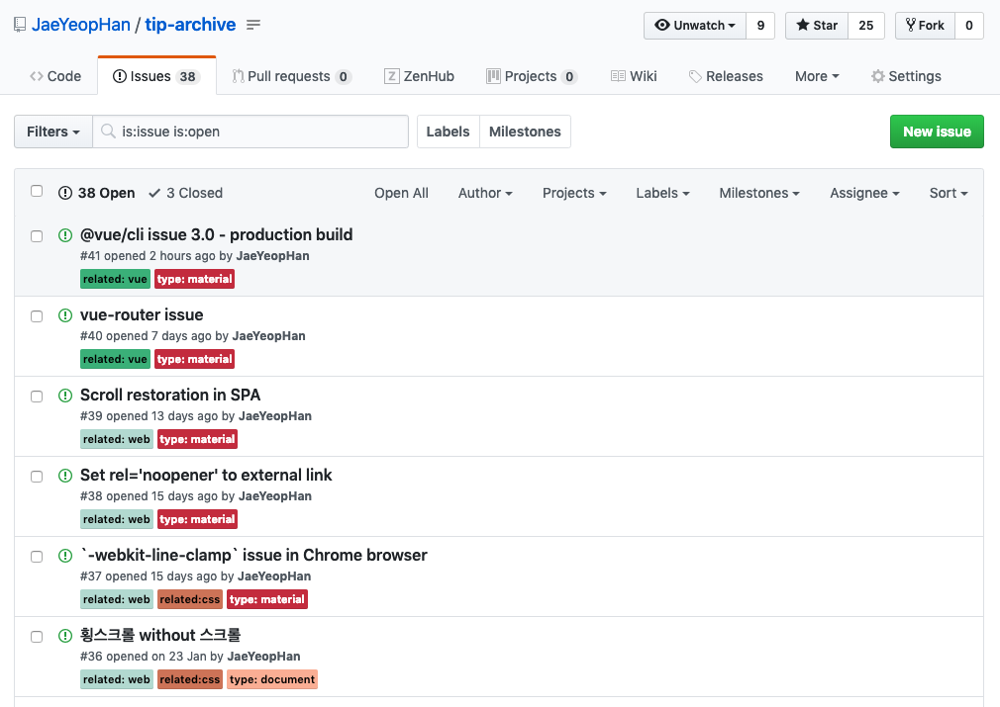

문제가 발생했을 때 또는 모르는 것이 생겼을 때, 이를 해결할 수 있는 가장 빠른 방법은 자신의 상황을 잘 알고 있는 누군가에게 질문하는 것입니다. 그 누군가는 옆 동료가 될 수도 있고 멘토나 사수 등이 될 수 있습니다.

## 충분한 구글링을 우선 선행

당연히 위에서 말한 ‘문제’와 ‘모르는 것’은 구글링으로 해결되는 문제를 의미하지 않습니다. 우리가 마주하게 되는 대부분의 문제는 이미 웹 상에 그 해결책이 있습니다.

아쉽게도 구글링을 잘하면 나올법한 질문들이 종종 보이거나 그런 질문들을 받게 됩니다. 구글링 또한 의식적으로 해야 한다고 생각합니다.

웹 상에 공유된 해결책으로 문제가 해결되지 않거나 여러 해결책들을 기반으로 새로운 해결책을 도출해야할 경우, ‘모르는 것’이 생겨납니다.

> 나 이거 모르는데, 알려주세요.

## 동료의 시간을 낭비하지 마세요.

무턱대고 ‘A’을 모른다고 하면 질문을 받는 사람 입장에서는 난처할 수 밖에 없습니다. 그 이유는 다음과 같기 때문입니다.

- ‘A’와 관련된 내용을 정말 **전부** 모르는 것인가
- 그것이 아니라면 정확히 **무엇이 문제**인 것인가
- **무엇을 하다가** A까지 갔을까
- 현재 A로 무엇까지 **해보았을까** (trial)

질문에 위 내용에 대한 질문이 전혀 없기 때문입니다. 당연히 이러한 **정보**가 포함된 질문이 좋은 질문입니다.

옆의 동료도 자신의 개발, 업무를 하고 있을 겁니다. 질문을 받는 옆 동료의 Context와 자신의 Context가 다르다는 것을 인지해야 합니다. 문제가 빨리 해결되길 원한다면 **Context를 맞추는 작업**이 선행되어야 합니다. 그리고 이 작업이 빠르게 선행되기 위해서는 질문자가 질문을 **정리**해야 합니다.

## Two Question

질문에는 다음 두 가지 종류가 있습니다.

- 정답이 **있는** 질문
- 정답이 **없는** 질문

정답이 있는 질문에는 **‘예/아니오’로 대답**할 수 있도록 질문하는 것이 좋습니다. 정답이 없는 질문에는 **토론**으로 이어지게 끔 자신의 입장을 정리하여 질문을 정리하는 것이 좋습니다.

추상적인 것 같으니 간단한 예를 들어볼까요?

#### Example 1. “Jbee님, QA 중 올라온 이슈인데요, 보던 화면이 유지가 안 되는데 이거 어떻게 해야하죠?”

여기에서 제가 역으로 질문할 내용은 다음과 같습니다.

1. 모든 디바이스, 브라우저에서 발생하는 이슈인가요?
2. 어떤 상황에서 보던 화면이 유지가 안되나요?
3. 기존에는 어떠한 방식으로 보던 화면을 복원하고 있었나요?
4. 이슈를 받고 어떠한 시도들을 해봤나요?

#### Example 2. “Jbee님, 이 로직은 A에 들어가는게 맞나요, B에 들어가는게 맞나요?”

여기에서 제가 역으로 질문할 내용은 다음과 같습니다.

1. 이 로직은 왜 필요한건가요?
2. A에 들어가야 한다고 생각하는 이유는 무엇인가요?
3. B에 들어가야 한다고 생각하는 이유는 무엇인가요?
4. 두 방법을 고민하는 이유는 무엇인가요?

1번부터 4번까지 역으로 질문하다가 1시간은 흘러가겠네요. 서로 피곤해질 것이 뻔합니다. 그리고 답변을 해주는 사람도 1~4번 내용을 모르고서는 쓸모있는 답변을 하기 힘듭니다.

## 질문 정리하기

위와 같은 상황이 발생하지 않도록 질문을 하려면 어떻게 해야 할까요? Context를 맞추는 작업은 무엇을 말할까요? 모르는 것이 생겨서 질문을 해야 겠다는 생각이 들면, 아래 내용을 정리해보세요. 정리를 하다가 스스로 해결이 되는 경우도 많습니다.

### 지금 이슈가 된 것이 무엇인가?

정확한 상황 설명을 추가하면 좋습니다. 이러한 부연 설명을 최대한 줄이기 위해 최소한 **자신이 무슨 프로젝트를 하고 있는지 알고 있는**, 또는 **자신의 수준을 알고 있는** 동료 개발에게 질문을 하는 것이 좋습니다.

- 지금 개발 중인지, QA 중인지, 배포 후 긴급 대응인지
- 이슈가 발생한 환경은 무엇인지 (OS, 브라우저 등)
- 어떠한 상황에서 이슈가 발생했는지

### 어디까지 해보았나?

발생한 이슈에 대해서 자신이 어느 정도까지 파악을 했고 어떠한 시도를 해봤는지 공유를 하면 좋습니다. 질문을 받는 사람이 이미 자신이 아는 것을 설명해주거나 이미 시도해본 방법을 제시한다면 서로 시간 낭비가 됩니다.

- 발생한 이슈의 원인이 무엇이라고 생각하는가?
- 그 원인을 토대로 내린 결론은 무엇인가
- 결론대로 시도를 해보았는가

이러한 내용들이 담긴 질문을 한다면 답변자는 약간의 시간만 들여서 수월하게 문제를 함께 해결해볼 수 있습니다. 즉 답변자는 다음과 같은 액션을 취할 수 있습니다.

- 이슈의 원인을 다시 짚고 그에 따른 새로운 해결 방안을 제안
- 파악된 원인을 기반으로 다른 시도를 제안
- 올바른 방향의 결론이었다면 함께 디버깅을 진행

> 질문 정리하다가 답을 찾아서 질문할 필요가 없어지겠네요.

스스로 해결하는 경우가 당연 베스트이지 않을까요? 😁

## 온라인에 질문 올리기

> 다음 내용은 [코드스쿼드의 정호영 마스터님의 발표 영상(동기부여 - 질문 잘하는 법)](https://www.youtube.com/watch?v=L2p1mdpxD5w)을 참고하여 작성하였습니다.

페이스북 그룹에 종종 질문 글이 올라옵니다. 하지만 답변을 받지 못하는 경우도 많이 봤고 답변해주고 싶어도 이해가 안 가는 질문글이 많았습니다. 다음과 같은 부분들을 고려해보면 어떨까 싶습니다.

### 질문의 제목에!

- 질문의 status를 추가하자
  - 답변 대기, 해결됨 등

### 질문의 본문에!

- API , 핵심 에러메시지을 포함하기 - 발생한 에러 메세지는 정확히
- 예의바르게, 깔끔하게, 맞춤법을 맞춰서
- 코드는 스크린샷이 아닌, 텍스트 그 자체가 아닌 code share 툴을 사용.
  - Gist, code sandbox, jsbin 등
- **질문을 올리고 반드시 tracking**

마지막 ‘질문을 올리고 반드시 tracking’ 부분은 개인적으로 정말 중요하다고 생각합니다. 질문을 올리고나서 답변이 달려도 아무 반응이 없는 질문글들이 보이면 마음이 아픕니다. 답변이 원하는 내용이 아니더라도 도움을 주시려는 분에게 최소한의 예의가 아닐까 생각합니다.

## 한 걸음 더 나아가기

질문에 대한 답을 듣고 문제를 해결했습니다. 여기서 한 발 더 나아가서 그것을 공유해보는 것은 어떨까요? 답변을 해준 사람이 ‘감히 내 소중한 지식을 너가 공유해?’라고 하진 않을 겁니다.

> 이거 별거 아닌데… 굳이 공유까지 하나요?

대부분 공유를 부탁하면 이런 반응입니다. 질문을 하고 답변을 듣기 전 이 이슈는 자신에게 굉장히 힘겨운 문제였는데도 까맣게 잊어버립니다. 누군가는 같은 이슈로 고통받고 있지 않을까요?

> 블로그가 없어요!

블로그가 없어도 공유는 가능합니다. 간단히 정리하여 페이스북 커뮤니티 그룹에 올려도 되구요, 요즘 많이 사용하시는 [notion](https://www.notion.so)은 정리한 내용을 바로 웹 상으로 공유도 할 수 있습니다.

우리는 개발자이니 GitHub 저장소를 활용할 수도 있겠습니다. 저는 [tip-archive](https://github.com/JaeYeopHan/tip-archive/issues)라는 GitHub 저장소를 하나두고 블로그에 올리기에는 너무 짧은 snippet 성의 지식들을 이슈로 정리하고 있습니다.

## 마무리

질문자는 질문하기 전 조금만 시간을 더 투자해서 서로의 시간을 아끼고 함께 성장할 수 있지 않을까요?

감사합니다.
