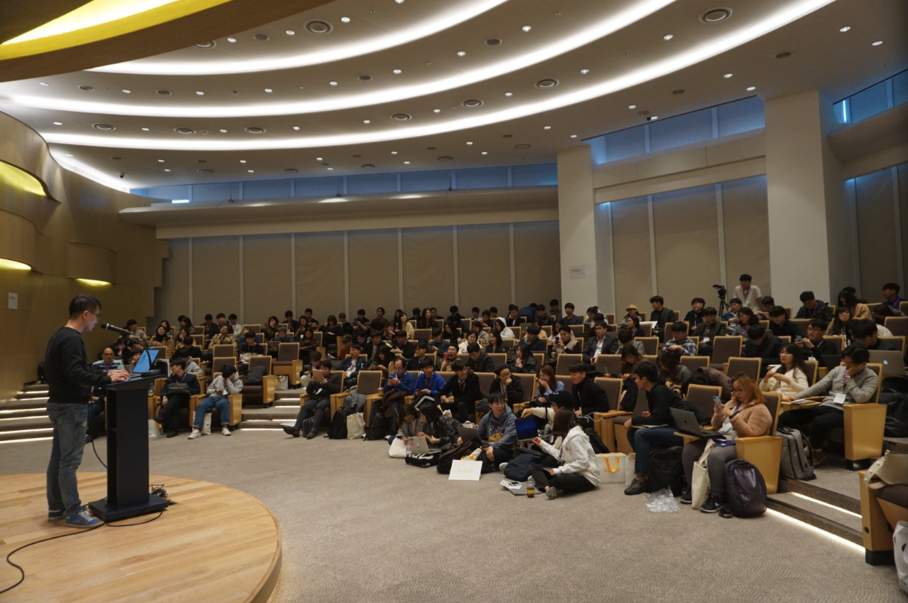
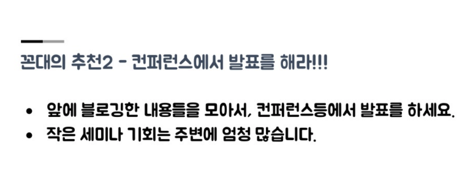

요즘 개발자 행사가 정말 많아진 것 같습니다.

프론트엔드 개발 그룹, TypeScript Korea, GDG(Google Developer Group), Seoul.js, 장고걸스, AWS … 등 다양한 커뮤니티가 주축이 되어 행사가 열리고 있습니다. 생태계가 건강하다는 반증이라고 생각합니다. 앞으로도 꾸준히 유지됐으면 좋겠습니다. 그럴려면 개발자 행사의 꽃, 발표자가 가장 중요할텐데요, 발표자들은 어떻게 발표를 할까요? 개발자분들이 발표를 너무 어렵게 생각하시는 것 같아서 이 글을 쓰게 되었습니다.

> 강대명님의 개발자는 어떻게 성장해야 할까 발표 슬라이드#55

## 발표는 누가 하는가?

뻔한 얘기입니다. **‘개발’을 하는 누구나** 발표를 할 수 있습니다. 당연하게도 Google, Facebook 이런 회사에 다녀야만 발표할 수 있는게 아닙니다. 일단 저도 저런 회사에 다니지 않고 있습니다. 바로 옆에 앉아서 개발하던 동료도 발표자가 될 수 있습니다.

### 그래도 잘하는 사람이 발표를 하지 않나요?

일단 저도 발표를 몇 번 해봤기 때문에 그런 부분은 전혀 고려되지 않고 있다는 점을 아주 잘 압니다. 잘하고 말고보다는 자신의 경험을 자신이 알게 된 것을 공유한다는 게 중요한 것 같습니다.

### 그래도 전 아직 2년차라… 시니어 분들이 주로 발표하지 않나요?

주니어가 겪었던 경험이 도움이 되는 청중이 있을거고 시니어가 팀을 리드했던 경험이 되는 청중이 있지 않을까요?

청중에게 내용을 전달할 때, **눈높이**가 맞아야 잘 전달될 수 있다고 생각합니다. 또한 청중이 **이해할 수 있는 내용을 전달**하는게 중요하다고 생각합니다. 이런 부분에 있어서 주니어가 할 수 있는 발표가 있고 시니어가 할 수 있는 발표가 있다고 생각합니다. 개발을 공부하고 있는 입장에서 할 수 있는 발표도 있습니다.

예비 개발자, 학생들을 위한 미트업일 경우 얼마 전에 입사한 주니어 개발자가 들려주는 생생한 경험이 적절한 발표 주제가 될 수 있습니다. 또는 면접을 많이 진행해본 시니어 개발자의 발표도 적절할 수 있습니다. 인턴 생활의 경험을 공유하는 발표도 있을 수 있고 블로그를 운영했던 경험을 공유할 수도 있습니다.

행사를 준비하는 오거나이저가 생각한 적절한 발표 주제가 있기 때문에 자신이 하고자 하는 발표 주제가 행사와 맞는지 물어볼 수도 있습니다.

## 발표하면 뭐가 좋은데?

그러게요. 수많은 발표자 분들은 뭐가 좋다고 발표를 할까요. 시간이 남아 돌아서 발표를 하는 걸까요?

제 개인적인 경험은 이렇습니다. 블로그를 계속 하고 있는 이유와도 비슷합니다. 발표를 하기 위해 **준비하는 과정에서 성장**합니다. 또 뻔한 이야기가 되겠지만 자신이 알고 있는 내용을 남에게 이해시키려고 할 때, 내가 잘 몰랐던 부분을 알게 됩니다. 내가 아는 무엇인가를 배출하기 위해서 아는 것보다 조금 더 깊게 들여다보게 됩니다. 그러는 과정에서 놓친 부분도 있을 거고 새롭게 알게 된 부분도 있을 겁니다.

그리고 발표를 마친 후 밀려오는 뿌듯함은 한 번 쯤 느껴볼 만 합니다.

> 이제 좀 발표 한 번 해보실 마음이 생겼을까요?

## 발표 주제는 어떻게 잡을까?

평소 개발하면서 **발생했던 이슈들을 기록**해두면 좋습니다. 시간이 지나면 지날수록 이슈들이 쌓이게 되겠죠. 그런 다음 그 이슈들을 **비슷한 분류**로 묶어봅니다. 그러다보면 하나의 이슈 덩어리가 생기게 되고 **한 가지 주제로 응집**됩니다. 직접 경험에서 나오는 이 **이슈 덩어리가 바로 발표 주제**가 됩니다.

예를 하나 들어볼까요. react/redux 기반의 평범한 프로젝트를 graphql을 도입하면서 apollo 기반으로 마이그레이션 하게 되었습니다. 당연히 이슈가 팡팡 터지겠죠. 공식 문서에서 나오지 않았던 이슈들도 속속히 등장합니다. 스택오버플로우에게 물어봐도 모르는 이슈들이 한 가득일 수 있습니다. 그 누구도 알려주지 않는 이것들을 삽질해서 결국 해내고 덮어두기만 하면 너무 아깝지 않나요?

꼭 이런 큰 이슈가 아니어도 좋습니다. 작은 이슈 하나 하나가 모여서 하나의 주제를 형성할 수 있습니다. 성능을 개선한 여러 이슈들을 모아 ‘성능 개선하기’라는 제목으로 묶을 수도 있겠네요!

자신이 직접 겪은 경험을 공유할 때 청중들과 공감대도 형성되고 내용을 전달하는데 있어서 자신감이 생기는 것 같습니다.

‘평소 개발하면서 발생했던 이슈들을 기록해두면 좋다’라고 말했는데, 물론 쉽지 않습니다. 하지만 한 번 시도해볼만 하다고 생각합니다. 성장할 수 있는 좋을 기회일 뿐만 아니라 **‘공유’의 뿌듯함**을 느끼실 수 있습니다! (확신!)

## 마무리

개발자 행사와 관련된 글을 써봤습니다.

개발자는 발표를 무조건 해야한다는 이야기가 아니며, 발표를 해야 좋은 개발자라는 이야기도 아닙니다. 그러나 발표를 하는 개발자는 분명 더 많은 경험을 할 수 있는 개발자라는 것은 꼭 말하고 싶었습니다.

여러분의 발표 신청을 기다리는 컨퍼런스와 미트업은 항상 열려있습니다. 이 글이 도움이 되어 용기를 얻고 많은 분들이 발표로 행사에 참여했으면 좋을 것 같습니다! :)
