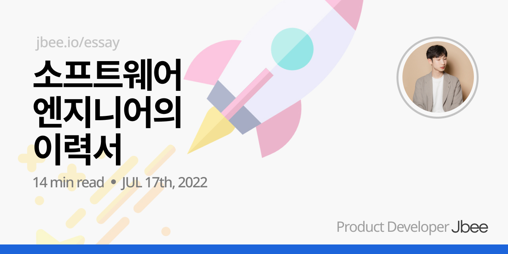

이력서에 대한 이야기를 해보려고 한다. '이력서'라고 검색하면 나오는 수많은 '팁'들이 있어서 이력서를 작성하는데 어려움이 없을 것 같다.

여느 글이 그렇듯 굳이 한번 더 정리하는 이유는 이력서에 대한 개인적인 견해를 덧붙이기 위함이다. 최근 출간한 [전자책](https://fastcampus.co.kr/books/212106)에서는 간단하게만 다뤘는데, 이 글에서는 이력서에만 집중해서 이야기해보려고 한다.

들어가기에 앞서, '개발'이라는 포괄적인 용어를 프로그래머들이 독차지 하는게 평소부터 조금 이상했다. 그래서 이번 글에서는 제목에서도 그렇고 개발자라는 용어 대신 소프트웨어 엔지니어 (너무 길어서 그냥 엔지니어)라는 용어를 사용해봤다.

## 이력서

이력서는 나름의 목적을 갖고 있는 문서다. 그렇다면 엔지니어의 이력서는 어떤 목적을 가지고 있을까. 무엇을 위한 문서일까.

### 역할

이 이력서라는 문서는 내가 어떤 엔지니어인지 '소개'하고자 하는 목적을 가지고 있다. 어디에 사용할지는 몰라도 결국 자신을 드러내는 수단인 것이다.

그렇다면 어떤 내용이 채워져야 할까? 어떤 엔지니어인지는 어떻게, 무엇으로 소개할 수 있을까? 엔지니어는 무엇을 하는 사람인지로부터 힌트를 얻을 수 있다. 엔지니어는 문제를 정의하고 해결한다. 즉, 엔지니어의 이력서는 자신이 가진 기술로 **어떤 문제를 어떻게 해결했는지** 중심으로 채워지는 순간 그 목적을 달성할 수 있다.

### 예상 독자

작성한 사람이 있다면 읽는 사람이 있다. 엔지니어의 이력서는 누가 읽을까. 나에 대해 알고 싶은 사람이 읽는다. 나 혼자 보려고 작성할 수도 있지만 일기가 아닌 이상 대게 독자는 남이다. 나라는 엔지니어를 궁금해하는 다른 사람이 읽는다는 것이다.

이 점이 생각보다 중요한데, 많은 사람들이 이 부분을 놓치고 있다. 다른 사람에게 읽히기 위한 문서라는 것을 인지한다면 가독성과 형식을 고려할 것이기 때문이다.

## 이력서의 기본

이력서의 역할을 생각해서 내용을 고민하고, 예상 독자를 생각해서 형식을 구성하면 기본은 할 수 있지 않을까?

### 중요한 것을 먼저 제시

경력 사항은 **내림차순**으로 정렬한다. 내림차순인 이유는 예전의 경력보다 **최신의 경력이 더 중요**하기 때문이다. 3년 전에 해결한 문제와 지난 달에 해결한 문제 중 어떤 것이 더 궁금할지 고민해보면 너무나도 당연한 이야기이다. (이력서는 본인의 일대기를 적는 문서가 아니다.)

경력 사항 뿐만 아니라 나를 드러내는데 있어 가장 중요하다고 생각하는 요소를 가장 상단에 위치시키자. 필자의 [경우](https://jbee.io/about)에는 나에 대한 간략한 소개와 선호하는 팀의 특징을 먼저 공유했고, 간단한 인적사항 다음 바로 경력 소개로 배치해두었다.

> 경력과 경험은 최신의 것부터 나열하자.

### 일반적인 포맷

가독성을 고려한 형식이 필요하다고 이야기했다. 어떻게 하면 가독성이 좋을까? 사실 이력서라고 다르지 않다. 문서가 잘 읽히도록 하는 정도로만 신경써도 충분하다. 문제는 그렇지 않다는 것이다.

만약 오른쪽에서 왼쪽으로 읽어야 하는 소설이 있다면 잘 읽힐까? 당연히 그렇지 않다. 우리는 왼쪽에서 오른쪽으로 읽는게, 위에서 아래로 읽는게 익숙하기 때문이다. 즉 가독성이 좋다라는 것은 **익숙한 문서의 포맷**을 갖추고 있음을 의미한다.

그러나 아쉽게도 독창적인 디자인을 입혀서 읽기 힘들게 만든 이력서도 흔하게 볼 수 있다. 한 장에 끝내려고 3단의 다단 형식을 적용해서 빽빽하게 채운 이력서도 봤고, 웹 형식의 이력서 중에는 다양한 애니메이션을 적용해둔 것도 있는데 내용에 집중할 수 없었다.

그냥 원티드에서 제공하는 이력서 포맷이라던가 마크다운만 사용한 문서가 가장 읽기 편한 것 같다. (Simple is the best)

#### 노션 기반의 이력서

요즘 노션을 기반으로 생성된 이력서가 많이 보여서 굳이 콕 집어서 이야기하고 싶었다. 웹 상에서 바로 접근할 수 있다보니, PDF파일을 만들고 다운로드 받을 필요가 없어 이 부분이 큰 장점인 것 같다. 자연스럽게 최신화의 문제도 해결된다. 노션이라는 스타일에도 점점 익숙해지다보니 나쁘지 않은 포맷이라고 생각하는데, 가끔 읽기 힘든 노션 기반의 이력서를 마주한다.

- heading과 text, list bullet 만으로 표현할 수 있을 것 같은데, 각종 이모지와 컬러 텍스트, 이미지 등으로 꾸며놓은 이력서
- 링크를 타고 타고 들어가야 내용을 온전히 읽을 수 있는 이력서.

디지털 가든처럼 온갖 링크들로 서로 연결되어 있는 이력서는 어디까지 봤는지, 이게 어떤 내용과 연관이 되어 있는지 파악하기 힘들다. 링크는 안 봐도 그만인 참고용 웹 페이지를 공유할 때만 사용하고 최대한 한판에서 볼 수 있게 하자.

이런 이유에서 노션 기반의 이력서는 잘 추천하지 않는다. 플랫폼 자체가 작성자에게 너무 꾸미고 싶은 환경이기 때문이다. 이력서는 내가 만족하기 위해 작성하는 문서가 아니다. 내용 전달과 그 역할에 집중하고 과도한 치장은 과감히 빼자.

## 좋은 이력서

지금까지 이력서의 기본에 대해서 이야기했는데, 좋았던 이력서를 떠올리면서 그 특징들을 정리해봤다.

### 신뢰할 수 있는 이력서

어떤 문제를 해결했는지 중심으로 이력서 내용을 채워야 한다고 이야기했다. 

대부분 우리는 어떤 서비스, 제품을 만든다. 제품을 담당하여 개발했다면 단순히 'OO 제품 개발'이 아니라, 이 서비스는 어떤 사용자를 타겟으로 하고 있는지, 그 사용자들이 겪고 있는 어떤 문제를 해결하는 서비스인지 배경을 함께 적어두거나 개발할 때 어떤 것들을 신경썼는지 보충하면 전달력이 조금 더 높아질 수 있다.

무언가를 개선한 것도 어떤 문제를 해결했다고 볼 수 있다.

| '어드민 서비스의 성능 개선'

이 문장을 어떻게 해석할 수 있을까? 어떤 어드민 서비스이길래 성능 개선이 필요했는지, 그 배경이 궁금해지면서 어떤 지표에 대한 성능을 개선했는지 파악하기 어렵다. 실제로 개선했는지도 의심이 되면서 신뢰할 수 없는 문장이 된다. 다음과 같이 개선된 지표를 측정한 수치를 추가해보면 어떨까?

| 가맹점 어드민 제품에서 대량의 데이터를 테이블로 보여주는 초기 렌더링 시, LCP 시점을 2s 단축

측정할 수 없으면 개선할 수 없다. 개선에 대한 이야기를 할 때, 측정한 수치가 있다면 함께 이야기하자.

### 궁금한 이력서

이력서는 보통 서류 검토 단계와 인터뷰 전에 읽어보게 된다. 이 때, 어떤 이야기를 할 지는 이력서에 따라 달라진다. 이력서를 읽고 특정 문제에 대해 좀 더 듣고 싶다던지, 소개되어있는 해결 방법은 어떤 배경이서 나오게 된 것인지 호기심이 발생하는 경우가 있는데, 이런 이력서가 좋은 이력서라고 생각한다.

예를 들어보자.

| 가맹점이 사용하는 결제 어드민 개발

이 문장을 보고 어떤 궁금한 점이 드는가?

'어떤 제품인지는 모르겠지만 어드민을 개발했구나.' 하고 넘어가게 된다. 이 하위에 이런 내용이 추가되면 어떨까?

| 복잡한 테이블 컴포넌트를 모듈화하여 제품에서 사용하는 테이블 간의 일관성을 맞추고 생산성을 높였으며 이를 오픈소스로 공개

어드민 개발이 반복되고 지겨운 업무가 될 수 있지만 이 과정 속에서 효율화 할 수 있는 부분을 찾고 이를 공유하는 과정으로 유의미한 성과로 만들 수 있다.

재미있는 문제는 해결하려고 하는 과정도 재밌지만, 재미없는 문제를 해결하는 것은 재미가 없을 수가 있는데, 이런 노잼문제를 유잼으로 해결하는 과정이 흥미롭게 다가오곤 했다. 또 눈에 보이지 않는 비효율을 문제로 정의하고 해결한 경험도 눈길을 끌곤 한다.

### 불필요한 정보가 없는 이력서

해결한 문제와 관련이 없는 것들은 과감히 이력서에서 지우자.

#### No Skill set

가끔 본인이 할 수 있는 기술 목록(Skill set)에서 그 Skill에 대한 능숙한 정도를 기재하는 경우가 있다. 이런 주관적인 내용들은 이력서 전반에 대한 신뢰도를 떨어뜨린다. 앞서 개선한 사항에 대해 수치화를 하면 좋다는 이야기를 했는데, 이 경우는 객관적인 근거가 없는 주관적인 수치화이기 때문에 아무런 의미가 없다.

자신이 능숙하게 다룰 수 있는 기술들은 문제를 해결하는 과정에서 사용한 기술들을 자연스럽게 노출하는 것만으로 충분하다. 특정 기술을 다룰 수 있음을 드러내는 것도 좋지만 궁극적으로는 그 기술로 어떤 문제를 어떻게 해결했는지가 더 중요하기 때문이다.

#### No TOEIC

토익 점수를 비롯해 기타 다른 어학 점수는 엔지니어 채용에 크게 도움되지 않는다. 만점이 아니라면 괜히 이력서 길어지게 만들지 말고 지우자. 비슷한 맥락에서 아르바이트 경험이나, 운전면허 같은 자격증 내용도 제외해주자.

### 경력이 없는 이력서

| 그러면 신입은 어디에서 경력을 쌓나요?

이젠 흔한 밈이 되어버렸는데, 신입으로 입사하기가 참 쉽지 않은 것 같다. 이력서 준비부터 쉽지 않은데, 신입 개발자 분들, 신입 엔지니어 분들은 기재할 경력이 마땅치 않다. 최근에는 부트캠프나 코딩 학원에서 진행한 프로젝트들을 중심으로 채워지는 현상이 보인다. 심한 경우, 포맷의 통일을 넘어 진행한 프로젝트와 그 내용도 동일한 이력서 묶음도 받아보았다.

중요한 것은 경력이 아니라, 어떤 프로젝트를 진행했느냐가 아니라 어떤 문제를 해결했느냐이다. 보통 어떤 서비스를 클론해보는 프로젝트를 진행하는데, 아쉬운 지점이 많다.

#### No 클론 코딩

클론 코딩을 했다는 것만 기재되어 있는 경우, 제품 개발 경험을 단순히 '가맹점 어드민 개발'이라고 말하는 것과 다를바가 없다. 읽는 입장에서 전혀 궁금하지 않은 것이다. 어떤 서비스에 대한 클론 코딩을 했더라도 그 과정 중에서 정의한 문제라던가 맞딱뜨린 문제들이 있을 텐데, 그 문제들을 중심으로 컨텐츠를 재구성한다면 클론 코딩의 경험도 유의미한 내용이 될 수 있을 것 이다.

TODO 애플리케이션만 하더라도 제품으로서의 엣지 포인트를 줄 수 있는 여지가 굉장히 많은 제품이다. 항상 CRUD에서 멈추는 TODO가 아니라 시중의 TODO 앱을 사용해보면서 느낀 불편함을 해결하는 목적으로 만들어봐도 좋은 소재거리가 될 수 있다고 생각한다.

#### 오픈 소스

오픈 소스 자체가 문제를 정의하고 해결하는 과정이다. 오픈 소스는 현재 속해있는 조직이나 팀이 없더라도, 가지고 있는 자본이 없더라도 조직에서의 프로세스를 경험할 수 있다. 정말 좋은 교보재이니 꼭 시도해봤으면 좋겠다. 앞서 이야기한 무지성 클론 코딩 10번하는 것보다 오픈 소스에 기여해보는 1번의 경험이 더 유의미하다고 생각한다.

GitHub 프로필 꾸미는 것과는 다른 이야기다. GitHub에서 README.md를 이용하여 자신의 프로필 화면을 꾸밀 수 있게 해두었는데, 중요한 건 이 프로필이 얼마나 화려한지, 얼마나 잘 꾸며놨는지가 아니라 어떤 코드가 있는지다. GitHub에서 보여줄만한 프로젝트가 없다면 프로필 링크를 기재하지 않아도 무방하다.

간혹 가다가 잔디를 중요하게 보냐고 물어보시는 분이 계시는데 전혀 중요하지 않다.

#### 블로그, TIL

이 글에서 가장 많이 나온 단어, 문제. 문제를 해결한 경험들을 정리해둘 수 있는 가장 좋은 장소 블로그이다. 실제로 인터뷰를 진행할 때에도 블로그에 정리된 내용을 가지고 많이 진행하곤 한다. 양질의 문제 해결 경험은 10년의 경력보다 더 그 사람의 엔지니어로서의 가치를 높여준다. 다만 아쉽게도 블로그에 들어가보면 알고리즘 문제 정답 코드 뿐인 블로그가 많다. 이런 블로그라면 크게 도움이 되진 않는다.

블로그까지는 아니더라도 TIL 형식의 자신만의 위키가 있다면 이것들이 경력을 어느 정도 대신해줄 수 있을 것이다.

## 마무리

이력서는 미리 준비되어 있으면 좋다. 여러 이유 중 하나는 필요할 때 정리하려고 하면 쉽지 않기 때문이다. 평소에 기록하는 습관이 있으신 분들은 괜찮겠지만 무엇을 했는지 기억이 잘 나지 않는다. 제품과 비즈니스에 가장 몰입했던 시기에 자신이 어떤 문제를 해결했는지 정리해두는 측면에서 정리를 미리 해두면 커리어를 돌아보는 면에서도 좋다. 최소 분기마다 이력서 정리 시간을 갖는 것을 추천한다.

### Reference

- [커리어 속에서 성장하는 방법](https://fastcampus.co.kr/books/212106)