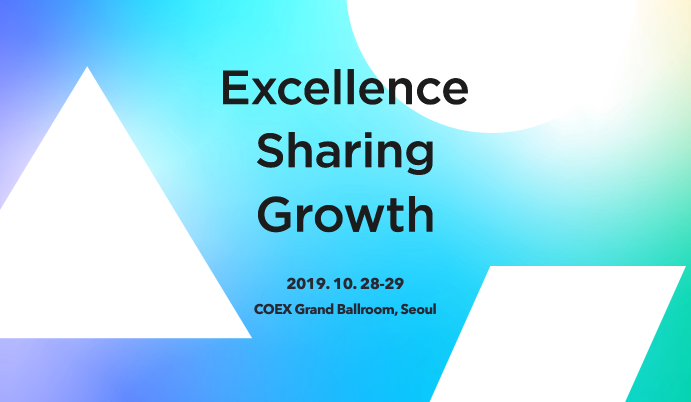

3년 연속 DEVIEW에 참석했다. 올해에는 2일차에만 다녀왔다. 세션은 3개 정도 들었는데 우연히 전부 Track 2에 있는 발표였다. (우연이 아닌가)

# 안드로이드 앱의 다중 웹뷰 환경에서 성능 병목 진단 및 최적화 사례

[https://deview.kr/2019/schedule/287](https://deview.kr/2019/schedule/287)

안드로이드 개발자는 아니지만 주로 웹뷰 환경 위에서 프론트엔드 개발을 하고 있다. 웹 프론트엔드 개발자에게 도움이 될만한 내용이 많았다고 생각하는 세션이다.

성능 최적화에 대해 다루고 있다. 이전 회사에서 성능과 관련된 작업들을 많이 했었고 이 때 배운 내용들을 기반으로 GDG Devfest에서도 발표를 했던 적이 있다.

최적화의 기본은 어느 플랫폼에서나 비슷하다고 느꼈다.

- 리소스를 로드할 때 필요한 것만 필요할 때 로드하며 필요없는 리소스들은 lazy하게 로드한다.
- 용량이 큰 이미지는 규격에 맞게 로드한다.
- Cache를 적절하게 사용한다 등.

프론트엔드 개발자가 모바일에서 웹뷰 성능 개선을 할 때 low tier 디바이스에서의 성능 개선은 정말 어렵다. 특히 이 경우, 마이크로 성능 최적화는 아무 소용이 없다. 일단 리소스를 불러와야 그 개선이 보일텐데 불러오질 못하니 말이다. 같은 이유로 lighthouse로의 측정도 힘들기 때문에 어느 정도 개선이 되어가고 있는지 판단하기도 어렵다. 원래 비용이었던 JavaScript는 거대한 bundle이 되면서 더 큰 비용이 되었다.

이 부분을 해소하는 방법으로는 네이티브 레벨에서부터 접근해야 하는 것이다. 이 문제를 해결하기 위해서는 타 직군과의 협업이 필요하고 협업을 요구하려면 타 직군 개발 영역에 대한 이해를 수반했다. Native 개발자도 웹 브라우저 엔진이 HTML, CSS, JavaScript 리소스들을 어떻게 가져와서 어떻게 그리는지 이해하면서 병목을 진단하였고 최적화를 진행했다. 내용을 100% 다 이해하지는 못했지만 Native 레벨에서 parsing 하는 시간을 단축하고 캐시 처리를 하는 등 여러 작업이 있었고 재미있게 들었다.

좋은 팀이란 서로 이해하는 영역에서 함께 문제를 해결하는 것이 아닐까 하는 생각이 들었다. 당연하게도 좋은 프로덕트는 좋은 팀에서 나온다.

# React, Angular, Vue를 한 번에 지원하기 위한 설계 (Cross Framework Component)

[https://deview.kr/2019/schedule/289](https://deview.kr/2019/schedule/289)

제목 참 잘 지었다. 연사자 분은 무려 4K 오픈소스 메인테이너 최연규님. FEConf 때는 4K 오픈소스 메인테이너가 되기 까지의 스토리를 공유해주셨다. 이번에는 소속된 팀에서 운영중인 오픈소스 라이브러리에 대한 이야기였다.

VanillaJS로 만들어진 라이브러리를 각각의 프레임워크에서도 사용할 수 있도록 wrapping하는 과정에서 발생한 trouble shooting으로 이야기를 시작한다.

현업에서 충분히 겪을 수 있는 이슈로 참가자들로 하여금 많은 공감이 됐을 거라 생각된다. 특히 NAVER와 같이 legacy가 가득한 상황에서 정말 해결해야만 하는 문제였고 멋지게 해결했다. 실제로 egjs 라이브러리 사용 중 맞닥뜨렸던 이슈여서 반가웠는데 이 이슈 때문에 다른 라이브러리를 선택한 것이 미안해졌다. 

내용은 조금 어려웠다. 최대한 쉽게 설명하기 위해 여러 도형, 애니메이션을 총 동원하셨지만 제대로 이해를 하려면 공유해주신 소스 코드를 봐야 했다. 보통 라이브러리를 만들고 유지보수하는 개발자보다 프로덕트나 서비스를 만드는 개발자가 더 많다. 그렇기 때문에 라이브러리 설계에 대한 부분인 다소 생소하게 다가올 수 있었을 것이다.

그래서 너(프로덕트 개발자 또는 서비스 개발자)가 하려면 어떻게 해야 하냐. 이 부분이 좀 더 다뤄졌으면 청중들로 하여금 공감을 더 불러일으킬 수 있지 않을까 하는 생각이 들었다.

왜 View와 Data를 분리해야하는지 명확하게 이야기를 하고 있다. 문제 해결의 핵심도 data만 업데이트를 하거나 우선 업데이트 하는 방식이었다. DOM 조작과 데이터 관리를 분리하여 외부 옵션으로부터 render를 위임하는 방식이 핵심이었다.

# 2019년 FE 프레임워크를 배우는 기분(FE 인싸들이라면 알고 있어야 하는 프레임워크 기술들)

[https://deview.kr/2019/schedule/320](https://deview.kr/2019/schedule/320)

믿고 듣는 박재성님 발표. 연도 별로 JavaScript 생태계 동향에 대해서 정리해주시는 연사자 분이다. 발표 제목도 재미있고 발표 자료 또한 힙함의 끝판왕이었다. (역주행 중인 철용 형님과 펭수의 등장)

이미 기울어진 운동장이지만 반대편의 프레임워크도 새로운 아이디어로 계속 발전했으면 좋겠다.

발표 후반부에 이런 내용이 나온다.

하늘아래 새로운 것은 없다.

프론트엔드 생태계를 가만히 보고 있으면 마치 새로운 것처럼 포장을 하지만 내부적으로는 있던 기술들을 새로운 프레임워크, 라이브러리에 맞게 지지고 볶아서 만들어둔 것이다. 그나마 패러다임을 살짝 바꿔본 것이 런타임에서 컴파일 타임으로 옮겨둔 Svelte이었다.

jQuery Event handler에서 hook이라는 개념이 이미 존재했다는 것과 함께 React hooks를 소개해주셨고 얼마 전 공식 문서에 추가된 React Scheduling에 대한 이야기도 일부 포함되어 있었다. 프론트엔드 개발에 얼마 전에 입문한 분들이 실수할 수 있는 부분들도 잘 짚어주셨다.

React가 등장했던 것만큼 센세이션을 불러일으킬만한 무언가는 당분간 나오지 않을 것만 같고 그래서 인지 오히려 생태계가 건강해졌다고도 생각이 든다.

## 발표 말고 행사

- 작년 기억으로는 초록색 계열의R 부스말고 다른 회사의 부스도 정말 많았던 것 같고 참여할 수 있는 부스 행사도 더 많았던 것 같은데 이번엔 생각보다 적어 아쉬웠다.
- 2017년도부터 참석했지만 웹, 모바일 등의 영역이 차지하는 영역은 갈수록 작아지는 느낌이 든다. 시대의 흐름이 인공지능, 머신러닝, 딥러닝이라서 어쩔 수 없는 부분인가 싶기도 하다.
- 아 좀 더 정확히 웹 프론트엔드 영역의 세션은 딱 2개였다. 웹 프론트엔드 영역의 컨퍼런스는 이제 FEConf.
- 얼굴 인식 체크인, 놀랐다. 엄청 빠르고 파워풀했다! 어서 실생활의 여기 저기 도입되고 사용할 수 있으면 좋겠다.

### 그 외 단상

- 1일차에 대통령님께서 왔다고...? SOSOCON이 아닌 DEVIEW라는 것에 놀랐고 엔지니어들의 위상이 높아지는 순간이라고 생각했다.
- COEX는 정말 넓고 멋있다. 컨퍼런스 최적의 장소인 것 같다.

---
