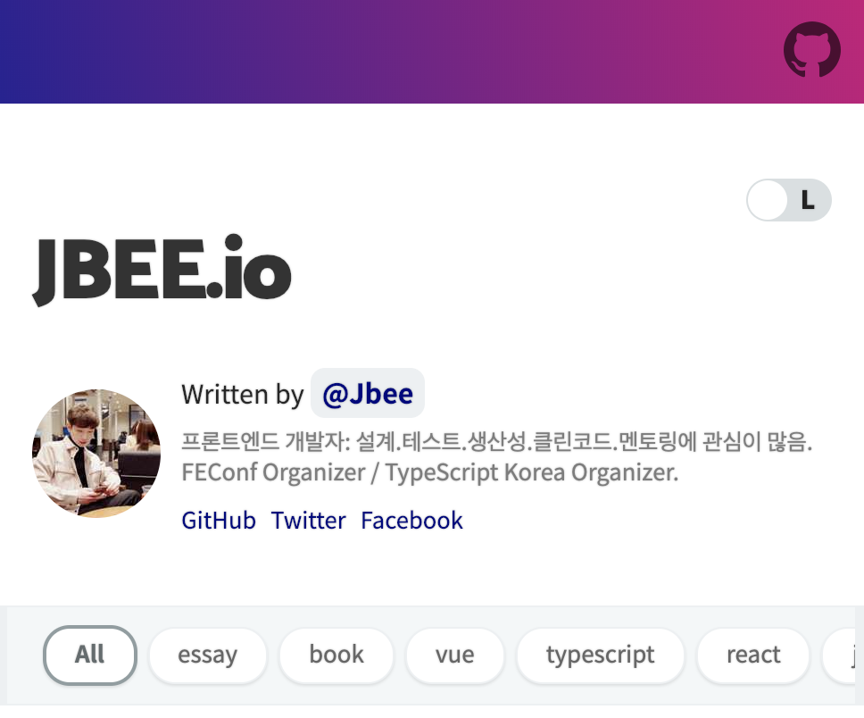
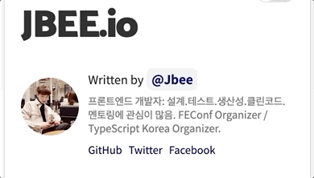
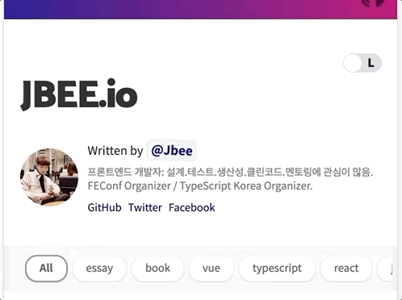
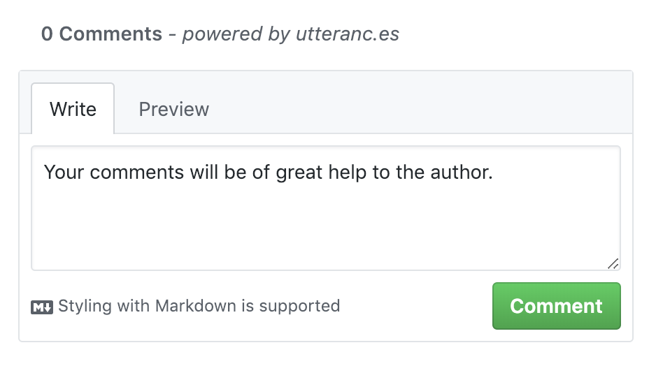
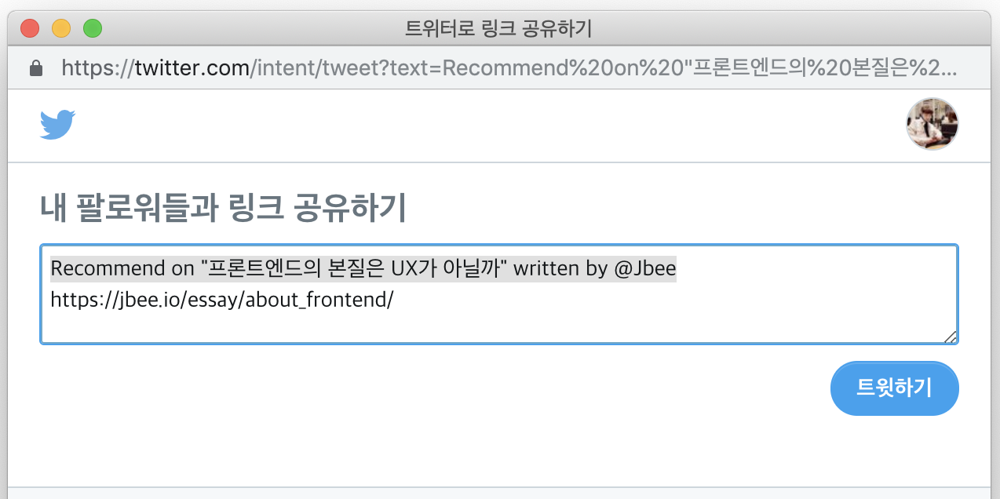
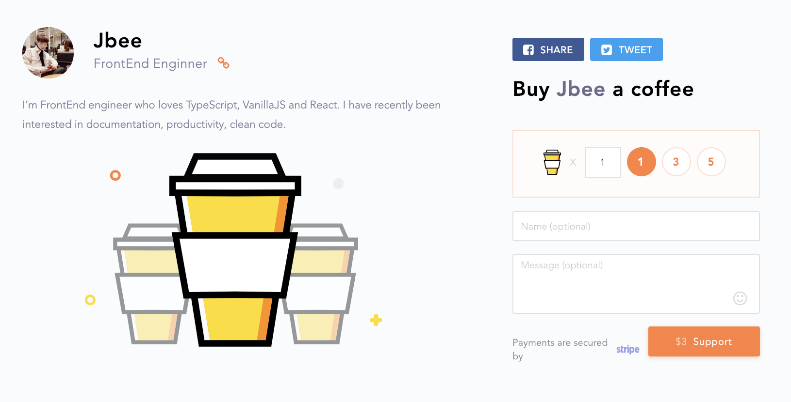
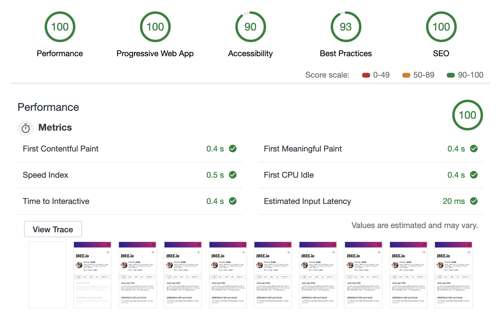
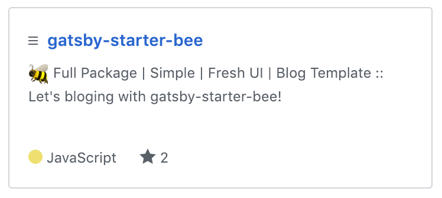

오랜 숙원 사업이었던 블로그 마이그레이션이 거의 마무리되었고 그 과정 속에서 고민했던 내용을 정리해 보았습니다. 추가하고 싶은 기능은 많았지만 블로그를 만드느라 포스팅을 게을리하여 부랴부랴 마무리했습니다.

## 0. Choose Tool

블로그를 마이그레이션 해야겠다라는 생각을 할 때부터 [Gatsby](https://github.com/gatsbyjs/gatsby)로 정해져 있던터라 고민은 없었습니다. 선택한 결과는 매우 만족입니다. React 기반의 Static Web Generator 중 가장 Well-made한 Framework(?)라고 생각되며 어마어마한 ecosystem 덕분에 빠르게 블로그를 새로 만들 수 있었습니다. 필요한 feature들이 거의 대부분 plugin으로 만들어져 있어서 가져다가 사용하고 약간의 customize 과정으로 해결되었습니다. Gatsby에 대한 자세한 내용은 [여기](https://blog.outsider.ne.kr/1426)를 확인해주세요.

### Template

이 블로그는 [gatsby-starter-bee](https://github.com/JaeYeopHan/gatsby-starter-bee) template을 기반으로 만들어졌습니다. 블로그를 마이그레이션 하면서 따로 정리한 starter template입니다. 지금부터 소개되는 모든 feature들이 전부 담겨있는 starter pack입니다.

### Deploy

배포하는데 있어서 [now](https://github.com/zeit/now-cli)와 [surge](https://surge.sh/)를 사용해봐서 이번에는 [netlify](https://netlify.com)를 사용했는데, 압도적으로 좋은 경험이었습니다. 좋다는 말만 들었는데 기본적인 deploy 기능은 물론, Preview feature, DNS Setting, SSH setting 등 부가적으로 제공하는 기능들이 정말 편리했습니다. 다음에도 static web을 배포할 일이 있을 경우 netlify를 사용할 것 같습니다.


## 1. Fresh UI

**HOME**, **ARTICLES**, **ABOUT** 쓰리 콤보와 함께 dropbox 형태의 카테고리로 구성되어 있는 기존 블로그의 UI를 벗어나고 싶었습니다. 그러면서 이러한 Feature들을 **simple하게** 담을 수 있을지 고민했습니다. 기존의 UI를 벗어나는 것이 좋은 UX인지는 모르겠으나 최대한 공을 들인 부분 중 하나입니다.

### Categorize

보통 카테고리 별 분류는 최상단 header 영역에서 구현되지만 그 정도로 카테고리가 많지 않아서 하나의 **'띠'**를 만들어 봤습니다. 여기에서 category를 선택할 수 있도록 했습니다. 이 카테고리 띠 영역은 `sticky` 속성을 사용하여 스크롤이 내려가도 접근할 수 있도록 약간의 섬세함을 추가해 보았습니다.

> :gift: Bonus 횡 스크롤 만들기 + 스크롤 바를 CSS로 보이지 않게 하기 ([Link](https://github.com/JaeYeopHan/tip-archive/issues/36))

### Bio/About



대단한 이력이 아닌지라 **about**이란 별도 페이지가 필요할까 싶었는데 웹 상에 올려둔 resume를 통합시킬 목적으로 `/about` 페이지를 만들었습니다. `/content/__about` 디렉토리에 `.md` 파일을 추가해주면 됩니다.

어떻게 접근하게 하느냐가 고민이었는데, `bio` 영역에서 접근하도록 했습니다. 눌러달라고 흔들리는 것 같지 않나요? 저 `author name`을 클릭하면 `/about` 페이지로 이동합니다.

## 2. Readability

블로그는 글을 읽는 공간인 만큼 가독성을 어떻게 하면 높일 수 있을까 고민을 했습니다.

### Font

일반 글씨체에는 [Noto sans](https://fonts.google.com/specimen/Noto+Sans) 를 사용했습니다. 'GDG Devfest 2018' 행사 때 알게 된 폰트인데 마음에 들어서 적용했습니다. `h1` 과 `h2` 에는 좀 더 강조를 주기 위해 [Catamaran](https://fonts.google.com/specimen/Catamaran)라는 폰트를 사용했습니다. Code snippets에는 [Fira Code](https://github.com/tonsky/FiraCode) 라는 폰트를 적용했습니다. VSCode에서도 사용중인 폰트인데, `strict equal`, `arrow function` 등을 이쁘게(?) 표현해서 적용했습니다. (색상도 한땀 한땀...) 여러 폰트를 적용하다보니 성능 부분에서 신경쓰이긴 했지만 감수하기로 하고 유려함을 추구했습니다.

> :gift: Bonus: VSCode에 Fira Code font 적용하기 ([Link](https://github.com/JaeYeopHan/tip-archive/issues/7))

이 블로그 템플릿은 다음과 같은 code snippets을 보여줍니다.

_Code Snippets Example_

```js{6,7,9}
import React from 'react'

const TEMPLATE = 'gatsby-starter-bee'

class Foo extends React.Component {
  handleClick = val => {
    if (val === 'bar') {
      return 1
    } else if (val !== 'zoo') {
      return 2
    }
    console.log(`clicked`)
    return 3
  }

  render() {
    return <div>Welcome, ${TEMPLATE}</div>
  }
}
```

### Styling

화면에 렌더링되는 텍스트를 가독성 좋게 하려면 어떻게 해야할까 살펴보던 중 몇몇 CSS 속성들을 적용했습니다.

```css
body {
  text-shadow: 0 0 0.1px rgba(0, 0, 0, 0.3);
  -webkit-text-size-adjust: antialiased;
  -moz-osx-font-smoothing: grayscale;
}
```

### GitHub Style

주로 개발 관련 글이다보니 익숙한 Styling이 좋겠다 싶어 GitHub에서 적용되는 Markdown 스타일의 styling을 적용했습니다. 몇몇 부분만 customize하고 기본적으로 적용되는 style을 사용했습니다.

### Dark mode



Medium에도 dark mode가 있고 Twitter에도 dark mode가 있어서 있으면 참 좋겠다 하고 있었는데 [Dan Abramov](https://overreacted.io/)가 자신의 블로그에 dark mode를 추가한 것을 보고 바로 추가했습니다. color 조합을 잘 배정했는지는 아직 잘 모르겠습니다. 우측 상단의 버튼을 통해 **light/dark theme**를 설정할 수 있습니다.

## 3. General Features

일반적으로 '블로그'라는 것을 생각했을 때, 기본적으로 기대하는 기능들에 무엇이 있을까 고민했습니다. 기존에 사용하고 있던 tistory, hexo, medium 등에서 좋았던 기능들을 간추렸고 이것들을 블로그에 추가했습니다.

### Comments

> Good bye Disqus, Hello utterances!



기존 hexo 블로그나 tistory에서는 [disqus](https://disqus.com)로 댓글들을 통합하여 관리하고 있었습니다. 그러나 이번 블로그 템플릿과 어울리지 않는 디자인 때문에 버리기로 결정했습니다. 그리고 그 대안을 살펴보던 중 [utterances](https://github.com/utterance/utterances)가 가장 마음에 들었고 바로 붙였습니다. 이미 gatsby 블로그에 적용하고 계신 분의 코드를 참고하여 금방 추가할 수 있었습니다.

> :gift: disqus를 선호하시는 분이 계실 수 있기 때문에 해당 템플릿에서는 config를 통해 원하는 댓글 플랫폼을 선택할 수 있도록 했습니다.

### Social sharing



Medium에서 제공하고 있는 social sharing 기능이 좋아서 추가했습니다. twitter와 facebook 공유 버튼을 추가했습니다. Twitter는 공유 기능을 추가하기 쉬웠는데 facebook은 Facebook App Id 라는 것이 필요해서 약간 번거로웠습니다. 뚝딱 만들어지는 starter template을 만들고 싶었는데 이 부분에서 손이 조금 가게 되었습니다.

### Not Google Adsense, But Buy-me-a-coffee



기존에 운영하고 있던 hexo 블로그와 Tistory 블로그에서는 Google Adsense를 통해 아주 미세한 수익을 창출(?)하고 있었습니다. 그러나 이 부분이 포스트를 읽는데 불편한 UX를 제공한다는 생각에 과감히 없애버렸고 대신 다른 방법을 찾아보았습니다. 우연히 Outsider 님이 [Buy-me-a-coffee](https://www.buymeacoffee.com/) 서비스를 블로그에 추가하셨다는 [소식](https://blog.outsider.ne.kr/1425)을 접하고 template에 추가했습니다.

> 얼마나 커피를 마실 수 있을지는 잘 모르겠네요 😅

### GA, RSS

이 두 기능은 워낙 기본적인 부분이라고 생각되는데요, 다음 gatsby plugin 두 가지를 사용했습니다.

- gatsby-plugin-feed
  - `${siteUrl}/rss.xml` 을 통해 접근할 수 있습니다.
- gatsby-plugin-google-analytics
  - **Tranking ID**만 config를 통해 설정해주면 바로 연동이 가능합니다.

## 4. Configurable

gatsby로 새로운 프로젝트를 생성하게 되면 기본적으로 `gatsby-*`라고 config 파일들이 생성됩니다. 이 부분에서 template에 특화된 `gatsby-meta-config.js` 설정 파일을 하나 더 만들어서 설정으로 여러 부분을 손쉽게 수정할 수 있도록 했습니다. 약간 미흡한 부분이 있는 것 같지만 대부분의 수정될 가능성이 있는 부분들을 빼내려(extract) 신경 쓴 부분입니다.

## 5. Performance and others



GDG Devfest 2018 에서 Lighthouse로 [발표](https://slides.com/jbee/devfest_seoul_2018_performance_optimization_with_chrome_devtools#/)를 했던터라 신경을 좀 써봤습니다. 그래봤자 Gatsby가 거의 다 해둔 최적화에 숟가락을 얹은 정도이지만... Accessibility에서 `color constrast` 부분은 제가 선택한 색상이 더 보기 좋기 때문에 포기할 수가 없었고 `aria-*` attribute를 lighthouse에서 잘못 검사하고 있어서 조금 감점됐습니다.

## 6. Support CLI tool


`hexo`에서는 `hexo new ~` command를 제공해줘서 `.md` template 파일을 손쉽게 생성할 수 있었습니다. 이 점을 가져와서 이 템플릿에 맞는 script를 만들어 npm script로 추가했습니다.

```sh
$ npm run post
```

**카테고리**와 **포스트 제목(title)**을 받아서 커맨드 실행 시간 기준으로 markdown 템플릿 파일을 생성합니다. 기존에 존재하던 카테고리를 선택하거나 새로운 카테고리를 생성할 수 있도록 했습니다. 완료가 되면 선택한 (또는 새로 생성한) 카테고리와 같은 이름의 directory에 다음과 같은 `.md` 파일이 생성됩니다.

```
---
title: hook api
date: 2019-02-10 18:02:43
category: react
---
```

> 해당 스크립트는 `cli` directory에서 확인할 수 있습니다.

## 7. Other minor features

- Lazy Rendering with animation
- Scroll Restoration
- Header anchoring
- Smooth Scrolling
- First render blurred image
- Support emoji in markdown file (.md) 😉
- (+) Written with `Hooks` API (feat. React v16.8.0)

### Remained Tasks

- search engine
- ToC (Table Of Contents) when PC

> (+) 꾸준히 좋은 글 작성하기

search engine은 쓸만한 plugin을 찾지 못했고 UI 상에서 어느 부분에 input 엘리먼트를 노출시킬지 애매하여 보류해둔 상태입니다. ToC의 경우, 들어가는 cost에 비해 PC에서만 유효한 기능이다보니 미루다가 결국 다음 iteration으로 넘어가게 되었습니다. (Plz, PR :pray:)

## Conclusion

흩어져 있던 블로그 포스팅들을 한 곳에 모으고 Web 에 올려뒀던 resume도 이 플랫폼으로 가져오면서 드디어 중앙 집권 체제를 이뤘습니다. 기존에 없던 도메인도 구매하면서 좀 더 그럴싸해진 것 같습니다. (디자이너 분의 소중함을 또 한 번 깨닫게 되는 경험이었습니다.)

> 앞으로 좋은 글을 쓰기 위해 더욱 정진하겠습니다. 😎

gatsby-stater-bee template code는 아래에서 확인하실 수 있습니다.

<a href="https://github.com/JaeYeopHan/gatsby-starter-bee">



</a>

### References

- gatsby-starter-bee (https://github.com/JaeYeopHan/gatsby-starter-bee)
- gatsby-starter-blog (https://github.com/gatsbyjs/gatsby-starter-blog)
- overreact.io (https://overreacted.io)
- Velog (https://velog.io)
- https://github.com/wonism/gatsby-advanced-blog
- https://github.com/adhrinae/gatsby-blog
