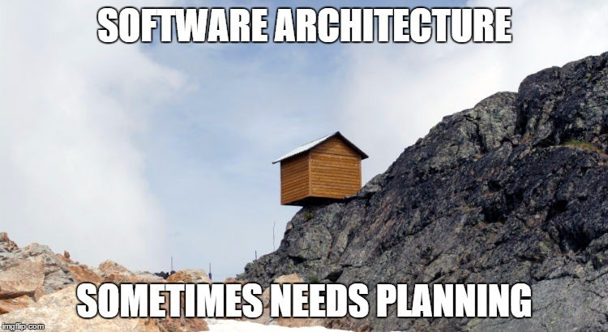

React는 라이브러리이다. 라이브러리와 프레임워크의 가장 큰 차이점은 자유도에 있다고 생각한다. 프레임워크는 여러 약속의 집합이라고 할 수 있다. React를 사용하다보면 수많은 의사 결정을 마주하게 되는데 이러한 부분들을 약속으로 정해 프레임워크화하여 프로젝트에 적용한 작은 경험을 공유한다.



React Ecosystem에서의 best practice라고 했지만 이 글은 best practice를 찾아 떠나는 **여정**에 더 가까운 글이며 그 도착지가 정답이 아닐 수 있다. 또 6개월 후에는 아무 의미없는 글이 될 수도 있다. 그러나 고민의 과정은 이미 없지 않을 것 같아서 이렇게 기록한다.

[best_practice](./images/bestpractice.jpeg)

이 시리즈는 다음 version을 기반으로 작성되었다.

```json
{
  "react": "^16.8.6",
  "react-dom": "^16.8.6",
  "react-i18next": "^10.11.4",
  "react-redux": "^7.1.0",
  "react-router-dom": "^5.0.1",
  "react-scripts": "3.0.1",
  "react-transition-group": "^4.2.1",
  "redux": "^4.0.4",
  "redux-actions": "^2.6.5",
  "redux-saga": "^1.0.5",
  "ts-optchain": "^0.1.7",
  "typescript": "^3.5.3"
}
```

## Table of Contents

### [1. Development Environment](https://jbee.io/react/[react]-1.-development-environment-setup/)

- CRA?
- TypeScript
- 사소한 부분 미리 챙겨두기
- 프로젝트 세팅
- 마무리

### [2. Redux Architecture](https://jbee.io/react/[react]-2.-redux-architecture/)

- 고민 1. Context API + Hooks API
- 고민 2. action, reducer 관리 - module pattern
- 고민 3. Server Response 관리
- 고민 4. 올바른 reducer의 단위는 무엇인가?
- 결과물
- 마무리

### 3. [WIP] React Architecture

- 고민 1. Functional vs Class
- 고민 2. Hooks API 사용
- 고민 3. Container and Dumb?
- 고민 4. Cross Cutting Concern
- 결과물
- 마무리

### 4. [WIP] Directory Structure

### 5. [WIP] 리액트 애플리케이션에서 중요한 횡단 관심사들

## Not tutorial

시리즈로 작성되는 이 글은 튜토리얼이 아닙니다. 프로젝트를 구성하면서 제가 했던 고민들을 거의 의식의 흐름대로 정리한 글입니다. 저와 비슷한 고민을 하시는 분들에게 조금이나마 도움이 되면 의미있는 글이 될 것 같습니다!