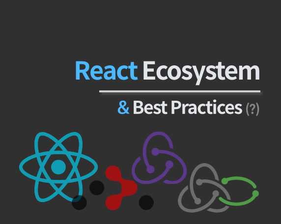

> Scaffolding 도구를 사용할 것인가, 하얀 도화지부터 시작할 것인가

Webpack 설정부터 한땀 한땀 할 수 있다. 관련 자료도 많아졌고 Webpack도 zero config를 '지향'하면서 많은 부분이 default config로 들어가게 되며 진입 장벽이 낮아졌다. 그럼에도 불구하고 CRA(create-react-app)를 사용하여 많은 부분을 이득볼 수 있다.

## 👉 [CRA](<[https://github.com/facebook/create-react-app](https://github.com/facebook/create-react-app)>)

필요한 (거의) 모든 webpack plugin과 loader를 설정해주며 lint rule도 잡아준다. TypeScript까지 정식으로 지원하니 사용하지 않을 이유가 없다. 한 가지 추가해줬던 것은 prettier 관련 설정과 husky 그리고 phase 관련 설정이었다.

### Override Config

물론 이득보는게 있으면 손해보는 것도 있다. 분명 내부에 감춰져있는 설정을 수정해야 하는 경우가 생긴다. 이럴 때 eject를 하거나 여러 override도구들을 사용할 수 있다. 특정 도구를 또 하나 도입해야 한다는 부담감이 있지만 eject 하는 것보다 나은 선택이라고 생각한다.

#### Tools

- [customize-cra](https://github.com/arackaf/customize-cra)
- [craco](https://github.com/sharegate/craco)

이번 프로젝트에서 `craco`라는 CRA override 도구를 사용하여 babel plugin을 추가하거나 Webpack plugin들을 추가했다. 생각보다 간단한 코드로 작성할 수 있다.

```js{7,8}
module.exports = () => {
  return {
    babel: {
      plugins: ['date-fns'],
    },
    webpack: {
      alias: {
        '@': resolve('src'),
      },
      plugins: [
        ...whenDev(() => [new BundleAnalyzerPlugin()], []),
        ...whenProd(
          () => [
            new CompressionWebpackPlugin({
              test: [
                /\.js(\?.*)?$/i,
                /\.css(\?.*)?$/i,
                /\.(png|jpe?g|gif|svg|ico)(\?.*)?$/i,
              ],
            }),
          ],
          []
        ),
      ],
    },
  }
}
```

이번 프로젝트에서는 사용하지 않았지만 craco 자체에서 여러 [craco plugin들](https://github.com/sharegate/craco/tree/master/recipes)을 제공한다.

개발 환경 구축 중 여러 삽질을 했었는데 그 중 하나는 TypeScript 환경에서 absolute path 관련 config를 적용하는 부분이었다. 위 `craco.config.js` 파일에서 7번째에 해당하는 부분이다. 이 부분은 삽질을 너무 많이해서 따로 정리를 해둔 [이슈](https://github.com/JaeYeopHan/tip-archive/issues/60)도 있다. Jest와도 엮이면 문제가 더 골치아파진다.

### 후회없는 선택 CRA,

CRA를 사용하든 사용하지 않든 개발 환경 구축과 관련된 문제는 반드시 만나게 된다. CRA를 쓰면 그 문제의 수를 줄일 수 있다고 생각한다. 또한 프로젝트가 장기적으로 진행될 경우, 여러 dependency들의 version을 따라가는 것을 생각하면 정말... (CRA를 사용할 때마다 느끼는 거지만 [vue-cli](https://github.com/vuejs/vue-cli)는 참 잘 만들었다.)

## 👉 TypeScript

이미 많은 회사, 많은 프로젝트에서 사용되고 있기 때문에 길게 작성할 필요가 없을 것 같다. 1년 전, [달달한 제안, TypeScript](https://jbee.io/typescript/you_might_need_typescript/)라는 글을 썼는데, 이 부분에 대한 의견은 딱히 변함이 없다.

### 수많은 변경이 발생할 때 빛을 발하는 TypeScript

프로젝트 초기에 API 응답 포맷이 변경되거나 요구사항이 변경되는 경우가 많았는데, TypeScript의 Type Definition을 수정해준 후, compile error가 변경되는 부분을 잡아주면 변경된 요구 사항을 빠르게 반영할 수 있다. (에러만 발생시키는 것이 이렇게 안정감을 줄 수 있다니.🤔)

## 👉 사소한 부분 미리 챙겨두기

정말 사소한 것들이지만 눈에 거슬릴 수 있는 것들을 정리해두면 불필요한 코드 리뷰로 낭비되는 시간을 절약할 수 있다. 대부분 코딩 컨벤션에 대한 것인데 이러한 부분들을 미리 미리 정해두면 나중에 코드 전체에 대하여 수정하는 작업을 줄일 수 있다. 텍스트로 정리하기 보다는 eslint와 prettier를 사용하면 자동화 시킬 수 있는 부분이기도 하다. prettier 설정과 husky 설정은 [이 글](https://jbee.io/web/formatting-code-automatically/)을 참고하면 된다.

### Convention

- return 전에는 개행을 해주세요!
- absolute path를 적용해주세요!
- 불필요한 삼항 연사자는 제거해주세요!
- early return을 적용하여 indent depth를 줄여주세요!

### Naming

- event handler naming은 어떻게 할까요?
- `interface` naming은 어떻게 할까요?
- `props` naming은 어떻게 할까요?
- File naming은 어떻게 할까요?

### Configuration Management

- Pull Request merge Rules
- `.github/PULL_REQUEST_TEMPLATE.md` & `.github/ISSUE_TEMPLATE.md`
- Commit Message Rules (or Convention)
- Branch Strategy

### Util Library

- undefined, null 처리는 어떻게 할까요?

위 Convention에 대한 내용들을 lint rule에 추가하여 불필요한 코드 리뷰가 진행되지 않았고 서로의 시간을 절약할 수 있었다. 이번 프로젝트에서 적용한 eslint setting은 다음과 같다.

```json
{
  "extends": ["react-app", "prettier"],
  "plugins": ["react-hooks", "simple-import-sort"],
  "rules": {
    "react-hooks/rules-of-hooks": "error",
    "padding-line-between-statements": [
      "error",
      { "blankLine": "always", "prev": "*", "next": "return" }
    ],
    "max-depth": ["error", { "max": 3 }],
    "no-unneeded-ternary": ["error", { "defaultAssignment": false }],
    "simple-import-sort/sort": "error",
    "sort-imports": "off",
    "import/order": "off"
  }
}
```

참고로 tslint는 deprecated 예정이기 때문에 TypeScript 기반의 프로젝트에도 eslint로 lint를 잡아줬다.

## 👉 프로젝트 세팅

개발 환경 구축은 프로젝트 구축의 일부분이다. 이 외에도 챙겨야 하는 부분이 많다. 개발적인 요소 뿐만 아니라 일정과 같은 비 개발적인 요소도 전부 포함된다.

- 스크럼은 어떻게 진행할 것인지
- 일정 관리, 진척률 관리, 리스크 관리는 어떻게 진행할 것인지
- 배포는 어떻게 진행할 것인지
- 테스트 환경은 어떻게 진행할 것인지
- phase는 어떻게 가져갈 것인지
- 변경 관리는 어떻게 진행할 것인지

## 1편 마무리,

처음부터 완벽하게 세팅을 하고 프로젝트를 진행했으면 더 좋았겠지만 진행하면서 필요성을 느낀 부분을 하나씩 하나씩 추가했다.

Next: [2. Redux Architecture](https://jbee.io/react/[react]-2.-redux-architecture/)
Intro: [0. 들어가면서](https://jbee.io/react/[react]-0.-intro/)
