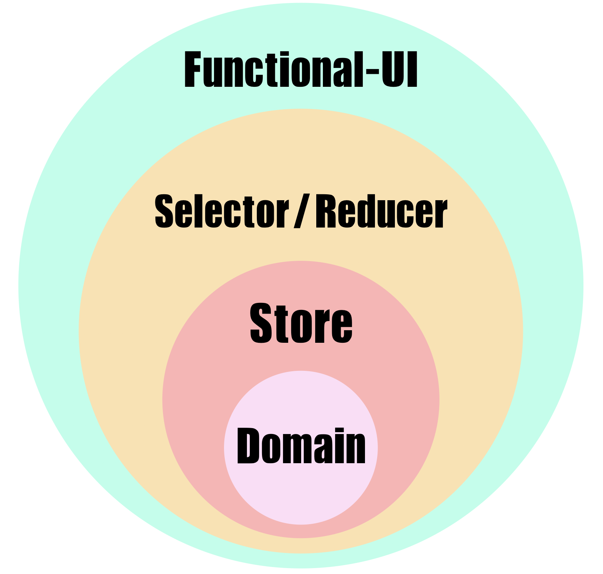

> 상태 관리, 어떻게 할 것인가?

상태 관리를 위한 선택지는 많다. 심지어 고르지 않는 선택지도 있다. 선택만 하면 절반은 다 된 것이다. 애플리케이션의 규모가 크다 보니 상태 관리를 보조하는 라이브러리가 필요했고 이번 프로젝트에서는 [Redux](https://github.com/reduxjs/redux)를 선택했다.

## 👉 고민 1. Context API와 Hooks API를 조합

이 부분을 가장 우선적으로 검토했다. [Do React Hooks Replace Redux?](https://medium.com/javascript-scene/do-react-hooks-replace-redux-210bab340672) 라는 글도 있고 [Replacing redux with react hooks and context (part 1)](https://medium.com/octopus-labs-london/replacing-redux-with-react-hooks-and-context-part-1-11b72ffdb533) 라는 글도 있다. React Hooks가 나온 시점부터 많은 사람들이 관심을 가졌던 주제이다.

[간단한 프로토타입](<[https://github.com/JaeYeopHan/react-plate](https://github.com/JaeYeopHan/react-plate)>)을 만들어 ROI를 검증하기도 했다. 결론부터 말하자면 **No**. (위 소개한 두 글 중에는 전자의 의견을 따랐다. [@Eric Elliott](https://twitter.com/_ericelliott)
)

### 굳이?

Context API와 Hooks API의 조합을 사용하지 않고 Redux를 사용한 이유는 **'굳이'**였다. 직접 프로토타입을 만들고 실제 코드를 작성하다보니 redux 비슷한 것을 만들고 있었다. 다음은 Context API와 Hooks API로 만든 store의 일부 코드이다.

```ts
const GlobalContext = createContext(defaultValue)

export const GlobalProvider = ({ children }: { children: React.ReactNode }) => {
  const [state, dispatch] = useReducer(reducer, globalState)
  const value = useMemo(() => [state, dispatch], [state])

  return (
    <GlobalContext.Provider value={value}>{children}</GlobalContext.Provider>
  )
}
```

전역 Provider에서 Context를 관리하는 방식으로 구성을 해봤다. 이게 하나 둘 작성할 때는 redux라는 dependency가 하나 줄어드니 좋아보였다가 계속 작업이 길어지면서...

> 이럴거면 그냥 redux를 쓰는게 낫지 않나 🤔

라는 회의에 이르렀다. 그냥 편하게 Context API와 직접 통신할 수 있었지만 각 함수들을 성격에 맞게 분리를 하다보니 어느새 action, reducer가 만들어지고 결국 redux 구조를 만들고 있었던 것이다.

그래서 내린 결론은 redux를 쓰면서 hooks를 사용하기로 하였다.

### Async

결국 비동기 action을 처리해야 하는 경우가 올텐데, 그 부분을 우아하게 다루기 힘들었다. 자체적으로 만든 상태 관리 시스템에서 미들웨어를 만들어줘야 했는데, [redux-saga](https://github.com/redux-saga/redux-saga), [redux-thunk](https://github.com/reduxjs/redux-thunk) 등이 이미 존재하는데 내가 왜 만들어야 하나 하는 생각이 들었다.

### initial fetch

결정적으로 컴포넌트가 rendering 되기 전, 또는 공통적으로 초기 호출에 필요한 api fetching 로직을 어디에 둬야할지 애매해졌다. 결국 redux-saga와 같은 미들웨어가 필요한 것이었지만 이 부분은 크리티컬했다.

## 👉 고민 2. action, reducer 관리

Redux를 사용하다보면 action을 정의하고 생성하는 작업에 지칠 수 있다. 이 부분을 최대한 덜어보고자 했다. 우선 module pattern(or [duck pattern](https://github.com/erikras/ducks-modular-redux))을 사용하기로 했다. 간단히 소개하자면 action type과 action과 reducer 들이 한 파일에 뭉쳐있는 구조를 말한다.

### Util library 도입

#### redux-actions

그리고 action들을 깔끔하게 관리하기 위해 [redux-actions](<[https://github.com/redux-utilities/redux-actions](https://github.com/redux-utilities/redux-actions)>)라는 라이브러리를 사용했고 TypeScript를 사용할 때 유용한 [typesafe-actions](<[https://github.com/piotrwitek/typesafe-actions](https://github.com/piotrwitek/typesafe-actions)>) 를 보조적으로 사용했다.

아래와 같이 `CounterModule.ts`를 작성할 수 있다.

```ts
import { createAction, handleActions } from 'redux-actions'

const initialState = {
  count: 0,
}

const COUNTER = 'counter'

const INCREASE = `${COUNTER}/INCREASE`
const DECREASE = `${COUNTER}/DECREASE`

const reducer = {
  [INCREASE]: state => ({
    ...state,
    count: state.count + 1,
  }),
  [DECREASE]: state => ({
    ...state,
    count: state.count - 1,
  }),
}

export const counterActions = {
  increase: createAction(INCREASE)
  decrease: createAction(DECREASE)
}

export const counterReducer = handleActions(reducer, initialState)
```

이미 많이 사용하고 있을 라이브러리겠지만 보다시피 코드양을 많이 줄일 수 있었다.

#### react-redux

[react-redux 7.1.0 version](https://github.com/reduxjs/react-redux/releases/tag/v7.1.0)부터 hooks API 지원을 시작했다. 대표적인 API는 다음 두 가지이다.

- [useDispatch](https://react-redux.js.org/api/hooks#usedispatch)
- [useSelector](https://react-redux.js.org/api/hooks#useselector)

기존 container라고 불리우던 react component에서 사용하고 있던 `connect`, `mapDispatchToProps`, `mapStateToProps` API들을 사용할 이유가 없었다. 다음 편에서 이야기 할 React Architecture 부분에서도 다루겠지만 모든 컴포넌트를 functional component로 작성하고 hooks API를 적극적으로 사용할 계획이었기 때문에 redux에서도 `useDispatch`와 `useSelector` API를 적극 사용하기로 하였다.

위에서 정의했던 CounterModule을 컴포넌트에서 사용하면 다음과 같이 간단하게 작성할 수 있다.

```tsx
export const TestComponent = () => {
  const dispatch = useDispatch()
  const { count } = useSelector(state => state[COUNTER])

  const handleClick = () => dispatch(counterActions.increase())

  return <div onClick={handleClick}>{count}</div>
}
```

### 자체 Util 제작 - loading reducer

하지만 아직도 중복으로 작성되는 코드가 많았다. 특히 api 통신이 이루어질 때 꼭 등장하게 되는 loading state 부분이 매번 중복되었다. 이를 해결하기 위해 별도 reducer로 빼내었고 loading에 관련된 state는 이 reducer에서 관리하도록 하였다. `loading.reducer.ts` 파일의 일부 코드이다.

```ts
export interface ILoadingState {
  [key: string]: boolean
}

export const startLoading = createAction(START_LOADING)
export const finishLoading = createAction(FINISH_LOADING)

export const reducer = {
  [START_LOADING]: (state: ILoadingState, action: Action<string>) => ({
    ...state,
    [action.payload]: true,
  }),
  [FINISH_LOADING]: (state: ILoadingState, action: Action<string>) => ({
    ...state,
    [action.payload]: false,
  }),
}

export const loadingReducer = handleActions(reducer, initialState)
```

어떠한 api call에 대한 Loading state를 제어할 것인지 `payload`에서 판단하고 이를 state로 저장하고 있다. 이렇게 loading에 대한 state를 하나의 reducer에서 관리할 경우, api 성공, 실패 reducer마다 loading 상태를 `true`, `false` 토글해줄 필요가 없다. api call 하기 전 `startLoading` 액션을 dispatch 하면 되고 api call이 끝난 후, `finishLoading` 액션을 dispatch 하면 된다.

### 자체 Util 제작 - redux-saga util

비동기 처리를 위한 redux middleware로 redux-saga를 선택했다. 이 saga 또한 중복 코드가 많이 발생할 수 있는 부분이다. `try-catch`로 감싸고, api를 `call`하고 yield 된 response를 `put`하는데, 이 부분이 계속 반복된다. action 또한 `FETCH`, `SUCCESS`, `FAILURE` 등의 action type이 반복된다. 이러한 부분을 util 함수로 extract하여 사용했다.

Action 생성을 위한 util 함수와 saga util 함수가 각각 만들어졌으며 아래는 util 함수 코드의 일부이다.

```ts
export function createFetchAction(type: string): IFetchActionGroup {
  const FETCH = `${type}/FETCH`
  const SUCCESS = `${type}/SUCCESS`
  const FAILURE = `${type}/FAILURE`

  return {
    TYPE: type,
    FETCH,
    SUCCESS,
    FAILURE,
    fetch: createAction(FETCH),
    success: createAction(SUCCESS),
    failure: createAction(FAILURE),
  }
}
```

`FETCH`, `SUCCESS`, `FAILURE`라는 action type과 `fetch`, `success`, `failure`라는 action을 생성해주는 함수이며 이를 기반으로 component에서 action을 dispatch하고 saga에서 api call과 비즈니스 로직을 구현한다.

```ts{5,8,10,12}
export function createSaga<P>(actions: IFetchActionGroup, req: any) {
  return function*(action: Action<P>) {
    const payload = oc(action).payload()

    yield put(startLoading(actions.TYPE))
    try {
      const res = yield call(req, payload)
      yield put(actions.success(res))
    } catch (e) {
      yield put(actions.failure(e))
    } finally {
      yield put(finishLoading(actions.TYPE))
    }
  }
}
```

아까 정의해둔 loading action을 통해서 api call의 pending 상태를 정의할 수 있고, `put`, `call` 등의 귀찮은 작업들을 이 util 함수로 해결할 수 있었다. 아래는 `createFetchAction`와 `createSaga`를 사용하는 코드이다.

```ts
export const testAsync = createFetchAction(🍋)

export const testSaga = [
  takeLatest(
    testAsync.FETCH,
    createSaga(testAsync, fetch🍋Api),
  ),
]
```

`fetchApi`라는 api function을 saga에서 처리하는 코드를 이렇게 간단하게 작성할 수 있다. 이에 따른 component에서 loading state 처리는 다음과 같이 간단하게 작성할 수 있다.

```tsx
export const TestComponent = () => {
  const loading = useSelector<IRootState, ILoadingState>(state => state.loading)

  if (loading[🍋]) {
    return <Loading />
  }
  return <Something />
}
```

🍋이라는 module type을 기반으로 🍋에서 다루고 있는 비동기 액션이 현재 어떤 상황인지 알 수 있다.

## 👉 고민 3. 서버에서 내려준 데이터를 어떻게 저장할 것인가?

- normalize를 할 것인가?
- 정제를 할 것인가?

결론부터 말하자면 정제하지 않은 채로 redux에서 관리했다.

### normalize

Normalize에 대한 설명인 [redux 공식문서](https://redux.js.org/recipes/structuring-reducers/normalizing-state-shape)의 설명으로 대신한다. 데이터의 성격에 따라 normalize가 필요했다면 적용했겠지만 단순 조회의 성격이 더 강한 데이터들이 대부분이었고 nested 때문에 불필요한 작업을 최소화하기로 하였다. 이 부분은 프로젝트의 성격, 데이터의 성격에 따라 달라지는 부분이라 필요한 부분이 생기면 적용할 예정이다.

### 정제

Swagger를 통해 공유받은 API 명세를 클라이언트에서 입맛에 맞게 수정하면 분명 View 단이 깔끔해질 수 있다. 또 API 레벨에서 필드명 또는 구조가 변경되었을 경우, 정제하는 부분만 수정해주면 되기 때문에 정제하는 것이 더 매력적으로 느껴졌다.

#### 그러나,

서버에서 내려준 A 값을 A라고 부르지 못한다. 프론트엔드와 백엔드의 간격이 점점 멀어지면 어떻게 해야하나 하는 걱정이 되었고 결국 정제하지 않는 것으로 결정했다.

### Selector의 활용

컴포넌트에서는 react-redux에서 제공하는 API인 `useSelector`를 이용하여 redux의 state에 접근한다. store에는 서버에서 전달해준 값을 그대로 가지고 있기 때문에 nested 한 값에 접근하려면 다음과 같이 진행된다.

```tsx
export const TestComponent = () => {
  // Bad
  const 📦 = useSelector<IRootState, I🍑>(state => state[TEST])
  const { 🍑 } = 📦.data.foo.bar
  // something...
}
```

또 nullable value에 대해 `Reference Error`를 확인하는 작업이 추가로 필요하다. (위 코드에서는 생략)

`null` 또는 `undefined` 값을 최대한 안전하게 확인하기 위해 [ts-optchain](https://github.com/rimeto/ts-optchain)이라는 라이브러리를 사용하여 default value를 처리할 수 있었다. [optional-chaining](https://github.com/tc39/proposal-optional-chaining)을 사용할까 고민을 했지만 lint rule 에서 아직 지원이 좋지 못하고 표준이 아닌 문법을 사용하는 것이 부담스러워서 외부 라이브러리를 도입했다.

`ts-optchain`은 type inference를 깨지 않는 상황에서 exception 처리가 이루어지고 default value를 설정할 수 있다.

```ts
export const testSelector = {
  🍑: (state: IRootState) =>
    oc(state[TEST]).📦.data.foo.bar.🍑(defaultValue)
}
```

위 컴포넌트의 `useSelector` 코드는 다음과 같이 변경할 수 있다.

```tsx
export const TestComponent = () => {
  const 🍑 = useSelector<IRootState, I🍑>(state => testSelector.🍑(state))
  // something...
}
```

이 Selector가 전혀 새로운 것이 아니라는 것은 react 프로젝트에서 [reselect](https://github.com/reduxjs/reselect)라는 라이브러리를 사용해본 사람이라면 알 것이다. reselect의 아이디어를 착안하였으며, memoize 로직은 `useSelector`에서 제공하는 [shallowEqual](https://react-redux.js.org/next/api/hooks#equality-comparisons-and-updates) function을 사용하거나 dependency list를 사용하였다.

reselect util library는 추후 성능에 문제가 발생하는 지점에서 개선이 필요하거나 말 그대로 re-select 하는 condition이 복잡해질 경우, 도입하기로 하였다.

## 👉 고민 4. 올바른 reducer의 단위는 무엇인가?

module 단위로 store의 코드를 작성하다보니 몇 가지의 action과 그에 따른 reducer function만 작성해도 파일이 길어졌다.

### 화면 단위 🙅‍♂️ / 기능 단위 🙆‍♂️

데이터의 성격에 따라서 달라질 수 있겠지만 어떤 데이터는 여러 화면에서 공유하는 데이터 일 수도 있고 특정 화면에서만 사용하는 데이터일 수 있다. 이럴 경우, 화면 단위의 store module을 설계해두면 A라는 화면에서 B module에 접근할 때 애매해진다. 화면이 간단할 경우에는 문제없지만 화면이 복잡할 경우 하나의 module이 복잡해지는 문제가 발생했다.

Controller 기준으로 module을 분리하여 관리하고 있다.

#### local state

화면 단위가 아닌 기능 단위로 reducer를 구성하였을 때 장점은 하나 더 있다. local state를 우선 고려한다는 부분이다. 적절한 local state와 props를 통한 전달은 reducer가 비대해지는 것을 막아주었다. session storage에 저장하기 위한 값, 여러 화면에서 공유하는 화면 상태 값들만 reducer에서 별도로 관리를 진행하면서 balance를 맞출 수 있었다.

## 🤟 Results

서버로부터 데이터가 들어오고 이 데이터가 어떠한 Flow를 거쳐 화면에 노출되는지 다음과 같이 정리할 수 있게 되었다.

- Domain / API
- Store
- Selector / Reducer
- Functional UI



1. 서버로부터 데이터가 내려올 때, 정의한 api function과 interface, domain을 기반으로 하여 store에 데이터가 저장된다.
2. 전역에서 관리해야 하는 state는 reducer를 통해 변경된다.
3. 컴포넌트에서 store에 있는 데이터에 접근할 때는 selector를 통해 접근한다.
4. functional component에서는 JSX 문법으로 작성된 view를 render한다.
5. Event handler에서는 action을 dispatch한다.
6. 화면에 그릴 데이터는 store의 state를 select하여 가져온다.

### 마무리

화면 단의 설명은 다음 react-architecture 부분에서 다룰 예정이다. functional-UI(view) level에서 비즈니스 로직을 최대한 제거한 내용, Container, Presentational의 구분없이 코드를 작성한 내용 등을 다룰 예정이다.
