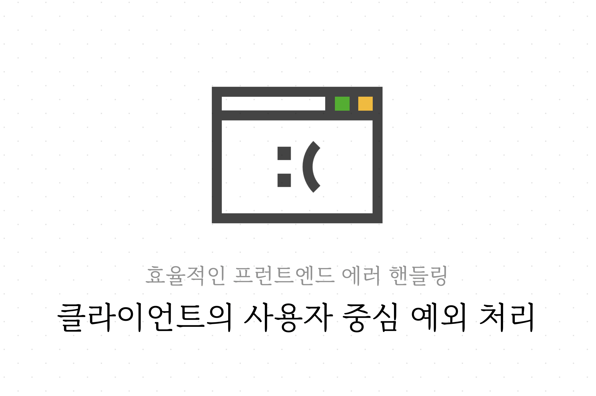
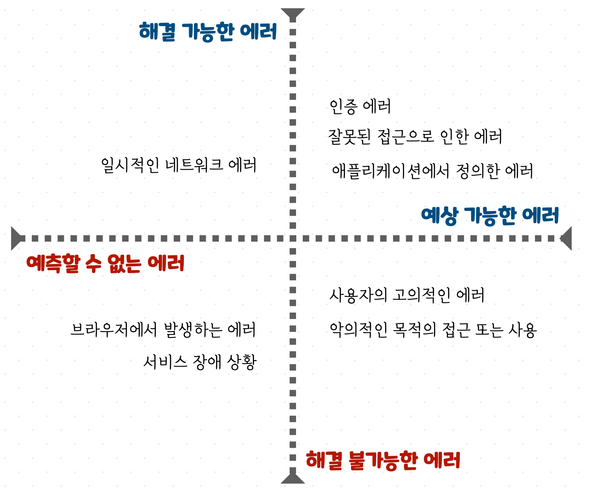
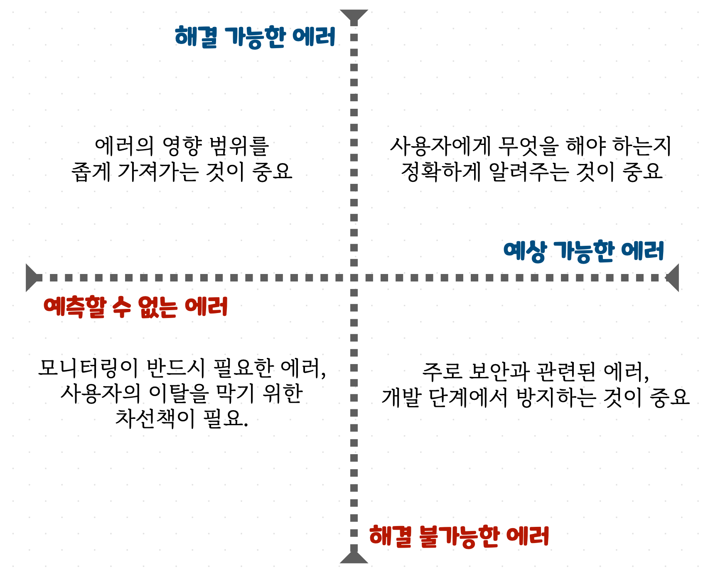

1편에서는 React 애플리케이션에서 비동기를 선언적으로 다룰 수 있는 컴포넌트를 만들어봤습니다. 이번 포스팅에서는 다뤄야 하는 '에러'에 대해 살펴봅니다. 에러를 환경에 따라 성격을 분석해보고 사용자 중심으로 분류해봅니다. 그리고 각각의 에러 특징을 파악해 무엇을 고려해야 하는지 분석합니다.

### Table of Contents

- 에러는 어떤 종류들이 존재할까
- 에러를 어떻게 대응할 수 있을까
- 현실 속의 에러

# 에러는 어떤 종류들이 존재할까

지피지기 백전불태, 에러를 잘 처리하려면 어떤 에러들이 존재하는지 에러에 대해 잘 알아야 한다. 먼저 마주칠 수 있는 에러들을 분류를 해보자.

## 환경과 에러

웹 클라이언트 환경에서 에러가 발생한다면 어떤 상황에서 발생할까? **어떤 종류의 에러**가 발생할까?

- 네트워크 에러
- 서버 API로부터 받는 에러
- 사용자 브라우저 환경 에러
- ...

여러 가지 에러를 만날 수 있다. 하지만 이 에러들은 일단 두 가지로 분류할 수 있다.

1. 언제 어떻게 발생할 지 알고 있는, 예상 가능한 에러 (**Expected Error**)
2. 언제 어떻게 발생할 지 알지 못하는, 예측할 수 없는 에러 (**Unexpected Error**)

예시로 살펴본 에러를 이 분류로 나눠보자.

### 예상 가능한 에러

서버 API로부터 전달받는 에러 중 status 코드가 명확한 에러인 경우는 사전에 미리 알고 대응이 가능한 에러로 볼 수 있다. 권한이 없는 에러(401), 잘못된 접근의 에러(403)는 상황에 맞게 에러를 처리할 수 있다. 각 status code마다 좀 더 세부적인 Error Code를 정의하여 애플리케이션의 로직을 error로 처리하는 경우도 많다. 이런 에러를 **예상 가능한 에러(Expected Error)**라고 할 수 있다.

### 예측할 수 없는 에러

하지만 서버 API로부터 전달받는 에러 중 500대 에러는 예측할 수 없는 에러로 분류한다. (어떤 이유로든) 서버에서 응답을 줄 수 없는 상황은 언제든 발생할 수 있기 때문이다. 그리고 사용자의 네트워크 환경에 따라 발생할 수 있는 에러, 사용자의 브라우저 환경에서 발생할 수 있는 에러는 예측하기 어렵기 때문에 **예측할 수 없는 에러(Unexpected Error)**로 분류할 수 있다.

> 언제 어떻게 발생할 지 예상 가능한가, 불가능한가?

## 시용자와 에러

에러를 환경 말고 **사용자와의 상호 작용**으로도 분류할 수 있다. 에러를 마주한 사용자가 **할 수 있는 것이 있는가?**라는 기준으로 에러를 분류해보면 다음과 같은 기준을 세울 수 있다.

1. 사용자가 **에러 상황을 이해**해서 애플리케이션을 계속 사용할 수 있도록 **도와줄 수 있는** 에러
2. 사용자에게 상황을 말해줘도 사용자에게 **아무런 도움이 되지 않는** 에러

### 해결 가능한 에러

예를 들면 인증 또는 권한에 대한 에러가 될 수 있다. 로그인이 되지 않은 사용자에겐 401 status에 해당하는 에러를 마주하게 될 텐데, 이럴 경우 로그인을 할 수 있도록 로그인 화면을 보여주거나 로그인이 필요하다는 메세지를 보여줄 수 있다.

특정 화면에 대해 접근 권한이 없는 경우에도 관리자에게 권한을 요청하도록 가이드를 줄 수 있다.

사용자의 이탈을 반가워 하는 제품 개발자는 없다. 에러를 만난 사용자에게 에러 상황을 극복해나갈 가이드를 제시해야 한다. 예를 들면 일시적인 네트워크 에러를 해결하기 위한 새로고침을 위한 버튼이라던가, 존재하지 않는 화면으로 접근했을 때, 이전 화면으로 다시 돌아갈 수 있는 버튼을 제시해야 하는 것이다.

### 해결 불가능한 에러

하지만 사용자에게 어떤 에러 상황인지를 말해줘도 아무런 도움이 안 되는 경우가 있다. 저사양 기기 또는 브라우저에서 동작하지 않는 코드가 포함되어 있을 경우, 에러가 발생할 수 있을텐데, 이 경우 사용자는 할 수 있는 것이 없다. (다른 브라우저를 사용하라는 메세지...?)

1번과 2번의 경우 모두 메세지를 담고 있다. 다만 1번의 경우에는 사용자에게 액션을 유도하는 무언가가 함께 존재한다.

> 마주한 에러가 사용자 스스로 해결 가능한가, 불가능한가?

## 분류

지금까지 나온 에러를 앞에서 이야기해본 기준으로 정리해보면 다음과 같이 분류할 수 있다.

# 에러를 어떻게 대응할 수 있을까

그렇다면 발생한 에러는 어떻게 처리해야할까? 에러가 발생한 상황에서 애플리케이션은 사용자에게 어떤 인터페이스를 제공해야할까? 특징에 따라 분류한 에러를 어떻게 대응할 수 있을지 살펴보자.

## 예상할 수 없지만 해결 방법이 있는 에러

대표적인 경우가 네트워크 에러이다. 사용자가 애플리케이션을 사용하고 있는 네트워크 환경에 따라 언제든지 발생할 수 있기 때문이다. 가장 쉬운 해결책은 사용자에게 '일시적인 에러'임을 말해주고 바로 이전 액션을 다시 시도할 수 있는 가이드를 제공해주는 것이다.

### 에러의 영향 범위가 중요한 에러

이 에러의 경우엔 에러가 발생했을 때, 애플리케이션 전반에 영향을 끼치지 않도록 신경써줘야 한다. 한 화면에서 10개의 API를 호출해야 하는 경우가 있다고 가정해보자. 그 중 하나만 실패하더라도 애플리케이션 전체에 에러 메세지를 띄우고 다시 호출해야 할 필요는 없다.

실패한 영역에 대해서만 회복 가능하도록 처리가 필요한 에러이다.

## 예상할 수도 없고 해결 방법도 없는 에러

놓치기 쉽지만 반드시 신경써줘야 하는 에러이다. 개발 단계에서 최대한 발생하지 않도록 해야 하는 에러이며 발생했을 경우에 대한 별도 처리가 필요하다. 사용자가 스스로 해결해나갈 수 없는 에러이기 때문에 고객센터로 쉽게 문의할 수 있는 진입 경로를 열어줄 수도 있다.

### 모니터링이 중요한 에러

개발자의 제어권 밖에 있는 에러이기 때문에 Sentry 와 같은 도구를 사용하여 모니터링을 하고 사용자가 해당 화면을 마주할 일이 없도록 수정해야 한다. 마주하게 됐을 때 다시 애플리케이션으로 돌아올 수 있는 장치가 함께 준비되어야 한다.

## 예상 가능하지만 해결 방법이 없는 에러

상식적으로 생각을 해보면 이런 에러는 존재할 수 없다. 이미 알고 있는 에러이지만 사용자가 스스로 해결할 수 있는 방법이 없다면 놓친 에러가 존재하는 것이다. 다만 사용자가 스스로 해결하고자 하는 의지가 없을 수 있는데, 이런 경우 마주할 수 있다.

### 보안과 관련된 에러

악의적인 목적을 가지고 애플리케이션에 접근했을 때 해당 에러를 마주하게 된다. 이런 에러들은 주로 보안 취약점에서 발생할 수 있으며 개발 단계에서 방지할 수 있다. CORS, XSS 등 기본적인 부분을 고려하여 개발하고 보안팀과 협력하여 안전한 애플리케이션을 만드는 것이 중요한 에러이다.

## 예상 가능하며 해결 방법이 있는 에러

이 에러는 대부분 비즈니스 로직의 일부로 개발자가 이미 알고 있는 에러들이 속한다.

- 로그인이 필요한 401 Unauthorized Error
- 잘못된 페이지로 접근한 404 Not Found Error
- 그 외 비즈니스 로직으로 정의한 에러들

이런 경우엔 애플리케이션 안에서 적절한 가이드를 주거나 별도 페이지를 만들어 안내한다.

### 가이드가 중요한 에러

사용자는 에러 메세지를 보고 다음 무엇을 해야 하는지 명확히 알 수 있어야 한다. 그래야 그만큼 에러 발생 횟수도 적어지고 이탈을 막을 수 있다. 즉 에러 메세지와 함께 사용자의 액션을 유도하는 무엇(Call To Action)도 필요한 것이다.

field validate 에러였다면 에러가 발생한 field에 focus를 해준다던가 잘못 접근한 페이지라면 이전 화면으로 돌아갈 수 있는 뒤로가기 버튼을 노출해주는 것이다.

## 정리

아까 분류했던 기준으로 다시 정리해보면 다음과 같다. 대응은 1:1 분류가 되진 않는다. 예측할 수 없는 에러는 전부 모니터링이 필요하다. 해결 가능한 에러는 사용자에게 적절한 가이드를 주는 것이 중요하다. 그리고 모든 에러는 애플리케이션 전체에 영향을 줘서는 안 된다.

# 현실 속의 에러

발생할 수 있는 에러에 대해 정리해봤다. 그러나 현실 속의 에러는 위 분류 중 딱 하나의 분류로 발생하지 않는다. 해결 방법이 존재하는 에러지만 예상 가능한 에러일 수도 있고 예상치 못한 에러일 수도 있다. 분류한 기준으로 에러를 바라봤을 때, 예상치 못한 에러는 언제 어디서든 항상 발생할 수 있다.

그렇기 때문에 각각을 판단할 기준과 함께, 에러를 대응할 수 있는 도구 또는 '무언가'가 필요하다.

## 에러 다루기

여러 상황을 동시에 대응하기 위해선 몇 가지 준비가 필요하다.

### 1. 예상 가능한 에러와 예상할 수 없는 에러를 판단할 기준

예상 가능한 에러는 프로그래밍 적으로 사용자에게 가이드를 하고 예상치 못한 에러는 모니터링을 위한 로그를 심어야 한다. 다른 대응을 하기 위해선 이를 판단할 기준이 필요하다.

HTTP Status를 기준으로 처리되는 에러에는 이것이 합의된 에러라서, 이미 알고 있는 에러인지에 대한 flag 값으로 구분할 수 있겠다.

### 2. 에러 전파를 막기 위한 장치

일부분의 에러가 애플리케이션 전반에 영향을 미치면 안 된다. 한 화면에서 10개의 API 호출 중 하나만 에러가 발생했는데 애플리케이션 전체가 에러 화면을 보이면 사용자 경험을 크게 해치기 때문이다. 자연스럽게 사용자의 이탈도 많아지기 때문에 에러는 최대한 작은 범위에서 catch되어야 한다.

### 3. 에러 모니터링을 위한 도구

위에서 이야기한 것처럼 예상치 못한 에러는 모니터링이 필요하다. 예상치 못한 에러는 로깅을 해서 어떤 경로로 발생했는지 추적할 수 있게 해야 한다. 대표적인 예로 Sentry라는 도구도 있고 경로 추적을 위한 Source Map도 업로드도 가능하여 디버깅에 용이하다.

### 시도해볼만한 것

직접 해보진 않았지만 사용자 경험을 위해 시도해볼만한 것들을 정리해봤다.

#### 사전에 알려줄 수도 있는 에러

네트워크 상태를 미리 파악하고 사용자에게 미리 경고를 해주는 것도 에러를 사전에 방지하기 위한 방법 중 하나가 될 수 있다. 웹 브라우저에도 해당 스펙이 존재한다. [window.navigator.connection](https://developer.mozilla.org/ko/docs/Web/API/Navigator/connection)라는 것이 있는데 물론 브라우저 지원은 형편없는 수준이다. 일부 디바이스에서 빠르게 테스트해보려면 [GoogleChromeLabs/react-adaptive-hooks](https://github.com/GoogleChromeLabs/react-adaptive-hooks#network)를 사용하여 네트워크 상태가 좋지 않은 경우, 응답이 지연될 수 있다는 메세지를 노출시켜봐도 좋을 것 같다.

## 마무리

다음 포스팅에서는 상황에 따라 분류한 에러들을 앞서 살펴본 [AsyncBoundary](/react/error-declarative-handling-1/#asyncboundary)를 사용하여 어떻게 다룰지 살펴본다.

|       |                                                 |
| :---: | :---------------------------------------------: |
| Next  |     3. 선언적으로 에러 상황 제어하기 (WIP)      |
| Intro | [0. Intro](/react/error-declarative-handling-0) |
