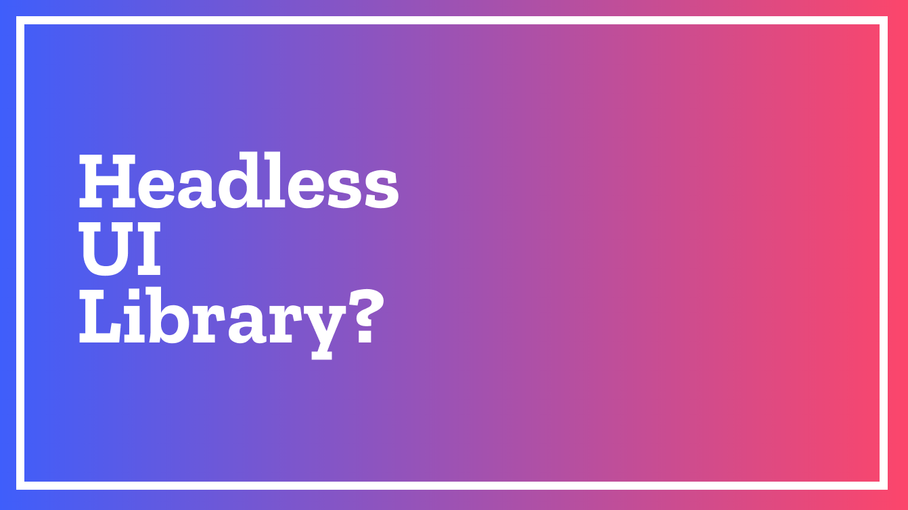
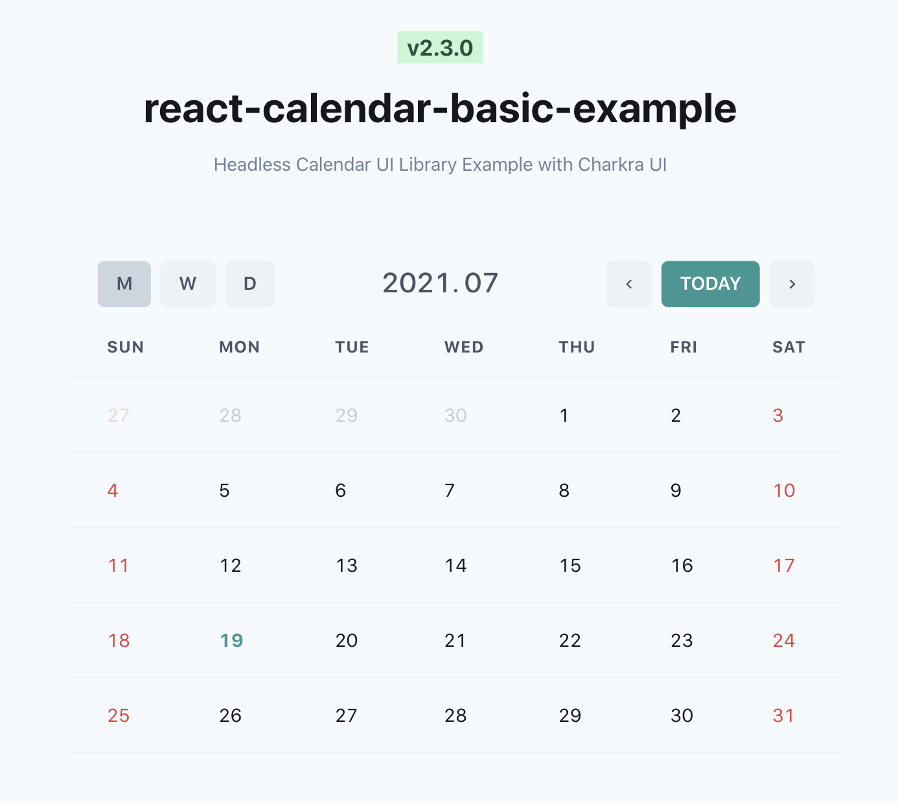

### Table of Contents

- Intro
- 컴포넌트
- Headless

## TL;DR

- UI를 컴포넌트로 만들기 전에 다음 세 가지를 먼저 고민하자.
  - UI가 내포하고 있는 **상태**는 무엇인지
  - 상태를 관리하기 위한 적절한 **자료구조**는 무엇인지
  - 컴포넌트를 사용하는 **인터페이스**는 어떻게 노출할 것인지

# Intro



<div align="right">
  <sup><a>https://github.com/veccu/react-calendar</a></sup>
</div>

달력은 꽤 흔하게 볼 수 있는 사용자 인터페이스다. 담당하고 있는 제품에 달력을 만들어야 한다면 보통 처음부터 만들기 전에 사용하기 좋은 라이브러리가 있는지 살펴보곤 한다.

그러나 기존의 제품에 바로 적용할 수 있는 라이브러리는 매우 한정적이다. 필요한 기능을 모두 가지고 있는 라이브러리도 찾기 힘들지만, 더욱 중요한 것은 **'스타일'**이다. 대부분의 제품은 고유한 디자인이 있을 것이고 이 디자인에 잘 스며들 수 있어야 하는데 이를 위해선 스타일을 반드시 재정의해줘야 한다. 즉, 찾고자 하는 기능 외에도 스타일을 재정의하기 편한가?라는 부수적인 것을 고려하게 된다.

UI 라이브러리들을 둘러보면 '스타일'이 포함되어있는 경우가 많아 바로 사용하기 곤란한 경우가 많다. 이런 귀찮은 문제를 잘 해결할 수 없을까?

## 컴포넌트에 대한 이야기

먼저 React 공식 문서에도 존재하는 아주 흔한 Counter 예제를 살펴보자.

```tsx
import React, { useState } from 'react'

function Counter() {
  const [count, setCount] = useState(0)

  return (
    <Container>
      <Message>You clicked {count} times</Message>
      <Button onClick={() => setCount(count + 1)}>Click me</Button>
    </Container>
  )
}
const Container = styled.div`
  /* styles */
`
const Message = styled.div`
  /* styles */
`
const Button = styled.div`
  /* styles */
`
```

이제 이 `Counter`라는 컴포넌트를 여러 제품에서 가져다 쓴다고 가정해보자. 어떤 제품에서는 `Container`의 스타일을 조정해야하고 어떤 제품에서는 `Message`를 다르게 보여줘야 하고 어떤 제품에서는 `Button`의 스타일을 다르게 줘야 한다. 즉 여러 제품에서 각각의 고유한 디자인을 재정의 할 필요가 발생한 것이다.

물론 위와 같은 간단한 예제를 이 정도로 재사용할 필요는 없다. 오히려 `count + 1`하는 부분을 Custom hooks로 정의하는 것이 더 합리적인 코드가 되지 않을까?

## Customize의 어려움

Intro에서 다뤘던 달력 라이브러리들을 살펴보자. 달력 정도면 좀 더 복잡하고 충분히 재사용할만한 로직이라고 생각한다. 꽤 많이 사용되고 있는 [fullcalendar](https://fullcalendar.io/)를 살펴보면 달력의 모든 스타일을 내부 라이브러리가 가지고 있다. 그리고 이 스타일을 재정의 할 수 있도록 [CSS Customization](https://fullcalendar.io/docs/css-customization)이라는 문서를 별도로 제공하고 있다. 문서 중 [More Advanced]라는 섹션에서 이 내용을 다루고 있는데, 스타일 재정의를 쉽게 할 수 있도록 하는게 기본이 아닐까 생각이 든다.

CSS의 축복인지 대부분의 스타일 재정의는 CSS Override로 쉽게 제어가 가능하다. 그러나 이것에는 몇 가지 단점이 존재한다.

1. 오버라이드한 class가 다른 class로 변경되면 override한 스타일이 제대로 동작하지 않는다.
2. 오버라이드한 스타일이 내부적으로 override 할 수 없게 되는 케이스가 발생한다. (우선순위 이슈)
3. CSS in JS 방식으로 애플리케이션을 스타일링 하고 있다면 postcss라도 설치해서 css를 별도로 컴파일해줘야 한다.
4. 리소스는 한정적인데, 처음부터 만든느 것 보다 손이 많이 가는 작업이다.
5. 위와 같은 이슈로 관리가 안 된다.

사용하고 있는 라이브러리에 적용된 class(또는 다른 selector들)를 알아내서 이를 재정의하는 것은 너무 귀찮고 번거로운 일이다. 때려치고 새로 만들기엔 달력의 로직을 처음부터 작성하기 괴롭기 때문에 차악으로 스타일을 재정의할 수 밖에 없는 현실이 안타깝기만 하다.

# Headless

당연하게도 어떤 상태를 가지고 있는 컴포넌트는 이 상태를 제어하는 부분과 스타일을 제어하는 부분을 나눌 수 있다. Headless라는 개념은 스타일링을 담당하게 되는 부분을 과감하게 제외하고 상태와 관련된 부분만을 다루자고 이야기한다.

## 스타일 정의에 대한 역할 위임

UI의 룩앤필(Look & Feel)은 생각 이상으로 중요하다. UX를 고려한 화면 설계는 이젠 너무나도 당연하게 됐다. 독자적인 스타일을 가지고 있는 여러 서드파티(Third-party)들이 스타일 재정의 없이 한 제품에 사용되는 순간 제품의 완성도가 떨어지게 된다.

스타일은 라이브러리를 사용하는 개발자에게 위임하고 자신은 상태와 그 상태를 제어할 수 있는 인터페이스만 노출한다. 원하는 디자인 시스템을 가져다 쓰거나 직접 스타일을 구현하는 자유를 주는 것이다.

## 어떤 점이 좋아지는가?

### Separation of Concerns (관심사의 분리)

사용자 인터페이스를 스타일링하는 코드와 스타일링 된 요소(또는 컴포넌트)가 어떻게 보여질지 결정하는 비즈니스 로직은 별도로 관리되어야 한다. UI에는 수많은 경우가 존재하고 이는 변경에 그만큼 취약하다고 볼 수 있다. 이에 반해 데이터를 다루는 로직은 상대적으로 변경 가능성이 낮다.

달력의 예를 들어보자. 1주일이 7일이라는 것은 변경될 가능성이 거의 0에 수렴한다. 토요일, 일요일이 주말이라는 것 또한 변경 가능성이 없다.

이전 글에서 [왜 좋지 않은 코드가 생산되는가?](https://jbee.io/etc/what-is-good-code/#%EC%99%9C-%EC%A2%8B%EC%A7%80-%EC%95%8A%EC%9D%80-%EC%BD%94%EB%93%9C%EA%B0%80-%EC%83%9D%EC%82%B0%EB%90%98%EB%8A%94%EA%B0%80)를 되돌아봤을 때, (무지성으로) 변경에 대응하다 보면 좋지 않은 코드가 자연스럽게 생산된다는 이야기를 했다. 이러한 이유로 변경 가능성이 높은 코드와 변경 가능성이 낮은 코드를 분리해둬야 한다.

관심사를 분리하는 것이 결국 변경 가능성에 따른 분리가 되었고 스타일링을 담당하는 코드와 상태를 다루는 코드를 분리하는 것이 좋은 코드의 출발점이 될 수 있다.

### Maintenance (유지보수 용이성)

스타일을 담당하는 코드가 함께 추상화되었다면 이 스타일을 재정의하기 위한 여러 인터페이스를 열어둬야 한다. (수많은 Props와 함께) 컴포넌트에게 Props는 외부에 노출되는 인터페이스를 의미하며 이 인터페이스는 가장 중요한 관리의 대상이 된다. 외부로 노출되는 인터페이스 중 하나가 그 역할이 달라지거나 수정되는 순간 바로 Breacking Change를 발생시키기 때문이다.

라이브러리 또는 저수준 모듈에서의 Breaking Change는 프로덕션 레벨 코드의 '변경'을 의미한다. 변경은 버그가 발생할 가능성을 높인다.

즉, 변경에 취약한 UI를 고려하여 외부로 공개되는 인터페이스가 많아질수록 추상화 된 코드는 관리가 어려워지기 때문에 각각 관리함으로써 보다 코드를 잘 관리할 수 있게 되는 것이다.

## 어떻게 작성할 수 있을까?

여태 Headless라는 주제를 가지고 이야기했지만 지금까지 한 이야기는 [React 공식문서의 Higher-Order Components](https://reactjs.org/docs/higher-order-components.html)에 있는 내용과 크게 다르지 않다. 이 문서의 첫번째 섹션으로 [Use HOCs For Cross-Cutting Concerns](https://reactjs.org/docs/higher-order-components.html#use-hocs-for-cross-cutting-concerns)라는 이야기가 나온다. 횡단관심사를 HoC를 사용하여 추상화하라는 부분인데, 이 부분에서 횡단관심사 대신 상태를 다루는 관심사로 바꾼다면 여태 했던 이야기와 크게 다른 부분이 없다.

Counter 예제를 소개하면서 이런 말을 했다. "오히려 `count + 1`하는 부분을 Custom hooks로 정의하는 것이 더 합리적인 코드가 되지 않을까?"

> 우리는 그것을 Custom Hook이라 부르기로 했잖아요!

좀 더 넓은 의미로 보면 UI와 의존성이 없는 로직을 Headless라고 할 수 있다.

### 추상화

UI가 가지고 있는 상태를 '추상화'하여 그것을 모듈화하는 것으로 Headless를 구현할 수 있다. 스타일은 걷어내고 이 UI가 내포하고 있는 **상태는 무엇이며** 이 **상태를 관리하기 위한 적절한 자료구조**는 무엇인지 고민하는 것이 우선이다. 그리고 그 상태를 제어할 수 있는 **최소한의 API만을 제공**한다.

추상화라는 용어는 말로만 설명하다보면 한없이 추상적이기 때문에 이 글의 처음부터 살펴봤던 [달력](/react/headless-concept/#intro)을 예로 들어보자. 이 달력은 요구사항에 따라 다양한 관점으로 추상화 할 수 있겠지만 간단히 추상화해보자.

#### 달력 추상화해보기

달력의 요구사항을 줄여서 한번에 하나의 달만 노출하는 달력이라고 가정하자.

1. 달력의 UI를 Table 엘리먼트로 구성할 수 있다. (HTML 요소로 추상화)
2. Table Body에서 렌더링되는 데이터는 보여지는 데이터(날짜)는 2x2 배열이라고 할 수 있다. (데이터 자료구조 추상화)
3. 달력은 '현재 보여지고 있는 월(Month)'라는 값을 상태로 가지고 있다. (상태 추상화)
4. 이 '현재 보여지고 있는 월(Month)'을 제어할 수 있다. (인터페이스 추상화)

즉 Headless Calendar 라이브러리는 달력이 어떻게 스타일링될 지 관심없고 오직 상태에 대한 것만 관리한다. 인터페이스 구성을 어떻게 하느냐에 따라 다르겠지만 상태와 달력을 그리는데 필요한 데이터(2x2 배열) 그리고 상태를 조작할 수 있는 핸들러를 반환하면 되는 것이다.

## 마무리

라이브러리를 만드는 경우 말고도 프로덕션 코드에서도 이 개념을 쉽게 적용할 수 있다. 거창하게 Headless(또는 renderless라고 하기도 한다.)라는 이름을 붙여줬지만 관심사의 분리일 뿐이다. 상태를 다루는 부분과 스타일을 담당하는 코드를 나눠서 관리하여 확장 가능하고 재사용 가능한 hooks와 컴포넌트를 만들 수 있는 것이다. 여러 예제들을 참고하여 유지보수가 용이한 프런트엔드 애플리케이션을 만들어보면 좋을 것 같다.

### 대표적인 라이브러리

- [veccu/react-calendar](https://github.com/veccu/react-calendar)
- [tannerlinsley/react-table](https://github.com/tannerlinsley/react-table)
- [jxom/awesome-react-headless-components](https://github.com/jxom/awesome-react-headless-components)

### Reference

- [Joshua Britz | The Sexiness of Headless UI Components](https://www.joshbritz.co/posts/the-sexiness-of-headless-ui/)
- [The complete guide to building headless interface components in React - LogRocket Blog](https://blog.logrocket.com/the-complete-guide-to-building-headless-interface-components-in-react/)
