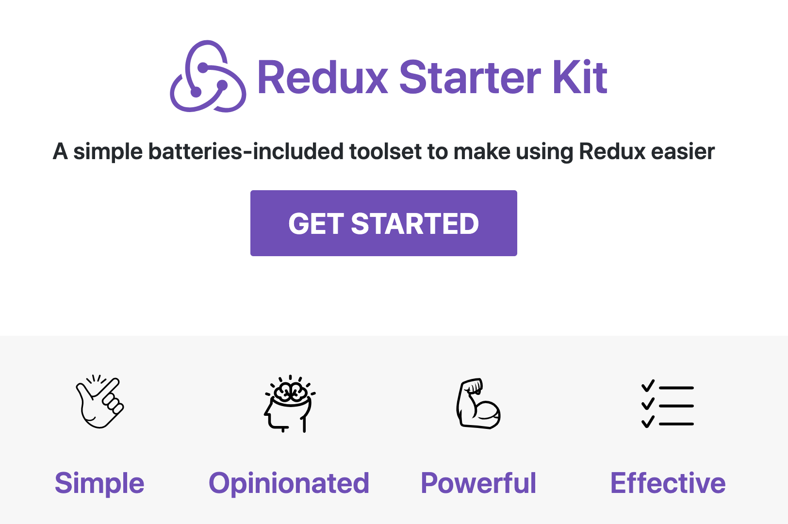

(이제서야...) [redux-starter-kit](https://github.com/reduxjs/redux-starter-kit)의 [1.0version
](https://github.com/reduxjs/redux-starter-kit/releases/tag/v1.0.0)이 공개됐습니다. `RSK` 라고 줄여부르네요. 자신들이 생각하는 redux best practice라고 생각하는 것들로 구성한 것 같습니다. 늦은 감이 좀 있지만 많은 부분을 커버하고 있고 redux 작성에 painful한 부분을 거의 대부분 해소했다고 생각합니다.

일전에 공유한 [Redux Architecture](https://jbee.io/react/react-2-redux-architecture/) 글에서 다뤘던 내용들 중 많은 내용을 starter-kit이 다루고 있어 소개합니다.

> 이 글을 다 읽고 난 후, 공식 문서도 한 번 읽어보시면 좋을 것 같습니다.

# TL;DR

1. [redux-actions](https://github.com/redux-utilities/redux-actions), [reselect](https://github.com/reduxjs/reselect)를 포용.
2. [immer](https://github.com/immerjs/immer)의 `produce` API 포용.
3. [Flux standard Action](https://github.com/redux-utilities/flux-standard-action) 포용.
4. 비동기 action을 처리하기 위한 middleware로는 [redux-thunk](https://github.com/reduxjs/redux-thunk)를 default로 지원.
5. action type, state type 등 TypeScript를 사용할 때 필요한 **Type Definition**을 공식 지원.

## Store 생성.

### Redux Devtools 공식 지원

기존에는 `createStore` 라는 API로 store를 생성하고 middleware를 통해 redux devtools 설정을 추가해줬습니다. 이 API가 RSK에서는 `configureStore` 로 지원하면서 default로 redux devtools를 지원하게 되었습니다.

### object argument

기존에 store를 생성하는 함수를 만들어 내부에서 `createStore`를 하고 middleware를 추가하고 귀찮은 작업들을 했었습니다.

이제는 RSK에서 지원하는 [configureStore](https://redux-starter-kit.js.org/api/configurestore)로 귀찮음에서 해방될 수 있습니다.

```ts
const store = configureStore({
  reducer: rootReducer,
  middleware: [thunk, logger],
})
```

## redux-actions 포용

redux-actions에서 지원하는 API 중 `createAction`을 RSK에서도 [동일한 이름으로 공식 지원](https://redux-starter-kit.js.org/api/createaction)합니다. 또한 handleActions라는 API로 initialState와 reducer를 조합했는데요, 이 부분 또한 [createReducer](https://redux-starter-kit.js.org/api/createreducer)라는 API로 지원합니다.

```ts
import { createAction, createReducer } from 'redux-starter-kit'

const increment = createAction('INCREMENT')
const decrement = createAction('DECREMENT')

const counter = createReducer(0, {
  [increment.type]: state => state + 1,
  [decrement.type]: state => state - 1,
})

const store = configureStore({
  reducer: counter,
})
```

## Ducks Patterns 공식 지원

[ducks pattern](https://github.com/erikras/ducks-modular-redux) 또한 slice라는 이름으로 공식 지원합니다. [createSlice](https://redux-starter-kit.js.org/api/createslice) 라는 API로 지원합니다.

아주 괜찮은 API라고 생각하는데요, createSlice는 `name` , `initialState`, `reducers` 세 가지를 넘겨주게 됩니다.

```ts
const todosSlice = createSlice({
  name: 'todos',
  initialState: [],
  reducers: {
    addTodo(state, action) {
      const { id, text } = action.payload
      state.push({ id, text, completed: false })
    },
  },
})
```

`name` 으로 action이 생성될 때 prefix를 자동으로 붙여줍니다. 매번 action create를 할 때, 해당 모듈 또는 reducer와 관련된 action임을 명시하기 위해 NAMESPACE 같은 느낌으로 `[prefix/action_name]` 이렇게 action을 생성해줬는데요, 이 부분을 처리해주게 됩니다.

## immer의 produce API 포용

꼼꼼하게 글을 읽고 계신 분은 위 예제 코드에서 이상한 점을 발견하셨을 겁니다. 바로 `push` 를 통해 state를 변경하고 있습니다. React 뿐만 아니라 Redux를 처음 접할 때부터 귀가 닳도록 들은 내용이 바로 immutable object로 상태를 다뤄야 한다는 내용이었는데요, 공식문서에 버젓이 push라는 API로 예제를 작성해뒀습니다.

RSK에서 제공되는 `createReducer`, `createSlice` 의 API는 immer의 produce API를 포용했습니다. 그렇기 때문에 mutable하게 상태를 변경해도 이를 감지하여 새로운 객체를 '생산'하여 return하게 됩니다.

immutable에 처리 때문에 귀찮았던 작업들이 많이 해소될 것 같습니다.

## FSA(Flux Standard Action) 포용

`createAction` 을 통해 생성되는 action은 Flux standard Action으로 다룹니다. action에 넘어가는 payload를 `payload`라는 key값으로 넘겨주게 됩니다. 어떤 데이터든 payload에 담겨서 전달될 수 있게 됐습니다.

## Reselect 포용

[createSelector](https://redux-starter-kit.js.org/api/createselector) 로 selector를 생성할 수 있습니다. reselect라는 라이브러리에서 지원하고 있던 API인데요, convention은 `get-*` 대신 `select-*` 을 권장하고 있습니다.

```ts
import { createSelector } from 'redux-starter-kit'

const selectVisibleTodos = createSelector(
  [selectTodos, selectFilter],
  (todos, filter) => {
    switch (filter) {
      case VisibilityFilters.SHOW_ALL:
        return todos
      case VisibilityFilters.SHOW_COMPLETED:
        return todos.filter(t => t.completed)
      case VisibilityFilters.SHOW_ACTIVE:
        return todos.filter(t => !t.completed)
      default:
        throw new Error('Unknown filter: ' + filter)
    }
  }
)
```

## Type Definition

TypeScript와 redux를 사용하다보면, RootState에 대한 타입, action payload에 대한 타입 등 신경써줘야 하는 부분이 많았고 이와 동시에 타입을 위한 타입을 정의하는 경우가 있었는데요, 이 부분을 해결하기 위해 내장 타입을 지원합니다. 과연 얼마나 실효성이 있을지는 적용해봐야 할 것 같습니다.

## 아쉬운 점.

기본으로 지원하는 middleware 중 async를 위한 미들웨어가 thunk인 부분은 조금 아쉽습니다. 하지만 redux-saga의 러닝 커브, redux-observable의 러닝커브를 생각하면 starter-kit에 포함되는 것은 무리가 있을 것 같고 redux-promise보다는 redux-thunk가 나은 선택임에는 분명한 것 같습니다. 이 부분에 대한 내용은 [Why Use Thunks?](https://redux-starter-kit.js.org/tutorials/advanced-tutorial#why-use-thunks) 내용을 참고하면 좋을 것 같습니다.

## Reference

[https://github.com/reduxjs/redux-starter-kit](https://github.com/reduxjs/redux-starter-kit)
