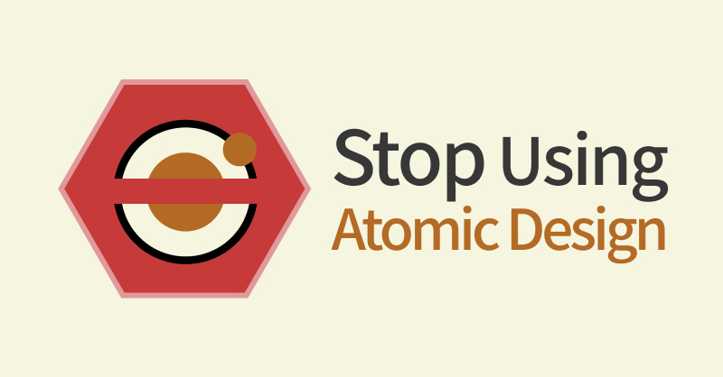

요즘 많은 프런트엔드 팀에서 디자인 시스템을 운영하는 것 같다. 그러면서 함께 들리는 용어 중 하나는 바로 [Atomic Design Pattern](https://atomicdesign.bradfrost.com/table-of-contents/) 이다. 디자인 시스템을 만들고 이를 제품에서 사용할 때 발생하는 여러 문제들을 해결하기 위해서 사용되는 것 같다. 이번 글에서는 이 아토믹 디자인 패턴이라는 개념에 대한 생각을 정리해봤다.

모든 문제를 전부 해결해줄 수 있는 도구는 없다. 아토믹 디자인 패턴 또한 어떤 문제를 해결하지만 해결하지 못하는 영역이 있고 이 글은 한계를 중심으로 생각을 풀어봤다. 그렇기 때문에 아토민 디자인 패턴에 대해 궁금하신 분들은 마지막에 첨부한 글들도 함께 보는 것을 추천한다.

## TL;DR

- 순수하지 않은 패턴은 혼란을 야기한다.
- 유용하지 않은 패턴은 나쁜 코드를 생산하도록 한다.
- 애매한 기준으로 분류하면 Component Driven Development 이점을 얻을 수 없다.

### Table of Contents

- Atomic Design Pattern?
- 순수한 패턴인가?
- 유용한 패턴인가?
- 마무리

## Atomic Design Pattern?

이것이 무엇인지는 이미 많은 글들이 있어서 생략한다. 간단하게 요약하자면 컴포넌트를 5가지 레벨로 패턴화 한 것이다.

- atom (원자)
- molcules (분자)
- organism (유기체)
- template (템플릿)
- page (페이지)


가장 널리 쓰이는 사진을 가져왔는데, 사진만 봐서는 molecules, organisms 차이가 무엇인지 와닿지 않고 templates, pages가 무엇인지 잘 와닿지가 않는다.

## 순수한 패턴인가?

동일한 입력에 동일한 출력을 하는 함수를 순수 함수라고 한다. 아토믹 디자인 패턴이라는 입력(기준)에 동일한 출력(대답)이 나오는지에 대한 의문으로, 이 패턴이 순수한가?라는 의문이 생겼다.

### Pattern?

'패턴'이라고 하면 무엇이 떠오르나? 가장 먼저 디자인 패턴이 생각나는데, 아토믹 디자인을 과연 패턴이라고 할 수 있을까?

패턴이라 함은 코드에서의 약속이라고 할 수 있지 않을까? 보통 제품은 여러 명의 개발자가 만들기 때문에 일종의 약속이 필요하다. 이 약속은 제품의 특성에 따라 최소한만 약속할 수 있고, 구조를 강력하게 제한하기도 한다. 이런 약속들이 널리 쓰이고 다수가 좋다고 인정한 약속들은 패턴이 되곤 한다.

쉽게 접할 수 있는 패턴 중 ESLint도 작은 패턴 중 하나로 볼 수 있다.

```jsx
'@typescript-eslint/no-unused-vars': [
  'error',
  { argsIgnorePattern: '^_', ignoreRestSiblings: true },
],
```

'사용하지 않는 변수는 에러로 취급하겠다.' 라는 규칙인데, config 파일에 이 규칙을 정의해두면 도구를 통해 이 규칙을 강제할 수 있다. 이것을 에러로 취급할지 말지를 논의하여 이것을 에러로 취급하기로 했다면 이것은 에러인 것이다. 사용하지 않는 변수이지만 어떤 때는 에러가 아니다. 라는 예외 사항도 `argsIgnorePattern` 로 명시를 해뒀다. 이 규칙이 적용된 프로젝트를 운영하는 모두에게 동일한 기준으로 패턴이 적용된 것이다.

여기에서 중요한 것은 **'모두에게 동일한 기준'**이라는 것이다. 그 기준이 객관적이고 명료하여 개인마다 해석의 여지에 따라 달라질 수 없어야 하는 것이 중요하다. 그리고 문제는 이 부분에서 발생한다.

### 분자와 유기체

아토믹 디자인 패턴의 프로젝트에 리스트 엘리먼트를 컴포넌트화 하여 `ListItem`이라는 원자 타입의 컴포넌트를 만들어보자.

```tsx
interface Prop extends LiHTMLAttributes<HTMLLIElement> {}

export function ListItem(props: Props) {
  return <Li {...props} />
}

const Li = styled('li', {
  /* custom styles */
})
```

`/* custom styles */` 라는 스타일 요소가 들어간 것을 제외하고 HTML의 `li` 태그를 그대로 렌더링하는 컴포넌트이다.

방금 custom으로 적용한 스타일과 같은 스타일의 UI에서 쉽게 가져다 사용할 수 있을 것이다. 프로필 목록에서도 사용할 수 있을 것이고, 약관 동의를 받는 목록에서도 체크박스와 함께 사용할 수 있다. 즉 이 컴포넌트를 사용할 수 있는 다양한 케이스가 존재한다.

- 텍스트 좌측에 **[프로필 사진]**이 추가되어야 한다.
- 텍스트 좌측에 **[체크박스]**가 추가되어야 한다.
- 텍스트 우측 끝에 **[뱃지 아이콘]**이 추가되어야 한다.
- 텍스트 **[하단에 작은 글씨]**로 텍스트가 추가되어야 한다.

이러한 것들은 아토믹 디자인 패턴에서 어떻게 처리할까? 위 상황에서 볼드체로 처리된 요소들은 우선 '원자 컴포넌트'로 정의되어야 한다. 그리고 이것들을 잘 조립해서 분자 컴포넌트를 만들어 가져다 사용할 수 있다.

### OOO OO 분자와 유기체 구분하기

원자 컴포넌트는 사람마다 기준이 비슷할 수 있지만 분자 컴포넌트와 유기체 컴포넌트는 사람마다 다를 수 있지 않을까? 아토믹 디자인 패턴을 설명하는 도식을 보고 가장 먼저 떠올랐던 의구심이다.

우선 분자 컴포넌트를 만들어보고 고민해보자.

#### 좌측에 **프로필 사진** 추가

`ProfileImage` 라는 원자 컴포넌트와 `ListItem`이라는 컴포넌트를 조립하여 이 케이스를 대응해보자.

```tsx
interface Props {
  imageSrc: string
  imageAlt: string
  contents: string
}

export function ProfileListItem({ imageSrc, imageAlt, contents }: Props) {
  return (
    <ListItem css={{ display: 'flex' }}>
      <ProfileImage src={imageSrc} alt={imageAlt} />
      {contents}
    </ListItem>
  )
}
```

첫번째 케이스를 대응하기 위해 `ProfileListItem`라는 분자 컴포넌트를 만들었다. 원자 컴포넌트 두 가지를 조립하여 간단하게 만들 수 있다. 위에서 살펴본 다른 케이스들도 쉽게 만들 수 있다. ( `CheckBoxListItem`, `ListItemWithBadge`,...)

#### 좌측에 **프로필 사진** 추가 받고 우측에 아이콘

방금 만든 `ProfileListItem`의 우측에 'NEW'라는 뱃지아이콘을 추가해줘야 하는 상황이 발생했다. 이번엔 분자와 원자를 조합하여 '유기체'로 만들어 대응을 하면 된다. 만들어둔 `Badge` 원자 컴포넌트와 `ProfileListItem` 컴포넌트를 사용하여 아래와 같이 만들어줄 수 있다.

```tsx
interface Props {
  imageSrc: string
  imageAlt: string
  contents: string
  badgeName?: string
  badgeCondition?: boolean
}

export function ProfileListItemWithBadge({
  imageSrc,
  imageAlt,
  contents,
  badgeName,
  badgeCondition,
}: Props) {
  return (
    <div css={{ display: 'flex', justifyContent: 'flex-end' }}>
      <ProfileListItem
        imageSrc={imageSrc}
        imageAlt={imageAlt}
        contents={contents}
      />
      {badgeCondition === true ? <Badge name={badgeName!} size={24} /> : null}
    </div>
  )
}
```

'NEW' 뱃지아이콘만 올 수 있는 것이 아니므로 `badgeName`이라는 props를 추가하여 확장 가능하게 만들어줬고 이 뱃지아이콘을 노출할지 말지를 결정할 수도 있도록 `badgeCondition` props도 추가해줬다.

이미 만들어 둔 분자컴포넌트와 원자 컴포넌트를 가지고 새로운 컴포넌트를 빠르게 만들 수 있었다. 이와 비슷하게 여러 유기체 컴포넌트들을 만들 수 있을 것이다. (`CheckboxListItemWithArrow` , `CheckboxListItemWithBadge`, ...)

이 때 `ProfileListItemWithBadge` 컴포넌트는 *'분자'*라고 말하는 팀원이 등장할 수 있지 않을까?

> 이 컴포넌트는 유기체에 비해 **덜 복잡**하니까 분자 아닌가요? UI 상으로는 **원자끼리의 집합**으로도 볼 수 있잖아요?

유기체 컴포넌트라고 하기엔 그 컴포넌트의 구성이 간단하다는 것이다.  
이 `ProfileListItemWithBadge` 컴포넌트는 **상대적으로** 작고 덜 복잡한 컴포넌트이기 때문에 유기체가 아닌 분자라고 인식된 것이다.

하지만 컴포넌트의 실제 **구현**은 분자 컴포넌트와 원자 컴포넌트의 집합이기 때문에 유기체로 볼 수 있지 않을까? 또 `ProfileListItem`과 `Badge` 컴포넌트 간의 간격, 즉 컴포넌트들의 레이아웃을 결정하기 때문에 유기체라고 볼 수도 있지 않을까? (앗, 레이아웃을 결정하는 컴포넌트면 템플릿 컴포넌트로 봐야하나?)

### 저마다 다른 분자와 유기체 구분하기

팀원 코드 리뷰 과정이 있다면 또는 논의할 수 있는 시간이 있다면 문제가 발생할 때마다 '이것은 유기체이다.', '이것은 분자이다.' 의사결정을 내리고 이를 문서화 해둘 수 있다. 또는 어느 디렉토리에 있는 것이 뭐가 중요하냐 유연하게 가자. 라고 의사결정하여 작성자 마음대로 작성할 수도 있다.

이러한 이유로 '순수하지 않다.' 라는 결론을 내렸고 오히려 혼란을 야기할 수 있다고 생각한다. 혼란을 합의로 이끌어내기 위한 커뮤니케이션, 합의를 이루는 과정도 비용이라고 생각한다.

> 여러분은 어떻게 생각하시나요?

## 유용한 패턴인가?

아토믹 디자인 패턴은 웹 애플리케이션을 5단계로 구분한다. 이 5단계가 유용한가? 유용하다는 것은 무엇인가? 이야기해보려고 한다.

어떤 패턴의 유용함을 판단하려면 무엇을 고민해봐야 할까? 이것은 [좋은 코드에 대한 고민](https://jbee.io/etc/what-is-good-code/)에서 힌트를 얻을 수 있다. 소프트웨어는 끊임없이 변하기 때문에 **변경에 유연하게 대응하는 코드**를 작성해야 한다. 자연스럽게 변경에 잘 대응하고 변경에 따른 영향 범위를 최소화 할 수 있도록 컴포넌트를 디자인해야 하고 패턴으로부터 이 목적을 달성할 수 있으면 유용하다고 볼 수 있다.

### Reusable

`ProfileListItemWithBadge` 를 잘 쓰고 있던 와중에, 뱃지 아이콘이 '우측 끝'이 아닌 텍스트 '바로 우측에 12px 떨어진' 간격으로 그려야 하는 요구 사항이 등장했다고 가정해보자. `ProfileListItemWithBadge` 이 컴포넌트를 재사용하기 어려운 상황이라 props를 하나 추가할지, 새로 만들지 고민이 된다.

- props를 추가하면 컴포넌트 내부가 너무 복잡해지지 않을까?
- 따로 컴포넌트를 만들게 되면 `CheckboxListItemWithBadge` 도 대응해줘야 하나?
- 아니 그나저나 이름은 뭘로 짓지? 지금도 좀 긴데...
- ...

예상치 못했던 케이스가 발생하자 적절한 대응이 어려워졌다. 그 땐 재사용이 가능했지만 지금은 컴포넌트 내부를 변경하거나 다시 만들어야 하는 상황이다.

> Prop이 하나 추가되는 것 뿐이지만 이로인해 컴포넌트 내부는 더 복잡해지고 이런 상황은 언제든 맞딱드릴 수 있지 않을까?

### Scalable

처음에 살펴본 ListItem 케이스 중 '텍스트 **하단에 작은 글씨**로 텍스트가 추가되어야 한다.' 케이스는 아직 대응하지도 않았는데 수많은 유기체 컴포넌트(아, 누군가에겐 분자 컴포넌트)들이 생겨났다. 대응해야 하는 상황이 생길 때마다 새로운 컴포넌트를 정의하게 되는 것이 과연 확장 가능한 컴포넌트일까?

사실 컴포넌트의 확장 가능성은 재사용성의 또 다른 이름일 수 있다. 기본적으로 확장이 가능해야 기존의 것을 가져다 사용하고 필요에 따라 기능을 추가할 수 있다.

하단에 작은 글씨의 텍스트가 추가되어야 한다면 만들어 두었던 `ProfileListItemWithBadge` 컴포넌트를 재사용할 수 없다. 물론 `bottomText` 라는 props를 하나 추가해서 다음과 같이 만들 수도 **있긴** 하다.

```tsx
interface Props {
  imageSrc: string
  imageAlt: string
  contents: string
  badgeName?: string
  badgeCondition?: boolean
  bottomText?: string
}

export function ProfileListItemWithBadgeText({
  imageSrc,
  imageAlt,
  contents,
  badgeName,
  badgeCondition,
  bottomText,
}: Props) {
  return (
    <div css={{ display: 'flex' }}>
      <div css={{ display: 'flex', justifyContent: 'flex-end' }}>
        <ProfileListItem
          imageSrc={imageSrc}
          imageAlt={imageAlt}
          contents={contents}
        />
        {badgeCondition === true ? <Badge name={badgeName!} size={24} /> : null}
      </div>
      <span>{bottomText}</span>
    </div>
  )
}
```

지금도 충분히 복잡하지만 곧 이 컴포넌트는 내부적으로 수많은 분기를 계산하는 몬스터 컴포넌트(Monster Component)가 된다. 이미 컴포넌트 이름으로부터 bottomText props가 정의될 수 있는지 알 수 없고 bottomText에 조금이라도 **새로운 변경**(정렬, 애니메이션)이 생기면 재사용이 어려워진다.

문제는 이것 뿐만이 아니다. 보여줘야 하는 데이터는 어디로부터 오는지 알아야 하는데 그러다보면 [Prop drilling](https://kentcdodds.com/blog/prop-drilling)이 발생한다.

예제 코드에서는 데이터를 보여주는 것만 신경을 썼다. 하지만 컴포넌트는 데이터를 보여주는 역할 뿐만 아니라 사용자의 입력을 받는 것도 정의되어야 한다. 사용자의 입력까지 고려하게 되면 더욱 변경에 취약한 컴포넌트들이 되지 않을까 생각한다.

### 그래서 유용한 패턴인가?

간단한 예제로 재사용이 어렵고 확장이 어려운 컴포넌트가 생겨나는 것을 목격했다. 여기까지 살펴봤을 때, 유용한 패턴이라고 할 수 있을까? 다만 위 예제에서는 합성을 전혀 사용하지 않는 억지가 있었는데, 이 부분도 살펴보려고 한다.

## Composition

분자와 유기체, 템플릿과 페이지 등 어떤 기준으로 컴포넌트의 유형을 구분짓는 것보다 컴포넌트들을 서로 합성 가능하도록 만드는 것이 중요하다.

앞서 살펴본 예제에서 `<ProfileImage>`로 그려주는 부분, `bottomText`, `badge` 등 여러 요소들을 `ListItem`와 합성할 수 있도록 수정할 수 있다. 다음과 같이 `ListItem` 인터페이스를 수정해보면 어떨까?

```tsx
<ListItem
  left={<ProfileImage src="..." alt="..." />}
  bottom={<span>하단 텍스트</span>}
  right={<Badge name="이름" size={24} />}
>
  contents
</ListItem>
```

`ListItem`의 Props가 아예 다르게 정의되었고 (매우 줄어들었다) 하는 `li` 엘리먼트의 스타일을 제외하고 하는 역할이라곤 각 `left`, `bottom`, `right` 그리고 `children`로 전달되는 컴포넌트들(또는 텍스트)을 배치하는 것 뿐이다.

당연히 아토믹 디자인 패턴을 적용하면서 합성 가능하도록 컴포넌트를 구성할 수 있다. 그렇다면 `ListItem`은 레이아웃만을 담당하고 이 또한 스타일에 불과하니 아직 원자일까? 레이아웃을 담당하니 템플릿일까? 원자 컴포넌트라고 정의한다면 페이지(Page) 레벨에서 바로 사용할 수 없는 것인가?

> 이것이 무조건 정답은 아니지만 이 부분에 대한 고민이 있었고 이것에 대한 내용은 이 글이 너무 길어질 것 같아 다른 글에서 정리해보려고 한다.

### 다섯 단계의 레벨

아토믹 디자인 패턴은 무엇을 위해 웹 애플리케이션 컴포넌트를 다섯 레벨로 나눈 것일까? 컴포넌트를 어떤 기준으로 나누고, 어떻게 재사용 해야 하는지에 대한 명확한 기준이 없다보니, 기준을 잡는 대신 각 레벨마다 '제약'을 두어 일관성을 추구한 것은 아닐까?

컴포넌트의 재사용성은 도메인에 대한 맥락(context)가 있는지에 따라 크게 나뉘게 된다. 당연히 컴포넌트에서 특정 도메인에 대해 의존하게 되는 순간 재사용성이 떨어지게 되는데, 이 부분에 대한 계층이 따로 존재한다던가 등 고려하지 않은 부분 도 아쉬운 부분이다.

## 마무리

웹 애플리케이션이 점점 많은 일을 처리할 수 있게 되면서 복잡해지고 있는데 React는 이를 (전혀) 제어하지 않는다.(방관) 그러다보니 컴포넌트를 어떻게 나눠야 하는지 기준이 딱히 없고 급한 일정에 개발하다보니 확장이 어렵고 재사용이 어려운 컴포넌트들이 만들어지기 쉽다. 이 방법론, 패턴이 매력적으로 다가온 이유에는 여러 가지가 있겠지만 그 중 하나는 애플리케이션의 복잡함을 해결해줄 무언가가 필요했기 때문일 것이다.

컴포넌트들을 서로 합성 가능하도록 만드는 것이 중요하다. 변경 가능성을 고려해 변경에 유연하게 대응할 수 있도록 컴포넌트를 설계하고 디자인해야 한다. (To be continued...)

### 아토믹 디자인 패턴 관련 좋은 글

- (영어) [https://atomicdesign.bradfrost.com/](https://atomicdesign.bradfrost.com/)
- (한글) [https://kciter.so/posts/effective-atomic-design](https://kciter.so/posts/effective-atomic-design)
