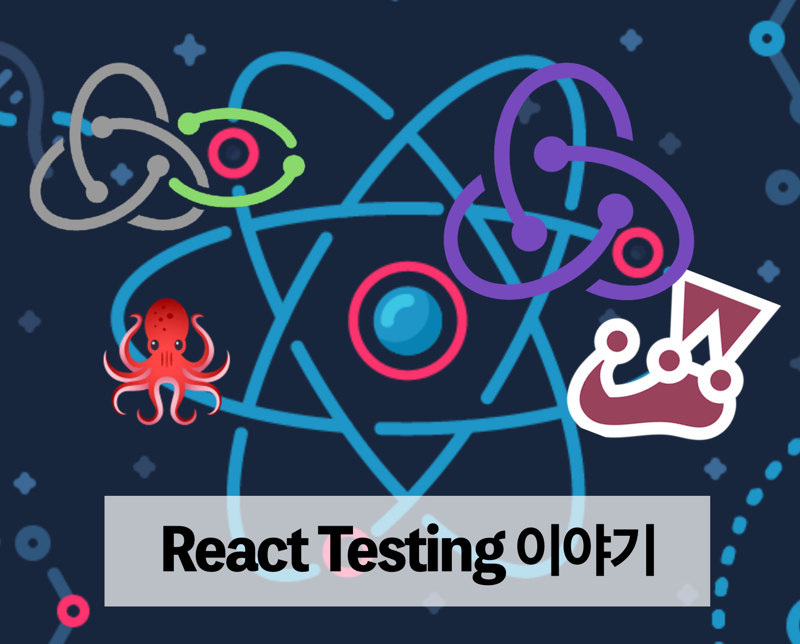

앞서 비즈니스 로직과 컴포넌트 렌더링 구조를 분리하자고 이야기했다. 로직을 관리하게 되는 Store와 그 외의 것들을 어떻게 테스트 할 수 있을지 먼저 살펴본다.

## Store

꼭 store가 아니더라도 애플리케이션의 상태(state)를 관리하는 무언가가 있을 것이다. 이 상태를 관리하는 부분은 어떻게 테스트 할 수 있을까? 가장 대중적인 상태 관리 라이브러리, Redux를 예시로 들어보자.

1. 액션 생성 함수가 액션을 의도한대로 생성하는가?
2. 리듀서가 상태를 의도한대로 변경하는가?
3. (만약 미들웨어가 있다면) 액션이 미들웨어에 적용되는가?
4. 미들웨어는 잘 동작하는가?
5. selector를 사용한다면 그 selector는 store의 상태에 따라 제대로 된 값을 반환하는가?

1번은 FSA(Flux Standard Action) 구조를 따라 액션을 정의한다면 불필요한 테스트가 될 것이다. util로 액션 생성하는 함수를 만들어두고 해당 부분만 테스트를 진행하던가 [redux-actions](https://github.com/redux-utilities/redux-actions) 을 사용한다면 라이브러리를 믿고 가는 것도 방안이 될 수 있다.

3번도 라이브러리에 맡기자. redux에서 어느 특정 action만 미들웨어를 건너뛰는 일은 발생하지 않을 것이다.

### Reduce Test

2번은 많은 분들이 공감을 한다. 순수 함수(pure function)인 reducer는 테스트하기 참 쉽다. util 라이브러리 테스트하듯이 `state`와 `action`만 case에 따라 넘겨주고 그에 맞게 상태를 잘 변경하는지 테스트하면 끝나기 때문이다.

### Selector Test

이 부분도 테스트 작성하기가 쉽다. 어떤 조건에 의해 분기되어 다른 값을 반환하는 selector의 경우에도 mocking만 해주면 순수 함수를 테스트 하듯 테스트 코드를 작성할 수 있다.

### Middleware Test

Redux를 사용하다보면 각종 비동기 처리에 대한 부분을 미들웨어를 통해 처리하게 된다. 이번 프로젝트에서는 Redux-saga를 사용했다. 그리고 비즈니스 로직들을 이 saga generator function에서 처리했는데 이 부분은 Saga Test 부분에서 좀 더 자세히 다룰 예정이다.

> 실제 코드

## Store에 대한 단위 테스트

### reducer, selector

두 경우는 A라는 입력(input)에 대해서 항상 동일한 출력(output) B를 반환하는 순수 함수이기 때문에 쉽게 테스트 코드를 작성할 수 있다. 앞 편에서 언급한 Given, When, Then 구조에 맞게 작성하되 내부 분기에 대해 대응할 수 있도록 테스트를 작성한다.

```ts
test('should return', () => {
  // Given
  const state = {}
  const action = {
    type: '',
    payload: '',
  }

  // When
  const results = reducerFunction(state, action)
  // or When
  const results = selectorFunction(state, action)

  // Then
  const expected = {}
  expect(results).toEqual(expected)
})
```

두 경우, state에 대한 mocking만 잘 해주면 발생할 수 있는 모든 상황에 대해 테스트 코드를 작성할 수 있다. Store 테스트는 UI 변경과 밀접하게 연관되어 있지 않기 때문에 충실히 작성해주는 것이 좋다.

### redux-saga

우선 미들웨어의 테스트는 Redux 환경 **바깥에서** 테스트가 진행되어야 한다.

redux-saga는 공식 문서에서도 테스트하기 쉽다고 나와 있고 그렇게 소문이 나있다. 하지만 늘 그렇듯, 실제로 saga로 작성한 로직을 테스트하려면 손이 정말 많이 간다. 그래서 인지 redux-saga 테스트를 돕는 helper 라이브러리가 이미 여러 종류 있다. (그리고 이것들을 면밀히 [분석한 글](https://blog.scottlogic.com/2018/01/16/evaluating-redux-saga-test-libraries.html)도 많다.)

결론부터 말하자면 이번 프로젝트에서는 [redux-saga-testing-plan 라이브러리](https://github.com/jfairbank/redux-saga-test-plan)를 사용했다. 이 라이브러리를 사용하여 테스트 코드를 작성하는 것과 사용하지 않고 테스트 코드를 작성하는 것의 차이를 코드를 통해 살펴보면 다음과 같다.

아래와 같은 간단한 saga 함수를 테스트한다고 가정해보자.

```ts
export function* initializeAddresses() {
  try {
    yield put(loadingActions.start(DEBIT_CARD_ISSUE_SHIPPING))

    const { home, biz }: IUserProfile = yield call(fetchProfile)
    const [isDisableHome, isDisableBiz] = yield all([
      call(check, { code: home.code }),
      call(check, { code: biz.code }),
    ])

    yield put(debitCardIssueShippingActions.setAddresses({ home, biz }))

    if (isDisableHome && isDisableBiz) {
      yield put(
        debitCardIssueActions.setView({
          selectedAddress: AddressType.ETC,
        })
      )
    }
  } catch (e) {
    console.error(e)
  } finally {
    yield put(loadingActions.finish(DEBIT_CARD_ISSUE_SHIPPING))
  }
}
```

집과 직장의 주소를 가져오고 각각의 주소가 배송 가능한지에 대한 여부를 다시 한 번 api 호출을 통해서 확인하는 함수이다. 주소와 관련된 정보들이 Store에 저장되고 배송이 불가능한 지역이면 새로운 주소를 입력할 수 있도록 해준다. 이러한 일련의 비즈니스 로직을 saga 함수에서 처리했다. 이 코드를 테스트한다고 가정했을 때, 다음과 같이 작성될 수 있다.

```ts
test('run initializeAddresses initialize disable address and setView', async done => {
  // Given
  const home = { cityCode: '123' }
  const biz = { cityCode: '345' }
  const etcOption = { selectedAddress: AddressType.ETC }

  // When
  const gen = initializeAddresses()

  expect(gen.next().value).toEqual(
    put(loadingActions.start('DebitCardIssueShipping'))
  )
  expect(gen.next().value).toEqual(call(fetchProfile))
  expect(gen.next({ code: home.code }).value).toEqual(
    call(checkAvailableDelivery)
  )
  expect(gen.next({ code: biz.code }).value).toEqual(
    call(checkAvailableDelivery)
  )
  expect(gen.next({ home, biz }).value).toEqual(
    put('DebitCardIssueShipping/setAddresses')
  )
  expect(gen.next(etcOption).value).toEqual(
    put('DebitCardIssueShipping/setView')
  )
  expect(gen.next().value).toEqual(
    put(loadingActions.finish('DebitCardIssueShipping'))
  )

  // Then
  expect(gen.next().done).toBeTruthy()
})
```

제너레이터를 단계별로 하나씩 테스트할 수 있다. 각 응답값을 mocking하는 것이 아닌 다음 generator 에 원하는 값을 넣어줄 수 있다.
그리고 위 테스트 코드를 Helper 라이브러리를 사용한다면 다음과 같이 작성할 수 있다.

```ts
test('run initializeAddresses initialize disable address and setView', async done => {
  // Given
  const homeAddress = { cityCode: '123' }
  const bizAddress = { cityCode: '345' }

  // When
  const { effects } = await expectSaga(initializeAddresses)
    .provide([
      [matchers.call.fn(fetchProfile), { home, biz }],
      [matchers.call.fn(checkAvailableDelivery), true],
    ])
    .put(loadingActions.start('DebitCardIssueShipping'))
    .call.fn(fetchProfile)
    .call.fn(checkAvailableDelivery)
    .call.fn(checkAvailableDelivery)
    .put.actionType('DebitCardIssueShipping/setAddresses')
    .put.actionType('DebitCardIssue/setView')
    .put(loadingActions.finish('DebitCardIssueShipping'))
    .run(false)

  // Then
  expect(effects).toEqual({})
  done()
})
```

테스트 헬퍼에서 가장 많이 사용했던 기능은 `provide` 이다. 발생할 수 있는 상황에 따른 테스트를 작성할 때, 적절한 mocking을 해줄 때 사용했다. `expectSaga`를 위 예제 코드처럼 사용할 수 있고, 반환하는 generator를 이용하여 helper 라이브러리 사용하기 전처럼 단계별로 테스트를 진행할 수도 있다.

이번 프로젝트에서는 금융과 관련된 인증 처리나 고객의 상태에 따른 복잡한 분기 처리 로직을 미들웨어 함수에서 처리했다. 그러다보니 여러 비동기 호출 로직을 유연하게 처리할 수 있는 saga generator의 도움을 많이 받았다.

redux-saga의 또다른 단점은 Redux 액션을 호출(put)한다던가, state에 접근(select)하는 로직을 **effect로 처리**하고, 그 effect를 mocking 함으로써 테스트 코드를 빠르게 작성할 수 있다는 것이다.

## 마무리

Store에서 상태를 관리하고 그 상태에 대한 테스트 코드를 작성했다. 그리고 비즈니스 로직까지 Store의 미들웨어에서 처리하면서 테스트 코드를 쉽게 작성할 수 있었다. 화면(view)에서는 테스트 코드의 보호를 받고 있는 정제된 데이터를 접근하여 렌더링하고 테스트 코드의 보호를 받고 있는 Action을 Dispatch한다.

다음 장에서는 Component에 대한 부분을 살펴볼 예정이다.

|       |                                                                              |
| :---: | :--------------------------------------------------------------------------: |
| Next  | [4. React Component 테스트](https://jbee.io/react/testing-4-react-testing/)  |
| Intro | [0. 시리즈를 들어가며](https://jbee.io/react/testing-0-react-testing-intro/) |
