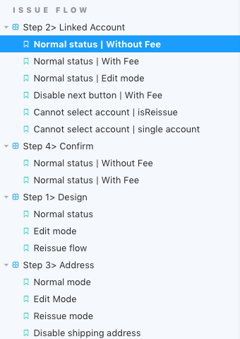

앞서 컴포넌트에 대한 단위 테스트는 과감히 진행하지 않는다고 했다. (컴포넌트에 비즈니스 로직이 없을 때에 대한 이야기) 하지만 그냥 두기에는 뭔가 불안하다.

웹의 특성 상, 특정 상황에서 UI가 깨졌을 때, 빠르게 수정하여 배포가 가능하다. 사용자의 애플리케이션 사용 흐름을 방해하는 정도의 **'붕괴'**가 아닌 이상, 빠르게 대응하면 되는 일이다. 배포 자동화가 잘 이루어져 있다면 수정 후 버튼 하나만 클릭하면 이후 사용자는 고쳐진 화면을 마주하게 된다.

즉, 우리에게 필요한 것은 모든 상황에 대해 UI 깨짐 현상없이 완벽하게 렌더링 됨을 보장하는 테스트 코드가 아니라, UI 깨진 특정 상황이 무엇인지 빠르게 파악할 수 있도록 도와주는 무언가가 필요하다.

## UI 검증을 위한 Storybook 활용


이번 프로젝트에서는 이미 많이 알려진 Storybook을 활용했다. 테스트라고 하기에는 개발자에게 피드백을 주는 기능이 없는 이 Storybook은 그저 **컴포넌트 시각화 도구**이다.

주로 여러 공통 컴포넌트를 관리하거나 디자인 시스템(Design System)을 운영할 때, 각각의 컴포넌트의 렌더링 상태를 확인하기 위해 사용된다.

그러나 이번 프로젝트에서는 조금 다르게 사용했다. 각각의 공통 컴포넌트(Element 단위의 컴포넌트)들은 Storybook 코드를 작성하지 않았다. 대신에 페이지 단위로 스토리(Storybook 코드)를 작성했다. 즉 Store의 특정 상황에 대한 화면 렌더링 상태를 페이지 통째로 스토리를 그려준 것이다.



### Why 1. Mobile Web

모바일 화면만을 목적으로 만들어진 웹 애플리케이션은 특정 화면까지 접근하는데 비용이 발생한다. 다음과 같은 A 화면을 예로 들어보자.

(이번 프로젝트에서 실제로 존재하는) A라는 페이지는

1. 로그인을 하고
2. 사용자 약관에 동의하고
3. 계좌를 개설한 후
4. 그 계좌에 해당하는 카드를 발급받고
5. 카드 배송이 완료된 후(완료라는 가정하에)
6. 제한된 시간을 지나 카드 활성화 만료기간이 지났을 경우

노출되는 페이지이다. 개발자가 하나 하나 버튼을 클릭해 넘어가야 할 뿐만 아니라, 특정 조건을 만족시키기 위한 mock API가 필요하다.

물론 바로 VSCode를 열어 코드 일부를 수정하면 이 화면을 볼 수 있다. 그러나 이 한 화면의 렌더링 상태를 확인하기 위해 사용자 관련 api를 mock data로 교체하고, 계좌 개설 관련 api를 mock data로 교체하고, 카드 발급과 관련된 api를 mock data로 교체한다고 하면 손이 정말 많이 간다. 그리고 확인이 끝나면 이 변경 사항은 다시 원래대로 돌려야 한다.

수많은 페이지 중 한 페이지를 확인할 때, 하나 하나 mock data로 고칠 필요없이 스토리를 페이지 별로 한 번만 작성해둔다면 이 수고에 드는 비용을 크게 절약할 수 있다.

> PC 화면의 웹 페이지는 너무 크고 필요한 상태도 너무 많아서 이 방법이 적절하지 않을 것 같다. 모바일 웹 페이지는 화면의 크기가 작아서 필요한 상태도 적어 이 방법을 적용하기 알맞다고 생각했다.

### Why 2. 빠른 대응

개발을 진행하면서 또는 실제 프로덕트를 운영할 때 특정 화면에 대한 확인이 매번 필요할텐데, 그 때마다 위에서 언급한 작업을 반복해야 한다. 만약 배포된 프로덕트에서 UI 버그가 발생하면 어떻게 해야 할까?

버그가 발생한 화면의 스토리북을 우선적으로 확인하고 UI를 렌더링하는 로직에 문제가 없는지 먼저 확인할 수 있다. 원인이 될 수 있는 영역을 좁혀나가면서 디버깅을 할 수 있는 것이다. 그 후 proxy를 걸거나 api response 값을 보면서 응답값이 제대로 오는지 등을 확인할 수 있다.

### Mock 데이터의 중요성

앞서 수많은 Store 테스트를 작성할 때, mock data를 생성해줬다. 이런 mock data를 재활용하여 페이지에서 발생할 수 있는 상태를 만들고 페이지 컴포넌트를 스토리에 작성해 준다.

아래 예제는 체크카드를 발급받을 때 특정 단계에 대한 페이지를 스토리로 작성한 코드이다.

```ts
storiesOf('Issue Flow | Step 3> Address', module)
  .addDecorator(
    withRedux({
      [DEBIT_CARD_ISSUE]: mock.issue,
      [DEBIT_CARD_ISSUE_SHIPPING]: mock.issueShipping,
    })
  )
  .add('Normal mode', () => <DebitCardIssueAddress />)

storiesOf('Issue Flow | Step 3> Address', module)
  .addDecorator(
    withRedux({
      [DEBIT_CARD_ISSUE]: {
        ...mock.issue,
        mode: {
          isEdit: true,
          isReissue: false,
        },
      },
      [DEBIT_CARD_ISSUE_SHIPPING]: mock.issueShipping,
    })
  )
  .add('Edit Mode', () => <DebitCardIssueAddress />)
```

> Storybook 5.2.x version부터 Component Story Format (CSF)라는 방식으로 Story 작성을 권장하고 있다. 위 예제는 StoriesOf API로 작성되었다.

## 마무리

Storybook 자체에 대한 이야기는 많이 하지 않았는데, 관련 소개글은 생각보다 많이 존재한다. Storybook 자체가 궁금하다면 공식 문서나 아래 Reference에 있는 글들을 참고하면 된다. 이번 글에서는 컴포넌트 단위의 스토리가 아닌 페이지 단위의 스토리를 작성하는 조금 다른 시각에 대해 집중하여 설명했다.

Storybook은 이미 수많은 addon들을 제공하고 있어서 화면을 구성하는데에는 어려움이 없을 것이다.

컴포넌트 단위의 스토리도 매우 중요하다고 생각한다. 하지만 이번 프로젝트에서는 퍼블리셔 분들이 미리 작성한 마크업들을 확인할 수 있는 페이지가 존재했기 때문에 중복으로 작성할 필요가 없었다. 프로젝트 상황에 따라서 스토리북을 잘 활용할 수 있을 것 같다.

### References

- [https://storybook.js.org/docs/basics/introduction/](https://storybook.js.org/docs/basics/introduction/)
- [https://hyunseob.github.io/2018/01/08/storybook-beginners-guide/](https://hyunseob.github.io/2018/01/08/storybook-beginners-guide/)
- [https://meetup.toast.com/posts/178](https://meetup.toast.com/posts/178)

|       |                                                                              |
| :---: | :--------------------------------------------------------------------------: |
| Next  | [5. 여러 테스트에 대한 단상](https://jbee.io/react/testing-5-react-testing/) |
| Intro | [0. 시리즈를 들어가며](https://jbee.io/react/testing-0-react-testing-intro/) |
