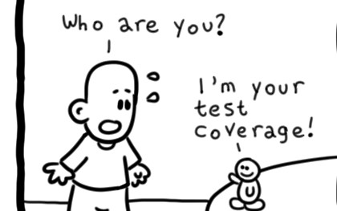

앞서 시리즈에서 소개한 테스트 말고도 여러 테스트들이 존재하는데, 그 테스트들에 대한 생각을 정리해봤다.

## snapshot 테스트에 대한 생각

결론부터 말하자면 snapshot 테스트에 대해서는 회의적인 입장이다. Regression test 시 사용한다면 말리진 않겠지만 나라면 스냅샷 테스트를 하지 않을 것이다. 페이스북에서 만든 테스트 도구인 Jest의 발전으로 snapshot을 쉽게 업데이트(라고 하고 테스트 조건 업데이트)할 수 있다. 스냅샷 테스트는 우리에게 어떤 피드백을 줄 수 있을까?

### 올바른 피드백인가?

snapshot 테스트의 통과는 snapshot을 찍어둔 컴포넌트가 변하지 않았다는 정보를 준다. 컴포넌트를 구성하고 있는 요소 중 그 어떤 하나라도 변경되면 그 테스트는 실패한다. snapshot을 비교해가면서 왜 깨졌는지 살펴봐야 한다. 그 상황에 대한 snapshot을 업데이트 해줘야 테스트가 통과한다.

### 문제를 파악하기 쉬운가

방금 **'왜 깨졌는지 살펴봐야 한다'** 라고 했는데, 이것은 snapshot 테스트의 문제점 중 하나이다. 테스트가 실패할 수 있는 여러 상황 중 무엇인가에 대해서 생각을 해봐야 하고 디버깅을 해봐야 하는 것이다. 프로덕션 코드를 디버깅하기도 바쁜데 테스트 코드를 디버깅해야 한다니.

### Regression Test

앞서 단점만 말했지만 이 스냅샷 테스트가 유의미할 경우가 있다. 프로젝트의 크기가 커져서 어떤 사이드 이펙트가 발생할지 판단이 불가능할 경우, 스냅샷 테스트를 활용할 수 있다.

운영 중인 프로젝트에 스냅샷들을 저장해두고 수정 사항에 대해 어떤 UI 사이드 이펙트가 발생하는지 확인해볼 수 있을 것이다. 이렇게 말은 하지만 현재 운영 중인 프로젝트에 적용해보진 못했다.

## E2E Test에 대한 생각

E2E Test에 대해서는 [2편](https://jbee.io/react/testing-2-react-testing/#e2e-%ED%85%8C%EC%8A%A4%ED%8A%B8-end-to-end-test)을 참고하면 된다.

### 시나리오 Quality

제대로 수행하려면 **시나리오**가 필요하다. 어떤 시나리오인가 하면 일단 스펙에 대한 부분을 빠짐없이 이해하고 있는 QA Engineer 또는 개발자가 설계한 시나리오를 말한다. 이 시나리오는 어떠한 동작이 어떤 화면을 그려야 하는지에 대한 애플리케이션 설계도를 포함하고 있어야 한다. 그래서 발생할 수 있는 모든 케이스를 빠뜨리지 않고 테스트 시나리오를 작성할 수 있어야 한다.

이런 시나리오 없이 E2E 테스트를 작성하면

- 신뢰할 수 없어지고
- 관리를 못하여 언젠가 깨지고
- 결국엔 삭제되는

알파벳 덩어리가 된다.

E2E테스트는 대게 Sanity Test 정도에 작성된다. 실제 유저가 사용하듯이 브라우저에서부터 요청이 출발하여 데이터베이스까지 닿아야 하는 테스트이기 때문이다. 모든 API가 제대로 동작하고 실제 데이터와 유사한 데이터가 데이터베이스에 적재되는 것은 개발 단계에서 매우 어려운 일이다.

### 오래 걸리는 피드백 시간

위에서 언급한 것처럼 탄탄한 시나리오를 기반으로 작성된 E2E 테스트 코드가 있다고 가정하자. 하지만 이 테스트가 동작하기 시작하여 모든 테스트 케이스를 처리하는데 시간이 오래 걸린다. 코드 한 줄 수정하고 매번 E2E 테스트 코드의 결과를 확인한다는 것은 효율적이지 못하며 E2E 테스팅의 목적과도 부합하지 않는다.

결국 이 E2E 테스트 코드는 Pull Request(or Merge Request) 단계에서 돌아가거나 더 늦어진다면 CI 과정(또는 build 과정)에서 돌아갈 것이다. 또는 별도 크론잡(cronjob)을 만들어두고 주기적으로 실행되면서 현재 배포된 프로덕트에 이상이 없는지 확인하는 용도로 사용되곤 한다. (Inner peace...)

### 변경점에 취약

태생적으로 느리기 때문에 변경에 취약하다. 테스트 코드가 동작하는 시점이 뒤로 늦춰지면서 프로덕트의 변경 사항을 따로 따라가야 한다.

유닛 테스트의 경우 watch를 걸어두면 매번 테스트가 돌아가면서 변경 점에 대한 피드백을 바로 바로 전달한다. 그러나 E2E 테스트는 여러 제약조건으로 바로 피드백을 받을 수 없는 테스팅이기 때문에 **별도의 관리 포인트가 만들어지는 것**이다.

물론 E2E 테스팅 도구가 정말 편하고 좋아져서 디자인 변경 또는 작은 변경에는 영향을 미치지 않도록 설계할 수 있는 상황이 발생한다면 모르겠지만 hotfix 이슈 3개만 프로덕션에 급하게 배포되면 E2E 테스트 코드는 무너진다.

진행하고 있는 프로젝트에서는 위와 같은 이유로 도입을 하지 않았지만 다른 프로젝트에서 진행했던 E2E 테스트 코드가 이슬 속으로 사라지는 것을 목격했다.

## Coverage에 대한 생각

Test Coverage란 테스트 코드가 커버(Cover)하고 있는 프로덕션 또는 서비스의 코드의 정도를 측정한 값을 말한다. 특정 수치를 기준으로 테스트 코드를 작성할 필요는 없다고 생각한다. 모든 케이스를 대응하지 않았음에도 100%가 나오는 경우도 있고, 충분하게 테스트 코드를 작성했음에도 불구하고 coverage가 올라가지 않는 경우도 있다.

테스트 코드를 작성하는데 있어서 coverage 80%를 달성하기 위해 테스트 코드를 작성하는 주객전도 상황이 없길 바랄 뿐이다.

물로 현재 진행하고 있는 프로젝에서도 특정 커버리지 점수를 맞추기 위해 테스트 코드를 작성하지 않는다.

## 마무리

프로젝트의 성격에 따라서 테스트 코드를 작성하는 것이 무의미한 프로젝트도 분명 존재한다고 생각한다. 특히 프론트엔드 개발 중에는 몇 일 동안만 운영되는 이벤트 페이지도 있는데 이러한 프로젝트들에 테스트 코드까지 추가하면 공수가 너무 많이 소요된다. 개발자의 판단에 따라서 어떤 테스트를 작성할 것인지 어느 정도 테스트를 작성할 것인지 결정하면 될 것 같다.

테스트에 대한 고민과 학습은 현재 진행 중이다. 현재 시점에서 작성한 이 테스트 시리즈 글들이 얼마나 유효할지도 잘 모르겠다.

|       |                                                                      |
| :---: | :------------------------------------------------------------------: |
| Intro | [0. 시리즈를 들어가며](https://jbee.io/react/testing-0-react-testing-intro/) |
