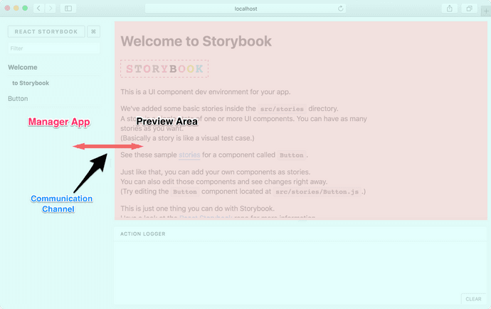
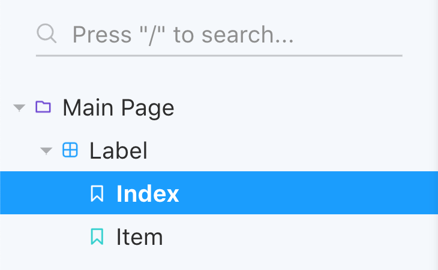

> Storybook is a user interface development environment and playground for UI components.

Storybook은 UI 개발 환경이며 동시에 UI 컴포넌트 플레이그라운드라고 할 수 있다.

### Table of Contents

- Quick Start
- Before
- Writing Stories
- Store connected component
- 마무리

## Quick Start

빠르게 Storybook 개발 환경을 구축한다. CRA 기반에서는 `--type react_scripts` 와 함께 `init` 커맨드를 실행한다.

```sh
npx -p @storybook/cli sb init --type react_scripts
```

요즘 대부분의 라이브러리, 프레임워크들은 CLI 도구를 내장하고 있다. Storybook 또한 지원하고 있는 CLI를 통해 빠르게 개발 환경을 구축할 수 있다. `init` command는 storybook과 관련된 dependency들을 설치해주고, `stories` directory를 만들어 예제 코드까지 생성해준다.

심지어 npm script에 `storybook`, `build-storybook` script 까지 추가해줘서 커맨드 하나로 Storybook 개발 환경을 구축할 수 있다.

> 개발 환경을 처음부터 구축하고 싶은 분들은 Storybook의 공식 가이드 중 [Slow Start Guide](https://storybook.js.org/docs/guides/slow-start-guide/)를 참고하시면 된다.

### Configuration

Storybook 관련 설정은 CLI가 프로젝트 루트에 만들어주는 `.storybook` directory에서 작성할 수 있다. 앞서 실행한 `init` command는 다음과 같은 `main.js`가 만들어진다.

```js
module.exports = {
  stories: ['../src/**/*.stories.js'],
  addons: [
    '@storybook/preset-create-react-app',
    '@storybook/addon-actions',
    '@storybook/addon-links',
  ],
}
```

### TypeScript

초기 설정에서는 TypeScript를 지원하지 않는다. CRA 기반이라면 `@storybook/preset-create-react-app` preset으로 사용이 가능하다. CLI 도구로 생성된 파일의 확장자와 `main.js`의 `stories` 설정만 변경하면 된다. CRA가 아닐 경우 [여러 가지 설정](https://storybook.js.org/docs/configurations/typescript-config/#setting-up-typescript-with-ts-loader)을 해줘야 한다.

```js
const React = require('react')
const customWebpackConfig = require('../craco.config.js')
const { addDecorator } = require('@storybook/react')

module.exports = {
  stories: ['../src/**/*.stories.tsx'],
  addons: [
    '@storybook/preset-create-react-app',
    '@storybook/addon-actions',
    '@storybook/addon-links',
    '@storybook/addon-viewport/register',
  ],
  webpackFinal: async config => {
    const { webpack } = customWebpackConfig()

    return {
      ...config,
      resolve: {
        ...config.resolve,
        alias: {
          ...config.resolve.alias,
          ...webpack.alias,
        },
      },
    }
  },
}
```

관련 설정은 [cra-template-unicorn](https://github.com/JaeYeopHan/cra-template-unicorn)에 추가될 예정이다.

## Before

Storybook은 단지 독립된 환경을 제공할 뿐이라 활용할 수 있는 방법이 많다. 즉 개발자가 Storybook을 어떻게 사용할 것인지에 따라 구성을 다르게 가져갈 수 있다. 다음과 같이 사용할 수 있을 것 같다.

1. Button, Input 과 같은 엘리먼트 단위의 story 작성
2. 여러 컴포넌트의 조합 단위로 story 작성
3. 페이지 단위의 story 작성

1번 같은 경우에는 Design System에서 많이 사용되는 방법이다. 필자가 진행한 프로젝트에서는 [[Testing] 4. 컴포넌트 테스트와 검증](https://jbee.io/react/testing-4-react-testing/)에서도 언급했듯이 3번의 방법으로 Storybook을 활용했다. 2번, 3번과 같이 여러 컴포넌트의 조합에 대해 story를 작성할 경우, store에 connect된 상황을 작성해야 하는데, 이 때 addon을 통해 해결할 수 있다.

## Addons

Storybook에는 **addon**이라는 plugin 시스템이 있다. 공식적으로 지원하고 있는 addon 뿐만 아니라 여러 오픈소스 addon들이 존재한다. ([참고](https://storybook.js.org/addons/)) 여러 가지 addon을 register하여 Storybook의 기본 기능에 여러 가지 기능들을 추가할 수 있다.



Storybook은 **Manager 영역**과 **Preview 영**역으로 나뉘어 렌더링 된다. Preview 영역이 iframe으로 되어 있기 때문에 Manager 영역과 Preview 영역은 별도의 Storybook Communication Channel을 통해 데이터를 주고 받는다.

## Writing Stories

공식 문서에서는 `storiesOf` 라는 API 대신 Storybook 5.3 version부터 지원하기 시작한 [Component Story Format(CSF)](https://storybook.js.org/docs/formats/component-story-format/)가 권장되고 있다.

```ts
import React from 'react'

import { Label } from '@/components/main/Label'
import { LabelIndex } from '@/components/main/LabelIndex'

export default {
  title: 'Main Page/Label',
}

export const Index = () => <LabelIndex />
export const Item = () => <Label id={'post2'} />

Item.story = {
  decorators: [
    /* something */
  ],
}
```

`title` 그리고 `export` 하게 되는 부분으로 Storybook의 Manager Area를 제어할 수 있다.



Storybook의 addon들을 적용하는 것과 story를 작성하는 부분은 몇번만 작성해보면 금방 작성할 수 있다. 다만 Manager 영역을 어떻게 구성할지 사전에 프로젝트 이해 관계자들 간의 의사결정이 필요하다.

보다 자세한 포스팅은 velopert님이 작성하신 [이 글](https://velog.io/@velopert/start-storybook)을 참고하면 좋을 것 같다.

## Store connected component

상태 관리를 위해 Redux나 MobX와 같은 Store 라이브러리를 사용할 때, 이 Store와 연결된 컴포넌트에 대해서 story를 작성해야 하는 경우가 생긴다. 공식 문서에서는 `connect` 할 때, 컴포넌트를 분리하여 story를 작성하도록 [권고](https://www.learnstorybook.com/intro-to-storybook/react/en/data/)하고 있다.

그러나 React에 Hooks API가 등장하고 react-redux에서 `useSelector`라는 API가 지원되면서 권고하고 있는 방법은 사용하기 힘들어졌다. 결국 Storybook에서 관리되는 고립된 환경에 redux를 추가해줘야 했다.

- [https://github.com/frodare/addon-redux](https://github.com/frodare/addon-redux)

이미 만들어진 redux addon이 존재했고 잘 사용하고 있었다. 내부적으로는 다음과 같이 되어있다.

```ts
export const withProvider = (reduxStore) => (storyFn: StoryFunctionType) => {
  return <Provider store={reduxStore}>{storyFn()}</Provider>
}

export const withRedux = <R extends Reducer>(rootReducer: R) => (
  mockState: unknown,
) => {
  const store = createStore(
    rootReducer,
    mockState,
    applyMiddleware(...)
  )

  return withProvider(store)
}
```

Storybook에서 렌더링하는 컴포넌트를 `storyFn`로 전달받아 `<Provider>` 컴포넌트로 wrapping하여 렌더링하게 된다. 그리고 이 Provider에는 독립된 Storybook 환경에서 사용할 store를 별도로 생성하여 전달해준다.

### With data fetching

그러나 컴포넌트에서 **data fetching이 이루어질 경우**, mocking한 state가 story에 제대로 반영되지 않는 문제가 발생했다. 이를 위해서 redux middleware에서 발생하는 action을 disable하는 로직을 추가해줬다.

```ts
import { Action, Middleware, MiddlewareAPI } from 'redux'

export type ActionsPreventMiddlewareOptionType = {
  allowedActions?: string[]
  debug?: boolean
}

export const preventActions = (option: ActionsPreventMiddlewareOptionType) => {
  const actionPreventMiddleware: Middleware = (store: MiddlewareAPI) => {
    return next => <A extends Action>(action: A) => {
      if (option.allowedActions.indexOf(action) > -1) {
        return next(action)
      }

      return store.getState()
    }
  }

  return actionPreventMiddleware
}
```

`allowedActions`를 통해 action 배열을 option으로 전달하여 필요한 action만 dispatch하도록 하였다.

직접 만든 middleware를 Storybook 환경에 주입되는 store에 추가해줬고 이를 통해 mocking되는 경우에는 `withState`라는 별도 API를 util로 만들어 사용했다.

```ts
import { withRedux } from '../../.storybook/decorators/addon-redux-toolkit'
import { rootReducer } from '../modules'

export const withState = withRedux(rootReducer)
```

Story는 다음과 같이 작성되었다.

```ts
Item.story = {
  decorators: [
    withState({
      // Something state
    }),
  ],
}
```

## 마무리

UI를 검증하는데 있어서 화면이 많고 여러 단계를 거쳐야 하는 모바일 페이지 작업을 할 때 유용하게 사용했던 도구, Storybook에 대해 소개했다. 이번 프로젝트에서도 잘 사용하고 있고 도입하기 참 잘했다고 생각이 되는 도구 중 하나이다.

> 포스트에서 사용된 코드는 [react-data-handling-lab Repository](https://github.com/JaeYeopHan/react-data-handling-lab)에서 확인하실 수 있습니다.
