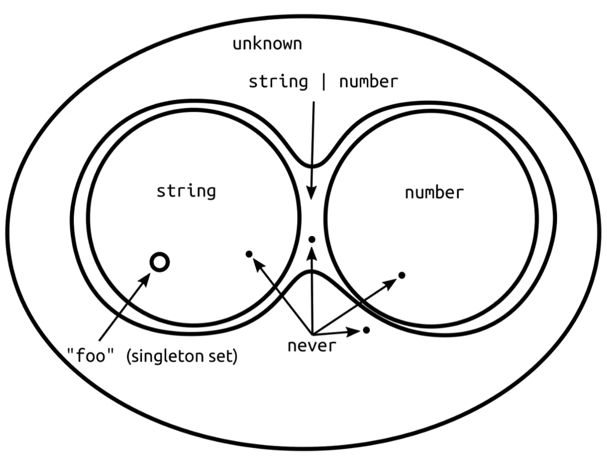

TypeScript 3.0 version부터 `unknown`이라는 새로운 타입이 추가됐다.

### any vs unknown

`unknown` 타입이 도입된 배경을 보다 잘 이해하기 위해 `any` 타입을 살펴봐야 한다. TypeScript에서 `any`는 모든 타입을 할당받을 수 있는 타입이다. 즉 `any` 타입으로 선언된 변수, argument는 모든 타입의 값이 할당될 수 있고 전달될 수 있는 것이다.

`unknown` 타입도 `any`과 마찬가지로 모든 타입의 값이 할당될 수 있다.

```ts
let variable: unknown

variable = true // OK (boolean)
variable = 1 // OK (number)
variable = 'string' // OK (string)
variable = {} // OK (object)
```

하지만 조금 다른 것은 `unknown` 타입으로 선언된 변수는 `any`를 제외한 다른 타입으로 선언된 변수에 할당될 수 없다는 것이다.

```ts
let variable: unknown

let anyType: any = variable
let booleanType: boolean = variable
// Error: Type 'unknown' is not assignable to type 'boolean'.(2322)
let numberType: number = variable
//  Error: Type 'unknown' is not assignable to type 'number'.(2322)
let stringType: string = variable
//  Error: Type 'unknown' is not assignable to type 'string'.(2322)
let objectType: object = variable
//  Error: Type 'unknown' is not assignable to type 'object'.(2322)
```

`unknown` 타입의 특징은 한 가지 더 있는데, `unknown` 타입으로 선언된 변수는 프로퍼티에 접근할 수 없으며, 메소드를 호출할 수 없으며, 인스턴스를 생성할 수도 없다. **알려지지 않은 타입**이라 그런 것이다.

```ts
let variable: unknown

variable.foo.bar // Error: Object is of type 'unknown'.(2571)
variable[0] // Error
variable.trigger() // Error
variable() // Error
new variable() // Error
```

다음과 같이 **Type Guard**와 함께라면 가능하다. ([https://jbee.io/typescript-tutorials/TS-7-TypeScript-type-system/#type-guards](https://jbee.io/typescript-tutorials/TS-7-TypeScript-type-system/#type-guards))

```ts
let variable: unknown
declare function isFunction(x: unknown): x is Function

if (isFunction(variable)) {
  variable() // OK
}
```

물론 Type Assertion을 통해서 에러를 사라지게 할 수 있다. (Runtime에서 앱이 죽는 것을 바란다면 이것 또한 좋은 방법이다.) [https://jbee.io/typescript-tutorials/TS-7-TypeScript-type-system/#type-assertion](https://jbee.io/typescript-tutorials/TS-7-TypeScript-type-system/#type-assertion)



유니온(Union)은 쉽게 말하면 합집합이다. 따라서 unknown 타입과 다른 타입을 `|`로 유니온 타입으로 합성하게 되면 `unknown` 타입이 반환된다.

인터섹션(intersection)은 교집합이라고 할 수 있다. 따라서 unknown 타입과 다른 타입을 `&`로 인터섹션 타입으로 반환하게 되면 대상이 된 타입이 반환된다.

```ts
type unknownType = unknown | string // unknown
type stringType = unknown & string // string
```

`unknown` 타입에 대해 좀 더 깊게 알고 싶은 분들은 서재원님이 작성하신 [안전한 any 타입 만들기](https://overcurried.netlify.com/%EC%95%88%EC%A0%84%ED%95%9C%20any%20%ED%83%80%EC%9E%85%20%EB%A7%8C%EB%93%A4%EA%B8%B0) 글을 읽어보면 좋을 것 같다.

## When

그렇다면 `unknown` 타입을 언제 사용할 수 있을까?

### Instead of any

`any`가 사용될 곳이라면 `unknown` 타입으로 대체할 수 있다. 위 예제 코드에서도 살펴봤듯이 `unknown` 타입으로 지정된 값은 타입을 먼저 확인 후에 무언가를 할 수 있기 때문에 안전하다.

### Type Guard

`isOfType`이라는 어떤 객체의 프로퍼티로 타입을 판단하는 util function에 `unknown` type을 사용할 수 있다.

```ts
const isOfType = <T>(
  varToBeChecked: unknown,
  propertyToCheckFor: keyof T
): varToBeChecked is T =>
  (varToBeChecked as T)[propertyToCheckFor] !== undefined
```

`varToBeChecked` 인자로 어떤 타입의 값이 전달될지 알 수 없으므로 무한 유니온 타입(`string | number | boolean | ...`)으로 선언하던가 `any` 타입으로 선언해야 할텐데, 이 때 `unknown` 타입을 사용할 수 있다. 위 type guard util function은 다음과 같이 사용할 수 있다.

```ts
interface SomethingType {
  foo: string
  bar: number
  zoo: boolean
}

const anything = {
  foo: '',
}

console.log(isOfType<SomethingType>(anything, 'foo')) // true
```

## 마무리

`any`를 조금이라도 덜 쓰기 위해 tsc에 `strict: true`을 주고 컴파일 단계에서 발생할 수 있는 버그를 하나 둘씩 해결해 나가길 바란다.

## References

- [https://mariusschulz.com/blog/the-unknown-type-in-typescript](https://mariusschulz.com/blog/the-unknown-type-in-typescript)
- [https://levelup.gitconnected.com/when-to-use-unknown-and-never-types-in-typescript-6cd4a54b79b7](https://levelup.gitconnected.com/when-to-use-unknown-and-never-types-in-typescript-6cd4a54b79b7)
- [https://blog.logrocket.com/when-to-use-never-and-unknown-in-typescript-5e4d6c5799ad/](https://blog.logrocket.com/when-to-use-never-and-unknown-in-typescript-5e4d6c5799ad/)
