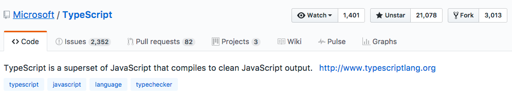

얼마 전, 구글의 발표에 타입스크립트에 관심을 갖게 되었습니다. 기술적인 내용보다는 여러 기술 소식이 담긴 포스팅입니다.
이 포스팅은 17년 4월 중순 경에 작성되었으며 작성되는 시점의 TypeScript version은 `2.2 version`입니다.
(4월 28일, 2.3 version이 release되었습니다.)

## JavaScript의 미래

올해가 벌써 2017년이니, 재작년인 2015년에 `ECMAScript2015(aka ECMAScript6 or ES6)`가 JavaScript 표준으로 정의되었고, 작년에는 `ECMAScript2016(aka ECMAScript7 or ES7)`이 발표되었습니다. 머지않아 `ECMAScript2017`도 발표될 예정(6월 예정)이라고 합니다. `Node.js`의 등장으로 JavaScript가 소프트웨어 개발 환경에서 막대한 비중을 차지하자 현재 [tc39](https://github.com/tc39/tc39-notes)라는 커뮤니티에서 끊임없이 JavaScript라는 언어의 표준을 명세하고 있습니다. 이것은 무엇을 의미할까요?

TypeScript에 대한 이야기를 하기 위해 JavaScript에 관한 내용은 다음 글을 참조하시면 좋을 것 같아 링크를 첨부합니다. [2017년과 이후 JavaScript의 동향 - JavaScript(ECMAScript)](http://d2.naver.com/helloworld/2809766)

## TypeScript의 정체

> TypeScript란 JavaScript의 `super set`이다.

어디선가 이런 말을 많이 들어봤을것 같은데요.

사실, TypeScript는 JavaScript입니다. 기존의 JavaScript와는 다르게 `.ts`라는 확장자를 갖고 있지만 결국 JavaScript로 compile되는 언어입니다. JavaScript의 성장과 동시에 언어 자체의 한계점을 인지한 MicroSoft는 JavaScript에 `타입(Type)`을 추가해서 TypeScript를 만듭니다.(TypeScript의 Type system을 [Structural Type System](https://en.wikipedia.org/wiki/Structural_type_system)이라고 합니다.) 그리고 2016년 9월에 TypeScript 2.0 버전이 공개되었습니다.(현재는 [2.2 version](http://www.typescriptlang.org/docs/handbook/release-notes/typescript-2-2.html) 이네요!)

이와 같은 움직임은 Google에서 개발한 `Dart`에서도 찾아볼 수 있습니다. 하지만 얼마 전, 프론트엔드 개발자들의 눈길을 끌만한 소식이 들려왔습니다.

> [MS 타입스크립트, 구글 사내 표준 언어되다.](http://www.zdnet.co.kr/news/news_view.asp?artice_id=20170413085316&lo=z45)

Google이 만든 프론트엔드 프레임워크 Angular2(얼마 전, [Angular4.0](http://angularjs.blogspot.kr/2017/03/angular-400-now-available.html)이 release되었습니다.)도 Dart, JavaScript를 지원하지만 TypeScript를 공식 언어로 지정할만큼 TypeScript의 위상이 높아졌다는 것을 확인하실 수 있습니다.

이에 더해, 다들 아실만한 협업 툴인 Slack이 TypeScript로 전환했습니다. 다음 링크는 Slack이 코드베이스를 TypeScript로 전환하는 과정에 대한 글로, 정적 분석의 필요성에 대해 인지했다는 내용입니다. [TypeScript at Slack](https://slack.engineering/typescript-at-slack-a81307fa288d)

Facebook에서 개발한 정적 타입 분석기(static typechecker of javascript) `Flow`도 마찬가지 행보가 아닐까 생각합니다. 애플리케이션의 규모가 커질 수록 안정성에 대한 수요는 높아지기 마련입니다. 동적 타입이라는 JavaScript가 갖고 있는 장점이자 한계점인 이 부분을 해결하기 위해 정적 분석의 중요도가 높아지고 있습니다.

## TypeScript의 현주소

이젠 개발자들에게 없어서는 안 될 존재인 `Github`의 [star](https://github.com/Microsoft/TypeScript)를 보니 `21,076개`입니다! (star개수가 64,556개인 React에 비하면 한참 멀었네요!) 올라온 Issue는 2,351개고 진행중인 Pull Request는 82개가 되네요.

다음 자료는 Github과 마찬가지로 개발자들에게 없어선 안 되는 [Stackoverflow의 조사 자료](http://stackoverflow.com/insights/survey/2017/#most-loved-dreaded-and-wanted)입니다. 개발자들이 가장 사랑하는 언어로 Rust, Smalltalk에 이어 TypeScript가 3위를 당당히 차지했습니다.(오, 이 정도인가요?)

추가된 Type System을 바탕으로 여러 가지 Tool과 구문 완성(content assist) 등의 도움을 받을 수 있는 TypeScript 소개였습니다. 얼마 전 공개된 [ReactXP](https://github.com/Microsoft/reactxp)를 만든 Microsoft의 지지로 React에서도 TypeScript 방향으로 가지 않을까 생각해봅니다.(Flow 의문의 1패?) 무엇을 공부해야 하나 걱정할 필요없는 프론트엔드 개발자분들을 응원합니다. 감사합니다 :)

_cf. 짤막하게 정리해본 [TypeScript Quick Start](https://jaeyeophan.github.io/2017/04/19/TS-0-Quick-Start/)입니다._

### TypeScript와 관련된 글과 그룹

- [Microsoft/TypeScript-Handbook](https://github.com/Microsoft/TypeScript-Handbook)
- [TypeScript Korea 페이스북 그룹](https://www.facebook.com/groups/TSKorea/?hc_ref=SEARCH)
- [TypeScript를 무서워하지 않아도 되는 이유(번역)](http://han41858.tistory.com/14)
- [TypeScript 소개(hyunseob님 블로그)](https://hyunseob.github.io/2016/09/25/typescript-introduction/index.html)
