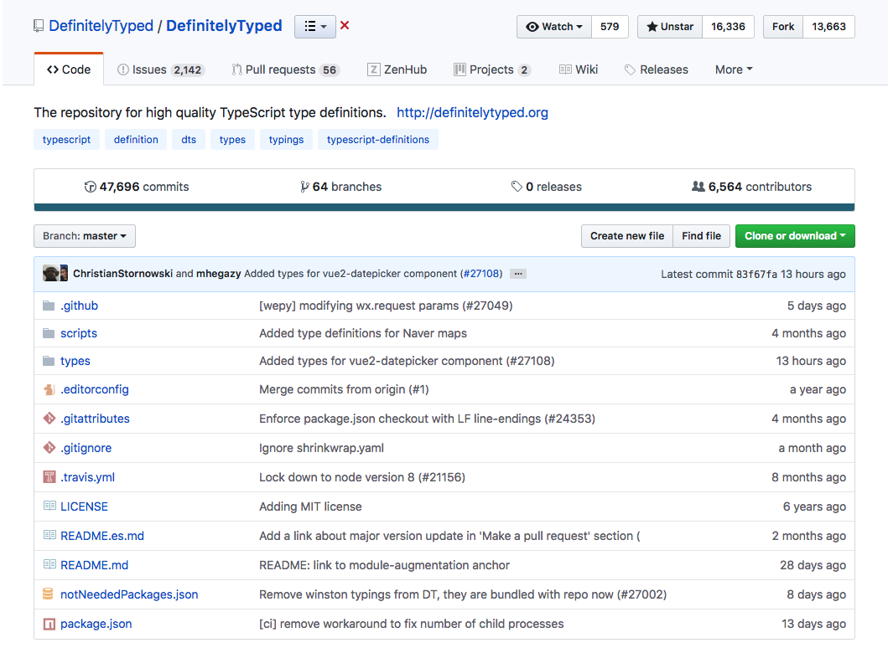
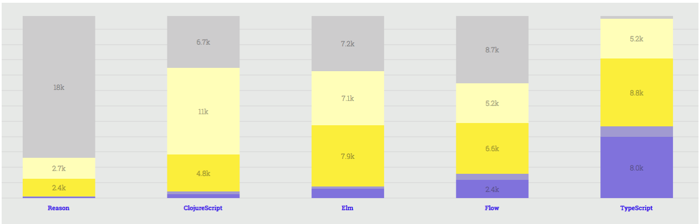
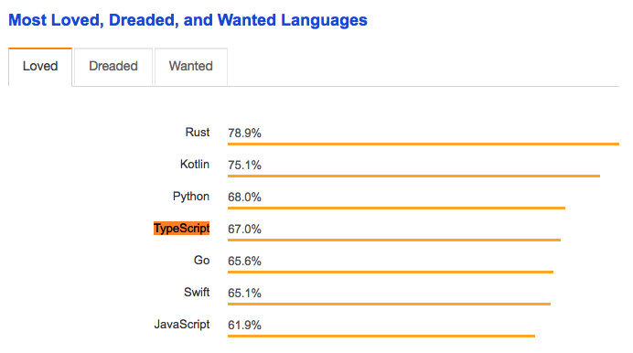
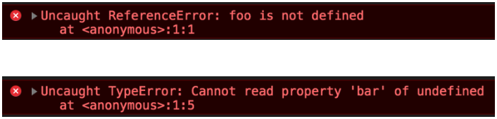

TypeScript에 대해 이야기해보려고 합니다. 기술적인 내용보다는 TypeScript 도입 시 고민할 수 있는 내용들을 중점적으로 정리했습니다.
TypeScript 문법에 대한 내용은 이 글의 맨 아래 Reference 에 걸린 링크들을 확인해주시면 됩니다.

올해 초, 프로젝트에 TypeScript를 사용했고 그 경험을 기반으로 작성했습니다. 긍정적인 경험이었기 때문에 주변에 전파하려고 했지만 쉽지가 않았습니다. 그래서 어떠한 고충이 있는지 알아보기 위해 페이스북 그룹에서 설문을 했습니다.

> TypeScript를 도입하지 않은 이유는 무엇인가요?


Facebook '프론트엔드 개발 그룹' 설문 조사 결과총 **197표**가 나뉘어졌고 중복 투표하신 분들도 계시기 때문에 약 150~160분께서 답변을 해주셨습니다. 낮은 표를 받은 순서대로 하나씩 짚어보겠습니다. (설문에 참여해주신 분들, 댓글로 소중한 의견을 남겨주신 분들 모두 감사드립니다. 위 페이스북 [링크](https://www.facebook.com/groups/webfrontend/permalink/1366303896847675/)에서 본 설문과 댓글을 보실 수 있습니다.)

## #1 아직 언어 자체가 미성숙하지 않아! 😡 - 1표

사실 이 항목을 추가할 때, '미성숙'이란 단어를 다른 직관적인 단어로 바꿔 말할 수 있을까 고민을 많이 했습니다. 제가 의도한 '미성숙하다'의 의미는 다음과 같습니다.
'아직 Production Level에서 사용할 정도로 그 안정성이 입증되지 않았으며 만들고 있는 단계의 언어이다.'
이 의미가 제대로 전달이 되었는지는 잘 모르겠지만 다행히 이 항목은 1표만 받았습니다. TypeScript는 아직 불안정하고 미성숙한 언어일까요? 많은 분들이 이 부분에 대해서는 의심하지 않았고 그 이유는 다음과 같습니다.

### 1. 이미 많은 production들이 TypeScript로 작성되었다.

TypeScript를 사용하고 있는 여러 서비스들을 이 목록에서 확인하실 수 있습니다. 가장 대표적인 예로 Visual Studio Code라는 에디터가 있습니다. 많은 사랑을 받고 있는 에디터 중 하나인데요, 이 VSCode는 TypeScript로 작성되어 있습니다.
우리가 만드는 웹 애플리케이션의 복잡도는 정말 다양합니다. 그 중에서도 '에디터'는 높은 복잡도를 가지고 있다고 단언할 수 있는데요, 이렇게 복잡한 애플리케이션이 TypeScript로 작성되었다고 한 것은 그만큼 TypeScript가 Production Level에서도 충분히 사용될 수 있음을 의미합니다.

### 2. '발전하고 있음'은 그 언어의 성숙도를 말해준다.

TypeScript RoadMap을 참고해보시면 끊임없이 여러 이야기가 오고 가고 그에 따라 TypeScript는 발전하고 있습니다. 이 글을 쓰는 시점은 3.0@rc까지 올라와있습니다. 이렇게 만들어 지는 과정이라고 해서 불안정하다는 것이 아니라는 것을 많은 분들이 이미 알고 있습니다. TypeScript는 이미 안정 단계에 들어선 것만큼은 확실합니다.

## #2 너무 어려워! 😫 - 1표

1표를 받은 항목입니다. JavaScript만 하다가 Generic, Type Inference, Type Compatibility, Type Casting 등 여러 typing과 관련된 문법들을 만나면 어렵다고 느끼게 되는 것 같습니다. 하지만 이러한 고급 문법들도 있지만 간단한 적용을 통해 우리의 개발 과정을 조금이나마 편하게 해주는 간단한 문법도 있습니다. '기본적인' TypeScript 문법은 이 문서의 뒷 부분에서 다루겠습니다. 그래도… Elm, PureScript 보다는 덜 하지 않을까 싶네요 :)
아, 우리는 TypeScript를 하지 않아도 ECMAScript spec마다 추가되는 문법을 학습해야 합니다.

## #3 난 더이상 뭘 더 배우고 싶지 않아! 😇 - 1표

1표를 받은 항목입니다. 거의 2년이 지난 글이지만, 2016년에 자바스크립트를 배우는 기분 글이 생각나네요. 빠른 변화가 프론트엔드 개발자들을 지치게 하는 것은 사실이지만 그 와중에서도 우리의 서비스에 필요한 것들을 취사선택할 필요가 있습니다. 제 입장에서 TypeScript는 취사 선택된 기술 중 하나입니다. TypeScript가 가져다주는 이점 때문인데요, TypeScript를 사용한 프로젝트들에서도 이 이점 때문에 넘쳐나는 기술 중 TypeScript를 선택하지 않았을까요? 이 이유에 대한 내용은 글의 뒷 부분에서 다룰 예정입니다.

## #4 다 필요없고 MS가 만들었잖아! 😈 - 2표

죄송합니다. 제가 드릴 말씀은 없네요… 2표나 받은 항목인데요, 참 아쉬운 이유입니다. GitHub 인수 때도 뭇매를 맞던 MS, 참 불쌍합니다.

## #5 다른 대체재로 만족하고 있어! 😎 - 8표

반갑습니다, 타이핑 동지!
8표를 받았습니다. 각자의 철학이 다르니 우리는 서로 갈 길을 갑시다! 혹시 시간이 되신다면 안희종님의 TypeScript와 Flow: 자바스크립트 개발에 정적 타이핑 도입하기를 읽어보세요! 이 자료는 발표 영상도 있습니다.
개인적으로는 별도의 라이브러리를 사용하기 보다는 언어 차원에서 typing을 하고자 flow를 사용해본 경험은 없습니다. 다만, TypeScript가 더 매력적인 이유는 TypeScript의 Design Goal에서 확인하실 수 있습니다.
TypeScript Design Goals 6. Align with current and future ECMAScript proposals.
새로운 프로젝트에 JavaScript에 정적 타이핑을 도입하고자 하시는 분들은 Flow가 아닌 TypeScript를 선택하시길 권장합니다. (아래 도표를 참고해주세요!)

## #6 생태계가 아직 발전하지 않아서 힘들어! 😞 - 10표

10표를 받은 항목입니다. 특정 프레임워크, 라이브러리, 언어를 선택할 때 우리는 '생태계가 제대로 갖춰져 있는가' 를 고려합니다. 언제 어떻게 발생할지 모르는 상황에 대해 대처할 수 있는 확률도 높아지고 코드도 참고할 수 있고 사용할 수 있는 라이브러리도 그만큼 많아지기 때문입니다. 그렇다면 TypeScript 생태계는 어떨까요?

### 1. @types/의 부재(?)

JavaScript 라이브러리를 TypeScript 프로젝트에서 사용하려고 할 때 .d.ts로 정의된 타입 정의 파일이 필요합니다. TypeScript를 사용하면서 얻는 이득들은 TSC(TypeScript Compiler)의 마법이 아니라 타입이 정의되었기 때문인데요, TSC가 사용하고자 하는 라이브러리의 API를 판단할 때, .d.ts를 바라보기 때문에 이 파일이 필요합니다.
물론 compiler option에서 skipLibCheck option을 꺼주면 됩니다. 하지만 이 옵션을 끄게 되면 TypeScript가 가져다 주는 이점이 반으로 줄어들기 때문에 아쉬움이 많이 남는 선택입니다.



> DefinitelyTyped GitHub Repository

하지만 DefinitelyTyped라는 Repository에서 그 작업이 활발히 진행되고 있고 어느 정도 '유명한' 라이브러리에 대해서는 타입 정의가 되어 있습니다. 오히려 type이 정의되어 있지 않은 라이브러리를 사용할 때 contribution의 기회가 될 수도 있겠습니다!

### 2. 긍정적인 개발자들의 인식



> The State of JavaScript

많이 사용해야 그 만큼 생태계가 발전할 수 있다고 생각합니다. 최신에 진행된 JavaScript 관련 설문조사인 The State of JavaScript 2017를 살펴보면 그만큼 사용자 수가 많이 늘어난 것을 확인하실 수 있습니다. 또한 다른 정적 타이핑을 위한 도구, 언어보다 압도적인 지지와 관심을 받고 있습니다.



StackOverflow surveyStackOverflow에서 진행한 Survey Result에서는 가장 사랑하는 언어 4위로 뽑혔네요.

### 3. 빵빵한 Maintainer

MS라는 빵빵한 메인테이너가 있으니, 믿을만 합니다. 얼마 전, Seattle에서는 TSConf도 열렸습니다.


TSConf 2018이러한 것들로 100% 증명할 수는 없겠지만 점점 발전하고 있는 TypeScript 라고 생각합니다. TypeScript Korea 에서는 정기적인 Meetup을 통해 TypeScript 사용자 간의 기술 공유의 장을 마련하고 블로깅을 통해 TypeScript 생태계를 발전시키기 위해 노력하고 있습니다! :)

## #7 타이핑이 너무 많아져서 '생산성'이 떨어져! 😱- 18표

**18표**를 받았습니다. 우리는 '**생산성**'이라는 용어에 대해 **다시 생각해볼 필요가 있습니다.** 우리가 만드는 애플리케이션은 하나의 생물과 같습니다. 한 번 개발된 애플리케이션은 배포 후 방치되는 것이 아니고 끊임없이 변화합니다. 사용자의 반응에 따라 또는 비즈니스의 변화에 따라 새로운 기능이 추가되기도 하고 제대로 동작하고 있던 기능이 사라지기도 합니다. 이러한 변화에 유연하게 대응하기 위해 '리팩토링'이라는 작업도 필연적으로 따라옵니다.

즉 개발자의 생산성을 정의할 때, 개발자들이 컴퓨터 앞에 앉아서 '무엇을' 하느냐를 먼저 살펴보아야 합니다.

개발자들은 '새로운 것을 만드는 일'만 하는 것이 아닙니다. 오히려 새로운 것을 만드는 경우가 더 적다고 봐도 무방할 정도로 많은 유지보수 일이 있고 버그를 대응하는 일이 있습니다. 또한 유지보수 대상인 프로젝트는 자신이 개발하지 않았던 경우가 허다합니다. 그렇기 때문에 **가독성이 좋은 코드**를 작성하려 하고 변수명을 짓는데 열중합니다.

_**단연컨대 이런 부분에 있어서 JavaScript는 매우 부족합니다.**_

### 가독성이 좋은 코드

프로젝트를 구성하고 있는 수많은 클래스가 있습니다. 어떤 하나의 클래스가 어떠한 역할을 수행하는지 알 수 있는 방법은 해당 클래스에 있는 함수들을 일일히 확인해봐야 합니다. 그리고는 이 함수가 어떤 변수를 받아서 어떠한 값을 반환하는지 알 수 있는 방법은 console을 찍거나 직접 break point를 찍어 디버깅을 해봐야 합니다. 코드로 확인할 수 있는 것은 의미가 불명확한 변수 이름 뿐입니다. (다행히 테스트 코드가 있다면 얻을 수 있는 정보가 조금 더 있겠습니다.)

부족한 내용들을 보충하기 위해 우리는 주석을 추가합니다. 하지만 아쉽게도 주석은 **그저 텍스트에 불과할 뿐** 우리가 개발하는데 있어서 큰 도움을 주지 못합니다. 그저 유지보수할 거리(추후 변경 요소)를 하나 더 늘려줄 뿐입니다. private임을 나타내기 위해 `_`를 사용하는 것 또한 마찬가지입니다.
다른 이유를 전부 뒤로 하고 코드의 가독성을 높이기 위한 수단이라는 하나의 이유만으로 TypeScript를 도입해야 하는 근거가 발생합니다. TypeScript에서 제공하는 basic type과 access modifier, interface만 곁들여도 코드가 훨씬 더 읽기 쉬워질 것 입니다. (위 문법들에 대한 내용은 뒤에서 다룹니다.)

### 에러 발생 확률이 적은 코드



자바스크립트 개발을 하다보면 한 번 쯤은, (또는 하루에 한 번 쯤) 마주한 에러 메세지 일텐데요, 이런 개발자의 실수 때문에 쓸데없이 시간을 뺏기면 그만큼 **생산성이 떨어지게 됩니다.** TypeScript에서는 100%까진 아니더라도 컴파일 단계에서 이런 버그를 잡아낼 수 있습니다.

결론은 생산성이 떨어진다기 보다는 높아진다는 것이 제 경험입니다. 이와 관련해서는 좀 더 추가적인 정보가 필요할 것 같아 댓글을 첨부합니다.

- 타이핑으로 인해 생산성이 떨어지는 문제는 초반에 잠깐 경험했지만, 각 사례와 문서를 살펴보면서 익숙해지면 오히려 생산성에 긍정적인 영향을 주는 거 같다.
- 타입스크립트 타이핑에 어울리지 않는 프레임워크, Vue나 koa처럼 미들웨어 방식으로 런타임에서 타입이 확장되면 제대로 정의하기 어려워지는 것 같다.
- 타이핑이 너무 어려워져서 생산성에 부정적 영향을 끼치니 도입 필요성이 줄어든다.
- 타이핑으로 인해 생산성이 떨어지는 문제는 초반에 잠깐 경험했다. 각 사례와 문서를 살펴보면서 익숙해지면 오히려 생산성에 긍정적인 영향을 주는 거 같다.

## #8 레거시에 도입 시, '비용'이 너무 많이 들어! 😔- 35표

35표라는 많은 표를 받았습니다. **'점진적 도입'**이라는 말이 있습니다. 한 파일 씩 TypeScript로 변경하는 것입니다. 해야할 것은 그렇게 많지 않습니다.

- build 과정에서 TypeScript 빌드 단계 추가하기
- `tsconfig.json`의 `allowjs` option 켜기
- `.js` 파일을 `.ts`로 변경하기
- TypeScript 문법으로 변경하기
  m- odule system 신경쓰기

기본 문법들은 그냥 변경해주면 되지만 `import` / `export`는 조금 신경써줘야 합니다. 이렇게 하면 **JavaScript와 TypeScript의 공존의 시대**가 열립니다. 자세한 코드와 함께 단계별로 설명하는 것인 해당 글의 취지와는 약간 벗어나기 때문에 관련 좋은 자료를 소개해드립니다.

- TypeScript 한글 문서 - JavaScript 프로젝트 마이그레이션 하기 ([Link](https://typescript-kr.github.io/pages/tutorials/Migrating%20from%20JavaScript.html))
- TypeScript 도입 경험에 대하여 조성우님이 FEConf 2017에서 발표해주신 [영상](https://www.youtube.com/watch?v=Ud-ZQ9LMoeU)이 있습니다.

이렇게 '점진적으로' 도입한다 하더라도 절대적인 '비용'은 줄어들지 않는 것처럼 느껴집니다. 여기서 '**비용**'은 프로젝트를 운영하는데 투입되는 '시간', '인력' 등의 **리소스**를 의미합니다.

- 한 **개발자**가 **특정 시간**을 들여 이미 잘 돌아가는 JavaScript 코드를 TypeScript로 마이그레이션한다.
- 이미 **익숙한** JavaScript 대신 TypeScript를 프로젝트에 도입해 학습 시간을 필요로 한다.

이것들은 오히려 해야 할 task가 더 늘어나는 것이기 때문에 **비용**을 증가시킵니다.

프로그래밍을 할 때 알아야 하는 5가지 인지 편향 중 하나입니다.

### 과도한 가치 폄하(Hyperbolic Discounting)

> 나중의 더 큰 보수 대신에 지금 당장의 이익을 우선 시 하는 것

처음에는 공부해야 할 것도 생기고 타이핑하는 양이 조금 늘고 시간이 필요할 수 있습니다. **하지만,**

- `.` 이 해주는 auto-complete으로 상쇄됩니다.
- **가독성 좋은** 코드로 눈이 편안해집니다.
- **'Move to definition'** 기능으로 소스 파악이 수월해집니다.
- 쓸데없는 주석이 없어져 코드 파일이 깔끔해집니다.
- 소스 간의 관계를 주석이 아닌 소스로 가능해집니다.
- …

많은 투자사들이 미래의 수익을 위해 투자를 하듯, 일정량의 비용을 미래를 위해 투자할 필요가 있다고 생각하며, 투자 대상으로써 TypeScript는 그만한 가치가 있다고 생각합니다.

## #9 그냥 딱히 필요성을 못 느껴… 🤔

_**네, 필요없습니다.**_

- 팀에 프론트엔드 개발자가 **한 명**이고
- 작성해야 하는 JavaScript 코드가 **1000 줄 이하**이며
- 앞으로 유지보수 할 일이 전혀 없는 **'서비스'** 프로젝트 일 때.

위 세 가지 경우(각각은 and 조건)일 때, TypeScript는 독이 됩니다. 코드의 가독성을 높여 협업의 효율을 올릴 필요가 없다면 JavaScript로 충분합니다. 1000줄 이하일 경우, 개발자는 코드의 흐름을 온전히 파악하기 쉽기 때문에 JavaScript로 충분합니다. 또한 배포 후 다신 보지 않을 서비스 코드일 경우, 고려해야 할 재사용성과 예외 처리 등이 라이브러리 또는 모듈 코드보다 상대적으로 적기 때문에 JavaScript로 충분합니다.

그리고 **이 경우를 제외한 나머지 경우에는 약**이 됩니다. JavaScript로 충분하지 않기 때문입니다. 제 개인적인 의견이 아닙니다. 이미 [tc39/proposal-private-methods](https://github.com/tc39/proposal-private-methods)에서 private에 대한 논의가 이루어졌습니다.

아무리 몸에 좋은 음식이 있어도 배가 부르면 먹고 싶지 않습니다. 마찬가지로 스스로 필요성을 느끼지 못하는 경우, 도입에 대해 생각을 할 이유가 없습니다. JavaScript가 허점 투성이인 언어이지만 발전하고 있고 많은 도구들이 이를 보완해주고 있습니다. 그리고 여기에 적응했습니다. 그래도 TypeScript를 한 번 쯤 쳐다볼 수 있도록 세 가지 기본 문법을 소개합니다.

## TypeScript 기본 문법, 3가지

### Basic types

TypeScript에서는 여러 [기본 Type](https://www.typescriptlang.org/docs/handbook/basic-types.html)들을 제공합니다. 이 Type들은 특별한 것들이 아닙니다. 우리가 흔히 알고 있는 `string`, `number`, `boolean` 이런 것들을 제공합니다. 이 타입들로 parameter의 타입, 함수 반환값의 타입 등을 정의하여 보다 가독성 높은 코드를 작성할 수 있습니다. TypeScript에서는 `any` 라는 타입도 존재하고 3.0부터는 `unknown` 이라는 타입도 생겼습니다.

### Access Modifier

한 클래스 내에서 멤버 또는 메소드가 `public` 인지 `private` 인지는 정말 중요합니다. JavaScript에서도 이러한 니즈가 있었습니다. 그래서 우리는 변수명 또는 메소드 명 앞에 `_`를 붙여 private 속성인지 public 속성인지 명시해줬습니다. 하지만 이건 사실 아무 소용이 없습니다. 그냥 호출하면 그만이고, 접근하면 그만인 것입니다. 이러한 부분을 language level에서 잡을 수 있다면 변수명도 깔끔해질 뿐더러 보다 안정적인 코딩을 할 수 있을 것입니다.

```js
class Foo {
  _handleKeyup(e) { // ... }
}
```

```ts
class Foo {
  private handleKeyup(e: React.KeyboardEvent<HTMLInputElement>): void { // ... }
}
```

### Type alias, Interface

TypeScript에서 기본적으로 제공하고 있는 타입 외에도 interface를 만들어 type check에 사용할 수 있습니다. 기본적인 다음과 같은 자바스크립트 코드
가 있습니다. 클래스 내에 있는 메소드를 예로 들어보겠습니다.

```js
fetchUsers(requestInfo) {
// ...
}
```

이 `fetchUsers`라는 함수는 내부적으로 this에 접근에 값을 할당하는지 아니면 그 값을 반환하는지 함수 내부를 봐야 합니다. 또한 `requestInfo`가 무엇인지 모르겠습니다. 이 함수를 호출하는 곳까지 가야합니다. (그냥 아무것도 모르겠습니다.)

```ts
private fetchUsers(requestInfo: RequestInfo): Promise<User> {
// ...
}
```

`RequestInfo`라는 인터페이스를 보면 무엇을 인자로 받는지 알겠습니다. 굳이 이동까지 하지 않아도 마우스를 올리기만 하면 VSCode가 알려줍니다. 이 함수는 내부적으로 값을 처리하는 것이 아는 Promise를 반환하고 있습니다. 우리는 이 함수를 async 함수에서 await으로 받던가 then 내부에서 데이터를 처리해야 합니다. 그리고 이 데이터는 User라는 인터페이스를 보면 바로 어떠한 값인지를 알 수 있습니다. 그리고 이 함수는 private으로 선언이 되어 있기 때문에 이 클래스 내부에서만 사용되고 있습니다. 그렇기 때문에 이 함수 내부를 변경할 때 신경써야하는 범위가 확 줄어들게 됩니다.

TypeScript에 대해 부담이 없을 정도로 간단한 문법을 살펴보았습니다. (TypeScript 별 거 없습니다.)

---

## 기타 의견

- 팀 내의 백엔드 개발자분들이 간단한 자바스크립트는 할줄 아시는데 타입스크립트를 배우라고 요구하기는 좀 어려워서요
- react 에서 HOC(High Order Component) 사용시 코드가 좀 '아스트랄'해집니다.
- StyledComponent 모양도 엄청 요상해지구요, Generic 에 익숙하지 않다면 학습비용도 꽤 큰 것 같습니다.
- 함수형이랑은 맞지 않아서
- 입시 교육의 폐혜 인지 모르겠지만, 스터디 결과를 남들과 비교 당하는 상황이 두려운 맴버들의 반발로 도입이 쉽지 않습니다.
- 고객과 오너들이 기존 코드를 고치는 작업을 위해 일정을 빼주지 않습니다.

# 보충 의견

- 이걸 왜 안씁니까? TS로 짜면 마음이 너무 편해요.
- 타이핑으로 인해 생산성이 떨어지는 문제는 초반에 잠깐 경험했습니다. 각 사례와 문서를 살펴보면서 익숙해지면 오히려 생산성에 긍정적인 영향을 주는 거 같습니다.
- 맛을 본 사람은 안 쓸 수 없어요.
- 저도 처음에 "난 자바스크립트의 자유로움이 좋아" 주의 였는데, 이제 타입스크립트 없는 자바스크립트는 불안해서 코딩 못하겠습니다..
- 외국인 개발자 + 담당이 주기적으로 바뀌는 시스템)에서 여러번 위와 같은 상황을 겪으면서 개발을 했었는데, 확실히 타입스크립트 도입 후에는 위 문제가 꽤나 해결된것 같습니다.
- 유지 보수 생각하면 타입스크립트가 답 아닌가요?

---

## Conclusion 🤗

위에서 언급했듯 많은 애플리케이션들이 Production Level에서 TypeScript를 사용하고 있으며 Roadmap에서 볼 수 있듯이 해당 프로젝트가 활발히 진행되고 있습니다. 이미 1년 전에 [구글은 사내 표준 언어로 TypeScript를 지정](https://blog.angularjs.org/2017/04/official-languages-at-google.html)했습니다.

TypeScript는 '단순히 안전하고 증명 가능한 올바른 타입시스템'이 목표가 아닙니다. **올바름과 생산성 사이에 균형을 잡는 것**이 목표인 것입니다. 이 목표를 달성하는데 있어서 TypeScript가 적절하다면 도입을 고려해봐도 좋을 것 같습니다.


> Ryan Dahl said, https://www.youtube.com/watch?v=M3BM9TB-8yA&t=1194s

## Reference

이쯤되면 TypeScript를 도입해볼 생각이 생겼을까요? 그렇다면 좋은 레퍼런스들을 소개해드립니다!

### 한국어로 되어 있는 좋은 자료

- https://github.com/JaeYeopHan/typescript_tutorial
- https://ahnheejong.gitbook.io/ts-for-jsdev/
- https://github.com/typescript-kr/awesome-typescript-korean
- https://typescript-kr.github.io/

영어가 익숙하시다면 다음 [awesome typescript repository](https://github.com/dzharii/awesome-typescript)가 있습니다.

### TypeScript 관련 좋은 발표 자료입니다.

- https://drive.google.com/file/d/1zPAEFNvLyro_fCIe3o_ZHF6BjNis7M_B/view
- https://www.slideshare.net/HeejongAhn/typescript-flow-81799404
- https://www.slideshare.net/ssuser44df45/why-typescript-with-clean-architecture-82371194

### 이 글을 쓰면서 참고한 자료입니다.

- [TypeScript Official WIKI](https://github.com/Microsoft/TypeScript/wiki)
- [2018년과 이후 JavaScript의 동향 - 라이브러리와 프레임워크](https://d2.naver.com/helloworld/3259111)
- [TypeScript compiler option 정리](https://vomvoru.github.io/blog/tsconfig-compiler-options-kr/)
- [우리가 TypeScript를 선택한 이유](https://medium.com/@constell99/%EC%9A%B0%EB%A6%AC%EA%B0%80-typescript%EB%A5%BC-%EC%84%A0%ED%83%9D%ED%95%9C-%EC%9D%B4%EC%9C%A0-b0a423654f1e)
- [TypeScript를 무서워하지 않아도 되는 이유](https://han41858.tistory.com/14)
- [프로그래밍에서 인지 편향](http://www.mimul.com/pebble/default/2018/01/05/1515145860439.html?utm_medium=social&utm_source=gaerae.com&utm_campaign=%EA%B0%9C%EB%B0%9C%EC%9E%90%EC%8A%A4%EB%9F%BD%EB%8B%A4)

> 감사합니다.
