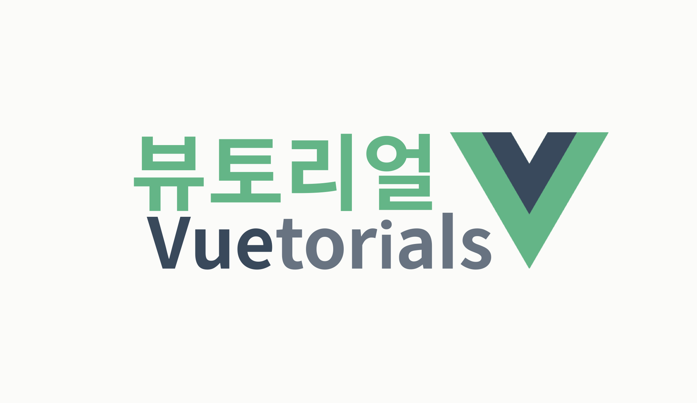

## 구성

각 내용들은 짧은 호흡으로 진행됩니다. @vue/cli 로 시작하여 Vue 에 대한 기본적인 내용을 다루고 Vue 생태계를 구성하고 있는 라이브러리들도 함께 다뤄볼 예정입니다. vuex, vue-router, vue-server-renderer, nuxt 순서가 되지 않을까 싶습니다. 그리고 React 와의 비교가 약간씩 들어갈 예정입니다.

뷰토리얼은 Vue 라는 라이브러리의 A 부터 Z 까지 전부 다루지 않습니다. Vue 의 모든 것을 처음부터 끝까지 다 보려는 목적이라면 책을 보거나 다른 강의나 튜토리얼 포스트를 보세요! 공식 문서 또한 매우 잘 되어있기 때문에 이러한 부분은 별도로 다루지 않습니다.

필자도 공부하면서 정리 중이라 모르는 것은 모른다고 하고 있습니다. (물론 알게 되면 업데이트 예정입니다.)

## 그럼 뭘 다룰 예정인가?

- 개발에 들어갈때 혼동이 될 수 있는 부분
- 매직이 어떻게 동작하는지
- 리액트와 비교
- 필자가 이해한 라이브러리가 추구하는 철학과 방향
- ...

## 이 튜토리얼을 따라가볼 대상자는 누군가?

1. React 또는 다른 라이브러리로 개발을 해봤는데 Vue 도 궁금한 개발자.
2. Vue 로 개발 중인 개발자.
3. Vue 공식 문서 정도 본 개발자.
4. 그냥 Vue 를 훑어보고 싶은 개발자.

## '음슴체'로 작성

뷰토리얼(Vuetorials)이 다른 튜토리얼과 다른 점은 음슴체로 진행된다는 점입니다.(ㅋㅋㅋ) 포스트 하나를 작성하는데 문체를 다듬거나 어순을 변경하는 등 부수적인 요소에 많은 시간이 소요됐습니다. 책을 쓰는 것도 아닌데 조금 더 편한 문체로 작성해도 되지 않나? 라는 생각에 시도해봤습니다.

## 순서

1. [@vue-cli 3.0](https://jaeyeophan.github.io/2018/10/21/Vuetorials-1-vue-cli-3-0/)
2. [Vue 의 전반적인 concept](https://jaeyeophan.github.io/2018/10/21/Vuetorials-2-Vue-concept/)
3. [Vue 의 Component API](https://jaeyeophan.github.io/2018/10/23/Vuetorials-3-Component-API/)
4. [Vue 의 내장 컴포넌트](https://jaeyeophan.github.io/2018/11/05/Vuetorials-4-Internal-Component/)
5. [Vuex API](https://jaeyeophan.github.io/2018/11/07/Vuetorials-5-Vuex/)
6. [Vuex Module Pattern](https://jaeyeophan.github.io/2018/11/16/Vuetorials-6-Vuex-Module-pattern/)
7. [Vuex Best Practice로 가는 여정](https://jaeyeophan.github.io/2018/11/17/Vuetorials-7-Vuex-Best-Practice/)

> Let's Vue!
