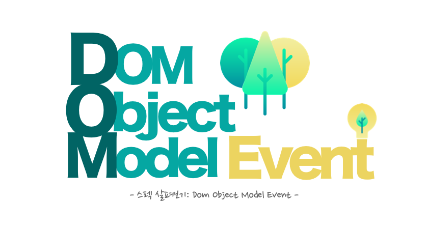
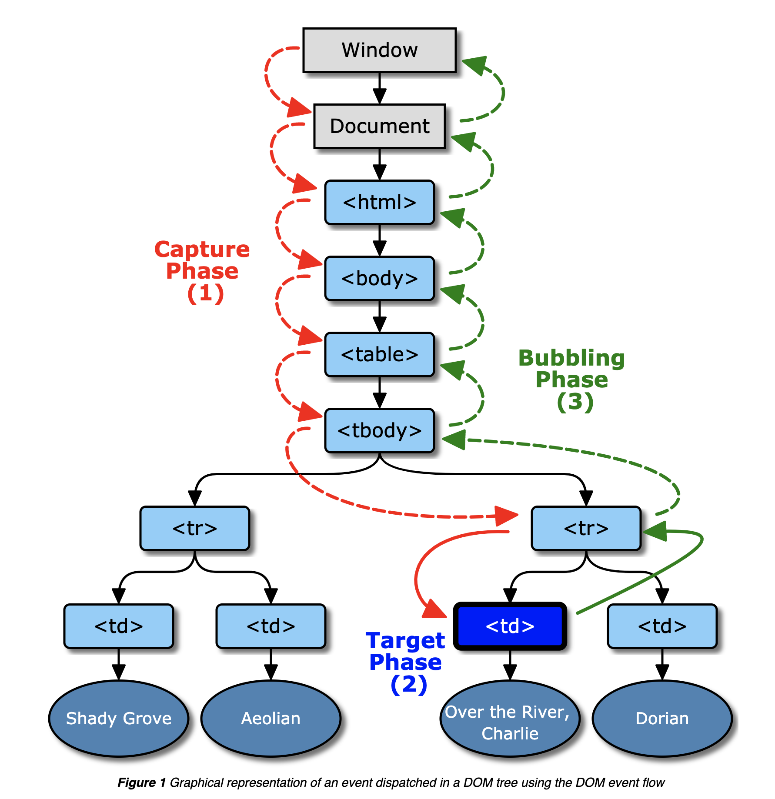
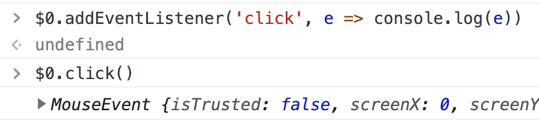
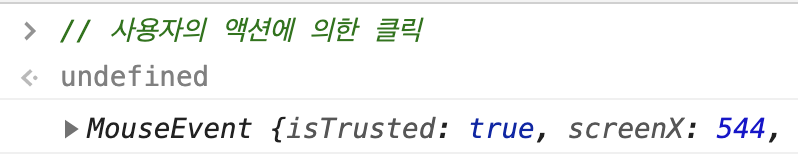

이벤트를 빼놓고는 프런트엔드 프로그래밍을 이야기할 수 없다. 이 포스팅에서는 웹 문서에서 이벤트가 어떻게 흘러가는지를 살펴본다.

> 이 포스팅에서 사용된 코드 조각들은 [CodeSandbox Workspace](https://codesandbox.io/s/about-event-in-the-web-bw006)에서 실행해보실 수 있습니다.

### Table of Contents

- Event
- Event Flow
- Bubbling Event
- Cancelable Event
- Trusted Event
- Stop propagation

## Event

웹에서는 수많은 이벤트(Event)가 발생하고 흐른다.

- 브라우저(user agent)로부터 발생하는 이벤트
- 사용자의 행동(interaction)에 의해 발생하는 이벤트
- DOM의 '변화'로 인해 발생하는 이벤트

발생하는 이벤트는 그저 **자바스크립트 객체**일 뿐이다. 브라우저의 [Event interface](https://dom.spec.whatwg.org/#interface-event)에 맞춰 구현된 객체인 것이다.

가장 쉽게 접할 수 있는 `click`이라는 액션을 예를 들어보자.

```js
element.addEventListener('click', () => {
  console.log('clicked')
})
```

위 예제 코드에선 `element`라는 DOM Element에 `addEventListener`을 통해 `click` 액션에 핸들러를 추가해줬다. 사용자가 `element`를 클릭했을 때, 이벤트 핸들러로 등록한 `() => console.log('clicked')`가 실행되도록 코드를 작성한 것이다.

위 click 이벤트는 다음과 같이도 실행(trigger)될 수 있다.

```js
element.click()
```

### Event, Event Handler

위 두 방법으로 발생(trigger)한 **Click Event**는 Event interface기반으로 구현된 type이 `click`인 Event 객체를 의미한다. 이 이벤트는 발생하여 웹 문서에 **전파**될 것이고 전파되는 이벤트 객체가 `element`라는 DOM Element에 **도달**했을 때, 이벤트 핸들러가 **실행**된다.

### Custom Event

정의된 이벤트뿐만 아니라 자바스크립트 코드로 자신만의 이벤트를 정의하고 만들 수 있다.

```js
const boom = new CustomEvent('boom')

element.addEventListener('boom', () => {
  console.log('boom!!!')
})

element.dispatchEvent(boom) // boom!!!
```

위 예제 코드에서는 boom이라는 이벤트를 만들고, `element`에 **boom 이벤트를 등록**한 후, boom이라는 이벤트를 `dispatch` 하였다.

즉, DOM Element는 사용자가 '클릭'했을 때, '클릭 Event'를 `dispatch` 해주는 역할을 하고 `addEventListener`는 전파되는 Event 객체들 중 특정 type에 대해서만 구독하는 Element의 메서드인 것이다.

이때 발생한 이벤트는 어디로 어떻게 흘러가게 될까?

## Event Flow

여러 DOM Element로 구성된 하나의 웹 페이지는 `Window`를 최상위로 하는 트리를 생성하게 된다. 결론부터 말하자면 이벤트는 이벤트 각각이 갖게 되는 **전파 경로(propagation path)**를 따라 전파된다. 그리고 이 전파 경로는 **DOM Tree 구조에서 Element의 위상(hierarchy)**에 의해 결정이 된다.

### Propagation path

전파 경로는 **자기 자신을 포함**하여 그 **부모 엘리먼트에 의존**한다. 이를 기반으로 경로가 리스트 형식으로 구성되며 이 리스트의 마지막 값은 **Event Phase에 따라** 달라진다. 그리고 **실제로 event 가 targeting 된 DOM 엘리먼트**에 의해 그 리스트가 결정된다.

이때 이벤트가 등록된 DOM 엘리먼트를 [current event target](https://www.w3.org/TR/uievents/#current-event-target)이라고 한다. Event handler에서 전달되는 Event 객체에서 접근할 수 있는 프로퍼티 중 `currentTarget`이 바로 이 값이다. 그리고 실제로 Event가 targeting된 DOM 엘리먼트를 [event target](https://www.w3.org/TR/uievents/#event-target)이라고 부르며 Event handler에서 전달되는 Event 객체에서 접근할 수 있는 프로퍼티 중 `target`이 바로 이 값이다.

즉 `currentTarget`과 `target`이 가리키는 대상은 항상 같지 않다.

```html
<ul id="list-wrapper">
  <li>React</li>
  <li>Vue</li>
  <li>Angular</li>
  <li>Svelte</li>
</ul>
<script>
  const wrapper = document.querySelector('#list-wrapper')
  wrapper.addEventListener('click', e => {
    console.log(e.target)
    // <li>React</li>
    // or <li>Vue</li>
    // or <li>Angular</li>
    // or <li>Svelte</li>
    console.log(e.currentTarget) // <ul id="list-wrapper">…</ul>
  })
</script>
```

### Event Phase



전파 경로가 결정되고 나면 이벤트 객체는 Event phase를 따라서 전달된다. 브라우저에서는 총 세 단계의 Event phase를 지원하고 있으며 그 세 가지는 다음과 같다.

#### 1. Capture phase

이벤트 객체가 `Window`부터 이벤트가 등록된 요소(element)까지 전달되는 단계이다. 이때 전파 경로의 시작은 `Window`가 되며 마지막은 이벤트가 등록된 요소가 된다.

#### 2. Target phase

이벤트 객체가 event target에 도달한 단계를 말한다. 만약에 Event type이 다음 phase를 지원하지 않는 경우, 다음 단계는 넘어가고 전파가 종료된다.

#### 3. Bubble phase

이벤트 객체가 capture 단계에서 전달되었던 순서의 반대로 진행되는 단계이다. 부모 엘리먼트로 전달이 진행되면서 최종적으로 `Window`까지 이벤트가 전달된다. 이 단계에서는 `Window`가 전파 경로의 마지막이 되는 것이다.

이벤트는 위 세 단계로 전파되며 세 단계 중 어느 단계에서 이벤트 핸들러를 발생(trigger)시킬 것인가에 따라 그 목적이 달라질 수 있다.

#### Not support phase

이벤트에 따라 지원하는 phase가 있고, 지원하지 않는 phase가 존재한다. 그래서 위 단계별로 이벤트가 전달될 때, 지원되지 않는 phase는 건너뛰게 된다. 그 외 전파되는 이벤트 객체는 개발자가 강제로 멈추지 않는 이상 결정된 전파 경로를 따라 전파된다.

예를 들면 타입이 `focus`인 Event는 bubbling 되지 않는다.

```html
<div id="parent">
  <label for="inner">Inner :</label>
  <input
    id="inner"
    type="text"
    onfocus="console.log('inner input focusing')"
    onclick="console.log('inner input clicked')"
  />
</div>
<script>
  const parent = $('#input-wrapper')
  parent.on('focus', () => console.log('parent focusing'))
  parent.on('click', () => console.log('parent clicked'))
</script>
```

`input#inner` 엘리먼트에서 `focus`, `click` 이벤트가 발생했을 때, `click` 이벤트만 버블링되어 `div#parent` 엘리먼트에 등록된 click 이벤트 핸들러만 실행되는 것을 확인할 수 있다.

## Bubbling Event

버블링으로 이벤트를 등록한다는 것은 무슨 말인가?

### Add Event Listener

`addEventListener` 세 번째 인자로 option이 전달되며 그 [명세](https://dom.spec.whatwg.org/#interface-eventtarget)는 다음과 같다.

```ts
interface AddEventListenerOption {
  capture?: boolean
  once?: boolean
  passive?: boolean
}
const option = {}
element.addEventListener(
  'click',
  () => {
    console.log(`boom`)
  },
  option
)
```

이벤트 핸들러는 등록될 때 어느 Event phase에서 실행할지 결정된다. `option`으로 전달되는 값 중, `option.capture`로 실행될 Event phase를 결정하며 이 값이 `false`일 경우, Capturing phase 때 이벤트 핸들러가 trigger 되지 않는다.

`option.capture`는 `false` 가 기본값이다. 즉, 이벤트 핸들러는 기본적으로 Bubbling phase 때 발생하도록 등록되며 버블링으로 이벤트를 등록한다는 것은 이벤트가 전파되는 단계 중 Bubbling Phase에서 핸들러를 실행하는 방식으로 등록하는 것을 말한다.

## Cancelable Event

`a` 태그를 사용했지만 `a` 태그가 지원하는 기본적인 동작을 막고 싶은 경우, `preventDefault` 를 호출한다.

```js
aTag.addEventListener('click', e => {
  e.preventDefault()
})
```

이렇게 되면 `a` 태그를 클릭할 경우, `href` attribute에 정의된 URL로 이동하지 않는다. 즉 `a` 엘리먼트의 기본 동작이 수행되지 않는 것이다.

이 `preventDefault` 메서드는 Event 객체의 `cancelable` property 값이 `true` 일 때만 호출할 수 있으며 이 메서드는 내부적으로 Event 객체의 `defaultPrevented` 값을 `true`로 변경하게 된다. 이벤트가 dispatch 될 때 기본 동작을 할 것인지에 대한 기준을 `defaultPrevented` 값으로 판단하는데, 이 값으 `true`일 때 기본 동작을 발생시키지 않는다.

addEventListener의 `option.passive`는 default 값으로 `false`값을 가진다. 이 옵션 값을 `true`로 지정할 경우, 이벤트가 발생되는 시점에서 [defaultPrevented](https://dom.spec.whatwg.org/#dom-event-defaultprevented) 값을 무시하게 된다. 이것은 이벤트가 발생할 때마다 매번 확인했던 `defaultPrevented`를 더이상 확인하지 않아도 된다는 것을 의미하며 이 비용을 줄여 이벤트의 성능을 향상시킬 수 있다.

## Trusted Event

사용자에 의해 발생한 이벤트인지 브라우저(user agent)에 의해 발생한 이벤트인지 Event 객체의 속성을 통해 판단할 수 있다.



Element의 `.click()` 메서드를 통해 호출된 이벤트 객체의 `isTrusted` 값은 `false`가 된다.



그리고 사용자 클릭에 의해 발생한 이벤트 객체의 `isTrusted` 값은 `true`가 된다.

## Stop propagation

이벤트의 전파를 멈출 수도 있다. Event 객체에는 [stopPropagation](https://developer.mozilla.org/en-US/docs/Web/API/Event/stopPropagation)이라는 메소드가 있다.

```js
element.addEventListener('click', e => {
  e.stopPropagation()
})
```

이벤트 핸들러 내에서 이벤트 객체의 `stopPropagation`메소드를 호출하게 되면 다음으로 진행 예정인 Event Phase가 진행되지 않고 이벤트 전파가 멈추게 된다.

### Case 1

```html
<div id="parent" onclick="console.log('Hello, i want to logging!')">
  <button id="bubbling-stop-button-1">Stop</button>
</div>
<script>
  $('#bubbling-stop-button-1').on('click', e => {
    e.stopPropagation()
    console.log("I'm bubbling-stop-button-1")
  })
</script>
```

위 상황에서 `div#parent`에 등록된 이벤트 핸들러는 실행되지 않는다.

어느 phase에 핸들러를 실행시킬지 명시하지 않았기 때문에 `div#parent` 엘리먼트의 이벤트 핸들러는 Bubbling Phase에 실행된다. 그러나 `div#parent` 엘리먼트의 자식인 `button#bubbling-stop-button-1` 엘리먼트에서 이벤트 핸들러가 실행된 후, 전파를 중단했기 때문에 상위 엘리먼트에서는 `click` 이벤트를 전파받을 수 없다.

### Case 2

```html
<div id="capture">
  <button id="bubbling-stop-button-2">Stop</button>
</div>
<script>
  $('#capture').on(
    'click',
    e => {
      console.log('Hello!')
    },
    { capture: true }
  )
  $('#bubbling-stop-button-2').on('click', e => {
    e.stopPropagation()
    console.log("I'm bubbling-stop-button-2")
  })
</script>
```

상위 엘리먼트의 이벤트 핸들러를 실행시키기 위해서 `capture: true`를 통해 Capturing Phase 때 이벤트 핸들러가 실행되도록 할 수 있다. 이 상황에서 `button#bubbling-stop-button-2`를 클릭하게 되면 다음과 같이 로그가 찍히는 것을 확인할 수 있다.

```
// Hello!
// I'm bubbling-stop-button-2
```

### Case 3

`capturing: true`로 등록된 이벤트 핸들러에서 이벤트 전파를 막게 되면 하위 엘리먼트에 등록한 동일한 타입의 이벤트 핸들러가 동작하지 않을 수 있다.

```html
<div id="capture-stop">
  <button id="prevented-button">Stop</button>
</div>
<script>
  $('#capture-stop').on(
    'click',
    e => {
      e.stopPropagation()
      console.log('I prevent capturing phase')
    },
    { capture: true }
  )
  $('#prevented-button').on('click', e => {
    console.log("I'm prevented-button (will not trigger)")
  })
</script>
```

`#prevented-button` 버튼에 등록된 이벤트 핸들러는 사용자의 액션에 의해서는 실행될 수 없다.

```js
preventedButton.click()
```

이렇게 실행시킬 수 있을 것 같은 착각이 들지만, 이 또한 위에서 설명한 것처럼 `dispatchEvent`를 통해서 발생하는 이벤트 객체가 전파 경로를 통해 전달되는 형태이기 때문에 이벤트 핸들러가 실행되지 않는다.

### Case 4

`stopPropagation`메서드는 다음 Phase로의 이벤트 전파를 막는다. Event Phase 중 Target Phase에서 이벤트 전파를 막기 위해서는 `stopImmediatePropagation` 메서드를 사용할 수 있다.

```html
<button id="multiclick-button">multi</button>
<script>
  const el = $('#multiclick-button')

  el.on('click', e => {
    console.log(`first click`)
  })
  el.on('click', e => {
    console.log(`second click`)
    e.stopImmediatePropagation()
  })
  el.on('click', e => {
    console.log(`third click`)
  })
  el.on('click', e => {
    console.log(`fourth click`)
  })
  // console: first click
  // console: second click
</script>
```

위 예제에서는 이벤트가 등록된 순서대로 이벤트 핸들러가 호출되는데, 호출되는 이벤트 핸들러 내에서 [stopImmediatePropagation](https://developer.mozilla.org/en-US/docs/Web/API/Event/stopImmediatePropagation)가 호출되는 경우, 그 뒤의 이벤트 핸들러는 동작하지 않으며 이벤트 전파가 멈추게 된다.

## 마무리

이 포스팅에서 사용된 코드 조각들은 [CodeSandbox Workspace](https://codesandbox.io/s/about-event-in-the-web-bw006)에서 실행해보실 수 있습니다.

> 이 포스팅은 W3C spec 문서의 UI event 부분과 DOM 스펙 문서를 기반으로 작성됐습니다.

- [https://dom.spec.whatwg.org/#introduction-to-dom-events](https://dom.spec.whatwg.org/#introduction-to-dom-events)
- [https://www.w3.org/TR/uievents/](https://www.w3.org/TR/uievents/)
- [https://javascript.info/bubbling-and-capturing](https://javascript.info/bubbling-and-capturing)
