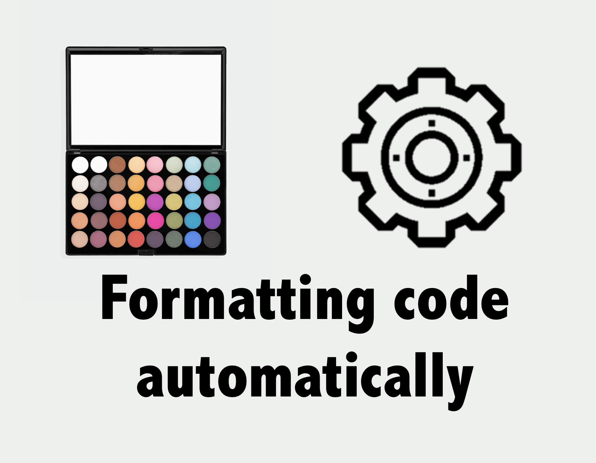
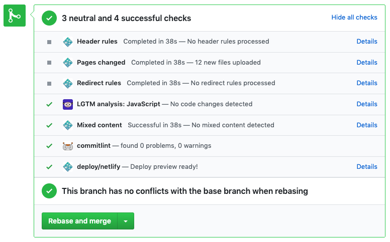

팀 단위로 프로젝트 개발이 이뤄지면서 합의한 Coding convention을 지키며 개발하는 것이 중요해졌습니다. 그러나 여전히 소프트웨어 개발을 할 때, 비즈니스 로직, 구조 설계, UX 등 많은 부분을 고려해야 합니다. 이 와중에 convention을 하나 하나 신경써야 하는데, 그러기엔 **우리 인생은 너무 짧습니다.**

이 글에서는 일관된 convention을 적용할 때 도움이 될 수 있는 여러 도구를 소개합니다.

> Formatting Code automatically! 🤖

## ToC

- Prettier, ESLint
- With VSCode
- With Hooks
- With GitHub bot

## Why do we need code style?

우선 Code formatting(코드 포맷팅)이 왜 필요한지, 팀 내 정해진 스타일 가이드가 왜 필요한지 의문이 드시는 분들이 계실 수 있을 것 같습니다. 이 포스팅에서는 관련 글을 첨부합니다.

> 코드의 많은 비용은 읽을 때 발생한다. 그러므로 코드는 가독성을 위해 최적화를 해야 한다는 결론, 즉 응용 프로그램의 코드는 모두 같은 스타일로 통일되어야한다는 결정을 이끌어 낼 수 있다. 일반적인 스타일에 맞춤으로써 여러분은 비용을 절감할 수 있다.  
\- [코딩 스타일에 대해 논쟁하는 이유](http://www.mimul.com/pebble/default/2019/05/31/1559304696070.html) 중

## [prettier](https://github.com/prettier/prettier), [eslint](https://github.com/eslint/eslint)

두 도구의 성격이 약간 달릅니다. 취향에 따라 프로젝트에 적용할 수 있습니다. eslint와 prettier 설정에 대한 설명은 이 글에서 제외했습니다. 궁금하신 분들은 [velopert님의 리액트 프로젝트에 ESLint와 Prettier 끼얹기 글](https://velog.io/@velopert/eslint-and-prettier-in-react)을 참고하시면 됩니다.

## With VSCode

VSCode의 설정을 통해 **저장(save) 시점에** formatting을 트리거 할 수 있습니다. 즉 eslint를 실행시키거나 prettier를 실행시켜 미리 설정해둔 coding convention을 적용할 수 있습니다.

- `formatOnSave: true`
- `autoFixOnSave: true`

prettier를 사용하고 있다면 `formatOnSave` 기능을 활성화시키면 되고 eslint를 사용하고 있다면 `fixOnSave` 기능을 활성화시키면 됩니다.

저장하기 위해 `command + s`를 누르는 것조차 귀찮으신 분들은 한 가지 설정을 더 해줄 수 있습니다. VSCode 설정 중 바로 **Auto Save** 설정을 통해 저장 기능도 자동화 시킬 수 있습니다. 저장 기능을 실행시킬 여러 가지 시점을 선택할 수 있습니다. 저는 활성화 된 에디터 창이 변경될 때인 `onFocusChange`로 설정을 해뒀습니다.

> `autoFixOnSave` 기능의 경우 VSCode 하위 버전(1.30.0)에서 제대로 동작하지 않는 버그가 있었습니다. 현재 1.32.3 version 기준 제대로 적용됩니다.

## With Hooks (not React hooks!)

저장되는 시점마다 formatting을 하는 것이 너무 과하다 싶으면 Git hooks을 이용하는 방법도 있습니다.

### [husky](https://github.com/typicode/husky)

Git hooks을 지원하는 `husky` 라이브러리를 통해 commit 전 또는 push 전 특정 script를 실행시킬 수 있습니다.

```bash
$ npm install --save-dev husky
```

husky 관련 설정을 `package.json` 파일에 추가할 수 있습니다.

```json{4}
"husky": {
  "hooks": {
    "pre-push": "npm run test:unit",
    "pre-commit": "npm run lint"
  }
}
```

`npm run lint` script에 lint 검사만 하는 command를 실행시킬 수도 있고 `--fix` 옵션과 함께 실행시켜 강제로 eslint rule에 맞게 formatting 시킬 수 있습니다.

`prettier`를 사용한다면 `pre-commit`에 prettier를 실행시키는 npm script를 추가하면 됩니다. ([prettier cli document](https://prettier.io/docs/en/cli.html) 참고)

### lint-staged

commit 할 때마다 전체 프로젝트 파일을 대상으로 lint 검사를 하게 되면 검사하는 시간이 굉장히 오래 걸리는 문제가 발생할 수 있습니다. commit을 하기 전, 변경 사항에 대해서만 lint를 검사하면 될 것 같은데요. 이 때 [lint-staged](https://github.com/okonet/lint-staged)라는 npm 라이브러리를 통해 stage 단계에 있는 사항에 대해서만 특정 task를 실행시킬 수 있습니다.

```bash
$ npm install --save-dev lint-staged
```

husky를 설정해준 것처럼 `package.json`에 lint-staged 관련 설정을 추가해줄 수 있습니다. 그리고 husky로 설정해둔 설정에 lint-staged를 실행시키도록 합니다.

```json{4}
"husky": {
  "hooks": {
    "pre-push": "npm run test:unit",
    "pre-commit": "lint-staged"
  }
},
"lint-staged": {
  "*.{js,jsx}": "eslint"
}
```

commit 전에는 변경사항에 대해서 lint를 확인하고 push 전에는 단위 테스트를 실행시키도록 Git hooks을 설정했습니다!

이제 Pull Request 단계에서 '세미콜론(;)이 빠졌다', '`trailling comma`가 빠졌다.' 이런 리뷰는 이제 추가되지 않겠죠? 리뷰 받는 사람, 리뷰하는 사람 모두에게 시간을 절약해줄 수 있습니다!

## With GitHub bot

이런 규칙들을 자동으로 code review 해주는 GitHub의 bot 들이 있습니다.
제 [gatsby-starter-bee](https://github.com/JaeYeopHan/gatsby-starter-bee)에서는 commitlint, LGTM, 등의 bot을 이용하고 있습니다.



### [LGTM bot](https://lgtm.com/)

> Prevent bugs from ever making it to your project by using automated reviews that let you know when your code changes would introduce alerts into your project. We support GitHub and Bitbucket.

자신이 운영하고 있는 GitHub 프로젝트에 등록을 해두면 Pull Request 시점에서 실행되는 Bot입니다. 버그를 발생시킬 수 있는 코드, 보안 상으로 문제가 있는 코드 등에 대해서 자동으로 리뷰를 해주며 리뷰 내용을 comment로 추가하여 바로 확인하실 수 있습니다.

### [commitlint](https://github.com/conventional-changelog/commitlint)

commit message format에 대해서 lint를 적용시킬 수 있는 도구입니다. 이 또한 [bot](https://github.com/z0al/commitlint-bot)으로도 있어서 소개합니다.

### [Probot](https://github.com/probot/probot)

원하는 기능을 구현한 GitHub Bot이 없을 경우 Probot을 통해서 직접 만드실 수도 있습니다! 재미있는 Bot들이 이미 많은데요, [여기](https://probot.github.io/apps/)에서 살펴보실 수 있습니다.

## 마무리

이 포스팅이 프론트엔드 개발자분들의 삶의 질에 조금이나마 도움되길 바랍니다.

Happy Coding! 😎

### References

- [https://github.com/GoogleChromeLabs/react-shrine#formatting-code-automatically](https://github.com/GoogleChromeLabs/react-shrine#formatting-code-automatically)
