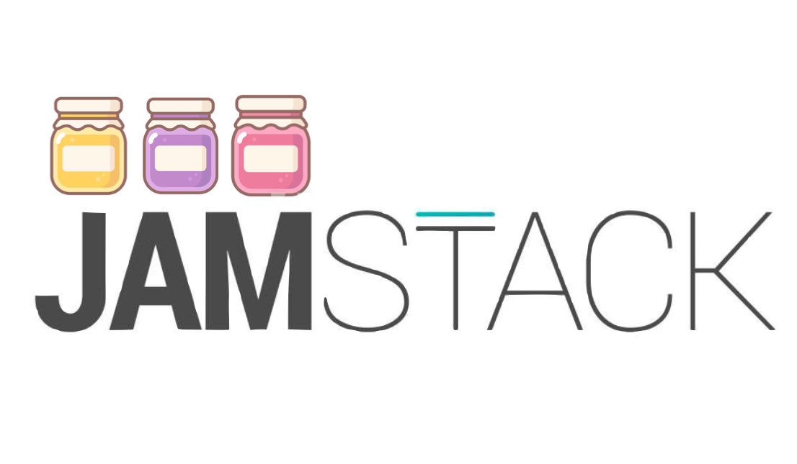

MEAN 스택이라는 용어를 기억하는 사람이 있을 것 같습니다. MongoDB, Express, AngularJS, NodeJS의 각 앞 글자만 따서 MEAN 스택이라 칭했습니다. React가 인기를 끌면서 MEAN 스택 중 AngularJS가 React로 대체되고 mern이라는 것도 등장했었습니다. 조금 더 전에는 [LAMP](<https://en.wikipedia.org/wiki/LAMP_(software_bundle)>)(Linux, Apaache, MySQL, PHP)이란 것도 있었습니다.

그리고 요즘 **JAM Stack**이라는 용어가 심심치 않게 보입니다.

[JAM Stack 공식 문서](https://jamstack.org/)에서는 다음과 같이 정의하고 있습니다.

> Fast and secure sites and apps delivered by pre-rendering files and serving them directly from a CDN, removing the requirement to manage or run web servers.

웹 애플리케이션에서 렌더링 할 화면을 **Pre-render** 하고 이를 **CDN에서 제공(delivery)**하여 빠르고 안전한 앱으로 웹 서버를 관리하거나 실행할 필요가 없다.

## What?

Jamstack에서 `JAM`은 무엇을 말하는 것인지 먼저 살펴보겠습니다.

- `J`: JavaScript
- `A`: API
- `M`: Markup

Jamstack은 위 세 가지 요소로 구성됩니다.

MEAN(or MERN) 스택에서 있던 데이터베이스나 서버 관련 스펙은 보이지 않습니다. 데이터베이스, 서버는 철저하게 API로 분리하여 정적인 사이트를 만드는데 최적화되어 있습니다.

JavaScript와 Markup에 해당하는 HTML, CSS 정적 리소스들을 활용하여 웹 애플리케이션을 구성하는 스택입니다. 그리고 이 정적 리소스들을 CDN(Content Delivery Network)에 배포하여 서버 관리를 최소화 할 수 있습니다.

## Why?

왜 Jamstack이라는 용어가 자주 들려올까요? 공식 문서에서 이야기하는 내용들을 가져왔습니다.

### Better Performance

Jamstack에서는 배포 시점에 페이지를 생성할 수 있습니다. 브라우저가 SPA의 첫 페이지를 스크립트로 렌더링 할 때까지 기다릴 필요가 없다는 것입니다. 첫 번째 바이트가 브라우저에 도달하기까지의 시간(Time To First Bytes: TTFB)을 최소화 할 때, 사전 빌드(pre render)된 파일을 CDN으로 제공하는 것보다 빠른 것은 없다고 합니다.

### Higher Security

서버 사이드 프로세스를 마이크로 서비스 API로 추상화하면 공격에 노출되는 영역이 줄어 듭니다. 이로 인해 웹 애플리케이션에서 발생할 수 있는 보안 부분들에 대해 신경을 덜 쓸 수 있게 됩니다.

### Cheaper, Easier Scaling

배포된 파일들을 어디든 제공할 수 있어야 하는 경우, 해당 파일을 더 많은 서버에 제공해야 하는데 CDN을 통해 이 부분을 해결할 수 있습니다. 대표적인 CDN 서비스 Akamai는 전세계적으로 약 7만여대의 Cache 서버를 가지고 있습니다. 별도의 스케일링(Scailing) 작업이 필요하지 않으며 서버 관리에 드는 비용도 없어집니다.

### Better Developer Experience

CDN을 통해 확장이 되고 별도의 서버 관리가 필요하지 않기 때문에 개발자는 보다 개발과 문제 해결에 집중할 수 있습니다.

## When?

Jamstack의 장점에 대해 알아봤는데요, 모든 상황에서 적절한 기술 스택은 아닙니다.

1. 워드프레스(WordPress)와 같이 서버사이드 CMS와는 사용하기 어렵습니다.
2. Ruby on Rails, Express 등과 같은 백엔드 언어로 작성되어 서버와 웹 애플리케이션이 분리되지 않고 하나로 운영되고 있는 상황에서는 사용하기 어렵습니다.
3. isomorphic rendering으로 운영되는 웹 애플리케이션에는 적절하지 않습니다.

아래에서 설명할 Jamstack을 구성하고 있는 요소들을 살펴보면 왜 위 경우에 대해서 적합하지 않은 스택인지 알 수 있습니다.

## Best Practices

Netlify에서는 Jamstack으로 프로젝트를 구성할 때 다음 요소들을 갖춰 구성해야 한다고 말하고 있습니다.

### Entire Project on CDN

Jamstack 프로젝트는 서버 측 코드에 의존하지 않기 때문에 단일 서버에서만 제공(serving)되지 않고 분산될 수 있습니다. 애플리케이션에 필요한 정적 리소스들을 CDN을 통해 제공하게 되면 빠른 속도와 성능을 보여줍니다. 애플리케이션이 더 많이 사용될수록 CDN에서 제공되는 시간이 짧아지므로 사용자 경험이 향상됩니다.

### Automated Builds

Jamstack 프로젝트는 마크업이 pre-render를 통해 미리 빌드됩니다. 때문에 다시 빌드를 실행할 때까지 변경된 컨텐츠가 적용되지 않습니다. 즉 변경된 사항을 반영하기 위해선 빌드를 다시 해줘야하는데, 이 프로세스를 자동화하면 많은 트러블슈팅을 줄일 수 있습니다. 웹 후크를 사용하여 직접 할 수도 있고 이런 서비스를 제공하는 플랫폼을 사용할 수 있습니다. 대표적인 플랫폼으로는 Netlify가 있습니다.

### Everything Lives in Git

Jamstack 프로젝트는 누구나 표준 절차(git clone, npm install 등)를 통해 필요한 종속성을 설치하고 전체 프로젝트를 로컬에서 실행할 수 있어야합니다. 데이터를 받기 위해 복제해야하는 데이터베이스가 없고 설치 또한 없습니다. 이는 프로젝트에 기여하고 싶은 사람들과의 마찰을 줄이고 스테이징(staging) 및 테스트 워크 플로우를 단순화 할 수 있습니다.

### Atomic Deploys

Jamstack 프로젝트가 커질수록 새로운 변경으로 인해 수백 개의 파일을 재배포해야하는 일이 발생할 수 있습니다. 이 변경 사항들을 하나씩 배포하면 배포 프로세스가 완료되는 동안 애플리케이션의 상태에서 문제가 발생할 수 있습니다. 변경된 모든 파일이 배포될 때까지 변경 사항이 적용되지 않는 "Atomic Deploy"를 수행할 수있는 시스템으로 이를 피할 수 있습니다. 새로운 리소스를 받아오는 스크립트 파일에 해시(hash)처리를 추가하여 특정 해시 값에서 받아오는 데이터들을 분류(versioning)하는 방법 등 다양한 방법을 도입할 수 있습니다.

### Modern Build Tools

Jamstack 프로젝트에서 최신 빌드 도구를 활용하여 여러 가지 장점을 얻을 수 있습니다. Babel, PostCSS, Webpack 등을 사용하여 웹 표준이지만 브라우저에서 구현되지 않은 기능과 구문(Syntax)들을 사용할 수 있습니다.

### Instant Cache Invalidation

빌드-배포하는 프로세스가 정기적으로 진행될 경우, 배포가 시작되면 실제로 현재 라이브 서비스에 반영됩니다. CDN이 바로 캐시를 제거할 수 있는지 의심할 필요가 없습니다.

## 마무리

이미 [Gatsby](https://github.com/gatsbyjs/gatsby), [Redwood](https://github.com/redwoodjs/redwood)와 같은 Jamstack 기반으로 프로젝트를 시작할 수 있는 프레임워크가 많이 있습니다. 이 블로그도 Gatsby를 기반으로 만들어졌으니 Netlify로 배포를 할 때, 궁합이 정말 잘맞아 앞으로가 기대됩니다.

> [O'reilly](https://www.netlify.com/oreilly-jamstack/)에서는 Jamstack과 관련된 책도 출판했습니다.

## Reference

- [https://jamstack.org/](https://jamstack.org/)
- [https://hackernoon.com/forget-docker-the-future-is-jamstack-aae5bcaf4616](https://hackernoon.com/forget-docker-the-future-is-jamstack-aae5bcaf4616)
