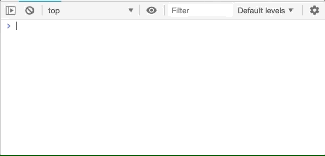
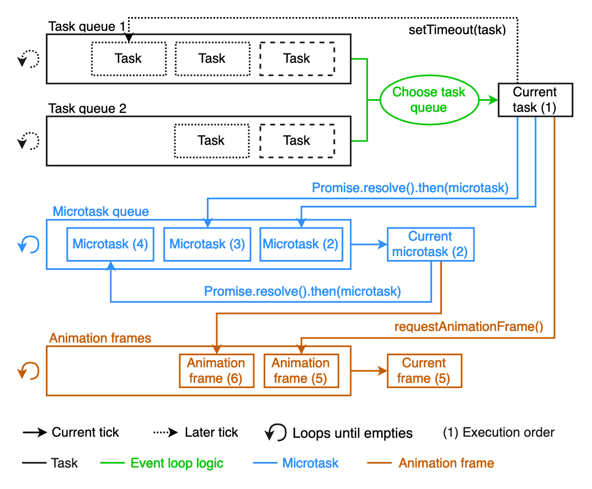

> ⚠ 이 포스팅은 자바스크립트의 비동기 처리에 대한 이해를 기반으로 작성되었습니다. 이 포스팅을 읽기 전, [JavaScript의 Event Loop](https://asfirstalways.tistory.com/362)와 [자바스크립트 비동기 처리 과정](http://sculove.github.io/blog/2018/01/18/javascriptflow/) 일독을 추천 드립니다.

우리는 아래처럼 브라우저의 스크롤에 이벤트를 추가할 수 있습니다.

```js
window.addEventListener('scroll', onScroll)
```

`onScroll` 함수에 `console.log('scrolled')` 를 추가해보겠습니다.



`onScroll` 함수가 마구 실행됩니다. 위 예시에서는 console을 찍는 function을 추가해줬지만 조금 무거운 이벤트를 등록하면 어떻게 될까요? 😥 scroll event에 reflow가 여러번 발생하는 무거운 callback function을 등록한 [예시 코드](https://github.com/twobin/react-lazyload/blob/master/src/index.jsx#L158) 입니다.

## TL;DR

- If possible, don't use `scroll` event.
- Use `requestAnimationFrame`.
- Use `{ passive: true }` option of event listener.

## Not throttle, But requestAnimationFrame

### throttle?

[throttle](https://github.com/sreejith-ms/lodash.debounce/blob/master/Debounce.js#L264) 이라는 function을 사용해서 스크롤 이벤트가 트리거되는 **'정도'**를 조절할 수 있습니다. 다음 코드는 **300ms마다** `onScroll`이 호출되도록 scroll 이벤트를 등록한 코드입니다.

```js
window.addEventListener('scroll', throttle(onScroll, 300))
```

대부분의 경우 이 정도로 최적화가 가능합니다. 하지만 아쉽게도 이 방법은 우리가 **기대한대로 동작하지 않을 수 있습니다.** 이 throttle function은 [debounce](https://github.com/sreejith-ms/lodash.debounce/blob/master/Debounce.js#L106)를 기반으로 동작하며, 이 debounce는 [setTimeout](https://github.com/sreejith-ms/lodash.debounce/blob/master/Debounce.js#L213) 기반으로 동작합니다. 이 `setTimeout` 이 기대한대로 동작하지 않을 수 있기 때문입니다. (각 링크는 VanillaJS 구현 코드입니다.)

> :gift: throttle과 debounce의 개념이 명확하지 않다면 [Throttle vs Debounce Demo](https://css-tricks.com/the-difference-between-throttling-and-debouncing/)에서 확인해보실 수 있습니다.

싱글 스레드로 동작하는 JavaScript는 `setTimeout` API의 비동기 task들을 **Task Queue(a.k.a. macro queue)**에 넣어둔 후 순차적으로 처리합니다. Queue에 저장된 비동기 task를 처리하는 시점은 Call stack이 비어져있을 경우입니다. 이 시점이 `setTimeout` 또는 `setInterval`에 할당해준 `delay`와 맞지 않는다면 등록해둔 callback은 trigger 되지 않을 수 있습니다.

> :gift: 보다 자세한 내용은 해당 포스팅 하단의 [reference](#reference)를 확인해주세요.

### requestAnimationFrame? (rAF)

우리는 브라우저가 렌더링 할 수 있는 **'능력'**에 맞춰 이벤트를 trigger를 트리거해줄 수 있습니다. 즉 일부러 300ms 씩 trigger 하려고 하지 않아도 되는 것입니다. 브라우저는 60fps(초당 60회)로 화면을 렌더링합니다. 이 렌더링에 최적화하기 위해 `rAF` 이라는 API를 사용할 수 있습니다.

이 `rAF` API도 `setTimeout` 과 마찬가지로 callback으로 넘겨지는 function을 비동기 task로 분류하여 처리합니다. 다만 `rAF` 은 **macro queue**가 아니라 **animation frame**에서 처리됩니다. 또한 `setTimeout` 두번째 parameter로 전달되는 `delay` 값이 브라우저 렌더링에 최적화되어 있다는 차이가 있습니다.



이 블로그 템플릿에서는 스크롤 이벤트를 최적화하기 위해 [toFit](https://github.com/JaeYeopHan/gatsby-starter-bee/blob/master/src/utils/event-manager.js) 이라는 util function을 만들어서 사용했습니다.

```js
export function toFit(
  cb,
  { dismissCondition = () => false, triggerCondition = () => true }
) {
  if (!cb) {
    throw Error('Invalid required arguments')
  }

  let tick = false

  return function() {
    console.log('scroll call')

    if (tick) {
      return
    }

    tick = true
    return requestAnimationFrame(() => {
      if (dismissCondition()) {
        tick = false
        return
      }

      if (triggerCondition()) {
        console.log('real call')
        tick = false
        return cb()
      }
    })
  }
}
```

해당 템플릿에서는 스크롤 시, 현재 스크롤의 위치와 bottom값의 차이가 일정 미만일 때만 트리거 해주는 이벤트를 등록하기 위해 사용했습니다. 다음과 같은 방식으로 사용할 수 있습니다.

```js
window.addEventListener('scroll', toFit(onScroll))
```

바로 `onScroll`을 이벤트에 등록하지 않고 `toFit`으로 한 번 감싸줬습니다. 지금부터 이 `toFit` util이 하는 일에 대해 알아보겠습니다.

## What happened?

간소화 된 형태를 먼저 살펴보겠습니다.

```js{2,4,10}
export function toFitSimple(cb) {
  let tick = false

  return function trigger() {
    if (tick) {
      return
    }

    tick = true
    return requestAnimationFrame(function task() {
      tick = false
      return cb()
    })
  }
}
```

`toFitSimple`은

1. 스크롤 시 실제로 발생시킬 함수 `cb`를 받는다.
2. `trigger` 함수를 반환한다.
3. `tick` 변수는 이 `trigger` 함수에서 참조하는 변수이다. ([클로져](https://developer.mozilla.org/en-US/docs/Web/JavaScript/Closures))
4. `trigger` 함수는 `tick`의 값에 따라 다른 값을 반환한다.

**이 `tick`이라는 flag 변수가 브라우저가 렌더링 할 수 있는 능력 이상의 `cb` 함수 호출을 막습니다.**

### Trigger scroll

스크롤을 발생시키면 어떤 일이 벌어지는지 순차적으로 보겠습니다.

1. `rAF`의 callback으로 넘겨지는 `task` 함수가 **animation frame**에 들어간다.
2. 실제로 실행되기 전 까지는 `tick`이 `true`이므로 `trigger`가 아무리 호출되도 아무것도 실행되지 않는다.
3. `task` 함수가 event loop에 의해 실행된다.
   3-1. 실행될 때 `tick`을 false로 바꿔주면서 실제 동작을 한다.
4. 다시 1번으로 이동.

실제로 호출되어야 하는 `cb`가 `rAF`에 의해 비동기로 처리되고 `tick`에 의해 브라우저 렌더링 범위 내에서 animation frame에 들어가게 되므로 스크롤 이벤트를 최적화 할 수 있습니다.

> `toFit`은 이 `toFitSimple`에 trigger 조건과 dismiss 조건을 추가한 함수일 뿐 입니다.

## Passive Event

브라우저는 기본적으로 이 `preventDefault` 를 호출하는지 호출하지 않는지를 감시하게 되는데요, 스크롤 이벤트를 호출할 경우에는 event 객체의 `preventDefault`를 호출하지 않기 때문에 이 비용을 절감할 수 있습니다. 이 때, [passive 속성](https://github.com/WICG/EventListenerOptions/blob/gh-pages/explainer.md#passive-event-listeners)을 통해 `preventDefault` API를 호출하지 않음을 명시할 수 있습니다. 즉, passive 속성을 `true` 로 지정해줄 경우, `event.preventDefault` 가 호출되는지에 대한 감시 비용을 줄일 수 있습니다.

> 폴리필 구현을 통해 내부 구현 원리 살펴보기 ([LINK](https://github.com/WebReflection/dom4/blob/master/src/event-target.js#L68))

DOM Element에 이벤트를 등록할 때 사용하는 API인 `addEventListener` 의 세번째 인자로 이 속성을 전달합니다.

```js
window.addEventListener('scroll', onScroll, { passive: true })
```

이 때, 브라우저에서 `passive` 속성을 지원하는지에 대한 판단이 필요하게 됩니다. 따라서 아래 코드가 추가됩니다.

```js
// if they are supported, setup the optional params
// IMPORTANT: FALSE doubles as the default CAPTURE value!
const passiveEvent = passiveEventSupported
  ? { capture: false, passive: true }
  : false
window.addEventListener('scroll', onScroll, passiveEvent)
```

> https://github.com/WICG/EventListenerOptions/blob/gh-pages/explainer.md#feature-detection

이 `{ passive: true }` 는 스크롤 이벤트 뿐만 아니라 `touchstart`, `touchend` 등 `preventDefault` 호출이 필요없는 이벤트를 등록할 때 주로 사용됩니다.

> ❗ **touch-\* 이벤트**들은 passive 속성의 default 값이 **true**입니다. ([관련 링크](https://www.chromestatus.com/features/5093566007214080))

> :gift: passive 속성 브라우저 커버리지 링크: [Can I use 'passive' property?](https://caniuse.com/#search=passive)

## Conclusion

```js
window.addEventListener(
  'scroll',
  toFit(onScroll, {
    // triggerCondition:
    // dismissCondition:
  }),
  { passive: true }
)
```

최종적으로 이런 형태로 스크롤 이벤트를 등록해줬습니다.

### Reference

이 글을 작성하면서 좀 더 정확한 표현, 내용을 담기 위해 참고한 문서들입니다.

- requestAnimationFrame으로 비동기 처리를 했을 경우 사용하는 animation frame에 관련된 spec 문서
  - https://html.spec.whatwg.org/multipage/imagebitmap-and-animations.html#animation-frames
- jQuery creator, 존 레식이 작성한 JavaScript의 timer 동작 원리
  - https://johnresig.com/blog/how-javascript-timers-work/
- JavaScript의 asynchronous task 처리 과정
  - https://blog.risingstack.com/writing-a-javascript-framework-execution-timing-beyond-settimeout/
- requestAnimationFrame을 사용한 성능 개선
  - https://dev.opera.com/articles/better-performance-with-requestanimationframe/
- Google Developers Web Fundamentals - Performance part
  - https://developers.google.com/web/fundamentals/performance/rendering/debounce-your-input-handlers
  - https://developers.google.com/web/tools/lighthouse/audits/passive-event-listeners
  - https://developers.google.com/web/fundamentals/performance/rendering/optimize-javascript-execution#web_workers
